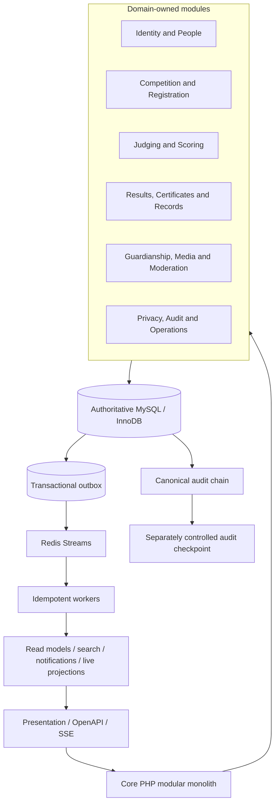
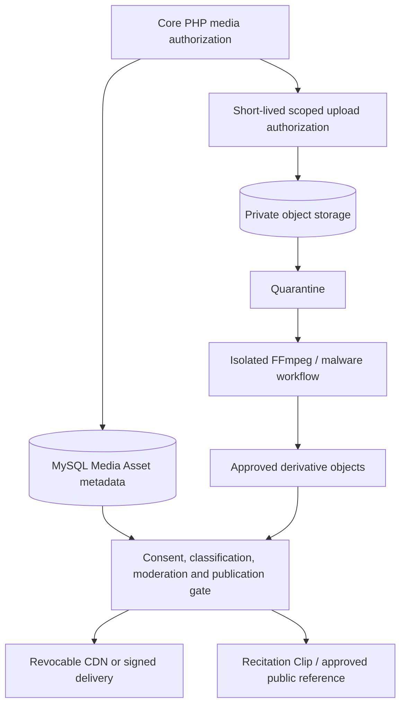

# Data Architecture Overview

| Document control | Value |
| --- | --- |
| Project | Qur’an Memorizer DB |
| Project Code | QMDB |
| Baseline ID | QMDB-BL-001 |
| Batch ID | QMDB-P0-B04 |
| Document Title | Data Architecture Overview |
| Document Version | 1.0.0 |
| Document Status | Controlled draft |
| Document Owner Role | Enterprise Data Architecture and Database Governance |
| Last Updated | 2026-08-24 |
| Approval Status | Proposed for governance approval; locked ADR-001–ADR-020 remain binding |
| Related Documents | [aggregate model](02-domain-aggregate-and-ownership-model.md); [schema conventions](03-mysql-schema-conventions.md); [schema manifest](mysql-logical-schema.yaml) |

## Purpose

Define the authoritative data architecture, ownership boundaries, persistence roles, consistency model, lifecycle philosophy, recovery posture, and governance responsibilities that future Core PHP modules and MySQL migrations shall implement.

## Scope

The design covers structured platform records, tenant isolation, transactions, domain events, read models, private media metadata, search/reporting, audit evidence, archival decisions and bootstrap provenance. It does not implement PHP, SQL, migrations, infrastructure, providers, retention periods, scoring formulas, geography codes or Quran datasets.

## Architecture goals

1. Preserve official truth through exact, versioned, attributable records.
2. Make cross-Workspace corruption structurally difficult and testable.
3. Keep each authoritative record under one modular-monolith owner.
4. Separate current identity from historical competition context.
5. Support concurrent judging without locking an entire Competition Edition.
6. Permit reliable live/read-model delivery without promoting projections to authority.
7. Minimize and classify personal, Minor and sensitive data.
8. Preserve correction, revocation, withdrawal, supersession and provenance.
9. Make schema change, seed import, archive and recovery evidence reproducible.
10. Delay irreversible capacity, partitioning and provider decisions until measured evidence exists.

## Storage and authority map

| Store or service | Role | Authoritative for | Explicitly not authoritative for |
| --- | --- | --- | --- |
| MySQL LTS / InnoDB | Transactional relational source of truth | Accounts, authority, People, Consent, competitions, scoring, Results, Appeals, Certificates, audit metadata, outbox, privacy and operations records | Media bytes, private keys, cached views |
| Redis | Short-lived cache, Redis Streams transport, coordination and rebuildable live state | No official business record | Scores, Results, Consent, authority, Quran releases |
| Private S3-compatible storage | Encrypted/private object bytes and cold evidence | Stored media/document bytes under a MySQL-governed identity/hash/policy record | Consent, publication authority, score/result state |
| Search index | Privacy-filtered, rebuildable search projection | No authoritative record | Identity truth, official score/result, public visibility authority |
| Reporting/analytics store | Approved aggregate or governed read model | No authoritative command state | Competition decisions, personal profile truth |
| CDN | Delivery of approved derivatives | No authoritative metadata or policy | Evidence Master, Consent, publication decision |
| External audit checkpoint | Separately controlled hash/checkpoint evidence | Independent tamper-evidence anchor | Business record content or correction authority |

MySQL is authoritative for structured platform records. Redis, search indexes, analytics, CDNs and public scoreboards are rebuildable or delivery-oriented. Audit checkpoints exist outside ordinary mutable application records. Media binaries remain outside MySQL.

## Structured-record and event architecture

The authoritative record, Audit Event and Outbox Event commit atomically where an event is required. Delivery is at least once; consumer idempotency prevents a duplicate business effect. A failed or stale projection is marked unavailable/stale or rebuilt—it never finalizes a Result.

## Media architecture

MySQL stores object keys, hashes, sizes, MIME types, processing attempts, derivatives, Consent links, moderation, publication and retention state. It does not store large audio/video BLOBs. Workers cannot authorize publication.

## Module ownership

- The owning module is the sole writer of its aggregate and publishes events after commit.
- Another module references an aggregate by stable internal identity plus Workspace/version context where required; it does not update the foreign aggregate’s tables.
- Application services coordinate cross-aggregate commands such as Result finalization or Certificate issuance using narrow transactions, explicit locks, version checks and idempotency.
- Presentation, controllers, templates, Redis consumers and integrations cannot bypass owning application services.
- Projection builders consume authoritative versions and are write-limited to their projection tables.

The complete ownership assignment is in the [aggregate model](02-domain-aggregate-and-ownership-model.md) and [dictionary](05-table-and-column-data-dictionary.md).

## Tenant model

A Workspace is the tenant security and ownership boundary. Every table classified `TENANT_OWNED` or `TENANT_CHILD` contains non-null `workspace_id`, references `workspaces(id)`, exposes `UNIQUE(workspace_id, id)` as a composite parent key, and uses composite child relationships whenever parent and child are both tenant-scoped. Global reference, global governed identity, public projection, cross-tenant oversight and system-operational records are explicit classifications—not generic bypasses.

Cross-Workspace access requires a named policy purpose, actor, minimized resource view, approval when applicable, expiry/revocation and Audit Event. A background job carries Workspace, job type, resource public ID, expected version, idempotency ID, correlation ID and authorization provenance.

## Authoritative and derived boundaries

| Record class | Authoritative form | Derived forms | Correction rule |
| --- | --- | --- | --- |
| Person | Person/current profile tables | Public Profile, search view | Governed profile version; snapshots unchanged |
| Participant context | Participant Snapshot | Roster/public participant view | Append annotated correction; no current-profile propagation |
| Judge score | Score Sheet Version | Judge/panel display | Reopen and append replacement version |
| Aggregate score | Panel Aggregation with immutable inputs | Live calculation display | New aggregation version from explicit inputs |
| Result | Result Snapshot/version | Scoreboard, search, passport | Correction plus superseding Result |
| Certificate | Certificate/hash/signature record | PDF/verification response | Revoke/supersede/reissue; old verification status remains |
| Consent | Consent Record/Event | Publication gate/cache status | Append withdrawal/scope change and propagate removals |
| Quran text | Approved checksummed release | Search-normalized text/reference view | New corrected release; old references remain |
| Media | Media metadata plus private object hash | Approved derivative/CDN | Unpublish/purge derivative; preserve governed evidence |
| Audit | Append-only canonical event and checkpoint | Operational dashboard | Linked correction/finding; never rewrite chain |

## Transactions and concurrency

Atomic transactions protect one aggregate lineage and the smallest set of cross-aggregate facts needed for a command. Future repositories use optimistic version columns for normal concurrent mutation; `SELECT ... FOR UPDATE` for authority/state transitions; unique constraints for race-safe identity; deterministic lock order and bounded retry for deadlocks; primary reads for authoritative decisions; transactional outbox for committed events; and idempotency records for retried commands.

Score Sheet submission locks one sheet lineage rather than a Competition Edition. Result finalization coordinates exact immutable Score Sheet/Aggregation input versions. Queue claiming may use `SKIP LOCKED`; ordinary business reads may not use it as a consistency shortcut.

## Eventual consistency boundaries

Search, public profiles, live scoreboards, feeds, notifications, reporting, analytics and CDN availability may lag. Each projection records authoritative source identity/version, projection schema version and update time. Consumers see freshness/status; critical workflows query primary authoritative records. Rebuild order starts from source version, applies privacy/Consent/state filters, and reconciles counts/hashes before publication.

## Data classification and lifecycle

Every table declares one of QMDB-DCL-001 through QMDB-DCL-005 and one lifecycle category: Ephemeral Security Record, Mutable Current Record, Versioned Configuration, Historical Snapshot, Append-Only Event, Immutable Official Version, Supersedable Official Record, Revocable Record, Rebuildable Projection, External Evidence Record, Archived Record or Anonymizable Personal Record.

Deletion is not a synonym for lifecycle change. Withdrawal removes authority; revocation invalidates future use; supersession installs a successor while retaining the former record; archival moves out of the hot path; anonymization transforms approved personal fields; removal/unpublication affects visibility; a legal/administrative hold blocks disposition. Retention periods remain unresolved policy.

## Historical-record philosophy

Historical evidence is self-describing. Official versions retain the exact Ruleset Version, Quran release/reference, Participant Snapshot, Judge Assignment, calculation inputs, decision authority, checksum, occurrence time and correction lineage used. Current Person, Organization or Administrative Area changes do not rewrite past competition context.

## Recovery philosophy

Backups and restores preserve MySQL authoritative records, object hashes/bytes, KMS references, audit checkpoints and outbox/projection reconciliation state. Redis/search/reporting/CDN data rebuild from MySQL and approved objects. Restore evidence includes version/checksum verification, orphan detection, projection rebuild and unresolved-event reconciliation. RTO/RPO and retention values remain governed parameters.

## Migration and governance philosophy

Schema change follows dependency-ordered QMDB-MIG groups, expand/migrate/contract compatibility, online-DDL assessment, resumable backfill, constraint verification, rollback or forward compensation, backup/restore evidence and release approval. Seeds require authority, version, checksum, importer provenance and review. No default shared production password or permanent unrestricted administrator is bootstrapped.

| Responsibility | Accountable role |
| --- | --- |
| Aggregate/schema ownership | Owning Module Lead and Data Architect |
| MySQL conventions, keys, constraints and migration order | Database Architecture |
| Tenant isolation and authorization evidence | Security Architecture with owning module |
| Classification, purpose, rights and retention decisions | Privacy and Records Governance |
| Minor/Guardian/Consent interpretation | Child-Safety and Privacy Governance |
| Quran release source, comparison and approval | Quran Reference Governance with qualified reviewers |
| Competition rules and score precision | Competition-Rules and Scoring Governance |
| Data quality, deduplication and provenance | Data Stewardship |
| Audit canonicalization and external checkpoint | Audit and Security Governance |
| Capacity, archival and recovery evidence | Platform Operations and Continuity Governance |

## Related documents

- [Data architecture index](README.md)
- [Tenant-isolation model](09-tenant-isolation-data-model.md)
- [Classification, ownership and lineage](10-data-classification-ownership-and-lineage.md)
- [Migration, seed and bootstrap plan](11-migration-seed-and-bootstrap-plan.md)

