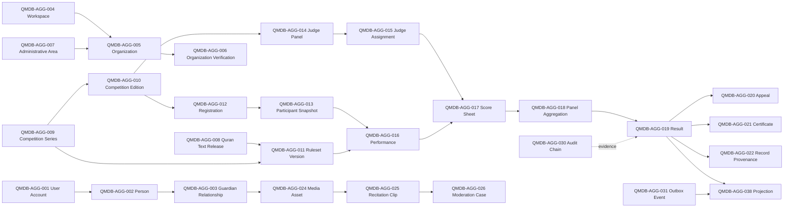

# Domain Aggregate and Ownership Model

| Document control | Value |
| --- | --- |
| Project | Qur’an Memorizer DB |
| Project Code | QMDB |
| Baseline ID | QMDB-BL-001 |
| Batch ID | QMDB-P0-B04 |
| Document Title | Domain Aggregate and Ownership Model |
| Document Version | 1.0.0 |
| Document Status | Controlled draft |
| Document Owner Role | Domain Architecture and Data Governance |
| Last Updated | 2026-08-24 |
| Approval Status | Proposed for governance approval |
| Related Documents | [data overview](01-data-architecture-overview.md); [dictionary](05-table-and-column-data-dictionary.md); [B02 event catalog](../requirements/P0-B02-event-and-notification-catalog.md) |

## Purpose

Define aggregate roots, ownership, transaction boundaries, historical behavior, published events and forbidden ownership so future Core PHP modules do not create cross-domain write coupling.

## Scope and boundary rules

- Aggregate roots protect local invariants; cross-aggregate coordination belongs to an application service with the narrowest viable transaction.
- Competition Edition does not own every Score Sheet. Each Judge-specific Score Sheet supports independent optimistic concurrency.
- Result finalization coordinates identified immutable inputs; it does not mutate Score Sheet, Participant Snapshot or Ruleset Version.
- Person identity, User Account authentication, Participant Snapshot, public projection and Certificate are distinct lifecycles.
- Media Asset owns metadata/policy state; private object bytes stay in object storage and Social Posts reference, but do not own, Media Assets.
- Public profiles, live boards, feeds, search and analytics are controlled projections, not aggregate authority.

## Aggregate relationship diagram

The arrows are references or event flows, not ownership transfer. IDs shown here match the records below.

## Aggregate records

### QMDB-AGG-001 — User Account

| Field | Controlled definition |
| --- | --- |
| Aggregate ID | QMDB-AGG-001 |
| Aggregate Root | `user_accounts` |
| Purpose | Protects the User Account business boundary and its invariants. |
| Owning Module | Identity and Authentication |
| Tenant Scope | GLOBAL_GOVERNED |
| Child Entities | `account_email_addresses`; `account_phone_numbers`; `account_credentials`; `credential_history`; `auth_sessions`; `devices`; `mfa_methods`; `passkeys`; `verification_challenges`; `recovery_tokens`; `account_status_events`; `authentication_security_events` |
| Value Objects | QMDB-VO-007 Minor Status; QMDB-VO-022 Verification Code Hash; QMDB-VO-029 Lifecycle Status; QMDB-VO-031 Device Sequence |
| Invariants | Declared table constraints, lifecycle policy and owning-module requirements. |
| Transaction Boundary | Mutate one User Account root and its owned children atomically; external aggregates are validated by identity/version and referenced, not rewritten. |
| Published Events | AccountRegistered; AccountEmailVerified; SessionTerminated |
| External References | References are immutable identities/versions validated through the owning application service and Workspace-aware constraints where applicable. |
| Forbidden Ownership | Other aggregate roots and their mutable children; references do not imply write ownership. |
| Versioning | Use optimistic version where concurrent mutation is material. Append only; corrections are linked events. |
| Deletion Behavior | Governed archival/anonymization; generic soft deletion only where explicitly permitted. |
| Related Requirements | QMDB-DR-005; QMDB-FR-IAM-001; QMDB-FR-IAM-002; QMDB-FR-IAM-003; QMDB-NFR-DAT-001; QMDB-NFR-DAT-002; QMDB-NFR-PRI-002 |

### QMDB-AGG-002 — Person

| Field | Controlled definition |
| --- | --- |
| Aggregate ID | QMDB-AGG-002 |
| Aggregate Root | `persons` |
| Purpose | Protects the Person business boundary and its invariants. |
| Owning Module | People and Guardianship |
| Tenant Scope | GLOBAL_GOVERNED; PUBLIC_PROJECTION; TENANT_OWNED |
| Child Entities | `person_names`; `person_profiles`; `public_profiles`; `memorizer_profiles`; `competitor_profiles`; `judge_profiles`; `coach_profiles`; `teacher_profiles`; `person_affiliations`; `person_geography_representations`; `identity_evidence`; `person_merge_cases`; `person_merge_events` |
| Value Objects | QMDB-VO-001 Workspace Identity; QMDB-VO-002 Public Identifier; QMDB-VO-006 Person Name; QMDB-VO-011 Quran Release Identity; QMDB-VO-019 Participant Snapshot Identity |
| Invariants | Declared table constraints, lifecycle policy and owning-module requirements. |
| Transaction Boundary | Mutate one Person root and its owned children atomically; external aggregates are validated by identity/version and referenced, not rewritten. |
| Published Events | State-specific domain events are emitted only when defined in the B02 event catalog; no generic event grants authority. |
| External References | References are immutable identities/versions validated through the owning application service and Workspace-aware constraints where applicable. |
| Forbidden Ownership | Credentials, Workspace authority, Participant Snapshots, Results and public projections. |
| Versioning | Use optimistic version where concurrent mutation is material. Track authoritative source version and rebuild deterministically. |
| Deletion Behavior | Governed archival/anonymization; generic soft deletion only where explicitly permitted. |
| Related Requirements | QMDB-DR-008; QMDB-FR-PPL-001; QMDB-FR-PPL-002; QMDB-FR-PPL-003; QMDB-NFR-DAT-001; QMDB-NFR-DAT-002; QMDB-NFR-TEN-001; QMDB-NFR-PRI-002 |

### QMDB-AGG-003 — Guardian Relationship

| Field | Controlled definition |
| --- | --- |
| Aggregate ID | QMDB-AGG-003 |
| Aggregate Root | `guardian_relationships` |
| Purpose | Protects the Guardian Relationship business boundary and its invariants. |
| Owning Module | People and Guardianship |
| Tenant Scope | GLOBAL_GOVERNED |
| Child Entities | `consent_records`; `consent_events` |
| Value Objects | QMDB-VO-008 Consent Purpose |
| Invariants | Declared table constraints, lifecycle policy and owning-module requirements. |
| Transaction Boundary | Mutate one Guardian Relationship root and its owned children atomically; external aggregates are validated by identity/version and referenced, not rewritten. |
| Published Events | GuardianRelationshipChanged; ConsentGranted; ConsentWithdrawn |
| External References | References are immutable identities/versions validated through the owning application service and Workspace-aware constraints where applicable. |
| Forbidden Ownership | Other aggregate roots and their mutable children; references do not imply write ownership. |
| Versioning | Use optimistic version where concurrent mutation is material. Append only; corrections are linked events. |
| Deletion Behavior | Governed archival/anonymization; generic soft deletion only where explicitly permitted. |
| Related Requirements | QMDB-DR-008; QMDB-FR-PPL-001; QMDB-FR-PPL-002; QMDB-FR-PPL-003; QMDB-NFR-DAT-001; QMDB-NFR-DAT-002; QMDB-NFR-PRI-002 |

### QMDB-AGG-004 — Workspace

| Field | Controlled definition |
| --- | --- |
| Aggregate ID | QMDB-AGG-004 |
| Aggregate Root | `workspaces` |
| Purpose | Protects the Workspace business boundary and its invariants. |
| Owning Module | Workspaces and Authorization |
| Tenant Scope | GLOBAL_GOVERNED; TENANT_OWNED; GLOBAL_REFERENCE; TENANT_CHILD |
| Child Entities | `workspace_settings`; `memberships`; `roles`; `permissions`; `role_permissions`; `membership_roles`; `administrative_scopes`; `scope_grants`; `competition_assignments`; `approval_requests`; `approval_decisions`; `temporary_privilege_grants` |
| Value Objects | QMDB-VO-001 Workspace Identity; QMDB-VO-009 Administrative Area Path; QMDB-VO-014 Competition Local Time |
| Invariants | INV-001; INV-002 |
| Transaction Boundary | Mutate one Workspace root and its owned children atomically; external aggregates are validated by identity/version and referenced, not rewritten. |
| Published Events | State-specific domain events are emitted only when defined in the B02 event catalog; no generic event grants authority. |
| External References | References are immutable identities/versions validated through the owning application service and Workspace-aware constraints where applicable. |
| Forbidden Ownership | Other aggregate roots and their mutable children; references do not imply write ownership. |
| Versioning | Use optimistic version where concurrent mutation is material. |
| Deletion Behavior | Governed archival/anonymization; generic soft deletion only where explicitly permitted. |
| Related Requirements | QMDB-DR-006; QMDB-FR-TEN-001; QMDB-FR-TEN-002; QMDB-FR-AUT-001; QMDB-NFR-DAT-001; QMDB-NFR-DAT-002; QMDB-NFR-TEN-001 |

### QMDB-AGG-005 — Organization

| Field | Controlled definition |
| --- | --- |
| Aggregate ID | QMDB-AGG-005 |
| Aggregate Root | `organizations` |
| Purpose | Protects the Organization business boundary and its invariants. |
| Owning Module | Organizations |
| Tenant Scope | GLOBAL_REFERENCE; GLOBAL_GOVERNED |
| Child Entities | `organization_types`; `organization_units`; `organization_relationships`; `organization_coverage_areas`; `organization_branding_configurations` |
| Value Objects | QMDB-VO-010 Organization Authority Scope |
| Invariants | Declared table constraints, lifecycle policy and owning-module requirements. |
| Transaction Boundary | Mutate one Organization root and its owned children atomically; external aggregates are validated by identity/version and referenced, not rewritten. |
| Published Events | State-specific domain events are emitted only when defined in the B02 event catalog; no generic event grants authority. |
| External References | References are immutable identities/versions validated through the owning application service and Workspace-aware constraints where applicable. |
| Forbidden Ownership | Other aggregate roots and their mutable children; references do not imply write ownership. |
| Versioning | Append a new immutable version; never overwrite historical facts. Use optimistic version where concurrent mutation is material. |
| Deletion Behavior | Governed archival/anonymization; generic soft deletion only where explicitly permitted. |
| Related Requirements | QMDB-DR-010; QMDB-FR-ORG-001; QMDB-FR-ORG-002; QMDB-FR-ORG-003; QMDB-NFR-DAT-001; QMDB-NFR-DAT-002 |

### QMDB-AGG-006 — Organization Verification

| Field | Controlled definition |
| --- | --- |
| Aggregate ID | QMDB-AGG-006 |
| Aggregate Root | `organization_verification_cases` |
| Purpose | Protects the Organization Verification business boundary and its invariants. |
| Owning Module | Organizations |
| Tenant Scope | GLOBAL_GOVERNED |
| Child Entities | `organization_verification_evidence`; `organization_verification_decisions` |
| Value Objects | QMDB-VO-010 Organization Authority Scope; QMDB-VO-022 Verification Code Hash |
| Invariants | Declared table constraints, lifecycle policy and owning-module requirements. |
| Transaction Boundary | Mutate one Organization Verification root and its owned children atomically; external aggregates are validated by identity/version and referenced, not rewritten. |
| Published Events | OrganizationVerificationChanged |
| External References | References are immutable identities/versions validated through the owning application service and Workspace-aware constraints where applicable. |
| Forbidden Ownership | Other aggregate roots and their mutable children; references do not imply write ownership. |
| Versioning | Use optimistic version where concurrent mutation is material. |
| Deletion Behavior | Governed archival/anonymization; generic soft deletion only where explicitly permitted. |
| Related Requirements | QMDB-DR-010; QMDB-FR-ORG-001; QMDB-FR-ORG-002; QMDB-FR-ORG-003; QMDB-NFR-DAT-001; QMDB-NFR-DAT-002 |

### QMDB-AGG-007 — Administrative Area

| Field | Controlled definition |
| --- | --- |
| Aggregate ID | QMDB-AGG-007 |
| Aggregate Root | `administrative_areas` |
| Purpose | Protects the Administrative Area business boundary and its invariants. |
| Owning Module | Geography; Platform and Offline Operations |
| Tenant Scope | GLOBAL_REFERENCE; GLOBAL_GOVERNED; TENANT_OWNED; TENANT_CHILD |
| Child Entities | `administrative_area_types`; `administrative_area_aliases`; `administrative_area_history`; `venues`; `venue_areas`; `venue_edge_node_registrations`; `venue_reconciliation_reports` |
| Value Objects | QMDB-VO-009 Administrative Area Path |
| Invariants | Declared table constraints, lifecycle policy and owning-module requirements. |
| Transaction Boundary | Mutate one Administrative Area root and its owned children atomically; external aggregates are validated by identity/version and referenced, not rewritten. |
| Published Events | State-specific domain events are emitted only when defined in the B02 event catalog; no generic event grants authority. |
| External References | References are immutable identities/versions validated through the owning application service and Workspace-aware constraints where applicable. |
| Forbidden Ownership | Other aggregate roots and their mutable children; references do not imply write ownership. |
| Versioning | Append a new immutable version; never overwrite historical facts. Use optimistic version where concurrent mutation is material. |
| Deletion Behavior | Governed archival/anonymization; generic soft deletion only where explicitly permitted. |
| Related Requirements | QMDB-DR-009; QMDB-FR-GEO-001; QMDB-FR-GEO-002; QMDB-FR-GEO-003; QMDB-NFR-DAT-001; QMDB-NFR-DAT-002; QMDB-DR-027; QMDB-FR-OPS-001 |

### QMDB-AGG-008 — Quran Text Release

| Field | Controlled definition |
| --- | --- |
| Aggregate ID | QMDB-AGG-008 |
| Aggregate Root | `quran_text_releases` |
| Purpose | Protects the Quran Text Release business boundary and its invariants. |
| Owning Module | Quran Reference Governance |
| Tenant Scope | GLOBAL_REFERENCE |
| Child Entities | `quran_release_sources`; `quran_readings`; `surahs`; `ayahs`; `juz_ranges`; `hizb_ranges`; `rub_ranges`; `page_references`; `passage_ranges`; `tajwid_rule_taxonomy`; `competition_mistake_taxonomy`; `quran_release_approvals`; `quran_release_checksums`; `quran_release_correction_history` |
| Value Objects | QMDB-VO-011 Quran Release Identity; QMDB-VO-012 Ayah Reference; QMDB-VO-013 Passage Range; QMDB-VO-014 Competition Local Time; QMDB-VO-015 Ruleset Checksum |
| Invariants | INV-017; INV-018 |
| Transaction Boundary | Mutate one Quran Text Release root and its owned children atomically; external aggregates are validated by identity/version and referenced, not rewritten. |
| Published Events | QuranTextReleaseActivated |
| External References | References are immutable identities/versions validated through the owning application service and Workspace-aware constraints where applicable. |
| Forbidden Ownership | Other aggregate roots and their mutable children; references do not imply write ownership. |
| Versioning | Append a new immutable version; never overwrite historical facts. Use optimistic version where concurrent mutation is material. |
| Deletion Behavior | No normal hard deletion; revoke, supersede, archive or governed anonymization only. |
| Related Requirements | QMDB-DR-011; QMDB-FR-QRF-001; QMDB-FR-QRF-002; QMDB-FR-QRF-003; QMDB-NFR-DAT-001; QMDB-NFR-DAT-002 |

### QMDB-AGG-009 — Competition Series

| Field | Controlled definition |
| --- | --- |
| Aggregate ID | QMDB-AGG-009 |
| Aggregate Root | `competition_series` |
| Purpose | Protects the Competition Series business boundary and its invariants. |
| Owning Module | Competition Configuration |
| Tenant Scope | TENANT_OWNED |
| Child Entities | None; the root is self-contained. |
| Value Objects | QMDB-VO-014 Competition Local Time |
| Invariants | Declared table constraints, lifecycle policy and owning-module requirements. |
| Transaction Boundary | Mutate one Competition Series root and its owned children atomically; external aggregates are validated by identity/version and referenced, not rewritten. |
| Published Events | State-specific domain events are emitted only when defined in the B02 event catalog; no generic event grants authority. |
| External References | References are immutable identities/versions validated through the owning application service and Workspace-aware constraints where applicable. |
| Forbidden Ownership | Other aggregate roots and their mutable children; references do not imply write ownership. |
| Versioning | Use optimistic version where concurrent mutation is material. |
| Deletion Behavior | Governed archival/anonymization; generic soft deletion only where explicitly permitted. |
| Related Requirements | QMDB-DR-012; QMDB-FR-CMP-001; QMDB-FR-CMP-002; QMDB-FR-CMP-003; QMDB-NFR-DAT-001; QMDB-NFR-DAT-002; QMDB-NFR-TEN-001 |

### QMDB-AGG-010 — Competition Edition

| Field | Controlled definition |
| --- | --- |
| Aggregate ID | QMDB-AGG-010 |
| Aggregate Root | `competition_editions` |
| Purpose | Protects the Competition Edition business boundary and its invariants. |
| Owning Module | Competition Configuration; Scheduling and Judging; Certificates and Trusted Records |
| Tenant Scope | TENANT_CHILD; TENANT_OWNED |
| Child Entities | `competition_organization_relationships`; `competition_administrative_areas`; `competition_venues`; `divisions`; `age_bands`; `categories`; `stages`; `rounds`; `competition_sessions`; `competition_schedules`; `session_schedules`; `draw_orders`; `competition_records` |
| Value Objects | QMDB-VO-009 Administrative Area Path; QMDB-VO-010 Organization Authority Scope; QMDB-VO-014 Competition Local Time |
| Invariants | Declared table constraints, lifecycle policy and owning-module requirements. |
| Transaction Boundary | Mutate one Competition Edition root and its owned children atomically; external aggregates are validated by identity/version and referenced, not rewritten. |
| Published Events | CompetitionPublished; SchedulePublished; ScheduleChanged |
| External References | References are immutable identities/versions validated through the owning application service and Workspace-aware constraints where applicable. |
| Forbidden Ownership | Score Sheets, Person profiles, Media Assets, Results and Certificates. |
| Versioning | Use optimistic version where concurrent mutation is material. |
| Deletion Behavior | Governed archival/anonymization; generic soft deletion only where explicitly permitted. |
| Related Requirements | QMDB-DR-012; QMDB-FR-CMP-001; QMDB-FR-CMP-002; QMDB-FR-CMP-003; QMDB-NFR-DAT-001; QMDB-NFR-DAT-002; QMDB-NFR-TEN-001; QMDB-NFR-PRI-002 |

### QMDB-AGG-011 — Ruleset Version

| Field | Controlled definition |
| --- | --- |
| Aggregate ID | QMDB-AGG-011 |
| Aggregate Root | `ruleset_versions` |
| Purpose | Protects the Ruleset Version business boundary and its invariants. |
| Owning Module | Competition Configuration |
| Tenant Scope | TENANT_OWNED; TENANT_CHILD |
| Child Entities | `rulesets`; `scoring_criteria`; `deduction_rules`; `aggregation_rules`; `tie_break_rules`; `disqualification_rules`; `publication_rules`; `appeal_rules` |
| Value Objects | QMDB-VO-002 Public Identifier; QMDB-VO-015 Ruleset Checksum; QMDB-VO-018 Score Version; QMDB-VO-020 Result Version |
| Invariants | Declared table constraints, lifecycle policy and owning-module requirements. |
| Transaction Boundary | Mutate one Ruleset Version root and its owned children atomically; external aggregates are validated by identity/version and referenced, not rewritten. |
| Published Events | RulesetVersionActivated |
| External References | References are immutable identities/versions validated through the owning application service and Workspace-aware constraints where applicable. |
| Forbidden Ownership | Other aggregate roots and their mutable children; references do not imply write ownership. |
| Versioning | Append a new immutable version; never overwrite historical facts. |
| Deletion Behavior | Governed archival/anonymization; generic soft deletion only where explicitly permitted. |
| Related Requirements | QMDB-DR-012; QMDB-FR-CMP-001; QMDB-FR-CMP-002; QMDB-FR-CMP-003; QMDB-NFR-DAT-001; QMDB-NFR-DAT-002; QMDB-NFR-TEN-001; QMDB-NFR-PRI-002 |

### QMDB-AGG-012 — Registration

| Field | Controlled definition |
| --- | --- |
| Aggregate ID | QMDB-AGG-012 |
| Aggregate Root | `registrations` |
| Purpose | Protects the Registration business boundary and its invariants. |
| Owning Module | Registration and Eligibility |
| Tenant Scope | TENANT_OWNED; TENANT_CHILD |
| Child Entities | `registration_categories`; `nominations`; `nomination_authorities`; `eligibility_checks`; `eligibility_evidence`; `registration_decisions`; `check_ins`; `waitlist_entries`; `registration_exceptions` |
| Value Objects | Shared public identifier, effective time range, lifecycle status and content hash as applicable. |
| Invariants | Declared table constraints, lifecycle policy and owning-module requirements. |
| Transaction Boundary | Mutate one Registration root and its owned children atomically; external aggregates are validated by identity/version and referenced, not rewritten. |
| Published Events | RegistrationSubmitted; EligibilityDecided |
| External References | References are immutable identities/versions validated through the owning application service and Workspace-aware constraints where applicable. |
| Forbidden Ownership | Other aggregate roots and their mutable children; references do not imply write ownership. |
| Versioning | Use optimistic version where concurrent mutation is material. |
| Deletion Behavior | Governed archival/anonymization; generic soft deletion only where explicitly permitted. |
| Related Requirements | QMDB-DR-013; QMDB-FR-REG-001; QMDB-FR-REG-002; QMDB-FR-REG-003; QMDB-NFR-DAT-001; QMDB-NFR-DAT-002; QMDB-NFR-TEN-001 |

### QMDB-AGG-013 — Participant Snapshot

| Field | Controlled definition |
| --- | --- |
| Aggregate ID | QMDB-AGG-013 |
| Aggregate Root | `participant_snapshots` |
| Purpose | Protects the Participant Snapshot business boundary and its invariants. |
| Owning Module | Registration and Eligibility |
| Tenant Scope | TENANT_CHILD |
| Child Entities | `participant_snapshot_affiliations`; `participant_snapshot_geography` |
| Value Objects | QMDB-VO-019 Participant Snapshot Identity |
| Invariants | Declared table constraints, lifecycle policy and owning-module requirements. |
| Transaction Boundary | Mutate one Participant Snapshot root and its owned children atomically; external aggregates are validated by identity/version and referenced, not rewritten. |
| Published Events | State-specific domain events are emitted only when defined in the B02 event catalog; no generic event grants authority. |
| External References | References are immutable identities/versions validated through the owning application service and Workspace-aware constraints where applicable. |
| Forbidden Ownership | Other aggregate roots and their mutable children; references do not imply write ownership. |
| Versioning | Append a new immutable version; never overwrite historical facts. Use optimistic version where concurrent mutation is material. |
| Deletion Behavior | No normal hard deletion; revoke, supersede, archive or governed anonymization only. |
| Related Requirements | QMDB-DR-013; QMDB-FR-REG-001; QMDB-FR-REG-002; QMDB-FR-REG-003; QMDB-NFR-DAT-001; QMDB-NFR-DAT-002; QMDB-NFR-TEN-001 |

### QMDB-AGG-014 — Judge Panel

| Field | Controlled definition |
| --- | --- |
| Aggregate ID | QMDB-AGG-014 |
| Aggregate Root | `judge_panels` |
| Purpose | Protects the Judge Panel business boundary and its invariants. |
| Owning Module | Scheduling and Judging |
| Tenant Scope | TENANT_OWNED; TENANT_CHILD |
| Child Entities | `judge_panel_members` |
| Value Objects | Shared public identifier, effective time range, lifecycle status and content hash as applicable. |
| Invariants | Declared table constraints, lifecycle policy and owning-module requirements. |
| Transaction Boundary | Mutate one Judge Panel root and its owned children atomically; external aggregates are validated by identity/version and referenced, not rewritten. |
| Published Events | State-specific domain events are emitted only when defined in the B02 event catalog; no generic event grants authority. |
| External References | References are immutable identities/versions validated through the owning application service and Workspace-aware constraints where applicable. |
| Forbidden Ownership | Other aggregate roots and their mutable children; references do not imply write ownership. |
| Versioning | Use optimistic version where concurrent mutation is material. |
| Deletion Behavior | Governed archival/anonymization; generic soft deletion only where explicitly permitted. |
| Related Requirements | QMDB-DR-014; QMDB-FR-SCH-001; QMDB-FR-SCH-002; QMDB-FR-SCH-003; QMDB-NFR-DAT-001; QMDB-NFR-DAT-002; QMDB-NFR-TEN-001 |

### QMDB-AGG-015 — Judge Assignment

| Field | Controlled definition |
| --- | --- |
| Aggregate ID | QMDB-AGG-015 |
| Aggregate Root | `judge_assignments` |
| Purpose | Protects the Judge Assignment business boundary and its invariants. |
| Owning Module | Scheduling and Judging |
| Tenant Scope | TENANT_CHILD |
| Child Entities | `judge_qualification_evidence`; `conflict_declarations`; `conflict_reviews`; `recusal_records`; `judge_replacements` |
| Value Objects | Shared public identifier, effective time range, lifecycle status and content hash as applicable. |
| Invariants | Declared table constraints, lifecycle policy and owning-module requirements. |
| Transaction Boundary | Mutate one Judge Assignment root and its owned children atomically; external aggregates are validated by identity/version and referenced, not rewritten. |
| Published Events | JudgeAssigned; ConflictDeclared |
| External References | References are immutable identities/versions validated through the owning application service and Workspace-aware constraints where applicable. |
| Forbidden Ownership | Other aggregate roots and their mutable children; references do not imply write ownership. |
| Versioning | Use optimistic version where concurrent mutation is material. |
| Deletion Behavior | Governed archival/anonymization; generic soft deletion only where explicitly permitted. |
| Related Requirements | QMDB-DR-014; QMDB-FR-SCH-001; QMDB-FR-SCH-002; QMDB-FR-SCH-003; QMDB-NFR-DAT-001; QMDB-NFR-DAT-002; QMDB-NFR-TEN-001; QMDB-NFR-PRI-002 |

### QMDB-AGG-016 — Performance

| Field | Controlled definition |
| --- | --- |
| Aggregate ID | QMDB-AGG-016 |
| Aggregate Root | `performances` |
| Purpose | Protects the Performance business boundary and its invariants. |
| Owning Module | Performance and Scoring |
| Tenant Scope | TENANT_OWNED; TENANT_CHILD |
| Child Entities | `performance_passages`; `performance_events`; `performance_incidents` |
| Value Objects | QMDB-VO-013 Passage Range |
| Invariants | Declared table constraints, lifecycle policy and owning-module requirements. |
| Transaction Boundary | Mutate one Performance root and its owned children atomically; external aggregates are validated by identity/version and referenced, not rewritten. |
| Published Events | PerformanceOpened |
| External References | References are immutable identities/versions validated through the owning application service and Workspace-aware constraints where applicable. |
| Forbidden Ownership | Other aggregate roots and their mutable children; references do not imply write ownership. |
| Versioning | Use optimistic version where concurrent mutation is material. Append only; corrections are linked events. |
| Deletion Behavior | Governed archival/anonymization; generic soft deletion only where explicitly permitted. |
| Related Requirements | QMDB-DR-015; QMDB-FR-SCR-001; QMDB-FR-SCR-002; QMDB-FR-SCR-003; QMDB-NFR-DAT-001; QMDB-NFR-DAT-002; QMDB-NFR-TEN-001; QMDB-NFR-PRI-002 |

### QMDB-AGG-017 — Score Sheet

| Field | Controlled definition |
| --- | --- |
| Aggregate ID | QMDB-AGG-017 |
| Aggregate Root | `score_sheets` |
| Purpose | Protects the Score Sheet business boundary and its invariants. |
| Owning Module | Performance and Scoring |
| Tenant Scope | TENANT_CHILD |
| Child Entities | `score_sheet_versions`; `score_items`; `score_deductions`; `score_mistakes`; `score_signatures`; `score_submission_receipts`; `score_reopening_requests`; `score_reopening_approvals`; `score_anomaly_flags` |
| Value Objects | QMDB-VO-018 Score Version; QMDB-VO-020 Result Version |
| Invariants | INV-008; INV-009; INV-010; INV-011; INV-013 |
| Transaction Boundary | Lock one Score Sheet lineage; validate current Performance, Assignment and Ruleset; append version, receipt, audit and outbox atomically. |
| Published Events | ScoreSheetDraftSaved; ScoreSheetSubmitted; ScoreSheetLocked; ScoreReopeningRequested; ScoreSheetReopened; ScoreSheetResubmitted |
| External References | References are immutable identities/versions validated through the owning application service and Workspace-aware constraints where applicable. |
| Forbidden Ownership | Other aggregate roots and their mutable children; references do not imply write ownership. |
| Versioning | Use optimistic version where concurrent mutation is material. Append a new immutable version; never overwrite historical facts. |
| Deletion Behavior | Governed archival/anonymization; generic soft deletion only where explicitly permitted. |
| Related Requirements | QMDB-DR-015; QMDB-FR-SCR-001; QMDB-FR-SCR-002; QMDB-FR-SCR-003; QMDB-NFR-DAT-001; QMDB-NFR-DAT-002; QMDB-NFR-TEN-001; QMDB-NFR-PRI-002 |

### QMDB-AGG-018 — Panel Aggregation

| Field | Controlled definition |
| --- | --- |
| Aggregate ID | QMDB-AGG-018 |
| Aggregate Root | `panel_aggregations` |
| Purpose | Protects the Panel Aggregation business boundary and its invariants. |
| Owning Module | Performance and Scoring |
| Tenant Scope | TENANT_CHILD |
| Child Entities | `aggregation_inputs`; `tie_break_evaluations`; `calculation_traces` |
| Value Objects | Shared public identifier, effective time range, lifecycle status and content hash as applicable. |
| Invariants | Declared table constraints, lifecycle policy and owning-module requirements. |
| Transaction Boundary | Mutate one Panel Aggregation root and its owned children atomically; external aggregates are validated by identity/version and referenced, not rewritten. |
| Published Events | PanelAggregationCompleted |
| External References | References are immutable identities/versions validated through the owning application service and Workspace-aware constraints where applicable. |
| Forbidden Ownership | Other aggregate roots and their mutable children; references do not imply write ownership. |
| Versioning | Use optimistic version where concurrent mutation is material. Append only; corrections are linked events. |
| Deletion Behavior | Governed archival/anonymization; generic soft deletion only where explicitly permitted. |
| Related Requirements | QMDB-DR-015; QMDB-FR-SCR-001; QMDB-FR-SCR-002; QMDB-FR-SCR-003; QMDB-NFR-DAT-001; QMDB-NFR-DAT-002; QMDB-NFR-TEN-001 |

### QMDB-AGG-019 — Result

| Field | Controlled definition |
| --- | --- |
| Aggregate ID | QMDB-AGG-019 |
| Aggregate Root | `result_snapshots` |
| Purpose | Protects the Result business boundary and its invariants. |
| Owning Module | Results and Appeals |
| Tenant Scope | TENANT_OWNED; TENANT_CHILD |
| Child Entities | `rankings`; `placements`; `result_approvals`; `result_finalization_bundles`; `result_corrections`; `result_supersession_links` |
| Value Objects | QMDB-VO-019 Participant Snapshot Identity; QMDB-VO-020 Result Version |
| Invariants | Declared table constraints, lifecycle policy and owning-module requirements. |
| Transaction Boundary | Lock one Result lineage and readiness inputs; append final/corrected snapshot, approval bundle, supersession, audit and outbox atomically. |
| Published Events | ProvisionalResultPublished; FinalResultPublished; ResultCorrected |
| External References | References are immutable identities/versions validated through the owning application service and Workspace-aware constraints where applicable. |
| Forbidden Ownership | Score Sheet Versions, Ruleset Versions, Participant Snapshots and Certificates. |
| Versioning | Append a new immutable version; never overwrite historical facts. Use optimistic version where concurrent mutation is material. |
| Deletion Behavior | No normal hard deletion; revoke, supersede, archive or governed anonymization only. |
| Related Requirements | QMDB-DR-016; QMDB-FR-LIV-001; QMDB-FR-LIV-002; QMDB-FR-RSL-001; QMDB-NFR-DAT-001; QMDB-NFR-DAT-002; QMDB-NFR-TEN-001; QMDB-NFR-PRI-002 |

### QMDB-AGG-020 — Appeal

| Field | Controlled definition |
| --- | --- |
| Aggregate ID | QMDB-AGG-020 |
| Aggregate Root | `appeals` |
| Purpose | Protects the Appeal business boundary and its invariants. |
| Owning Module | Results and Appeals |
| Tenant Scope | TENANT_OWNED; TENANT_CHILD |
| Child Entities | `appeal_evidence`; `appeal_assignments`; `appeal_reviews`; `appeal_decisions`; `appeal_events` |
| Value Objects | Shared public identifier, effective time range, lifecycle status and content hash as applicable. |
| Invariants | Declared table constraints, lifecycle policy and owning-module requirements. |
| Transaction Boundary | Mutate one Appeal root and its owned children atomically; external aggregates are validated by identity/version and referenced, not rewritten. |
| Published Events | AppealSubmitted; AppealDecided |
| External References | References are immutable identities/versions validated through the owning application service and Workspace-aware constraints where applicable. |
| Forbidden Ownership | Other aggregate roots and their mutable children; references do not imply write ownership. |
| Versioning | Use optimistic version where concurrent mutation is material. Append only; corrections are linked events. |
| Deletion Behavior | Governed archival/anonymization; generic soft deletion only where explicitly permitted. |
| Related Requirements | QMDB-DR-016; QMDB-FR-LIV-001; QMDB-FR-LIV-002; QMDB-FR-RSL-001; QMDB-NFR-DAT-001; QMDB-NFR-DAT-002; QMDB-NFR-TEN-001; QMDB-NFR-PRI-002 |

### QMDB-AGG-021 — Certificate

| Field | Controlled definition |
| --- | --- |
| Aggregate ID | QMDB-AGG-021 |
| Aggregate Root | `certificates` |
| Purpose | Protects the Certificate business boundary and its invariants. |
| Owning Module | Certificates and Trusted Records |
| Tenant Scope | TENANT_OWNED; TENANT_CHILD |
| Child Entities | `certificate_templates`; `certificate_template_versions`; `certificate_signatures`; `certificate_revocations`; `certificate_supersession_links`; `certificate_verification_events` |
| Value Objects | QMDB-VO-018 Score Version; QMDB-VO-020 Result Version; QMDB-VO-021 Certificate Serial; QMDB-VO-022 Verification Code Hash |
| Invariants | INV-015; INV-026 |
| Transaction Boundary | Lock one eligible Result/recipient lineage; issue unique serial/code, hash/signature metadata, audit and outbox atomically. |
| Published Events | CertificateIssued; CertificateRevoked |
| External References | References are immutable identities/versions validated through the owning application service and Workspace-aware constraints where applicable. |
| Forbidden Ownership | Other aggregate roots and their mutable children; references do not imply write ownership. |
| Versioning | Append a new immutable version; never overwrite historical facts. Append only; corrections are linked events. |
| Deletion Behavior | Governed archival/anonymization; generic soft deletion only where explicitly permitted. |
| Related Requirements | QMDB-DR-018; QMDB-FR-CER-001; QMDB-FR-CER-002; QMDB-FR-CER-003; QMDB-NFR-DAT-001; QMDB-NFR-DAT-002; QMDB-NFR-TEN-001; QMDB-NFR-PRI-002 |

### QMDB-AGG-022 — Record Provenance

| Field | Controlled definition |
| --- | --- |
| Aggregate ID | QMDB-AGG-022 |
| Aggregate Root | `competition_records` |
| Purpose | Protects the Record Provenance business boundary and its invariants. |
| Owning Module | Certificates and Trusted Records |
| Tenant Scope | TENANT_CHILD |
| Child Entities | `record_provenance`; `record_evidence`; `record_disputes`; `record_verification_decisions` |
| Value Objects | QMDB-VO-022 Verification Code Hash |
| Invariants | Declared table constraints, lifecycle policy and owning-module requirements. |
| Transaction Boundary | Mutate one Record Provenance root and its owned children atomically; external aggregates are validated by identity/version and referenced, not rewritten. |
| Published Events | State-specific domain events are emitted only when defined in the B02 event catalog; no generic event grants authority. |
| External References | References are immutable identities/versions validated through the owning application service and Workspace-aware constraints where applicable. |
| Forbidden Ownership | Other aggregate roots and their mutable children; references do not imply write ownership. |
| Versioning | Use optimistic version where concurrent mutation is material. |
| Deletion Behavior | Governed archival/anonymization; generic soft deletion only where explicitly permitted. |
| Related Requirements | QMDB-DR-018; QMDB-FR-CER-001; QMDB-FR-CER-002; QMDB-FR-CER-003; QMDB-NFR-DAT-001; QMDB-NFR-DAT-002; QMDB-NFR-TEN-001 |

### QMDB-AGG-023 — Legacy Import Batch

| Field | Controlled definition |
| --- | --- |
| Aggregate ID | QMDB-AGG-023 |
| Aggregate Root | `legacy_import_batches` |
| Purpose | Protects the Legacy Import Batch business boundary and its invariants. |
| Owning Module | Certificates and Trusted Records |
| Tenant Scope | TENANT_OWNED; TENANT_CHILD |
| Child Entities | `legacy_source_files`; `legacy_import_rows`; `legacy_import_validation_issues`; `legacy_import_approvals`; `legacy_import_reconciliation` |
| Value Objects | Shared public identifier, effective time range, lifecycle status and content hash as applicable. |
| Invariants | Declared table constraints, lifecycle policy and owning-module requirements. |
| Transaction Boundary | Mutate one Legacy Import Batch root and its owned children atomically; external aggregates are validated by identity/version and referenced, not rewritten. |
| Published Events | LegacyImportReconciled |
| External References | References are immutable identities/versions validated through the owning application service and Workspace-aware constraints where applicable. |
| Forbidden Ownership | Other aggregate roots and their mutable children; references do not imply write ownership. |
| Versioning | Use optimistic version where concurrent mutation is material. Append only; corrections are linked events. |
| Deletion Behavior | Governed archival/anonymization; generic soft deletion only where explicitly permitted. |
| Related Requirements | QMDB-DR-018; QMDB-FR-CER-001; QMDB-FR-CER-002; QMDB-FR-CER-003; QMDB-NFR-DAT-001; QMDB-NFR-DAT-002; QMDB-NFR-TEN-001 |

### QMDB-AGG-024 — Media Asset

| Field | Controlled definition |
| --- | --- |
| Aggregate ID | QMDB-AGG-024 |
| Aggregate Root | `media_assets` |
| Purpose | Protects the Media Asset business boundary and its invariants. |
| Owning Module | Media and Evidence |
| Tenant Scope | TENANT_OWNED; TENANT_CHILD |
| Child Entities | `media_upload_authorizations`; `media_storage_objects`; `media_variants`; `media_hashes`; `media_consent_links`; `media_processing_jobs`; `media_processing_attempts`; `media_metadata`; `media_publications`; `media_moderation_states`; `media_retention_states`; `media_access_events` |
| Value Objects | QMDB-VO-002 Public Identifier; QMDB-VO-008 Consent Purpose; QMDB-VO-024 Object Storage Key; QMDB-VO-030 Encryption Envelope Metadata |
| Invariants | Declared table constraints, lifecycle policy and owning-module requirements. |
| Transaction Boundary | Mutate one Media Asset root and its owned children atomically; external aggregates are validated by identity/version and referenced, not rewritten. |
| Published Events | MediaProcessingCompleted; MediaPublished |
| External References | References are immutable identities/versions validated through the owning application service and Workspace-aware constraints where applicable. |
| Forbidden Ownership | Person identity, Consent authority, Performance, Social Post and object-storage binary bytes. |
| Versioning | Use optimistic version where concurrent mutation is material. Append only; corrections are linked events. |
| Deletion Behavior | Governed archival/anonymization; generic soft deletion only where explicitly permitted. |
| Related Requirements | QMDB-DR-019; QMDB-FR-MED-001; QMDB-FR-MED-002; QMDB-FR-MED-003; QMDB-NFR-DAT-001; QMDB-NFR-DAT-002; QMDB-NFR-TEN-001; QMDB-NFR-PRI-002 |

### QMDB-AGG-025 — Recitation Clip

| Field | Controlled definition |
| --- | --- |
| Aggregate ID | QMDB-AGG-025 |
| Aggregate Root | `recitation_clips` |
| Purpose | Protects the Recitation Clip business boundary and its invariants. |
| Owning Module | Recitation Clips and Moderation |
| Tenant Scope | TENANT_OWNED; TENANT_CHILD; PUBLIC_PROJECTION |
| Child Entities | `social_posts`; `post_media`; `post_quran_tags`; `post_competition_links`; `follows`; `reactions`; `bookmarks`; `comments`; `comment_versions`; `blocks`; `mutes`; `creator_analytics_projections`; `feed_events` |
| Value Objects | QMDB-VO-014 Competition Local Time; QMDB-VO-018 Score Version; QMDB-VO-020 Result Version; QMDB-VO-032 Projection Cursor |
| Invariants | Declared table constraints, lifecycle policy and owning-module requirements. |
| Transaction Boundary | Mutate one Recitation Clip root and its owned children atomically; external aggregates are validated by identity/version and referenced, not rewritten. |
| Published Events | RecitationClipPublished |
| External References | References are immutable identities/versions validated through the owning application service and Workspace-aware constraints where applicable. |
| Forbidden Ownership | Other aggregate roots and their mutable children; references do not imply write ownership. |
| Versioning | Use optimistic version where concurrent mutation is material. Append a new immutable version; never overwrite historical facts. |
| Deletion Behavior | Governed archival/anonymization; generic soft deletion only where explicitly permitted. |
| Related Requirements | QMDB-DR-020; QMDB-FR-SOC-001; QMDB-FR-SOC-002; QMDB-FR-SOC-003; QMDB-NFR-DAT-001; QMDB-NFR-DAT-002; QMDB-NFR-TEN-001; QMDB-NFR-PRI-002 |

### QMDB-AGG-026 — Moderation Case

| Field | Controlled definition |
| --- | --- |
| Aggregate ID | QMDB-AGG-026 |
| Aggregate Root | `moderation_cases` |
| Purpose | Protects the Moderation Case business boundary and its invariants. |
| Owning Module | Recitation Clips and Moderation |
| Tenant Scope | TENANT_CHILD |
| Child Entities | `content_reports`; `report_evidence`; `moderation_assignments`; `moderation_actions`; `content_appeals`; `content_appeal_decisions` |
| Value Objects | QMDB-VO-023 Content Hash |
| Invariants | Declared table constraints, lifecycle policy and owning-module requirements. |
| Transaction Boundary | Mutate one Moderation Case root and its owned children atomically; external aggregates are validated by identity/version and referenced, not rewritten. |
| Published Events | ContentReported; ModerationActionTaken |
| External References | References are immutable identities/versions validated through the owning application service and Workspace-aware constraints where applicable. |
| Forbidden Ownership | Other aggregate roots and their mutable children; references do not imply write ownership. |
| Versioning | Use optimistic version where concurrent mutation is material. |
| Deletion Behavior | Governed archival/anonymization; generic soft deletion only where explicitly permitted. |
| Related Requirements | QMDB-DR-020; QMDB-FR-SOC-001; QMDB-FR-SOC-002; QMDB-FR-SOC-003; QMDB-NFR-DAT-001; QMDB-NFR-DAT-002; QMDB-NFR-TEN-001; QMDB-NFR-PRI-002 |

### QMDB-AGG-027 — Privacy Request

| Field | Controlled definition |
| --- | --- |
| Aggregate ID | QMDB-AGG-027 |
| Aggregate Root | `privacy_requests` |
| Purpose | Protects the Privacy Request business boundary and its invariants. |
| Owning Module | Privacy and Data Governance |
| Tenant Scope | GLOBAL_REFERENCE; CROSS_TENANT_OVERSIGHT; GLOBAL_GOVERNED |
| Child Entities | `processing_purposes`; `privacy_notice_versions`; `privacy_request_events`; `privacy_request_assignments`; `retention_policy_records`; `data_holds`; `anonymization_events`; `data_export_deliveries` |
| Value Objects | QMDB-VO-008 Consent Purpose; QMDB-VO-018 Score Version; QMDB-VO-020 Result Version |
| Invariants | Declared table constraints, lifecycle policy and owning-module requirements. |
| Transaction Boundary | Mutate one Privacy Request root and its owned children atomically; external aggregates are validated by identity/version and referenced, not rewritten. |
| Published Events | PrivacyRequestSubmitted |
| External References | References are immutable identities/versions validated through the owning application service and Workspace-aware constraints where applicable. |
| Forbidden Ownership | Other aggregate roots and their mutable children; references do not imply write ownership. |
| Versioning | Append a new immutable version; never overwrite historical facts. Use optimistic version where concurrent mutation is material. |
| Deletion Behavior | Governed archival/anonymization; generic soft deletion only where explicitly permitted. |
| Related Requirements | QMDB-DR-023; QMDB-FR-PRI-001; QMDB-FR-PRI-002; QMDB-FR-PRI-003; QMDB-NFR-DAT-001; QMDB-NFR-DAT-002; QMDB-NFR-PRI-002 |

### QMDB-AGG-028 — Support Access Grant

| Field | Controlled definition |
| --- | --- |
| Aggregate ID | QMDB-AGG-028 |
| Aggregate Root | `support_access_grants` |
| Purpose | Protects the Support Access Grant business boundary and its invariants. |
| Owning Module | Workspaces and Authorization |
| Tenant Scope | CROSS_TENANT_OVERSIGHT |
| Child Entities | None; the root is self-contained. |
| Value Objects | Shared public identifier, effective time range, lifecycle status and content hash as applicable. |
| Invariants | Declared table constraints, lifecycle policy and owning-module requirements. |
| Transaction Boundary | Mutate one Support Access Grant root and its owned children atomically; external aggregates are validated by identity/version and referenced, not rewritten. |
| Published Events | State-specific domain events are emitted only when defined in the B02 event catalog; no generic event grants authority. |
| External References | References are immutable identities/versions validated through the owning application service and Workspace-aware constraints where applicable. |
| Forbidden Ownership | Other aggregate roots and their mutable children; references do not imply write ownership. |
| Versioning | Use optimistic version where concurrent mutation is material. |
| Deletion Behavior | Governed archival/anonymization; generic soft deletion only where explicitly permitted. |
| Related Requirements | QMDB-DR-006; QMDB-FR-TEN-001; QMDB-FR-TEN-002; QMDB-FR-AUT-001; QMDB-NFR-DAT-001; QMDB-NFR-DAT-002 |

### QMDB-AGG-029 — Break-Glass Grant

| Field | Controlled definition |
| --- | --- |
| Aggregate ID | QMDB-AGG-029 |
| Aggregate Root | `break_glass_grants` |
| Purpose | Protects the Break-Glass Grant business boundary and its invariants. |
| Owning Module | Workspaces and Authorization |
| Tenant Scope | CROSS_TENANT_OVERSIGHT |
| Child Entities | None; the root is self-contained. |
| Value Objects | Shared public identifier, effective time range, lifecycle status and content hash as applicable. |
| Invariants | Declared table constraints, lifecycle policy and owning-module requirements. |
| Transaction Boundary | Mutate one Break-Glass Grant root and its owned children atomically; external aggregates are validated by identity/version and referenced, not rewritten. |
| Published Events | BreakGlassAccessActivated |
| External References | References are immutable identities/versions validated through the owning application service and Workspace-aware constraints where applicable. |
| Forbidden Ownership | Other aggregate roots and their mutable children; references do not imply write ownership. |
| Versioning | Use optimistic version where concurrent mutation is material. |
| Deletion Behavior | Governed archival/anonymization; generic soft deletion only where explicitly permitted. |
| Related Requirements | QMDB-DR-006; QMDB-FR-TEN-001; QMDB-FR-TEN-002; QMDB-FR-AUT-001; QMDB-NFR-DAT-001; QMDB-NFR-DAT-002; QMDB-NFR-PRI-002 |

### QMDB-AGG-030 — Audit Chain

| Field | Controlled definition |
| --- | --- |
| Aggregate ID | QMDB-AGG-030 |
| Aggregate Root | `audit_events` |
| Purpose | Protects the Audit Chain business boundary and its invariants. |
| Owning Module | Audit and Integrations |
| Tenant Scope | SYSTEM_OPERATIONAL |
| Child Entities | `audit_checkpoints`; `audit_verification_runs` |
| Value Objects | QMDB-VO-022 Verification Code Hash |
| Invariants | Declared table constraints, lifecycle policy and owning-module requirements. |
| Transaction Boundary | Mutate one Audit Chain root and its owned children atomically; external aggregates are validated by identity/version and referenced, not rewritten. |
| Published Events | AuditVerificationFailed |
| External References | References are immutable identities/versions validated through the owning application service and Workspace-aware constraints where applicable. |
| Forbidden Ownership | Other aggregate roots and their mutable children; references do not imply write ownership. |
| Versioning | Append only; corrections are linked events. |
| Deletion Behavior | No normal hard deletion; revoke, supersede, archive or governed anonymization only. |
| Related Requirements | QMDB-DR-025; QMDB-FR-AUD-001; QMDB-FR-AUD-002; QMDB-FR-INT-001; QMDB-NFR-DAT-001; QMDB-NFR-DAT-002; QMDB-NFR-PRI-002 |

### QMDB-AGG-031 — Outbox Event

| Field | Controlled definition |
| --- | --- |
| Aggregate ID | QMDB-AGG-031 |
| Aggregate Root | `outbox_events` |
| Purpose | Protects the Outbox Event business boundary and its invariants. |
| Owning Module | Audit and Integrations |
| Tenant Scope | SYSTEM_OPERATIONAL |
| Child Entities | `idempotency_records` |
| Value Objects | QMDB-VO-025 Idempotency Key |
| Invariants | Declared table constraints, lifecycle policy and owning-module requirements. |
| Transaction Boundary | Mutate one Outbox Event root and its owned children atomically; external aggregates are validated by identity/version and referenced, not rewritten. |
| Published Events | OutboxEventFailed |
| External References | References are immutable identities/versions validated through the owning application service and Workspace-aware constraints where applicable. |
| Forbidden Ownership | Other aggregate roots and their mutable children; references do not imply write ownership. |
| Versioning | Append only; corrections are linked events. Use optimistic version where concurrent mutation is material. |
| Deletion Behavior | No normal hard deletion; revoke, supersede, archive or governed anonymization only. |
| Related Requirements | QMDB-DR-025; QMDB-FR-AUD-001; QMDB-FR-AUD-002; QMDB-FR-INT-001; QMDB-NFR-DAT-001; QMDB-NFR-DAT-002 |

### QMDB-AGG-032 — API Client

| Field | Controlled definition |
| --- | --- |
| Aggregate ID | QMDB-AGG-032 |
| Aggregate Root | `api_clients` |
| Purpose | Protects the API Client business boundary and its invariants. |
| Owning Module | Audit and Integrations |
| Tenant Scope | TENANT_OWNED; TENANT_CHILD |
| Child Entities | `api_client_scopes`; `api_credentials`; `integration_events`; `external_provider_references` |
| Value Objects | QMDB-VO-012 Ayah Reference |
| Invariants | Declared table constraints, lifecycle policy and owning-module requirements. |
| Transaction Boundary | Mutate one API Client root and its owned children atomically; external aggregates are validated by identity/version and referenced, not rewritten. |
| Published Events | State-specific domain events are emitted only when defined in the B02 event catalog; no generic event grants authority. |
| External References | References are immutable identities/versions validated through the owning application service and Workspace-aware constraints where applicable. |
| Forbidden Ownership | Other aggregate roots and their mutable children; references do not imply write ownership. |
| Versioning | Use optimistic version where concurrent mutation is material. Append only; corrections are linked events. |
| Deletion Behavior | Governed archival/anonymization; generic soft deletion only where explicitly permitted. |
| Related Requirements | QMDB-DR-025; QMDB-FR-AUD-001; QMDB-FR-AUD-002; QMDB-FR-INT-001; QMDB-NFR-DAT-001; QMDB-NFR-DAT-002; QMDB-NFR-TEN-001; QMDB-NFR-PRI-002 |

### QMDB-AGG-033 — Webhook Subscription

| Field | Controlled definition |
| --- | --- |
| Aggregate ID | QMDB-AGG-033 |
| Aggregate Root | `webhook_subscriptions` |
| Purpose | Protects the Webhook Subscription business boundary and its invariants. |
| Owning Module | Audit and Integrations |
| Tenant Scope | TENANT_OWNED; TENANT_CHILD |
| Child Entities | `webhook_deliveries`; `webhook_delivery_attempts` |
| Value Objects | Shared public identifier, effective time range, lifecycle status and content hash as applicable. |
| Invariants | Declared table constraints, lifecycle policy and owning-module requirements. |
| Transaction Boundary | Mutate one Webhook Subscription root and its owned children atomically; external aggregates are validated by identity/version and referenced, not rewritten. |
| Published Events | State-specific domain events are emitted only when defined in the B02 event catalog; no generic event grants authority. |
| External References | References are immutable identities/versions validated through the owning application service and Workspace-aware constraints where applicable. |
| Forbidden Ownership | Other aggregate roots and their mutable children; references do not imply write ownership. |
| Versioning | Use optimistic version where concurrent mutation is material. Append only; corrections are linked events. |
| Deletion Behavior | Governed archival/anonymization; generic soft deletion only where explicitly permitted. |
| Related Requirements | QMDB-DR-025; QMDB-FR-AUD-001; QMDB-FR-AUD-002; QMDB-FR-INT-001; QMDB-NFR-DAT-001; QMDB-NFR-DAT-002; QMDB-NFR-TEN-001 |

### QMDB-AGG-034 — Notification

| Field | Controlled definition |
| --- | --- |
| Aggregate ID | QMDB-AGG-034 |
| Aggregate Root | `notifications` |
| Purpose | Protects the Notification business boundary and its invariants. |
| Owning Module | Notifications |
| Tenant Scope | SYSTEM_OPERATIONAL; TENANT_CHILD; GLOBAL_REFERENCE |
| Child Entities | `notification_preferences`; `notification_templates`; `notification_deliveries`; `notification_delivery_attempts`; `notification_dead_letters` |
| Value Objects | QMDB-VO-012 Ayah Reference |
| Invariants | Declared table constraints, lifecycle policy and owning-module requirements. |
| Transaction Boundary | Mutate one Notification root and its owned children atomically; external aggregates are validated by identity/version and referenced, not rewritten. |
| Published Events | State-specific domain events are emitted only when defined in the B02 event catalog; no generic event grants authority. |
| External References | References are immutable identities/versions validated through the owning application service and Workspace-aware constraints where applicable. |
| Forbidden Ownership | Other aggregate roots and their mutable children; references do not imply write ownership. |
| Versioning | Use optimistic version where concurrent mutation is material. Append a new immutable version; never overwrite historical facts. |
| Deletion Behavior | Governed archival/anonymization; generic soft deletion only where explicitly permitted. |
| Related Requirements | QMDB-DR-021; QMDB-FR-NTF-001; QMDB-FR-NTF-002; QMDB-NFR-DAT-001; QMDB-NFR-DAT-002; QMDB-NFR-TEN-001 |

### QMDB-AGG-035 — Offline Synchronization

| Field | Controlled definition |
| --- | --- |
| Aggregate ID | QMDB-AGG-035 |
| Aggregate Root | `synchronization_batches` |
| Purpose | Protects the Offline Synchronization business boundary and its invariants. |
| Owning Module | Platform and Offline Operations |
| Tenant Scope | TENANT_OWNED; TENANT_CHILD |
| Child Entities | `offline_assignment_packages`; `offline_submission_events`; `synchronization_conflicts` |
| Value Objects | Shared public identifier, effective time range, lifecycle status and content hash as applicable. |
| Invariants | Declared table constraints, lifecycle policy and owning-module requirements. |
| Transaction Boundary | Mutate one Offline Synchronization root and its owned children atomically; external aggregates are validated by identity/version and referenced, not rewritten. |
| Published Events | OfflineSynchronizationCompleted |
| External References | References are immutable identities/versions validated through the owning application service and Workspace-aware constraints where applicable. |
| Forbidden Ownership | Other aggregate roots and their mutable children; references do not imply write ownership. |
| Versioning | Use optimistic version where concurrent mutation is material. Append only; corrections are linked events. |
| Deletion Behavior | Governed archival/anonymization; generic soft deletion only where explicitly permitted. |
| Related Requirements | QMDB-DR-027; QMDB-FR-OPS-001; QMDB-FR-OPS-002; QMDB-FR-OPS-003; QMDB-NFR-DAT-001; QMDB-NFR-DAT-002; QMDB-NFR-TEN-001; QMDB-NFR-PRI-002 |

### QMDB-AGG-036 — Export

| Field | Controlled definition |
| --- | --- |
| Aggregate ID | QMDB-AGG-036 |
| Aggregate Root | `export_jobs` |
| Purpose | Protects the Export business boundary and its invariants. |
| Owning Module | Search and Reporting |
| Tenant Scope | TENANT_OWNED; TENANT_CHILD |
| Child Entities | `export_artifacts`; `export_access_records`; `scheduled_reports` |
| Value Objects | Shared public identifier, effective time range, lifecycle status and content hash as applicable. |
| Invariants | Declared table constraints, lifecycle policy and owning-module requirements. |
| Transaction Boundary | Mutate one Export root and its owned children atomically; external aggregates are validated by identity/version and referenced, not rewritten. |
| Published Events | State-specific domain events are emitted only when defined in the B02 event catalog; no generic event grants authority. |
| External References | References are immutable identities/versions validated through the owning application service and Workspace-aware constraints where applicable. |
| Forbidden Ownership | Other aggregate roots and their mutable children; references do not imply write ownership. |
| Versioning | Use optimistic version where concurrent mutation is material. |
| Deletion Behavior | Governed archival/anonymization; generic soft deletion only where explicitly permitted. |
| Related Requirements | QMDB-DR-022; QMDB-FR-SRH-001; QMDB-FR-SRH-002; QMDB-FR-SRH-003; QMDB-NFR-DAT-001; QMDB-NFR-DAT-002; QMDB-NFR-TEN-001 |

### QMDB-AGG-037 — Platform Configuration

| Field | Controlled definition |
| --- | --- |
| Aggregate ID | QMDB-AGG-037 |
| Aggregate Root | `configuration_versions` |
| Purpose | Protects the Platform Configuration business boundary and its invariants. |
| Owning Module | Platform and Offline Operations |
| Tenant Scope | SYSTEM_OPERATIONAL |
| Child Entities | `feature_flags`; `feature_flag_versions`; `operational_announcements`; `background_job_ledger`; `dead_letter_records` |
| Value Objects | QMDB-VO-018 Score Version; QMDB-VO-020 Result Version |
| Invariants | Declared table constraints, lifecycle policy and owning-module requirements. |
| Transaction Boundary | Mutate one Platform Configuration root and its owned children atomically; external aggregates are validated by identity/version and referenced, not rewritten. |
| Published Events | State-specific domain events are emitted only when defined in the B02 event catalog; no generic event grants authority. |
| External References | References are immutable identities/versions validated through the owning application service and Workspace-aware constraints where applicable. |
| Forbidden Ownership | Other aggregate roots and their mutable children; references do not imply write ownership. |
| Versioning | Use optimistic version where concurrent mutation is material. Append a new immutable version; never overwrite historical facts. |
| Deletion Behavior | Governed archival/anonymization; generic soft deletion only where explicitly permitted. |
| Related Requirements | QMDB-DR-027; QMDB-FR-OPS-001; QMDB-FR-OPS-002; QMDB-FR-OPS-003; QMDB-NFR-DAT-001; QMDB-NFR-DAT-002 |

### QMDB-AGG-038 — Projection

| Field | Controlled definition |
| --- | --- |
| Aggregate ID | QMDB-AGG-038 |
| Aggregate Root | `public_record_projections` |
| Purpose | Protects the Projection business boundary and its invariants. |
| Owning Module | Search and Reporting |
| Tenant Scope | SYSTEM_OPERATIONAL; PUBLIC_PROJECTION |
| Child Entities | `search_projection_status`; `live_scoreboard_projections`; `reporting_projection_status` |
| Value Objects | QMDB-VO-002 Public Identifier; QMDB-VO-007 Minor Status; QMDB-VO-029 Lifecycle Status; QMDB-VO-032 Projection Cursor |
| Invariants | Declared table constraints, lifecycle policy and owning-module requirements. |
| Transaction Boundary | Mutate one Projection root and its owned children atomically; external aggregates are validated by identity/version and referenced, not rewritten. |
| Published Events | State-specific domain events are emitted only when defined in the B02 event catalog; no generic event grants authority. |
| External References | References are immutable identities/versions validated through the owning application service and Workspace-aware constraints where applicable. |
| Forbidden Ownership | Other aggregate roots and their mutable children; references do not imply write ownership. |
| Versioning | Track authoritative source version and rebuild deterministically. |
| Deletion Behavior | May be purged and rebuilt from authoritative source. |
| Related Requirements | QMDB-DR-022; QMDB-FR-SRH-001; QMDB-FR-SRH-002; QMDB-FR-SRH-003; QMDB-NFR-DAT-001; QMDB-NFR-DAT-002 |

## Entity inventory

166 entity records are assigned stable IDs and mapped to exactly one logical table and aggregate.

| Entity ID | Entity | Aggregate | Owning Module | Logical Table |
| --- | --- | --- | --- | --- |
| QMDB-ENT-001 | Workspaces | Workspace | Workspaces and Authorization | `workspaces` |
| QMDB-ENT-002 | Workspace Settings | Workspace | Workspaces and Authorization | `workspace_settings` |
| QMDB-ENT-003 | Memberships | Workspace | Workspaces and Authorization | `memberships` |
| QMDB-ENT-004 | Roles | Workspace | Workspaces and Authorization | `roles` |
| QMDB-ENT-005 | Permissions | Workspace | Workspaces and Authorization | `permissions` |
| QMDB-ENT-006 | Administrative Scopes | Workspace | Workspaces and Authorization | `administrative_scopes` |
| QMDB-ENT-007 | Approval Requests | Workspace | Workspaces and Authorization | `approval_requests` |
| QMDB-ENT-008 | Approval Decisions | Workspace | Workspaces and Authorization | `approval_decisions` |
| QMDB-ENT-009 | Temporary Privilege Grants | Workspace | Workspaces and Authorization | `temporary_privilege_grants` |
| QMDB-ENT-010 | Support Access Grants | Support Access Grant | Workspaces and Authorization | `support_access_grants` |
| QMDB-ENT-011 | Break Glass Grants | Break-Glass Grant | Workspaces and Authorization | `break_glass_grants` |
| QMDB-ENT-012 | User Accounts | Identity and Authentication | Identity and Authentication | `user_accounts` |
| QMDB-ENT-013 | Account Email Addresses | User Account | Identity and Authentication | `account_email_addresses` |
| QMDB-ENT-014 | Account Phone Numbers | User Account | Identity and Authentication | `account_phone_numbers` |
| QMDB-ENT-015 | Auth Sessions | User Account | Identity and Authentication | `auth_sessions` |
| QMDB-ENT-016 | Devices | User Account | Identity and Authentication | `devices` |
| QMDB-ENT-017 | MFA Methods | User Account | Identity and Authentication | `mfa_methods` |
| QMDB-ENT-018 | Passkeys | User Account | Identity and Authentication | `passkeys` |
| QMDB-ENT-019 | Persons | Person | People and Guardianship | `persons` |
| QMDB-ENT-020 | Person Names | Person | People and Guardianship | `person_names` |
| QMDB-ENT-021 | Person Profiles | Person | People and Guardianship | `person_profiles` |
| QMDB-ENT-022 | Memorizer Profiles | Person | People and Guardianship | `memorizer_profiles` |
| QMDB-ENT-023 | Competitor Profiles | Person | People and Guardianship | `competitor_profiles` |
| QMDB-ENT-024 | Judge Profiles | Person | People and Guardianship | `judge_profiles` |
| QMDB-ENT-025 | Coach Profiles | Person | People and Guardianship | `coach_profiles` |
| QMDB-ENT-026 | Teacher Profiles | Person | People and Guardianship | `teacher_profiles` |
| QMDB-ENT-027 | Person Affiliations | Person | People and Guardianship | `person_affiliations` |
| QMDB-ENT-028 | Person Geography Representations | Person | People and Guardianship | `person_geography_representations` |
| QMDB-ENT-029 | Guardian Relationships | Guardian Relationship | People and Guardianship | `guardian_relationships` |
| QMDB-ENT-030 | Consent Records | Guardian Relationship | People and Guardianship | `consent_records` |
| QMDB-ENT-031 | Identity Evidence | Person | People and Guardianship | `identity_evidence` |
| QMDB-ENT-032 | Person Merge Cases | Person | People and Guardianship | `person_merge_cases` |
| QMDB-ENT-033 | Administrative Areas | Administrative Area | Geography | `administrative_areas` |
| QMDB-ENT-034 | Administrative Area Aliases | Administrative Area | Geography | `administrative_area_aliases` |
| QMDB-ENT-035 | Venues | Administrative Area | Geography | `venues` |
| QMDB-ENT-036 | Venue Areas | Administrative Area | Geography | `venue_areas` |
| QMDB-ENT-037 | Organizations | Organization | Organizations | `organizations` |
| QMDB-ENT-038 | Organization Units | Organization | Organizations | `organization_units` |
| QMDB-ENT-039 | Organization Relationships | Organization | Organizations | `organization_relationships` |
| QMDB-ENT-040 | Organization Coverage Areas | Organization | Organizations | `organization_coverage_areas` |
| QMDB-ENT-041 | Organization Verification Cases | Organization Verification | Organizations | `organization_verification_cases` |
| QMDB-ENT-042 | Organization Verification Evidence | Organization Verification | Organizations | `organization_verification_evidence` |
| QMDB-ENT-043 | Organization Verification Decisions | Organization Verification | Organizations | `organization_verification_decisions` |
| QMDB-ENT-044 | Organization Branding Configurations | Organization | Organizations | `organization_branding_configurations` |
| QMDB-ENT-045 | Quran Text Releases | Quran Text Release | Quran Reference Governance | `quran_text_releases` |
| QMDB-ENT-046 | Quran Release Sources | Quran Text Release | Quran Reference Governance | `quran_release_sources` |
| QMDB-ENT-047 | Quran Readings | Quran Text Release | Quran Reference Governance | `quran_readings` |
| QMDB-ENT-048 | Surahs | Quran Text Release | Quran Reference Governance | `surahs` |
| QMDB-ENT-049 | Ayahs | Quran Text Release | Quran Reference Governance | `ayahs` |
| QMDB-ENT-050 | Juz Ranges | Quran Text Release | Quran Reference Governance | `juz_ranges` |
| QMDB-ENT-051 | Hizb Ranges | Quran Text Release | Quran Reference Governance | `hizb_ranges` |
| QMDB-ENT-052 | Rub Ranges | Quran Text Release | Quran Reference Governance | `rub_ranges` |
| QMDB-ENT-053 | Page References | Quran Text Release | Quran Reference Governance | `page_references` |
| QMDB-ENT-054 | Passage Ranges | Quran Text Release | Quran Reference Governance | `passage_ranges` |
| QMDB-ENT-055 | Quran Release Approvals | Quran Text Release | Quran Reference Governance | `quran_release_approvals` |
| QMDB-ENT-056 | Quran Release Checksums | Quran Text Release | Quran Reference Governance | `quran_release_checksums` |
| QMDB-ENT-057 | Competition Series | Competition Series | Competition Configuration | `competition_series` |
| QMDB-ENT-058 | Competition Editions | Competition Edition | Competition Configuration | `competition_editions` |
| QMDB-ENT-059 | Categories | Competition Configuration | Competition Configuration | `categories` |
| QMDB-ENT-060 | Divisions | Competition Edition | Competition Configuration | `divisions` |
| QMDB-ENT-061 | Age Bands | Competition Edition | Competition Configuration | `age_bands` |
| QMDB-ENT-062 | Stages | Competition Edition | Competition Configuration | `stages` |
| QMDB-ENT-063 | Rounds | Competition Edition | Competition Configuration | `rounds` |
| QMDB-ENT-064 | Competition Sessions | Competition Edition | Competition Configuration | `competition_sessions` |
| QMDB-ENT-065 | Rulesets | Ruleset Version | Competition Configuration | `rulesets` |
| QMDB-ENT-066 | Registrations | Registration | Registration and Eligibility | `registrations` |
| QMDB-ENT-067 | Nominations | Registration | Registration and Eligibility | `nominations` |
| QMDB-ENT-068 | Eligibility Checks | Registration | Registration and Eligibility | `eligibility_checks` |
| QMDB-ENT-069 | Eligibility Evidence | Registration | Registration and Eligibility | `eligibility_evidence` |
| QMDB-ENT-070 | Registration Decisions | Registration | Registration and Eligibility | `registration_decisions` |
| QMDB-ENT-071 | Check Ins | Registration | Registration and Eligibility | `check_ins` |
| QMDB-ENT-072 | Waitlist Entries | Registration | Registration and Eligibility | `waitlist_entries` |
| QMDB-ENT-073 | Registration Exceptions | Registration | Registration and Eligibility | `registration_exceptions` |
| QMDB-ENT-074 | Competition Schedules | Competition Edition | Scheduling and Judging | `competition_schedules` |
| QMDB-ENT-075 | Session Schedules | Competition Edition | Scheduling and Judging | `session_schedules` |
| QMDB-ENT-076 | Draw Orders | Competition Edition | Scheduling and Judging | `draw_orders` |
| QMDB-ENT-077 | Judge Panels | Judge Panel | Scheduling and Judging | `judge_panels` |
| QMDB-ENT-078 | Judge Assignments | Judge Assignment | Scheduling and Judging | `judge_assignments` |
| QMDB-ENT-079 | Judge Qualification Evidence | Judge Assignment | Scheduling and Judging | `judge_qualification_evidence` |
| QMDB-ENT-080 | Conflict Declarations | Judge Assignment | Scheduling and Judging | `conflict_declarations` |
| QMDB-ENT-081 | Conflict Reviews | Judge Assignment | Scheduling and Judging | `conflict_reviews` |
| QMDB-ENT-082 | Recusal Records | Judge Assignment | Scheduling and Judging | `recusal_records` |
| QMDB-ENT-083 | Judge Replacements | Judge Assignment | Scheduling and Judging | `judge_replacements` |
| QMDB-ENT-084 | Performances | Performance | Performance and Scoring | `performances` |
| QMDB-ENT-085 | Performance Passages | Performance | Performance and Scoring | `performance_passages` |
| QMDB-ENT-086 | Performance Incidents | Performance | Performance and Scoring | `performance_incidents` |
| QMDB-ENT-087 | Score Sheets | Score Sheet | Performance and Scoring | `score_sheets` |
| QMDB-ENT-088 | Score Items | Score Sheet | Performance and Scoring | `score_items` |
| QMDB-ENT-089 | Score Deductions | Score Sheet | Performance and Scoring | `score_deductions` |
| QMDB-ENT-090 | Score Mistakes | Score Sheet | Performance and Scoring | `score_mistakes` |
| QMDB-ENT-091 | Score Signatures | Score Sheet | Performance and Scoring | `score_signatures` |
| QMDB-ENT-092 | Score Reopening Requests | Score Sheet | Performance and Scoring | `score_reopening_requests` |
| QMDB-ENT-093 | Score Reopening Approvals | Score Sheet | Performance and Scoring | `score_reopening_approvals` |
| QMDB-ENT-094 | Panel Aggregations | Panel Aggregation | Performance and Scoring | `panel_aggregations` |
| QMDB-ENT-095 | Tie Break Evaluations | Panel Aggregation | Performance and Scoring | `tie_break_evaluations` |
| QMDB-ENT-096 | Score Anomaly Flags | Score Sheet | Performance and Scoring | `score_anomaly_flags` |
| QMDB-ENT-097 | Rankings | Result | Results and Appeals | `rankings` |
| QMDB-ENT-098 | Placements | Result | Results and Appeals | `placements` |
| QMDB-ENT-099 | Result Approvals | Result | Results and Appeals | `result_approvals` |
| QMDB-ENT-100 | Result Finalization Bundles | Result | Results and Appeals | `result_finalization_bundles` |
| QMDB-ENT-101 | Result Corrections | Result | Results and Appeals | `result_corrections` |
| QMDB-ENT-102 | Appeals | Appeal | Results and Appeals | `appeals` |
| QMDB-ENT-103 | Appeal Evidence | Appeal | Results and Appeals | `appeal_evidence` |
| QMDB-ENT-104 | Appeal Assignments | Appeal | Results and Appeals | `appeal_assignments` |
| QMDB-ENT-105 | Appeal Reviews | Appeal | Results and Appeals | `appeal_reviews` |
| QMDB-ENT-106 | Appeal Decisions | Appeal | Results and Appeals | `appeal_decisions` |
| QMDB-ENT-107 | Certificates | Certificate | Certificates and Trusted Records | `certificates` |
| QMDB-ENT-108 | Certificate Signatures | Certificate | Certificates and Trusted Records | `certificate_signatures` |
| QMDB-ENT-109 | Certificate Revocations | Certificate | Certificates and Trusted Records | `certificate_revocations` |
| QMDB-ENT-110 | Competition Records | Competition Edition | Certificates and Trusted Records | `competition_records` |
| QMDB-ENT-111 | Record Provenance | Record Provenance | Certificates and Trusted Records | `record_provenance` |
| QMDB-ENT-112 | Record Evidence | Record Provenance | Certificates and Trusted Records | `record_evidence` |
| QMDB-ENT-113 | Record Disputes | Record Provenance | Certificates and Trusted Records | `record_disputes` |
| QMDB-ENT-114 | Record Verification Decisions | Record Provenance | Certificates and Trusted Records | `record_verification_decisions` |
| QMDB-ENT-115 | Legacy Import Batches | Legacy Import Batch | Certificates and Trusted Records | `legacy_import_batches` |
| QMDB-ENT-116 | Legacy Source Files | Legacy Import Batch | Certificates and Trusted Records | `legacy_source_files` |
| QMDB-ENT-117 | Legacy Import Rows | Legacy Import Batch | Certificates and Trusted Records | `legacy_import_rows` |
| QMDB-ENT-118 | Legacy Import Validation Issues | Legacy Import Batch | Certificates and Trusted Records | `legacy_import_validation_issues` |
| QMDB-ENT-119 | Legacy Import Approvals | Legacy Import Batch | Certificates and Trusted Records | `legacy_import_approvals` |
| QMDB-ENT-120 | Media Assets | Media Asset | Media and Evidence | `media_assets` |
| QMDB-ENT-121 | Media Upload Authorizations | Media Asset | Media and Evidence | `media_upload_authorizations` |
| QMDB-ENT-122 | Media Storage Objects | Media Asset | Media and Evidence | `media_storage_objects` |
| QMDB-ENT-123 | Media Variants | Media Asset | Media and Evidence | `media_variants` |
| QMDB-ENT-124 | Media Hashes | Media Asset | Media and Evidence | `media_hashes` |
| QMDB-ENT-125 | Media Processing Jobs | Media Asset | Media and Evidence | `media_processing_jobs` |
| QMDB-ENT-126 | Media Metadata | Media Asset | Media and Evidence | `media_metadata` |
| QMDB-ENT-127 | Media Publications | Media Asset | Media and Evidence | `media_publications` |
| QMDB-ENT-128 | Media Moderation States | Media Asset | Media and Evidence | `media_moderation_states` |
| QMDB-ENT-129 | Media Retention States | Media Asset | Media and Evidence | `media_retention_states` |
| QMDB-ENT-130 | Recitation Clips | Recitation Clip | Recitation Clips and Moderation | `recitation_clips` |
| QMDB-ENT-131 | Social Posts | Recitation Clip | Recitation Clips and Moderation | `social_posts` |
| QMDB-ENT-132 | Comments | Recitation Clip | Recitation Clips and Moderation | `comments` |
| QMDB-ENT-133 | Content Reports | Moderation Case | Recitation Clips and Moderation | `content_reports` |
| QMDB-ENT-134 | Report Evidence | Moderation Case | Recitation Clips and Moderation | `report_evidence` |
| QMDB-ENT-135 | Moderation Cases | Moderation Case | Recitation Clips and Moderation | `moderation_cases` |
| QMDB-ENT-136 | Moderation Assignments | Moderation Case | Recitation Clips and Moderation | `moderation_assignments` |
| QMDB-ENT-137 | Moderation Actions | Moderation Case | Recitation Clips and Moderation | `moderation_actions` |
| QMDB-ENT-138 | Content Appeals | Moderation Case | Recitation Clips and Moderation | `content_appeals` |
| QMDB-ENT-139 | Content Appeal Decisions | Moderation Case | Recitation Clips and Moderation | `content_appeal_decisions` |
| QMDB-ENT-140 | Notifications | Notification | Notifications | `notifications` |
| QMDB-ENT-141 | Notification Preferences | Notification | Notifications | `notification_preferences` |
| QMDB-ENT-142 | Notification Deliveries | Notification | Notifications | `notification_deliveries` |
| QMDB-ENT-143 | Notification Dead Letters | Notification | Notifications | `notification_dead_letters` |
| QMDB-ENT-144 | Export Jobs | Export | Search and Reporting | `export_jobs` |
| QMDB-ENT-145 | Export Artifacts | Export | Search and Reporting | `export_artifacts` |
| QMDB-ENT-146 | Export Access Records | Export | Search and Reporting | `export_access_records` |
| QMDB-ENT-147 | Scheduled Reports | Export | Search and Reporting | `scheduled_reports` |
| QMDB-ENT-148 | Privacy Requests | Privacy Request | Privacy and Data Governance | `privacy_requests` |
| QMDB-ENT-149 | Privacy Request Assignments | Privacy Request | Privacy and Data Governance | `privacy_request_assignments` |
| QMDB-ENT-150 | Retention Policy Records | Privacy Request | Privacy and Data Governance | `retention_policy_records` |
| QMDB-ENT-151 | Data Holds | Privacy Request | Privacy and Data Governance | `data_holds` |
| QMDB-ENT-152 | Data Export Deliveries | Privacy Request | Privacy and Data Governance | `data_export_deliveries` |
| QMDB-ENT-153 | Idempotency Records | Outbox Event | Audit and Integrations | `idempotency_records` |
| QMDB-ENT-154 | API Clients | API Client | Audit and Integrations | `api_clients` |
| QMDB-ENT-155 | Webhook Subscriptions | Webhook Subscription | Audit and Integrations | `webhook_subscriptions` |
| QMDB-ENT-156 | Webhook Deliveries | Webhook Subscription | Audit and Integrations | `webhook_deliveries` |
| QMDB-ENT-157 | External Provider References | API Client | Audit and Integrations | `external_provider_references` |
| QMDB-ENT-158 | Feature Flags | Platform Configuration | Platform and Offline Operations | `feature_flags` |
| QMDB-ENT-159 | Operational Announcements | Platform Configuration | Platform and Offline Operations | `operational_announcements` |
| QMDB-ENT-160 | Background Job Ledger | Platform Configuration | Platform and Offline Operations | `background_job_ledger` |
| QMDB-ENT-161 | Dead Letter Records | Platform Configuration | Platform and Offline Operations | `dead_letter_records` |
| QMDB-ENT-162 | Offline Assignment Packages | Offline Synchronization | Platform and Offline Operations | `offline_assignment_packages` |
| QMDB-ENT-163 | Synchronization Batches | Offline Synchronization | Platform and Offline Operations | `synchronization_batches` |
| QMDB-ENT-164 | Synchronization Conflicts | Offline Synchronization | Platform and Offline Operations | `synchronization_conflicts` |
| QMDB-ENT-165 | Venue Edge Node Registrations | Administrative Area | Platform and Offline Operations | `venue_edge_node_registrations` |
| QMDB-ENT-166 | Venue Reconciliation Reports | Administrative Area | Platform and Offline Operations | `venue_reconciliation_reports` |

## Value-object inventory

| Value Object ID | Value Object | Required behavior |
| --- | --- | --- |
| QMDB-VO-001 | Workspace Identity | Immutable, validated at the Domain boundary, serialized deterministically and compared using approved exact/collation semantics. |
| QMDB-VO-002 | Public Identifier | Immutable, validated at the Domain boundary, serialized deterministically and compared using approved exact/collation semantics. |
| QMDB-VO-003 | Human Code | Immutable, validated at the Domain boundary, serialized deterministically and compared using approved exact/collation semantics. |
| QMDB-VO-004 | Normalized Email Lookup | Immutable, validated at the Domain boundary, serialized deterministically and compared using approved exact/collation semantics. |
| QMDB-VO-005 | Normalized Phone Lookup | Immutable, validated at the Domain boundary, serialized deterministically and compared using approved exact/collation semantics. |
| QMDB-VO-006 | Person Name | Immutable, validated at the Domain boundary, serialized deterministically and compared using approved exact/collation semantics. |
| QMDB-VO-007 | Minor Status | Immutable, validated at the Domain boundary, serialized deterministically and compared using approved exact/collation semantics. |
| QMDB-VO-008 | Consent Purpose | Immutable, validated at the Domain boundary, serialized deterministically and compared using approved exact/collation semantics. |
| QMDB-VO-009 | Administrative Area Path | Immutable, validated at the Domain boundary, serialized deterministically and compared using approved exact/collation semantics. |
| QMDB-VO-010 | Organization Authority Scope | Immutable, validated at the Domain boundary, serialized deterministically and compared using approved exact/collation semantics. |
| QMDB-VO-011 | Quran Release Identity | Immutable, validated at the Domain boundary, serialized deterministically and compared using approved exact/collation semantics. |
| QMDB-VO-012 | Ayah Reference | Immutable, validated at the Domain boundary, serialized deterministically and compared using approved exact/collation semantics. |
| QMDB-VO-013 | Passage Range | Immutable, validated at the Domain boundary, serialized deterministically and compared using approved exact/collation semantics. |
| QMDB-VO-014 | Competition Local Time | Immutable, validated at the Domain boundary, serialized deterministically and compared using approved exact/collation semantics. |
| QMDB-VO-015 | Ruleset Checksum | Immutable, validated at the Domain boundary, serialized deterministically and compared using approved exact/collation semantics. |
| QMDB-VO-016 | Score Decimal | Immutable, validated at the Domain boundary, serialized deterministically and compared using approved exact/collation semantics. |
| QMDB-VO-017 | Percentage Decimal | Immutable, validated at the Domain boundary, serialized deterministically and compared using approved exact/collation semantics. |
| QMDB-VO-018 | Score Version | Immutable, validated at the Domain boundary, serialized deterministically and compared using approved exact/collation semantics. |
| QMDB-VO-019 | Participant Snapshot Identity | Immutable, validated at the Domain boundary, serialized deterministically and compared using approved exact/collation semantics. |
| QMDB-VO-020 | Result Version | Immutable, validated at the Domain boundary, serialized deterministically and compared using approved exact/collation semantics. |
| QMDB-VO-021 | Certificate Serial | Immutable, validated at the Domain boundary, serialized deterministically and compared using approved exact/collation semantics. |
| QMDB-VO-022 | Verification Code Hash | Immutable, validated at the Domain boundary, serialized deterministically and compared using approved exact/collation semantics. |
| QMDB-VO-023 | Content Hash | Immutable, validated at the Domain boundary, serialized deterministically and compared using approved exact/collation semantics. |
| QMDB-VO-024 | Object Storage Key | Immutable, validated at the Domain boundary, serialized deterministically and compared using approved exact/collation semantics. |
| QMDB-VO-025 | Idempotency Key | Immutable, validated at the Domain boundary, serialized deterministically and compared using approved exact/collation semantics. |
| QMDB-VO-026 | Correlation Identifier | Immutable, validated at the Domain boundary, serialized deterministically and compared using approved exact/collation semantics. |
| QMDB-VO-027 | Audit Chain Hash | Immutable, validated at the Domain boundary, serialized deterministically and compared using approved exact/collation semantics. |
| QMDB-VO-028 | Effective Time Range | Immutable, validated at the Domain boundary, serialized deterministically and compared using approved exact/collation semantics. |
| QMDB-VO-029 | Lifecycle Status | Immutable, validated at the Domain boundary, serialized deterministically and compared using approved exact/collation semantics. |
| QMDB-VO-030 | Encryption Envelope Metadata | Immutable, validated at the Domain boundary, serialized deterministically and compared using approved exact/collation semantics. |
| QMDB-VO-031 | Device Sequence | Immutable, validated at the Domain boundary, serialized deterministically and compared using approved exact/collation semantics. |
| QMDB-VO-032 | Projection Cursor | Immutable, validated at the Domain boundary, serialized deterministically and compared using approved exact/collation semantics. |

## Related documents

- [ERDs](04-entity-relationship-model.md)
- [Table and column dictionary](05-table-and-column-data-dictionary.md)
- [Record lifecycle](08-record-versioning-lifecycle-and-deletion.md)

## P3-B02 implemented ownership addendum

`people_persons` is the private, global Person aggregate root. It owns names, Account links, optional geography
associations, Person-role profiles and declared Memorizer progress. `people_guardianships` is a separate relationship
aggregate: a Guardian role is not authority, and an active exact relationship is required for dependent management.
Neither aggregate is Workspace-owned in B02; Organization affiliation, consent and public projections remain outside
the delivered ownership model.

## P3-B05 identity-resolution ownership addendum

`people.identity_resolution` owns pairing, claim, verification-assertion, duplicate-case, duplicate-consent, and
alias aggregates. Pairings belong to the requesting Account but authorize nothing until a separate authorized action
and claimant acceptance occur. Claims and assertions are global private People records; they are not tenant ownership,
authorization assignments, or public profile evidence. Duplicate cases coordinate two Person aggregates without
merging Accounts. The canonicalization coordinator owns the sole transaction boundary; People and Organization
Affiliation participants supply preflight/apply/rollback work without independent commits.
