# Entity-Relationship Model

| Document control | Value |
| --- | --- |
| Project | Qur’an Memorizer DB |
| Project Code | QMDB |
| Baseline ID | QMDB-BL-001 |
| Batch ID | QMDB-P0-B04 |
| Document Title | Entity-Relationship Model |
| Document Version | 1.0.0 |
| Document Status | Controlled draft |
| Document Owner Role | Domain and Database Architecture |
| Last Updated | 2026-08-24 |
| Approval Status | Proposed; diagrams are logical and not executable DDL |
| Related Documents | [aggregate model](02-domain-aggregate-and-ownership-model.md); [dictionary](05-table-and-column-data-dictionary.md); [schema manifest](mysql-logical-schema.yaml) |

## Purpose

Visualize the complete-domain structure and ten readable relational slices without merging distinct authority concepts or implying unsupported polymorphic foreign keys.

## Scope and legend

The table dictionary and YAML manifest are authoritative when a diagram intentionally omits a secondary column or cross-slice relationship for readability.

- Every `TENANT_OWNED`/`TENANT_CHILD` table shown with `workspace_id` has non-null ownership and the manifest’s Workspace relationship.
- `GLOBAL_REFERENCE` and `GLOBAL_GOVERNED` records omit tenant ownership unless a separately governed context column exists.
- `PUBLIC_PROJECTION` records are rebuildable; MySQL source tables remain authoritative.
- Relationship labels are QMDB-REL IDs and resolve to the complete composite columns/delete behavior in the integrity catalog.
- Public IDs are opaque lookup identifiers, never authorization.

## Complete-domain relationship map

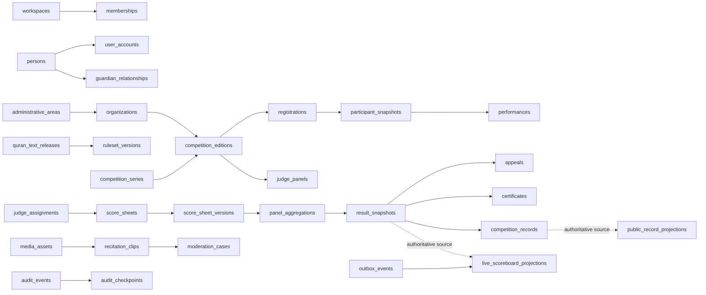

This map distinguishes Person from User Account; Competition scope from organizer/geography; current profile from Participant Snapshot; judge submission from aggregation/Result; and authoritative records from projections.

## 1. Identity, Account, Session, and Authorization ERD

Person identity and User Account authentication remain separate. Workspace Membership and scoped authorization mediate authority.

```mermaid
erDiagram
  persons {
    bigint id PK
    binary public_id FK,UK
    varchar minor_status_code
    varchar identity_status_code
  }
  user_accounts {
    bigint id PK
    binary public_id FK,UK
    bigint person_id FK
    varchar account_status
  }
  account_email_addresses {
    bigint id PK
    binary public_id FK,UK
    bigint user_account_id FK
  }
  account_phone_numbers {
    bigint id PK
    binary public_id FK,UK
    bigint user_account_id FK
  }
  account_credentials {
    bigint id PK
    bigint user_account_id FK
  }
  auth_sessions {
    bigint id PK
    binary public_id FK,UK
    bigint user_account_id FK
  }
  devices {
    bigint id PK
    binary public_id FK,UK
    bigint user_account_id FK
    varchar status_code
  }
  mfa_methods {
    bigint id PK
    binary public_id FK,UK
    bigint user_account_id FK
    varchar status_code
  }
  passkeys {
    bigint id PK
    binary public_id FK,UK
    bigint user_account_id FK
    varchar status_code
  }
  verification_challenges {
    bigint id PK
    bigint user_account_id FK
  }
  recovery_tokens {
    bigint id PK
    bigint user_account_id FK
  }
  workspaces {
    bigint id PK
    binary public_id FK,UK
    varchar status_code
  }
  memberships {
    bigint id PK
    binary public_id FK,UK
    bigint workspace_id FK
    bigint user_account_id FK
    varchar status_code
  }
  roles {
    bigint id PK
    binary public_id FK,UK
    bigint workspace_id FK
    varchar status_code
  }
  permissions {
    bigint id PK
    varchar status_code
  }
  role_permissions {
    bigint id PK
    bigint workspace_id FK
    bigint role_id FK
    bigint permission_id FK
  }
  membership_roles {
    bigint id PK
    bigint workspace_id FK
    bigint membership_id FK
    bigint role_id FK
  }
  scope_grants {
    bigint id PK
    bigint workspace_id FK
    bigint membership_id FK
    bigint administrative_scope_id FK
  }
  persons ||--o{ user_accounts : "QMDB-REL-0030"
  user_accounts ||--o{ account_email_addresses : "QMDB-REL-0031"
  user_accounts ||--o{ account_phone_numbers : "QMDB-REL-0032"
  user_accounts ||--o{ account_credentials : "QMDB-REL-0033"
  user_accounts ||--o{ auth_sessions : "QMDB-REL-0035"
  user_accounts ||--o{ devices : "QMDB-REL-0036"
  user_accounts ||--o{ mfa_methods : "QMDB-REL-0037"
  user_accounts ||--o{ passkeys : "QMDB-REL-0038"
  user_accounts ||--o{ verification_challenges : "QMDB-REL-0039"
  user_accounts ||--o{ recovery_tokens : "QMDB-REL-0040"
  workspaces ||--o{ memberships : "QMDB-REL-0003"
  workspaces ||--o{ memberships : "QMDB-REL-0004"
  user_accounts ||--o{ memberships : "QMDB-REL-0005"
  workspaces ||--o{ roles : "QMDB-REL-0006"
  workspaces ||--o{ roles : "QMDB-REL-0007"
  workspaces ||--o{ role_permissions : "QMDB-REL-0008"
  roles ||--o{ role_permissions : "QMDB-REL-0009"
  permissions ||--o{ role_permissions : "QMDB-REL-0010"
  workspaces ||--o{ membership_roles : "QMDB-REL-0011"
  memberships ||--o{ membership_roles : "QMDB-REL-0012"
  roles ||--o{ membership_roles : "QMDB-REL-0013"
  workspaces ||--o{ scope_grants : "QMDB-REL-0016"
  memberships ||--o{ scope_grants : "QMDB-REL-0017"
```

## 2. Workspace, Organization, and Geography ERD

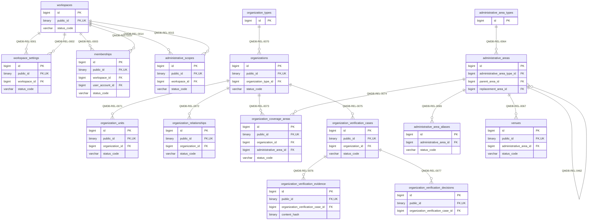

## 3. Person, Profile, Affiliation, Guardian, and Consent ERD

```mermaid
erDiagram
  persons {
    bigint id PK
    binary public_id FK,UK
    varchar minor_status_code
    varchar identity_status_code
  }
  person_names {
    bigint id PK
    binary public_id FK,UK
    bigint person_id FK
  }
  person_profiles {
    bigint id PK
    binary public_id FK,UK
    bigint person_id FK
    varchar status_code
  }
  public_profiles {
    bigint id PK
    bigint person_id FK
  }
  memorizer_profiles {
    bigint id PK
    binary public_id FK,UK
    bigint person_id FK
    varchar status_code
  }
  competitor_profiles {
    bigint id PK
    binary public_id FK,UK
    bigint person_id FK
    varchar status_code
  }
  judge_profiles {
    bigint id PK
    binary public_id FK,UK
    bigint person_id FK
    varchar status_code
  }
  coach_profiles {
    bigint id PK
    binary public_id FK,UK
    bigint person_id FK
    varchar status_code
  }
  teacher_profiles {
    bigint id PK
    binary public_id FK,UK
    bigint person_id FK
    varchar status_code
  }
  person_affiliations {
    bigint id PK
    binary public_id FK,UK
    bigint workspace_id FK
    bigint person_id FK
    bigint organization_id FK
    varchar status_code
  }
  person_geography_representations {
    bigint id PK
    binary public_id FK,UK
    bigint workspace_id FK
    bigint person_id FK
    bigint administrative_area_id FK
    varchar status_code
  }
  guardian_relationships {
    bigint id PK
    binary public_id FK,UK
    bigint person_id FK
    bigint guardian_person_id FK
    bigint subject_person_id FK
  }
  consent_records {
    bigint id PK
    binary public_id FK,UK
    bigint guardian_relationship_id FK
    bigint person_id FK
    bigint notice_version_id FK
  }
  consent_events {
    bigint id PK
    bigint consent_record_id FK
    binary content_hash
  }
  identity_evidence {
    bigint id PK
    binary public_id FK,UK
    bigint person_id FK
    binary content_hash
  }
  person_merge_cases {
    bigint id PK
    binary public_id FK,UK
    bigint person_id FK
    varchar status_code
  }
  person_merge_events {
    bigint id PK
    bigint person_merge_case_id FK
    binary content_hash
  }
  persons ||--o{ person_names : "QMDB-REL-0043"
  persons ||--o{ person_profiles : "QMDB-REL-0044"
  persons ||--o{ public_profiles : "QMDB-REL-0045"
  persons ||--o{ memorizer_profiles : "QMDB-REL-0046"
  persons ||--o{ competitor_profiles : "QMDB-REL-0047"
  persons ||--o{ judge_profiles : "QMDB-REL-0048"
  persons ||--o{ coach_profiles : "QMDB-REL-0049"
  persons ||--o{ teacher_profiles : "QMDB-REL-0050"
  persons ||--o{ person_affiliations : "QMDB-REL-0052"
  persons ||--o{ person_geography_representations : "QMDB-REL-0055"
  persons ||--o{ guardian_relationships : "QMDB-REL-0057"
  persons ||--o{ guardian_relationships : "QMDB-REL-0463"
  persons ||--o{ guardian_relationships : "QMDB-REL-0464"
  guardian_relationships ||--o{ consent_records : "QMDB-REL-0058"
  persons ||--o{ consent_records : "QMDB-REL-0059"
  consent_records ||--o{ consent_events : "QMDB-REL-0060"
  persons ||--o{ identity_evidence : "QMDB-REL-0061"
  persons ||--o{ person_merge_cases : "QMDB-REL-0062"
  person_merge_cases ||--o{ person_merge_events : "QMDB-REL-0063"
```

## 4. Quran Reference ERD

Canonical text uses release/Reading structural identities and checksum lineage; search-normalized text is a derivative.

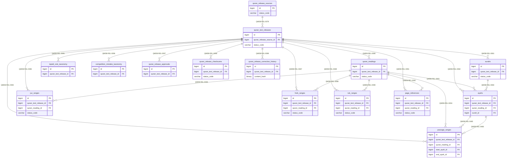

## 5. Competition Configuration and Registration ERD

```mermaid
erDiagram
  competition_series {
    bigint id PK
    binary public_id FK,UK
    bigint workspace_id FK
    varchar status_code
  }
  competition_editions {
    bigint id PK
    binary public_id FK,UK
    bigint workspace_id FK
    bigint competition_sery_id FK
    varchar status_code
  }
  competition_organization_relationships {
    bigint id PK
    bigint workspace_id FK
    bigint competition_edition_id FK
    bigint organization_id FK
  }
  competition_administrative_areas {
    bigint id PK
    bigint workspace_id FK
    bigint competition_edition_id FK
    bigint administrative_area_id FK
  }
  competition_venues {
    bigint id PK
    bigint workspace_id FK
    bigint competition_edition_id FK
    bigint venue_id FK
  }
  categories {
    bigint id PK
    binary public_id FK,UK
    bigint workspace_id FK
    bigint competition_edition_id FK
    varchar status_code
  }
  divisions {
    bigint id PK
    binary public_id FK,UK
    bigint workspace_id FK
    bigint category_id FK
    varchar status_code
  }
  age_bands {
    bigint id PK
    binary public_id FK,UK
    bigint workspace_id FK
    bigint competition_edition_id FK
    varchar status_code
  }
  stages {
    bigint id PK
    binary public_id FK,UK
    bigint workspace_id FK
    bigint competition_edition_id FK
    varchar status_code
  }
  rounds {
    bigint id PK
    binary public_id FK,UK
    bigint workspace_id FK
    bigint stage_id FK
    varchar status_code
  }
  competition_sessions {
    bigint id PK
    binary public_id FK,UK
    bigint workspace_id FK
    bigint round_id FK
    bigint competition_venue_id FK
    varchar status_code
  }
  rulesets {
    bigint id PK
    binary public_id FK,UK
    bigint workspace_id FK
    bigint competition_sery_id FK
    varchar status_code
  }
  ruleset_versions {
    bigint id PK
    bigint workspace_id FK
    bigint ruleset_id FK
    bigint quran_text_release_id FK
    int version_number
    varchar status_code
  }
  scoring_criteria {
    bigint id PK
    bigint workspace_id FK
    bigint ruleset_version_id FK
  }
  deduction_rules {
    bigint id PK
    bigint workspace_id FK
    bigint ruleset_version_id FK
    bigint scoring_criteria_id FK
  }
  aggregation_rules {
    bigint id PK
    bigint workspace_id FK
    bigint ruleset_version_id FK
  }
  tie_break_rules {
    bigint id PK
    bigint workspace_id FK
    bigint ruleset_version_id FK
  }
  registrations {
    bigint id PK
    binary public_id FK,UK
    bigint workspace_id FK
    bigint competition_edition_id FK
    bigint person_id FK
    varchar status_code
  }
  registration_categories {
    bigint id PK
    bigint workspace_id FK
    bigint registration_id FK
    bigint category_id FK
  }
  eligibility_checks {
    bigint id PK
    binary public_id FK,UK
    bigint workspace_id FK
    bigint registration_id FK
    varchar status_code
  }
  registration_decisions {
    bigint id PK
    binary public_id FK,UK
    bigint workspace_id FK
    bigint registration_id FK
  }
  participant_snapshots {
    bigint id PK
    bigint workspace_id FK
    bigint registration_id FK
    bigint person_id FK
    varchar minor_status_code
  }
  competition_series ||--o{ competition_editions : "QMDB-REL-0102"
  competition_editions ||--o{ competition_organization_relationships : "QMDB-REL-0104"
  competition_editions ||--o{ competition_administrative_areas : "QMDB-REL-0107"
  competition_editions ||--o{ competition_venues : "QMDB-REL-0110"
  competition_editions ||--o{ categories : "QMDB-REL-0113"
  categories ||--o{ divisions : "QMDB-REL-0115"
  competition_editions ||--o{ age_bands : "QMDB-REL-0117"
  competition_editions ||--o{ stages : "QMDB-REL-0119"
  stages ||--o{ rounds : "QMDB-REL-0121"
  rounds ||--o{ competition_sessions : "QMDB-REL-0123"
  competition_venues ||--o{ competition_sessions : "QMDB-REL-0124"
  competition_series ||--o{ rulesets : "QMDB-REL-0126"
  rulesets ||--o{ ruleset_versions : "QMDB-REL-0128"
  ruleset_versions ||--o{ scoring_criteria : "QMDB-REL-0131"
  ruleset_versions ||--o{ deduction_rules : "QMDB-REL-0133"
  scoring_criteria ||--o{ deduction_rules : "QMDB-REL-0134"
  ruleset_versions ||--o{ aggregation_rules : "QMDB-REL-0136"
  ruleset_versions ||--o{ tie_break_rules : "QMDB-REL-0138"
  competition_editions ||--o{ registrations : "QMDB-REL-0146"
  registrations ||--o{ registration_categories : "QMDB-REL-0149"
  categories ||--o{ registration_categories : "QMDB-REL-0150"
  registrations ||--o{ eligibility_checks : "QMDB-REL-0157"
  registrations ||--o{ registration_decisions : "QMDB-REL-0161"
  registrations ||--o{ participant_snapshots : "QMDB-REL-0163"
```

## 6. Scheduling, Judge, Performance, and Scoring ERD

Score Sheet lineages are Judge/Performance-specific; immutable versions and Panel Aggregation avoid Edition-wide locks.

```mermaid
erDiagram
  competition_schedules {
    bigint id PK
    binary public_id FK,UK
    bigint workspace_id FK
    bigint competition_edition_id FK
    varchar status_code
  }
  session_schedules {
    bigint id PK
    binary public_id FK,UK
    bigint workspace_id FK
    bigint competition_schedule_id FK
    bigint competition_session_id FK
    varchar status_code
  }
  draw_orders {
    bigint id PK
    binary public_id FK,UK
    bigint workspace_id FK
    bigint competition_session_id FK
    bigint participant_snapshot_id FK
    varchar status_code
  }
  judge_panels {
    bigint id PK
    binary public_id FK,UK
    bigint workspace_id FK
    bigint competition_edition_id FK
    varchar status_code
  }
  judge_panel_members {
    bigint id PK
    bigint workspace_id FK
    bigint judge_panel_id FK
    bigint person_id FK
  }
  judge_assignments {
    bigint id PK
    binary public_id FK,UK
    bigint workspace_id FK
    bigint judge_panel_id FK
    bigint person_id FK
    bigint competition_session_id FK
    varchar status_code
  }
  judge_qualification_evidence {
    bigint id PK
    binary public_id FK,UK
    bigint workspace_id FK
    bigint judge_assignment_id FK
    binary content_hash
  }
  conflict_declarations {
    bigint id PK
    binary public_id FK,UK
    bigint workspace_id FK
    bigint judge_assignment_id FK
    varchar status_code
  }
  conflict_reviews {
    bigint id PK
    binary public_id FK,UK
    bigint workspace_id FK
    bigint conflict_declaration_id FK
  }
  recusal_records {
    bigint id PK
    binary public_id FK,UK
    bigint workspace_id FK
    bigint judge_assignment_id FK
    varchar status_code
  }
  judge_replacements {
    bigint id PK
    binary public_id FK,UK
    bigint workspace_id FK
    bigint judge_assignment_id FK
    varchar status_code
  }
  performances {
    bigint id PK
    binary public_id FK,UK
    bigint workspace_id FK
    bigint participant_snapshot_id FK
    bigint competition_session_id FK
    bigint judge_panel_id FK
    bigint ruleset_version_id FK
    varchar status_code
  }
  performance_passages {
    bigint id PK
    binary public_id FK,UK
    bigint workspace_id FK
    bigint performance_id FK
    bigint passage_range_id FK
    varchar status_code
  }
  performance_events {
    bigint id PK
    bigint workspace_id FK
    bigint performance_id FK
    binary content_hash
  }
  performance_incidents {
    bigint id PK
    binary public_id FK,UK
    bigint workspace_id FK
    bigint performance_id FK
    varchar status_code
  }
  score_sheets {
    bigint id PK
    binary public_id FK,UK
    bigint workspace_id FK
    bigint performance_id FK
    bigint judge_assignment_id FK
    varchar sheet_status
    int current_version_number
  }
  score_sheet_versions {
    bigint id PK
    bigint workspace_id FK
    bigint score_sheet_id FK
    bigint ruleset_version_id FK
    int version_number
  }
  score_items {
    bigint id PK
    binary public_id FK,UK
    bigint workspace_id FK
    bigint score_sheet_version_id FK
    bigint scoring_criterion_id FK
  }
  score_deductions {
    bigint id PK
    binary public_id FK,UK
    bigint workspace_id FK
    bigint score_sheet_version_id FK
    bigint deduction_rule_id FK
  }
  score_mistakes {
    bigint id PK
    binary public_id FK,UK
    bigint workspace_id FK
    bigint score_sheet_version_id FK
    bigint competition_mistake_taxonomy_id FK
    bigint ayah_id FK
    varchar status_code
  }
  score_signatures {
    bigint id PK
    binary public_id FK,UK
    bigint workspace_id FK
    bigint score_sheet_version_id FK
    varchar status_code
  }
  score_submission_receipts {
    bigint id PK
    bigint workspace_id FK
    bigint score_sheet_version_id FK
    binary content_hash
  }
  score_reopening_requests {
    bigint id PK
    binary public_id FK,UK
    bigint workspace_id FK
    bigint score_sheet_id FK
    bigint score_sheet_version_id FK
    varchar status_code
  }
  score_reopening_approvals {
    bigint id PK
    binary public_id FK,UK
    bigint workspace_id FK
    bigint score_reopening_request_id FK
  }
  panel_aggregations {
    bigint id PK
    binary public_id FK,UK
    bigint workspace_id FK
    bigint performance_id FK
    bigint judge_panel_id FK
    bigint ruleset_version_id FK
  }
  aggregation_inputs {
    bigint id PK
    bigint workspace_id FK
    bigint panel_aggregation_id FK
    bigint score_sheet_version_id FK
  }
  calculation_traces {
    bigint id PK
    bigint workspace_id FK
    bigint panel_aggregation_id FK
    binary content_hash
  }
  competition_schedules ||--o{ session_schedules : "QMDB-REL-0181"
  judge_panels ||--o{ judge_panel_members : "QMDB-REL-0189"
  judge_panels ||--o{ judge_assignments : "QMDB-REL-0192"
  judge_assignments ||--o{ judge_qualification_evidence : "QMDB-REL-0196"
  judge_assignments ||--o{ conflict_declarations : "QMDB-REL-0198"
  conflict_declarations ||--o{ conflict_reviews : "QMDB-REL-0200"
  judge_assignments ||--o{ recusal_records : "QMDB-REL-0202"
  judge_assignments ||--o{ judge_replacements : "QMDB-REL-0204"
  judge_panels ||--o{ performances : "QMDB-REL-0208"
  performances ||--o{ performance_passages : "QMDB-REL-0211"
  performances ||--o{ performance_events : "QMDB-REL-0214"
  performances ||--o{ performance_incidents : "QMDB-REL-0216"
  performances ||--o{ score_sheets : "QMDB-REL-0218"
  judge_assignments ||--o{ score_sheets : "QMDB-REL-0219"
  score_sheets ||--o{ score_sheet_versions : "QMDB-REL-0221"
  score_sheet_versions ||--o{ score_items : "QMDB-REL-0224"
  score_sheet_versions ||--o{ score_deductions : "QMDB-REL-0227"
  score_sheet_versions ||--o{ score_mistakes : "QMDB-REL-0230"
  score_sheet_versions ||--o{ score_signatures : "QMDB-REL-0234"
  score_sheet_versions ||--o{ score_submission_receipts : "QMDB-REL-0236"
  score_sheets ||--o{ score_reopening_requests : "QMDB-REL-0238"
  score_sheet_versions ||--o{ score_reopening_requests : "QMDB-REL-0239"
  score_reopening_requests ||--o{ score_reopening_approvals : "QMDB-REL-0241"
  performances ||--o{ panel_aggregations : "QMDB-REL-0243"
  judge_panels ||--o{ panel_aggregations : "QMDB-REL-0244"
  panel_aggregations ||--o{ aggregation_inputs : "QMDB-REL-0247"
  score_sheet_versions ||--o{ aggregation_inputs : "QMDB-REL-0248"
  panel_aggregations ||--o{ calculation_traces : "QMDB-REL-0255"
```

## 7. Results, Appeals, Certificates, and Provenance ERD

```mermaid
erDiagram
  result_snapshots {
    bigint id PK
    bigint workspace_id FK
    bigint competition_edition_id FK
    bigint panel_aggregation_id FK
    varchar result_status
  }
  rankings {
    bigint id PK
    binary public_id FK,UK
    bigint workspace_id FK
    bigint result_snapshot_id FK
  }
  placements {
    bigint id PK
    binary public_id FK,UK
    bigint workspace_id FK
    bigint result_snapshot_id FK
    bigint participant_snapshot_id FK
    varchar placement_status
  }
  result_approvals {
    bigint id PK
    binary public_id FK,UK
    bigint workspace_id FK
    bigint result_snapshot_id FK
  }
  result_finalization_bundles {
    bigint id PK
    binary public_id FK,UK
    bigint workspace_id FK
    bigint result_snapshot_id FK
    varchar status_code
  }
  result_corrections {
    bigint id PK
    binary public_id FK,UK
    bigint workspace_id FK
    bigint result_snapshot_id FK
  }
  result_supersession_links {
    bigint id PK
    bigint workspace_id FK
    bigint result_snapshot_id FK
  }
  appeals {
    bigint id PK
    binary public_id FK,UK
    bigint workspace_id FK
    bigint result_snapshot_id FK
    bigint registration_id FK
    varchar status_code
  }
  appeal_evidence {
    bigint id PK
    binary public_id FK,UK
    bigint workspace_id FK
    bigint appeal_id FK
    binary content_hash
  }
  appeal_assignments {
    bigint id PK
    binary public_id FK,UK
    bigint workspace_id FK
    bigint appeal_id FK
    bigint person_id FK
    varchar status_code
  }
  appeal_reviews {
    bigint id PK
    binary public_id FK,UK
    bigint workspace_id FK
    bigint appeal_id FK
  }
  appeal_decisions {
    bigint id PK
    binary public_id FK,UK
    bigint workspace_id FK
    bigint appeal_id FK
  }
  appeal_events {
    bigint id PK
    bigint workspace_id FK
    bigint appeal_id FK
    binary content_hash
  }
  certificate_templates {
    bigint id PK
    bigint workspace_id FK
  }
  certificate_template_versions {
    bigint id PK
    bigint workspace_id FK
    bigint certificate_template_id FK
    int version_number
    varchar status_code
  }
  certificates {
    bigint id PK
    binary public_id FK,UK
    bigint workspace_id FK
    bigint result_snapshot_id FK
    bigint participant_snapshot_id FK
    bigint certificate_template_version_id FK
    varchar serial_number
    varchar certificate_status
  }
  certificate_signatures {
    bigint id PK
    binary public_id FK,UK
    bigint workspace_id FK
    bigint certificate_id FK
    varchar signing_key_id FK
  }
  certificate_revocations {
    bigint id PK
    binary public_id FK,UK
    bigint workspace_id FK
    bigint certificate_id FK
  }
  certificate_supersession_links {
    bigint id PK
    bigint workspace_id FK
    bigint certificate_id FK
  }
  certificate_verification_events {
    bigint id PK
    bigint workspace_id FK
    bigint certificate_id FK
    binary content_hash
  }
  competition_records {
    bigint id PK
    binary public_id FK,UK
    bigint workspace_id FK
    bigint result_snapshot_id FK
    bigint participant_snapshot_id FK
    varchar status_code
  }
  record_provenance {
    bigint id PK
    binary public_id FK,UK
    bigint workspace_id FK
    bigint competition_record_id FK
    varchar status_code
  }
  record_evidence {
    bigint id PK
    binary public_id FK,UK
    bigint workspace_id FK
    bigint competition_record_id FK
    binary content_hash
  }
  record_disputes {
    bigint id PK
    binary public_id FK,UK
    bigint workspace_id FK
    bigint competition_record_id FK
    varchar status_code
  }
  result_snapshots ||--o{ rankings : "QMDB-REL-0260"
  result_snapshots ||--o{ placements : "QMDB-REL-0262"
  result_snapshots ||--o{ result_approvals : "QMDB-REL-0265"
  result_snapshots ||--o{ result_finalization_bundles : "QMDB-REL-0267"
  result_snapshots ||--o{ result_corrections : "QMDB-REL-0269"
  result_snapshots ||--o{ result_supersession_links : "QMDB-REL-0271"
  result_snapshots ||--o{ appeals : "QMDB-REL-0273"
  appeals ||--o{ appeal_evidence : "QMDB-REL-0276"
  appeals ||--o{ appeal_assignments : "QMDB-REL-0278"
  appeals ||--o{ appeal_reviews : "QMDB-REL-0281"
  appeals ||--o{ appeal_decisions : "QMDB-REL-0283"
  appeals ||--o{ appeal_events : "QMDB-REL-0285"
  certificate_templates ||--o{ certificate_template_versions : "QMDB-REL-0288"
  result_snapshots ||--o{ certificates : "QMDB-REL-0290"
  certificate_template_versions ||--o{ certificates : "QMDB-REL-0292"
  certificates ||--o{ certificate_signatures : "QMDB-REL-0294"
  certificates ||--o{ certificate_revocations : "QMDB-REL-0296"
  certificates ||--o{ certificate_supersession_links : "QMDB-REL-0298"
  certificates ||--o{ certificate_verification_events : "QMDB-REL-0300"
  result_snapshots ||--o{ competition_records : "QMDB-REL-0302"
  competition_records ||--o{ record_provenance : "QMDB-REL-0305"
  competition_records ||--o{ record_evidence : "QMDB-REL-0307"
  competition_records ||--o{ record_disputes : "QMDB-REL-0309"
```

## 8. Media, Recitation Clips, and Moderation ERD

Object bytes are absent. Media storage rows contain references and hashes only; Consent and moderation gate publication.

```mermaid
erDiagram
  media_assets {
    bigint id PK
    binary public_id FK,UK
    bigint workspace_id FK
    varchar media_status
  }
  media_upload_authorizations {
    bigint id PK
    binary public_id FK,UK
    bigint workspace_id FK
    bigint media_asset_id FK
    varchar status_code
  }
  media_storage_objects {
    bigint id PK
    binary public_id FK,UK
    bigint workspace_id FK
    bigint media_asset_id FK
    binary content_hash
  }
  media_variants {
    bigint id PK
    binary public_id FK,UK
    bigint workspace_id FK
    bigint media_asset_id FK
    bigint media_storage_object_id FK
    varchar status_code
  }
  media_hashes {
    bigint id PK
    binary public_id FK,UK
    bigint workspace_id FK
    bigint media_asset_id FK
    varchar status_code
  }
  media_consent_links {
    bigint id PK
    bigint workspace_id FK
    bigint media_asset_id FK
    bigint consent_record_id FK
  }
  media_processing_jobs {
    bigint id PK
    binary public_id FK,UK
    bigint workspace_id FK
    bigint media_asset_id FK
    varchar status_code
  }
  media_processing_attempts {
    bigint id PK
    bigint workspace_id FK
    bigint media_processing_job_id FK
    binary content_hash
  }
  media_publications {
    bigint id PK
    binary public_id FK,UK
    bigint workspace_id FK
    bigint media_asset_id FK
    varchar status_code
  }
  media_moderation_states {
    bigint id PK
    binary public_id FK,UK
    bigint workspace_id FK
    bigint media_asset_id FK
    varchar status_code
  }
  media_retention_states {
    bigint id PK
    binary public_id FK,UK
    bigint workspace_id FK
    bigint media_asset_id FK
    varchar status_code
  }
  recitation_clips {
    bigint id PK
    binary public_id FK,UK
    bigint workspace_id FK
    bigint media_asset_id FK
    bigint person_id FK
    varchar status_code
  }
  social_posts {
    bigint id PK
    binary public_id FK,UK
    bigint workspace_id FK
    bigint person_id FK
    varchar status_code
  }
  post_media {
    bigint id PK
    bigint workspace_id FK
    bigint social_post_id FK
    bigint media_asset_id FK
  }
  post_quran_tags {
    bigint id PK
    bigint workspace_id FK
    bigint social_post_id FK
    bigint passage_range_id FK
  }
  follows {
    bigint id PK
    bigint workspace_id FK
    bigint person_id FK
  }
  reactions {
    bigint id PK
    bigint workspace_id FK
    bigint social_post_id FK
    bigint person_id FK
  }
  bookmarks {
    bigint id PK
    bigint workspace_id FK
    bigint social_post_id FK
    bigint person_id FK
  }
  comments {
    bigint id PK
    binary public_id FK,UK
    bigint workspace_id FK
    bigint social_post_id FK
    bigint person_id FK
    varchar status_code
  }
  comment_versions {
    bigint id PK
    bigint workspace_id FK
    bigint comment_id FK
    int version_number
    varchar status_code
  }
  content_reports {
    bigint id PK
    binary public_id FK,UK
    bigint workspace_id FK
    bigint social_post_id FK
    bigint person_id FK
    varchar status_code
  }
  report_evidence {
    bigint id PK
    binary public_id FK,UK
    bigint workspace_id FK
    bigint content_report_id FK
    binary content_hash
  }
  moderation_cases {
    bigint id PK
    binary public_id FK,UK
    bigint workspace_id FK
    bigint content_report_id FK
    varchar status_code
  }
  moderation_assignments {
    bigint id PK
    binary public_id FK,UK
    bigint workspace_id FK
    bigint moderation_case_id FK
    bigint person_id FK
    varchar status_code
  }
  moderation_actions {
    bigint id PK
    binary public_id FK,UK
    bigint workspace_id FK
    bigint moderation_case_id FK
    varchar status_code
  }
  content_appeals {
    bigint id PK
    binary public_id FK,UK
    bigint workspace_id FK
    bigint moderation_action_id FK
    bigint person_id FK
    varchar status_code
  }
  content_appeal_decisions {
    bigint id PK
    binary public_id FK,UK
    bigint workspace_id FK
    bigint content_appeal_id FK
  }
  media_assets ||--o{ media_upload_authorizations : "QMDB-REL-0327"
  media_assets ||--o{ media_storage_objects : "QMDB-REL-0329"
  media_assets ||--o{ media_variants : "QMDB-REL-0331"
  media_storage_objects ||--o{ media_variants : "QMDB-REL-0332"
  media_assets ||--o{ media_hashes : "QMDB-REL-0334"
  media_assets ||--o{ media_consent_links : "QMDB-REL-0336"
  media_assets ||--o{ media_processing_jobs : "QMDB-REL-0339"
  media_processing_jobs ||--o{ media_processing_attempts : "QMDB-REL-0341"
  media_assets ||--o{ media_publications : "QMDB-REL-0345"
  media_assets ||--o{ media_moderation_states : "QMDB-REL-0347"
  media_assets ||--o{ media_retention_states : "QMDB-REL-0349"
  media_assets ||--o{ recitation_clips : "QMDB-REL-0353"
  social_posts ||--o{ post_media : "QMDB-REL-0358"
  media_assets ||--o{ post_media : "QMDB-REL-0359"
  social_posts ||--o{ post_quran_tags : "QMDB-REL-0361"
  social_posts ||--o{ reactions : "QMDB-REL-0369"
  social_posts ||--o{ bookmarks : "QMDB-REL-0372"
  social_posts ||--o{ comments : "QMDB-REL-0375"
  comments ||--o{ comment_versions : "QMDB-REL-0378"
  social_posts ||--o{ content_reports : "QMDB-REL-0384"
  content_reports ||--o{ report_evidence : "QMDB-REL-0387"
  content_reports ||--o{ moderation_cases : "QMDB-REL-0389"
  moderation_cases ||--o{ moderation_assignments : "QMDB-REL-0391"
  moderation_cases ||--o{ moderation_actions : "QMDB-REL-0394"
  moderation_actions ||--o{ content_appeals : "QMDB-REL-0396"
  content_appeals ||--o{ content_appeal_decisions : "QMDB-REL-0399"
```

## 9. Notifications, Privacy, Integrations, and Operations ERD

```mermaid
erDiagram
  notifications {
    bigint id PK
    binary public_id FK,UK
    bigint workspace_id FK
    varchar status_code
  }
  notification_preferences {
    bigint id PK
    binary public_id FK,UK
    bigint workspace_id FK
    bigint user_account_id FK
    varchar status_code
  }
  notification_templates {
    bigint id PK
  }
  notification_deliveries {
    bigint id PK
    binary public_id FK,UK
    bigint notification_id FK
    varchar status_code
  }
  notification_delivery_attempts {
    bigint id PK
    bigint notification_delivery_id FK
    binary content_hash
  }
  notification_dead_letters {
    bigint id PK
    binary public_id FK,UK
    bigint notification_delivery_id FK
    varchar status_code
  }
  privacy_requests {
    bigint id PK
    binary public_id FK,UK
    bigint workspace_id FK
    bigint person_id FK
    varchar status_code
  }
  privacy_request_events {
    bigint id PK
    bigint workspace_id FK
    bigint privacy_request_id FK
    binary content_hash
  }
  privacy_request_assignments {
    bigint id PK
    binary public_id FK,UK
    bigint workspace_id FK
    bigint privacy_request_id FK
    bigint person_id FK
    varchar status_code
  }
  retention_policy_records {
    bigint id PK
    binary public_id FK,UK
    varchar status_code
  }
  data_holds {
    bigint id PK
    binary public_id FK,UK
    bigint workspace_id FK
    bigint privacy_request_id FK
    varchar status_code
  }
  anonymization_events {
    bigint id PK
    bigint workspace_id FK
    bigint privacy_request_id FK
    binary content_hash
  }
  api_clients {
    bigint id PK
    binary public_id FK,UK
    bigint workspace_id FK
    varchar status_code
  }
  api_client_scopes {
    bigint id PK
    bigint workspace_id FK
    bigint api_client_id FK
  }
  api_credentials {
    bigint id PK
    bigint workspace_id FK
    bigint api_client_id FK
    binary credential_public_id FK
  }
  webhook_subscriptions {
    bigint id PK
    binary public_id FK,UK
    bigint workspace_id FK
    bigint api_client_id FK
    varchar status_code
  }
  webhook_deliveries {
    bigint id PK
    binary public_id FK,UK
    bigint workspace_id FK
    bigint webhook_subscription_id FK
    bigint outbox_event_id FK
    varchar status_code
  }
  webhook_delivery_attempts {
    bigint id PK
    bigint workspace_id FK
    bigint webhook_delivery_id FK
    binary content_hash
  }
  feature_flags {
    bigint id PK
    binary public_id FK,UK
    varchar status_code
  }
  configuration_versions {
    bigint id PK
    int version_number
    varchar status_code
  }
  offline_assignment_packages {
    bigint id PK
    binary public_id FK,UK
    bigint workspace_id FK
    bigint venue_edge_node_registration_id FK
    bigint competition_edition_id FK
    varchar status_code
  }
  synchronization_batches {
    bigint id PK
    binary public_id FK,UK
    bigint workspace_id FK
    bigint offline_assignment_package_id FK
    varchar status_code
  }
  notifications ||--o{ notification_deliveries : "QMDB-REL-0406"
  notification_deliveries ||--o{ notification_delivery_attempts : "QMDB-REL-0407"
  notification_deliveries ||--o{ notification_dead_letters : "QMDB-REL-0408"
  privacy_requests ||--o{ privacy_request_events : "QMDB-REL-0421"
  privacy_requests ||--o{ privacy_request_assignments : "QMDB-REL-0422"
  privacy_requests ||--o{ data_holds : "QMDB-REL-0424"
  privacy_requests ||--o{ anonymization_events : "QMDB-REL-0425"
  api_clients ||--o{ api_client_scopes : "QMDB-REL-0432"
  api_clients ||--o{ api_credentials : "QMDB-REL-0434"
  api_clients ||--o{ webhook_subscriptions : "QMDB-REL-0436"
  webhook_subscriptions ||--o{ webhook_deliveries : "QMDB-REL-0438"
  webhook_deliveries ||--o{ webhook_delivery_attempts : "QMDB-REL-0441"
  offline_assignment_packages ||--o{ synchronization_batches : "QMDB-REL-0453"
```

## 10. Audit, Outbox, Idempotency, and Integrity ERD

Outbox, audit and offline event records are append-oriented; public/live tables are explicitly rebuildable projections.

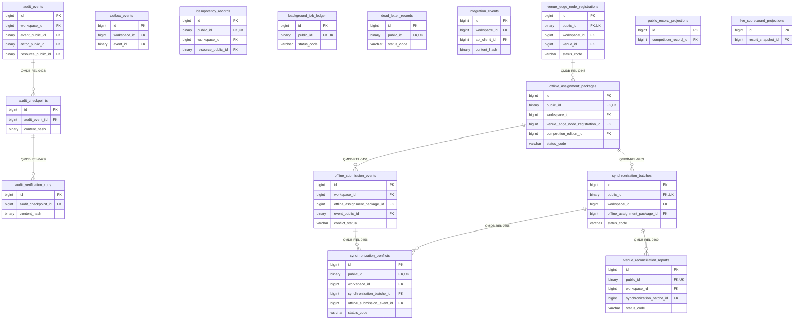

## Cross-slice integrity

Cross-slice foreign keys—such as Competition Edition to Organization/geography, Performance to Participant Snapshot/Ruleset Version, Certificate to Result/Participant Snapshot, Media Consent to Consent Record, and Outbox/Audit resource references—are defined in the YAML manifest and relationship catalog. The model never represents a generic `resource_type/resource_id` pair as a database-enforced polymorphic foreign key; such audit/event references are canonical metadata validated by the owning service and complemented by immutable hashes.

## Related documents

- [Table and column dictionary](05-table-and-column-data-dictionary.md)
- [Relationship and integrity catalog](06-relationship-constraint-and-integrity-catalog.md)
- [Tenant-isolation model](09-tenant-isolation-data-model.md)
