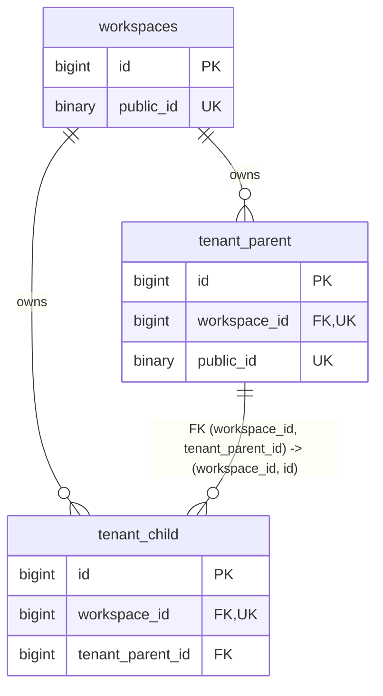

# Tenant-Isolation Data Model

| Document control | Value |
| --- | --- |
| Project | Qur’an Memorizer DB |
| Project Code | QMDB |
| Baseline ID | QMDB-BL-001 |
| Batch ID | QMDB-P0-B04 |
| Document Title | Tenant-Isolation Data Model |
| Document Version | 1.0.0 |
| Document Status | Controlled draft |
| Document Owner Role | Multi-Tenant Security and Database Architecture |
| Last Updated | 2026-08-24 |
| Approval Status | Proposed model implementing locked ADR-006 through ADR-008 |
| Related Documents | [system boundaries](../project/system-boundaries.md); [schema manifest](mysql-logical-schema.yaml); [integrity catalog](06-relationship-constraint-and-integrity-catalog.md) |

## Purpose

Make Workspace ownership, relationship integrity, access context, background processing, projections, exports and governed cross-Workspace oversight explicit and mechanically verifiable.

## Scope and security rule

A Workspace is the tenant security/ownership boundary, not merely a UI grouping. Tenant identity is derived from the authenticated server-side Membership/resource context. A route value, hidden field, public ID, cache key or queue payload never establishes authority.

## Classification model

| Classification | Count | Rule |
| --- | ---: | --- |
| GLOBAL_REFERENCE | 24 | Governed reference content shared across Workspaces; mutation requires its qualified global owner. |
| GLOBAL_GOVERNED | 39 | Platform-governed identity/organization/reference record with explicit policy; no tenant ownership implied. |
| TENANT_OWNED | 29 | Aggregate root owned by one non-null Workspace. |
| TENANT_CHILD | 129 | Child owned by the same non-null Workspace and protected by composite relationships. |
| CROSS_TENANT_OVERSIGHT | 8 | Exceptional purpose-scoped case/grant; never a generic bypass. |
| PUBLIC_PROJECTION | 4 | Privacy-filtered rebuildable public read model; no write authority. |
| SYSTEM_OPERATIONAL | 17 | Platform job/audit/delivery/config record; carries nullable Workspace only when the source context may be global. |

The model contains 158 tenant-owned/root-child tables and 172 composite Workspace-aware relationships.

## Structural tenant pattern

Every tenant table declares `workspace_id NOT NULL`, a Workspace FK, candidate `UNIQUE(workspace_id, id)`, tenant-prefixed list/queue index, server-derived context and policy tests. When parent and child are tenant-scoped, the FK is `(workspace_id, parent_id) -> parent(workspace_id, id)`. The relationship makes the cross-Workspace attack in B04 section 28.10 fail at the database boundary even if application filtering is defective.

## Complete table classification

| Table ID | Logical Table | Module | Classification | workspace_id | Workspace Relationship | Tenant-Prefixed Index | Notes |
| --- | --- | --- | --- | --- | --- | --- | --- |
| QMDB-TBL-001 | `workspaces` | Workspaces and Authorization | GLOBAL_GOVERNED | Not applicable | Not tenant-owned | Not tenant-owned or purpose-specific | Normal classification rule. |
| QMDB-TBL-002 | `workspace_settings` | Workspaces and Authorization | TENANT_OWNED | Non-null | QMDB-REL-0001 | QMDB-IDX-0003 | Normal classification rule. |
| QMDB-TBL-003 | `memberships` | Workspaces and Authorization | TENANT_OWNED | Non-null | QMDB-REL-0003 | QMDB-IDX-0005 | Normal classification rule. |
| QMDB-TBL-004 | `roles` | Workspaces and Authorization | TENANT_OWNED | Non-null | QMDB-REL-0006 | QMDB-IDX-0008 | Normal classification rule. |
| QMDB-TBL-005 | `permissions` | Workspaces and Authorization | GLOBAL_REFERENCE | Not applicable | Not tenant-owned | Not tenant-owned or purpose-specific | Normal classification rule. |
| QMDB-TBL-006 | `role_permissions` | Workspaces and Authorization | TENANT_CHILD | Non-null | QMDB-REL-0008 | QMDB-IDX-0009 | Normal classification rule. |
| QMDB-TBL-007 | `membership_roles` | Workspaces and Authorization | TENANT_CHILD | Non-null | QMDB-REL-0011 | QMDB-IDX-0012 | Normal classification rule. |
| QMDB-TBL-008 | `administrative_scopes` | Workspaces and Authorization | TENANT_OWNED | Non-null | QMDB-REL-0014 | QMDB-IDX-0016 | Normal classification rule. |
| QMDB-TBL-009 | `scope_grants` | Workspaces and Authorization | TENANT_CHILD | Non-null | QMDB-REL-0016 | QMDB-IDX-0017 | Normal classification rule. |
| QMDB-TBL-010 | `competition_assignments` | Workspaces and Authorization | TENANT_CHILD | Non-null | QMDB-REL-0019 | QMDB-IDX-0020 | Normal classification rule. |
| QMDB-TBL-011 | `approval_requests` | Workspaces and Authorization | TENANT_OWNED | Non-null | QMDB-REL-0022 | QMDB-IDX-0024 | Normal classification rule. |
| QMDB-TBL-012 | `approval_decisions` | Workspaces and Authorization | TENANT_CHILD | Non-null | QMDB-REL-0024 | QMDB-IDX-0026 | Normal classification rule. |
| QMDB-TBL-013 | `temporary_privilege_grants` | Workspaces and Authorization | TENANT_OWNED | Non-null | QMDB-REL-0026 | QMDB-IDX-0029 | Normal classification rule. |
| QMDB-TBL-014 | `support_access_grants` | Workspaces and Authorization | CROSS_TENANT_OVERSIGHT | Nullable governed context | Not tenant-owned | Not tenant-owned or purpose-specific | Explicit exception controls below. |
| QMDB-TBL-015 | `break_glass_grants` | Workspaces and Authorization | CROSS_TENANT_OVERSIGHT | Nullable governed context | Not tenant-owned | Not tenant-owned or purpose-specific | Explicit exception controls below. |
| QMDB-TBL-016 | `user_accounts` | Identity and Authentication | GLOBAL_GOVERNED | Not applicable | Not tenant-owned | Not tenant-owned or purpose-specific | Normal classification rule. |
| QMDB-TBL-017 | `account_email_addresses` | Identity and Authentication | GLOBAL_GOVERNED | Not applicable | Not tenant-owned | Not tenant-owned or purpose-specific | Normal classification rule. |
| QMDB-TBL-018 | `account_phone_numbers` | Identity and Authentication | GLOBAL_GOVERNED | Not applicable | Not tenant-owned | Not tenant-owned or purpose-specific | Normal classification rule. |
| QMDB-TBL-019 | `account_credentials` | Identity and Authentication | GLOBAL_GOVERNED | Not applicable | Not tenant-owned | Not tenant-owned or purpose-specific | Normal classification rule. |
| QMDB-TBL-020 | `credential_history` | Identity and Authentication | GLOBAL_GOVERNED | Not applicable | Not tenant-owned | Not tenant-owned or purpose-specific | Normal classification rule. |
| QMDB-TBL-021 | `auth_sessions` | Identity and Authentication | GLOBAL_GOVERNED | Not applicable | Not tenant-owned | Not tenant-owned or purpose-specific | Normal classification rule. |
| QMDB-TBL-022 | `devices` | Identity and Authentication | GLOBAL_GOVERNED | Not applicable | Not tenant-owned | Not tenant-owned or purpose-specific | Normal classification rule. |
| QMDB-TBL-023 | `mfa_methods` | Identity and Authentication | GLOBAL_GOVERNED | Not applicable | Not tenant-owned | Not tenant-owned or purpose-specific | Normal classification rule. |
| QMDB-TBL-024 | `passkeys` | Identity and Authentication | GLOBAL_GOVERNED | Not applicable | Not tenant-owned | Not tenant-owned or purpose-specific | Normal classification rule. |
| QMDB-TBL-025 | `verification_challenges` | Identity and Authentication | GLOBAL_GOVERNED | Not applicable | Not tenant-owned | Not tenant-owned or purpose-specific | Normal classification rule. |
| QMDB-TBL-026 | `recovery_tokens` | Identity and Authentication | GLOBAL_GOVERNED | Not applicable | Not tenant-owned | Not tenant-owned or purpose-specific | Normal classification rule. |
| QMDB-TBL-027 | `account_status_events` | Identity and Authentication | GLOBAL_GOVERNED | Not applicable | Not tenant-owned | Not tenant-owned or purpose-specific | Normal classification rule. |
| QMDB-TBL-028 | `authentication_security_events` | Identity and Authentication | GLOBAL_GOVERNED | Not applicable | Not tenant-owned | Not tenant-owned or purpose-specific | Normal classification rule. |
| QMDB-TBL-029 | `persons` | People and Guardianship | GLOBAL_GOVERNED | Not applicable | Not tenant-owned | Not tenant-owned or purpose-specific | Normal classification rule. |
| QMDB-TBL-030 | `person_names` | People and Guardianship | GLOBAL_GOVERNED | Not applicable | Not tenant-owned | Not tenant-owned or purpose-specific | Normal classification rule. |
| QMDB-TBL-031 | `person_profiles` | People and Guardianship | GLOBAL_GOVERNED | Not applicable | Not tenant-owned | Not tenant-owned or purpose-specific | Normal classification rule. |
| QMDB-TBL-032 | `public_profiles` | People and Guardianship | PUBLIC_PROJECTION | Not applicable | Not tenant-owned | Not tenant-owned or purpose-specific | Rebuildable and field-allowlisted. |
| QMDB-TBL-033 | `memorizer_profiles` | People and Guardianship | GLOBAL_GOVERNED | Not applicable | Not tenant-owned | Not tenant-owned or purpose-specific | Normal classification rule. |
| QMDB-TBL-034 | `competitor_profiles` | People and Guardianship | GLOBAL_GOVERNED | Not applicable | Not tenant-owned | Not tenant-owned or purpose-specific | Normal classification rule. |
| QMDB-TBL-035 | `judge_profiles` | People and Guardianship | GLOBAL_GOVERNED | Not applicable | Not tenant-owned | Not tenant-owned or purpose-specific | Normal classification rule. |
| QMDB-TBL-036 | `coach_profiles` | People and Guardianship | GLOBAL_GOVERNED | Not applicable | Not tenant-owned | Not tenant-owned or purpose-specific | Normal classification rule. |
| QMDB-TBL-037 | `teacher_profiles` | People and Guardianship | GLOBAL_GOVERNED | Not applicable | Not tenant-owned | Not tenant-owned or purpose-specific | Normal classification rule. |
| QMDB-TBL-038 | `person_affiliations` | People and Guardianship | TENANT_OWNED | Non-null | QMDB-REL-0051 | QMDB-IDX-0077 | Normal classification rule. |
| QMDB-TBL-039 | `person_geography_representations` | People and Guardianship | TENANT_OWNED | Non-null | QMDB-REL-0054 | QMDB-IDX-0081 | Normal classification rule. |
| QMDB-TBL-040 | `guardian_relationships` | People and Guardianship | GLOBAL_GOVERNED | Not applicable | Not tenant-owned | Not tenant-owned or purpose-specific | Normal classification rule. |
| QMDB-TBL-041 | `consent_records` | People and Guardianship | GLOBAL_GOVERNED | Not applicable | Not tenant-owned | Not tenant-owned or purpose-specific | Normal classification rule. |
| QMDB-TBL-042 | `consent_events` | People and Guardianship | GLOBAL_GOVERNED | Not applicable | Not tenant-owned | Not tenant-owned or purpose-specific | Normal classification rule. |
| QMDB-TBL-043 | `identity_evidence` | People and Guardianship | GLOBAL_GOVERNED | Not applicable | Not tenant-owned | Not tenant-owned or purpose-specific | Normal classification rule. |
| QMDB-TBL-044 | `person_merge_cases` | People and Guardianship | GLOBAL_GOVERNED | Not applicable | Not tenant-owned | Not tenant-owned or purpose-specific | Normal classification rule. |
| QMDB-TBL-045 | `person_merge_events` | People and Guardianship | GLOBAL_GOVERNED | Not applicable | Not tenant-owned | Not tenant-owned or purpose-specific | Normal classification rule. |
| QMDB-TBL-046 | `administrative_area_types` | Geography | GLOBAL_REFERENCE | Not applicable | Not tenant-owned | Not tenant-owned or purpose-specific | Normal classification rule. |
| QMDB-TBL-047 | `administrative_areas` | Geography | GLOBAL_REFERENCE | Not applicable | Not tenant-owned | Not tenant-owned or purpose-specific | Normal classification rule. |
| QMDB-TBL-048 | `administrative_area_aliases` | Geography | GLOBAL_REFERENCE | Not applicable | Not tenant-owned | Not tenant-owned or purpose-specific | Normal classification rule. |
| QMDB-TBL-049 | `administrative_area_history` | Geography | GLOBAL_REFERENCE | Not applicable | Not tenant-owned | Not tenant-owned or purpose-specific | Normal classification rule. |
| QMDB-TBL-050 | `venues` | Geography | GLOBAL_GOVERNED | Not applicable | Not tenant-owned | Not tenant-owned or purpose-specific | Normal classification rule. |
| QMDB-TBL-051 | `venue_areas` | Geography | GLOBAL_GOVERNED | Not applicable | Not tenant-owned | Not tenant-owned or purpose-specific | Normal classification rule. |
| QMDB-TBL-052 | `organization_types` | Organizations | GLOBAL_REFERENCE | Not applicable | Not tenant-owned | Not tenant-owned or purpose-specific | Normal classification rule. |
| QMDB-TBL-053 | `organizations` | Organizations | GLOBAL_GOVERNED | Not applicable | Not tenant-owned | Not tenant-owned or purpose-specific | Normal classification rule. |
| QMDB-TBL-054 | `organization_units` | Organizations | GLOBAL_GOVERNED | Not applicable | Not tenant-owned | Not tenant-owned or purpose-specific | Normal classification rule. |
| QMDB-TBL-055 | `organization_relationships` | Organizations | GLOBAL_GOVERNED | Not applicable | Not tenant-owned | Not tenant-owned or purpose-specific | Normal classification rule. |
| QMDB-TBL-056 | `organization_coverage_areas` | Organizations | GLOBAL_GOVERNED | Not applicable | Not tenant-owned | Not tenant-owned or purpose-specific | Normal classification rule. |
| QMDB-TBL-057 | `organization_verification_cases` | Organizations | GLOBAL_GOVERNED | Not applicable | Not tenant-owned | Not tenant-owned or purpose-specific | Normal classification rule. |
| QMDB-TBL-058 | `organization_verification_evidence` | Organizations | GLOBAL_GOVERNED | Not applicable | Not tenant-owned | Not tenant-owned or purpose-specific | Normal classification rule. |
| QMDB-TBL-059 | `organization_verification_decisions` | Organizations | GLOBAL_GOVERNED | Not applicable | Not tenant-owned | Not tenant-owned or purpose-specific | Normal classification rule. |
| QMDB-TBL-060 | `organization_branding_configurations` | Organizations | GLOBAL_GOVERNED | Not applicable | Not tenant-owned | Not tenant-owned or purpose-specific | Normal classification rule. |
| QMDB-TBL-061 | `quran_text_releases` | Quran Reference Governance | GLOBAL_REFERENCE | Not applicable | Not tenant-owned | Not tenant-owned or purpose-specific | Normal classification rule. |
| QMDB-TBL-062 | `quran_release_sources` | Quran Reference Governance | GLOBAL_REFERENCE | Not applicable | Not tenant-owned | Not tenant-owned or purpose-specific | Normal classification rule. |
| QMDB-TBL-063 | `quran_readings` | Quran Reference Governance | GLOBAL_REFERENCE | Not applicable | Not tenant-owned | Not tenant-owned or purpose-specific | Normal classification rule. |
| QMDB-TBL-064 | `surahs` | Quran Reference Governance | GLOBAL_REFERENCE | Not applicable | Not tenant-owned | Not tenant-owned or purpose-specific | Normal classification rule. |
| QMDB-TBL-065 | `ayahs` | Quran Reference Governance | GLOBAL_REFERENCE | Not applicable | Not tenant-owned | Not tenant-owned or purpose-specific | Normal classification rule. |
| QMDB-TBL-066 | `juz_ranges` | Quran Reference Governance | GLOBAL_REFERENCE | Not applicable | Not tenant-owned | Not tenant-owned or purpose-specific | Normal classification rule. |
| QMDB-TBL-067 | `hizb_ranges` | Quran Reference Governance | GLOBAL_REFERENCE | Not applicable | Not tenant-owned | Not tenant-owned or purpose-specific | Normal classification rule. |
| QMDB-TBL-068 | `rub_ranges` | Quran Reference Governance | GLOBAL_REFERENCE | Not applicable | Not tenant-owned | Not tenant-owned or purpose-specific | Normal classification rule. |
| QMDB-TBL-069 | `page_references` | Quran Reference Governance | GLOBAL_REFERENCE | Not applicable | Not tenant-owned | Not tenant-owned or purpose-specific | Normal classification rule. |
| QMDB-TBL-070 | `passage_ranges` | Quran Reference Governance | GLOBAL_REFERENCE | Not applicable | Not tenant-owned | Not tenant-owned or purpose-specific | Normal classification rule. |
| QMDB-TBL-071 | `tajwid_rule_taxonomy` | Quran Reference Governance | GLOBAL_REFERENCE | Not applicable | Not tenant-owned | Not tenant-owned or purpose-specific | Normal classification rule. |
| QMDB-TBL-072 | `competition_mistake_taxonomy` | Quran Reference Governance | GLOBAL_REFERENCE | Not applicable | Not tenant-owned | Not tenant-owned or purpose-specific | Normal classification rule. |
| QMDB-TBL-073 | `quran_release_approvals` | Quran Reference Governance | GLOBAL_REFERENCE | Not applicable | Not tenant-owned | Not tenant-owned or purpose-specific | Normal classification rule. |
| QMDB-TBL-074 | `quran_release_checksums` | Quran Reference Governance | GLOBAL_REFERENCE | Not applicable | Not tenant-owned | Not tenant-owned or purpose-specific | Normal classification rule. |
| QMDB-TBL-075 | `quran_release_correction_history` | Quran Reference Governance | GLOBAL_REFERENCE | Not applicable | Not tenant-owned | Not tenant-owned or purpose-specific | Normal classification rule. |
| QMDB-TBL-076 | `competition_series` | Competition Configuration | TENANT_OWNED | Non-null | QMDB-REL-0100 | QMDB-IDX-0150 | Normal classification rule. |
| QMDB-TBL-077 | `competition_editions` | Competition Configuration | TENANT_CHILD | Non-null | QMDB-REL-0101 | QMDB-IDX-0152 | Normal classification rule. |
| QMDB-TBL-078 | `competition_organization_relationships` | Competition Configuration | TENANT_CHILD | Non-null | QMDB-REL-0103 | QMDB-IDX-0154 | Normal classification rule. |
| QMDB-TBL-079 | `competition_administrative_areas` | Competition Configuration | TENANT_CHILD | Non-null | QMDB-REL-0106 | QMDB-IDX-0157 | Normal classification rule. |
| QMDB-TBL-080 | `competition_venues` | Competition Configuration | TENANT_CHILD | Non-null | QMDB-REL-0109 | QMDB-IDX-0160 | Normal classification rule. |
| QMDB-TBL-081 | `categories` | Competition Configuration | TENANT_CHILD | Non-null | QMDB-REL-0112 | QMDB-IDX-0164 | Normal classification rule. |
| QMDB-TBL-082 | `divisions` | Competition Configuration | TENANT_CHILD | Non-null | QMDB-REL-0114 | QMDB-IDX-0167 | Normal classification rule. |
| QMDB-TBL-083 | `age_bands` | Competition Configuration | TENANT_CHILD | Non-null | QMDB-REL-0116 | QMDB-IDX-0170 | Normal classification rule. |
| QMDB-TBL-084 | `stages` | Competition Configuration | TENANT_CHILD | Non-null | QMDB-REL-0118 | QMDB-IDX-0173 | Normal classification rule. |
| QMDB-TBL-085 | `rounds` | Competition Configuration | TENANT_CHILD | Non-null | QMDB-REL-0120 | QMDB-IDX-0176 | Normal classification rule. |
| QMDB-TBL-086 | `competition_sessions` | Competition Configuration | TENANT_CHILD | Non-null | QMDB-REL-0122 | QMDB-IDX-0179 | Normal classification rule. |
| QMDB-TBL-087 | `rulesets` | Competition Configuration | TENANT_OWNED | Non-null | QMDB-REL-0125 | QMDB-IDX-0183 | Normal classification rule. |
| QMDB-TBL-088 | `ruleset_versions` | Competition Configuration | TENANT_CHILD | Non-null | QMDB-REL-0127 | QMDB-IDX-0185 | Normal classification rule. |
| QMDB-TBL-089 | `scoring_criteria` | Competition Configuration | TENANT_CHILD | Non-null | QMDB-REL-0130 | QMDB-IDX-0188 | Normal classification rule. |
| QMDB-TBL-090 | `deduction_rules` | Competition Configuration | TENANT_CHILD | Non-null | QMDB-REL-0132 | QMDB-IDX-0191 | Normal classification rule. |
| QMDB-TBL-091 | `aggregation_rules` | Competition Configuration | TENANT_CHILD | Non-null | QMDB-REL-0135 | QMDB-IDX-0195 | Normal classification rule. |
| QMDB-TBL-092 | `tie_break_rules` | Competition Configuration | TENANT_CHILD | Non-null | QMDB-REL-0137 | QMDB-IDX-0198 | Normal classification rule. |
| QMDB-TBL-093 | `disqualification_rules` | Competition Configuration | TENANT_CHILD | Non-null | QMDB-REL-0139 | QMDB-IDX-0201 | Normal classification rule. |
| QMDB-TBL-094 | `publication_rules` | Competition Configuration | TENANT_CHILD | Non-null | QMDB-REL-0141 | QMDB-IDX-0204 | Normal classification rule. |
| QMDB-TBL-095 | `appeal_rules` | Competition Configuration | TENANT_CHILD | Non-null | QMDB-REL-0143 | QMDB-IDX-0207 | Normal classification rule. |
| QMDB-TBL-096 | `registrations` | Registration and Eligibility | TENANT_OWNED | Non-null | QMDB-REL-0145 | QMDB-IDX-0211 | Normal classification rule. |
| QMDB-TBL-097 | `registration_categories` | Registration and Eligibility | TENANT_CHILD | Non-null | QMDB-REL-0148 | QMDB-IDX-0214 | Normal classification rule. |
| QMDB-TBL-098 | `nominations` | Registration and Eligibility | TENANT_CHILD | Non-null | QMDB-REL-0151 | QMDB-IDX-0218 | Normal classification rule. |
| QMDB-TBL-099 | `nomination_authorities` | Registration and Eligibility | TENANT_CHILD | Non-null | QMDB-REL-0153 | QMDB-IDX-0220 | Normal classification rule. |
| QMDB-TBL-100 | `eligibility_checks` | Registration and Eligibility | TENANT_CHILD | Non-null | QMDB-REL-0156 | QMDB-IDX-0224 | Normal classification rule. |
| QMDB-TBL-101 | `eligibility_evidence` | Registration and Eligibility | TENANT_CHILD | Non-null | QMDB-REL-0158 | QMDB-IDX-0227 | Normal classification rule. |
| QMDB-TBL-102 | `registration_decisions` | Registration and Eligibility | TENANT_CHILD | Non-null | QMDB-REL-0160 | QMDB-IDX-0230 | Normal classification rule. |
| QMDB-TBL-103 | `participant_snapshots` | Registration and Eligibility | TENANT_CHILD | Non-null | QMDB-REL-0162 | QMDB-IDX-0232 | Normal classification rule. |
| QMDB-TBL-104 | `participant_snapshot_affiliations` | Registration and Eligibility | TENANT_CHILD | Non-null | QMDB-REL-0165 | QMDB-IDX-0235 | Normal classification rule. |
| QMDB-TBL-105 | `participant_snapshot_geography` | Registration and Eligibility | TENANT_CHILD | Non-null | QMDB-REL-0168 | QMDB-IDX-0238 | Normal classification rule. |
| QMDB-TBL-106 | `check_ins` | Registration and Eligibility | TENANT_CHILD | Non-null | QMDB-REL-0171 | QMDB-IDX-0242 | Normal classification rule. |
| QMDB-TBL-107 | `waitlist_entries` | Registration and Eligibility | TENANT_CHILD | Non-null | QMDB-REL-0174 | QMDB-IDX-0246 | Normal classification rule. |
| QMDB-TBL-108 | `registration_exceptions` | Registration and Eligibility | TENANT_CHILD | Non-null | QMDB-REL-0176 | QMDB-IDX-0249 | Normal classification rule. |
| QMDB-TBL-109 | `competition_schedules` | Scheduling and Judging | TENANT_OWNED | Non-null | QMDB-REL-0178 | QMDB-IDX-0252 | Normal classification rule. |
| QMDB-TBL-110 | `session_schedules` | Scheduling and Judging | TENANT_CHILD | Non-null | QMDB-REL-0180 | QMDB-IDX-0255 | Normal classification rule. |
| QMDB-TBL-111 | `draw_orders` | Scheduling and Judging | TENANT_CHILD | Non-null | QMDB-REL-0183 | QMDB-IDX-0259 | Normal classification rule. |
| QMDB-TBL-112 | `judge_panels` | Scheduling and Judging | TENANT_OWNED | Non-null | QMDB-REL-0186 | QMDB-IDX-0263 | Normal classification rule. |
| QMDB-TBL-113 | `judge_panel_members` | Scheduling and Judging | TENANT_CHILD | Non-null | QMDB-REL-0188 | QMDB-IDX-0265 | Normal classification rule. |
| QMDB-TBL-114 | `judge_assignments` | Scheduling and Judging | TENANT_CHILD | Non-null | QMDB-REL-0191 | QMDB-IDX-0269 | Normal classification rule. |
| QMDB-TBL-115 | `judge_qualification_evidence` | Scheduling and Judging | TENANT_CHILD | Non-null | QMDB-REL-0195 | QMDB-IDX-0274 | Normal classification rule. |
| QMDB-TBL-116 | `conflict_declarations` | Scheduling and Judging | TENANT_CHILD | Non-null | QMDB-REL-0197 | QMDB-IDX-0277 | Normal classification rule. |
| QMDB-TBL-117 | `conflict_reviews` | Scheduling and Judging | TENANT_CHILD | Non-null | QMDB-REL-0199 | QMDB-IDX-0280 | Normal classification rule. |
| QMDB-TBL-118 | `recusal_records` | Scheduling and Judging | TENANT_CHILD | Non-null | QMDB-REL-0201 | QMDB-IDX-0283 | Normal classification rule. |
| QMDB-TBL-119 | `judge_replacements` | Scheduling and Judging | TENANT_CHILD | Non-null | QMDB-REL-0203 | QMDB-IDX-0286 | Normal classification rule. |
| QMDB-TBL-120 | `performances` | Performance and Scoring | TENANT_OWNED | Non-null | QMDB-REL-0205 | QMDB-IDX-0289 | Normal classification rule. |
| QMDB-TBL-121 | `performance_passages` | Performance and Scoring | TENANT_CHILD | Non-null | QMDB-REL-0210 | QMDB-IDX-0295 | Normal classification rule. |
| QMDB-TBL-122 | `performance_events` | Performance and Scoring | TENANT_CHILD | Non-null | QMDB-REL-0213 | QMDB-IDX-0298 | Normal classification rule. |
| QMDB-TBL-123 | `performance_incidents` | Performance and Scoring | TENANT_CHILD | Non-null | QMDB-REL-0215 | QMDB-IDX-0301 | Normal classification rule. |
| QMDB-TBL-124 | `score_sheets` | Performance and Scoring | TENANT_CHILD | Non-null | QMDB-REL-0217 | QMDB-IDX-0304 | Normal classification rule. |
| QMDB-TBL-125 | `score_sheet_versions` | Performance and Scoring | TENANT_CHILD | Non-null | QMDB-REL-0220 | QMDB-IDX-0307 | Normal classification rule. |
| QMDB-TBL-126 | `score_items` | Performance and Scoring | TENANT_CHILD | Non-null | QMDB-REL-0223 | QMDB-IDX-0311 | Normal classification rule. |
| QMDB-TBL-127 | `score_deductions` | Performance and Scoring | TENANT_CHILD | Non-null | QMDB-REL-0226 | QMDB-IDX-0315 | Normal classification rule. |
| QMDB-TBL-128 | `score_mistakes` | Performance and Scoring | TENANT_CHILD | Non-null | QMDB-REL-0229 | QMDB-IDX-0319 | Normal classification rule. |
| QMDB-TBL-129 | `score_signatures` | Performance and Scoring | TENANT_CHILD | Non-null | QMDB-REL-0233 | QMDB-IDX-0324 | Normal classification rule. |
| QMDB-TBL-130 | `score_submission_receipts` | Performance and Scoring | TENANT_CHILD | Non-null | QMDB-REL-0235 | QMDB-IDX-0326 | Normal classification rule. |
| QMDB-TBL-131 | `score_reopening_requests` | Performance and Scoring | TENANT_CHILD | Non-null | QMDB-REL-0237 | QMDB-IDX-0329 | Normal classification rule. |
| QMDB-TBL-132 | `score_reopening_approvals` | Performance and Scoring | TENANT_CHILD | Non-null | QMDB-REL-0240 | QMDB-IDX-0333 | Normal classification rule. |
| QMDB-TBL-133 | `panel_aggregations` | Performance and Scoring | TENANT_CHILD | Non-null | QMDB-REL-0242 | QMDB-IDX-0336 | Normal classification rule. |
| QMDB-TBL-134 | `aggregation_inputs` | Performance and Scoring | TENANT_CHILD | Non-null | QMDB-REL-0246 | QMDB-IDX-0340 | Normal classification rule. |
| QMDB-TBL-135 | `tie_break_evaluations` | Performance and Scoring | TENANT_CHILD | Non-null | QMDB-REL-0249 | QMDB-IDX-0344 | Normal classification rule. |
| QMDB-TBL-136 | `score_anomaly_flags` | Performance and Scoring | TENANT_CHILD | Non-null | QMDB-REL-0252 | QMDB-IDX-0348 | Normal classification rule. |
| QMDB-TBL-137 | `calculation_traces` | Performance and Scoring | TENANT_CHILD | Non-null | QMDB-REL-0254 | QMDB-IDX-0350 | Normal classification rule. |
| QMDB-TBL-138 | `result_snapshots` | Results and Appeals | TENANT_OWNED | Non-null | QMDB-REL-0256 | QMDB-IDX-0352 | Normal classification rule. |
| QMDB-TBL-139 | `rankings` | Results and Appeals | TENANT_CHILD | Non-null | QMDB-REL-0259 | QMDB-IDX-0356 | Normal classification rule. |
| QMDB-TBL-140 | `placements` | Results and Appeals | TENANT_CHILD | Non-null | QMDB-REL-0261 | QMDB-IDX-0359 | Normal classification rule. |
| QMDB-TBL-141 | `result_approvals` | Results and Appeals | TENANT_CHILD | Non-null | QMDB-REL-0264 | QMDB-IDX-0363 | Normal classification rule. |
| QMDB-TBL-142 | `result_finalization_bundles` | Results and Appeals | TENANT_CHILD | Non-null | QMDB-REL-0266 | QMDB-IDX-0366 | Normal classification rule. |
| QMDB-TBL-143 | `result_corrections` | Results and Appeals | TENANT_CHILD | Non-null | QMDB-REL-0268 | QMDB-IDX-0369 | Normal classification rule. |
| QMDB-TBL-144 | `result_supersession_links` | Results and Appeals | TENANT_CHILD | Non-null | QMDB-REL-0270 | QMDB-IDX-0371 | Normal classification rule. |
| QMDB-TBL-145 | `appeals` | Results and Appeals | TENANT_OWNED | Non-null | QMDB-REL-0272 | QMDB-IDX-0374 | Normal classification rule. |
| QMDB-TBL-146 | `appeal_evidence` | Results and Appeals | TENANT_CHILD | Non-null | QMDB-REL-0275 | QMDB-IDX-0378 | Normal classification rule. |
| QMDB-TBL-147 | `appeal_assignments` | Results and Appeals | TENANT_CHILD | Non-null | QMDB-REL-0277 | QMDB-IDX-0381 | Normal classification rule. |
| QMDB-TBL-148 | `appeal_reviews` | Results and Appeals | TENANT_CHILD | Non-null | QMDB-REL-0280 | QMDB-IDX-0385 | Normal classification rule. |
| QMDB-TBL-149 | `appeal_decisions` | Results and Appeals | TENANT_CHILD | Non-null | QMDB-REL-0282 | QMDB-IDX-0388 | Normal classification rule. |
| QMDB-TBL-150 | `appeal_events` | Results and Appeals | TENANT_CHILD | Non-null | QMDB-REL-0284 | QMDB-IDX-0390 | Normal classification rule. |
| QMDB-TBL-151 | `certificate_templates` | Certificates and Trusted Records | TENANT_OWNED | Non-null | QMDB-REL-0286 | QMDB-IDX-0392 | Normal classification rule. |
| QMDB-TBL-152 | `certificate_template_versions` | Certificates and Trusted Records | TENANT_CHILD | Non-null | QMDB-REL-0287 | QMDB-IDX-0394 | Normal classification rule. |
| QMDB-TBL-153 | `certificates` | Certificates and Trusted Records | TENANT_CHILD | Non-null | QMDB-REL-0289 | QMDB-IDX-0397 | Normal classification rule. |
| QMDB-TBL-154 | `certificate_signatures` | Certificates and Trusted Records | TENANT_CHILD | Non-null | QMDB-REL-0293 | QMDB-IDX-0402 | Normal classification rule. |
| QMDB-TBL-155 | `certificate_revocations` | Certificates and Trusted Records | TENANT_CHILD | Non-null | QMDB-REL-0295 | QMDB-IDX-0405 | Normal classification rule. |
| QMDB-TBL-156 | `certificate_supersession_links` | Certificates and Trusted Records | TENANT_CHILD | Non-null | QMDB-REL-0297 | QMDB-IDX-0407 | Normal classification rule. |
| QMDB-TBL-157 | `certificate_verification_events` | Certificates and Trusted Records | TENANT_CHILD | Non-null | QMDB-REL-0299 | QMDB-IDX-0409 | Normal classification rule. |
| QMDB-TBL-158 | `competition_records` | Certificates and Trusted Records | TENANT_OWNED | Non-null | QMDB-REL-0301 | QMDB-IDX-0412 | Normal classification rule. |
| QMDB-TBL-159 | `record_provenance` | Certificates and Trusted Records | TENANT_CHILD | Non-null | QMDB-REL-0304 | QMDB-IDX-0416 | Normal classification rule. |
| QMDB-TBL-160 | `record_evidence` | Certificates and Trusted Records | TENANT_CHILD | Non-null | QMDB-REL-0306 | QMDB-IDX-0419 | Normal classification rule. |
| QMDB-TBL-161 | `record_disputes` | Certificates and Trusted Records | TENANT_CHILD | Non-null | QMDB-REL-0308 | QMDB-IDX-0422 | Normal classification rule. |
| QMDB-TBL-162 | `record_verification_decisions` | Certificates and Trusted Records | TENANT_CHILD | Non-null | QMDB-REL-0310 | QMDB-IDX-0425 | Normal classification rule. |
| QMDB-TBL-163 | `legacy_import_batches` | Certificates and Trusted Records | TENANT_OWNED | Non-null | QMDB-REL-0312 | QMDB-IDX-0428 | Normal classification rule. |
| QMDB-TBL-164 | `legacy_source_files` | Certificates and Trusted Records | TENANT_CHILD | Non-null | QMDB-REL-0314 | QMDB-IDX-0430 | Normal classification rule. |
| QMDB-TBL-165 | `legacy_import_rows` | Certificates and Trusted Records | TENANT_CHILD | Non-null | QMDB-REL-0316 | QMDB-IDX-0433 | Normal classification rule. |
| QMDB-TBL-166 | `legacy_import_validation_issues` | Certificates and Trusted Records | TENANT_CHILD | Non-null | QMDB-REL-0319 | QMDB-IDX-0437 | Normal classification rule. |
| QMDB-TBL-167 | `legacy_import_approvals` | Certificates and Trusted Records | TENANT_CHILD | Non-null | QMDB-REL-0321 | QMDB-IDX-0440 | Normal classification rule. |
| QMDB-TBL-168 | `legacy_import_reconciliation` | Certificates and Trusted Records | TENANT_CHILD | Non-null | QMDB-REL-0323 | QMDB-IDX-0442 | Normal classification rule. |
| QMDB-TBL-169 | `media_assets` | Media and Evidence | TENANT_OWNED | Non-null | QMDB-REL-0325 | QMDB-IDX-0445 | Normal classification rule. |
| QMDB-TBL-170 | `media_upload_authorizations` | Media and Evidence | TENANT_CHILD | Non-null | QMDB-REL-0326 | QMDB-IDX-0447 | Normal classification rule. |
| QMDB-TBL-171 | `media_storage_objects` | Media and Evidence | TENANT_CHILD | Non-null | QMDB-REL-0328 | QMDB-IDX-0450 | Normal classification rule. |
| QMDB-TBL-172 | `media_variants` | Media and Evidence | TENANT_CHILD | Non-null | QMDB-REL-0330 | QMDB-IDX-0453 | Normal classification rule. |
| QMDB-TBL-173 | `media_hashes` | Media and Evidence | TENANT_CHILD | Non-null | QMDB-REL-0333 | QMDB-IDX-0457 | Normal classification rule. |
| QMDB-TBL-174 | `media_consent_links` | Media and Evidence | TENANT_CHILD | Non-null | QMDB-REL-0335 | QMDB-IDX-0459 | Normal classification rule. |
| QMDB-TBL-175 | `media_processing_jobs` | Media and Evidence | TENANT_CHILD | Non-null | QMDB-REL-0338 | QMDB-IDX-0463 | Normal classification rule. |
| QMDB-TBL-176 | `media_processing_attempts` | Media and Evidence | TENANT_CHILD | Non-null | QMDB-REL-0340 | QMDB-IDX-0465 | Normal classification rule. |
| QMDB-TBL-177 | `media_metadata` | Media and Evidence | TENANT_CHILD | Non-null | QMDB-REL-0342 | QMDB-IDX-0468 | Normal classification rule. |
| QMDB-TBL-178 | `media_publications` | Media and Evidence | TENANT_CHILD | Non-null | QMDB-REL-0344 | QMDB-IDX-0471 | Normal classification rule. |
| QMDB-TBL-179 | `media_moderation_states` | Media and Evidence | TENANT_CHILD | Non-null | QMDB-REL-0346 | QMDB-IDX-0474 | Normal classification rule. |
| QMDB-TBL-180 | `media_retention_states` | Media and Evidence | TENANT_CHILD | Non-null | QMDB-REL-0348 | QMDB-IDX-0477 | Normal classification rule. |
| QMDB-TBL-181 | `media_access_events` | Media and Evidence | TENANT_CHILD | Non-null | QMDB-REL-0350 | QMDB-IDX-0479 | Normal classification rule. |
| QMDB-TBL-182 | `recitation_clips` | Recitation Clips and Moderation | TENANT_OWNED | Non-null | QMDB-REL-0352 | QMDB-IDX-0482 | Normal classification rule. |
| QMDB-TBL-183 | `social_posts` | Recitation Clips and Moderation | TENANT_OWNED | Non-null | QMDB-REL-0355 | QMDB-IDX-0486 | Normal classification rule. |
| QMDB-TBL-184 | `post_media` | Recitation Clips and Moderation | TENANT_CHILD | Non-null | QMDB-REL-0357 | QMDB-IDX-0488 | Normal classification rule. |
| QMDB-TBL-185 | `post_quran_tags` | Recitation Clips and Moderation | TENANT_CHILD | Non-null | QMDB-REL-0360 | QMDB-IDX-0491 | Normal classification rule. |
| QMDB-TBL-186 | `post_competition_links` | Recitation Clips and Moderation | TENANT_CHILD | Non-null | QMDB-REL-0363 | QMDB-IDX-0494 | Normal classification rule. |
| QMDB-TBL-187 | `follows` | Recitation Clips and Moderation | TENANT_CHILD | Non-null | QMDB-REL-0366 | QMDB-IDX-0497 | Normal classification rule. |
| QMDB-TBL-188 | `reactions` | Recitation Clips and Moderation | TENANT_CHILD | Non-null | QMDB-REL-0368 | QMDB-IDX-0499 | Normal classification rule. |
| QMDB-TBL-189 | `bookmarks` | Recitation Clips and Moderation | TENANT_CHILD | Non-null | QMDB-REL-0371 | QMDB-IDX-0502 | Normal classification rule. |
| QMDB-TBL-190 | `comments` | Recitation Clips and Moderation | TENANT_CHILD | Non-null | QMDB-REL-0374 | QMDB-IDX-0506 | Normal classification rule. |
| QMDB-TBL-191 | `comment_versions` | Recitation Clips and Moderation | TENANT_CHILD | Non-null | QMDB-REL-0377 | QMDB-IDX-0509 | Normal classification rule. |
| QMDB-TBL-192 | `blocks` | Recitation Clips and Moderation | TENANT_CHILD | Non-null | QMDB-REL-0379 | QMDB-IDX-0511 | Normal classification rule. |
| QMDB-TBL-193 | `mutes` | Recitation Clips and Moderation | TENANT_CHILD | Non-null | QMDB-REL-0381 | QMDB-IDX-0513 | Normal classification rule. |
| QMDB-TBL-194 | `content_reports` | Recitation Clips and Moderation | TENANT_CHILD | Non-null | QMDB-REL-0383 | QMDB-IDX-0516 | Normal classification rule. |
| QMDB-TBL-195 | `report_evidence` | Recitation Clips and Moderation | TENANT_CHILD | Non-null | QMDB-REL-0386 | QMDB-IDX-0520 | Normal classification rule. |
| QMDB-TBL-196 | `moderation_cases` | Recitation Clips and Moderation | TENANT_CHILD | Non-null | QMDB-REL-0388 | QMDB-IDX-0523 | Normal classification rule. |
| QMDB-TBL-197 | `moderation_assignments` | Recitation Clips and Moderation | TENANT_CHILD | Non-null | QMDB-REL-0390 | QMDB-IDX-0526 | Normal classification rule. |
| QMDB-TBL-198 | `moderation_actions` | Recitation Clips and Moderation | TENANT_CHILD | Non-null | QMDB-REL-0393 | QMDB-IDX-0530 | Normal classification rule. |
| QMDB-TBL-199 | `content_appeals` | Recitation Clips and Moderation | TENANT_CHILD | Non-null | QMDB-REL-0395 | QMDB-IDX-0533 | Normal classification rule. |
| QMDB-TBL-200 | `content_appeal_decisions` | Recitation Clips and Moderation | TENANT_CHILD | Non-null | QMDB-REL-0398 | QMDB-IDX-0537 | Normal classification rule. |
| QMDB-TBL-201 | `creator_analytics_projections` | Recitation Clips and Moderation | PUBLIC_PROJECTION | Not applicable | Not tenant-owned | Not tenant-owned or purpose-specific | Rebuildable and field-allowlisted. |
| QMDB-TBL-202 | `feed_events` | Recitation Clips and Moderation | TENANT_CHILD | Non-null | QMDB-REL-0401 | QMDB-IDX-0540 | Normal classification rule. |
| QMDB-TBL-203 | `notifications` | Notifications | SYSTEM_OPERATIONAL | Nullable governed context | Not tenant-owned | Not tenant-owned or purpose-specific | Source-context/correlation controls apply. |
| QMDB-TBL-204 | `notification_preferences` | Notifications | TENANT_CHILD | Non-null | QMDB-REL-0404 | QMDB-IDX-0545 | Normal classification rule. |
| QMDB-TBL-205 | `notification_templates` | Notifications | GLOBAL_REFERENCE | Not applicable | Not tenant-owned | Not tenant-owned or purpose-specific | Normal classification rule. |
| QMDB-TBL-206 | `notification_deliveries` | Notifications | SYSTEM_OPERATIONAL | Not applicable | Not tenant-owned | Not tenant-owned or purpose-specific | Source-context/correlation controls apply. |
| QMDB-TBL-207 | `notification_delivery_attempts` | Notifications | SYSTEM_OPERATIONAL | Not applicable | Not tenant-owned | Not tenant-owned or purpose-specific | Source-context/correlation controls apply. |
| QMDB-TBL-208 | `notification_dead_letters` | Notifications | SYSTEM_OPERATIONAL | Not applicable | Not tenant-owned | Not tenant-owned or purpose-specific | Source-context/correlation controls apply. |
| QMDB-TBL-209 | `search_projection_status` | Search and Reporting | SYSTEM_OPERATIONAL | Not applicable | Not tenant-owned | Not tenant-owned or purpose-specific | Source-context/correlation controls apply. |
| QMDB-TBL-210 | `public_record_projections` | Search and Reporting | PUBLIC_PROJECTION | Not applicable | Not tenant-owned | Not tenant-owned or purpose-specific | Rebuildable and field-allowlisted. |
| QMDB-TBL-211 | `live_scoreboard_projections` | Search and Reporting | PUBLIC_PROJECTION | Not applicable | Not tenant-owned | Not tenant-owned or purpose-specific | Rebuildable and field-allowlisted. |
| QMDB-TBL-212 | `reporting_projection_status` | Search and Reporting | SYSTEM_OPERATIONAL | Not applicable | Not tenant-owned | Not tenant-owned or purpose-specific | Source-context/correlation controls apply. |
| QMDB-TBL-213 | `export_jobs` | Search and Reporting | TENANT_OWNED | Non-null | QMDB-REL-0411 | QMDB-IDX-0557 | Normal classification rule. |
| QMDB-TBL-214 | `export_artifacts` | Search and Reporting | TENANT_CHILD | Non-null | QMDB-REL-0412 | QMDB-IDX-0559 | Normal classification rule. |
| QMDB-TBL-215 | `export_access_records` | Search and Reporting | TENANT_CHILD | Non-null | QMDB-REL-0414 | QMDB-IDX-0562 | Normal classification rule. |
| QMDB-TBL-216 | `scheduled_reports` | Search and Reporting | TENANT_OWNED | Non-null | QMDB-REL-0417 | QMDB-IDX-0566 | Normal classification rule. |
| QMDB-TBL-217 | `processing_purposes` | Privacy and Data Governance | GLOBAL_REFERENCE | Not applicable | Not tenant-owned | Not tenant-owned or purpose-specific | Normal classification rule. |
| QMDB-TBL-218 | `privacy_notice_versions` | Privacy and Data Governance | GLOBAL_REFERENCE | Not applicable | Not tenant-owned | Not tenant-owned or purpose-specific | Normal classification rule. |
| QMDB-TBL-219 | `privacy_requests` | Privacy and Data Governance | CROSS_TENANT_OVERSIGHT | Nullable governed context | Not tenant-owned | Not tenant-owned or purpose-specific | Explicit exception controls below. |
| QMDB-TBL-220 | `privacy_request_events` | Privacy and Data Governance | CROSS_TENANT_OVERSIGHT | Nullable governed context | Not tenant-owned | QMDB-IDX-0572 | Explicit exception controls below. |
| QMDB-TBL-221 | `privacy_request_assignments` | Privacy and Data Governance | CROSS_TENANT_OVERSIGHT | Nullable governed context | Not tenant-owned | Not tenant-owned or purpose-specific | Explicit exception controls below. |
| QMDB-TBL-222 | `retention_policy_records` | Privacy and Data Governance | GLOBAL_GOVERNED | Not applicable | Not tenant-owned | Not tenant-owned or purpose-specific | Normal classification rule. |
| QMDB-TBL-223 | `data_holds` | Privacy and Data Governance | CROSS_TENANT_OVERSIGHT | Nullable governed context | Not tenant-owned | Not tenant-owned or purpose-specific | Explicit exception controls below. |
| QMDB-TBL-224 | `anonymization_events` | Privacy and Data Governance | CROSS_TENANT_OVERSIGHT | Nullable governed context | Not tenant-owned | QMDB-IDX-0580 | Explicit exception controls below. |
| QMDB-TBL-225 | `data_export_deliveries` | Privacy and Data Governance | CROSS_TENANT_OVERSIGHT | Nullable governed context | Not tenant-owned | Not tenant-owned or purpose-specific | Explicit exception controls below. |
| QMDB-TBL-226 | `audit_events` | Audit and Integrations | SYSTEM_OPERATIONAL | Nullable governed context | Not tenant-owned | QMDB-IDX-0584 | Source-context/correlation controls apply. |
| QMDB-TBL-227 | `audit_checkpoints` | Audit and Integrations | SYSTEM_OPERATIONAL | Not applicable | Not tenant-owned | Not tenant-owned or purpose-specific | Source-context/correlation controls apply. |
| QMDB-TBL-228 | `audit_verification_runs` | Audit and Integrations | SYSTEM_OPERATIONAL | Not applicable | Not tenant-owned | Not tenant-owned or purpose-specific | Source-context/correlation controls apply. |
| QMDB-TBL-229 | `outbox_events` | Audit and Integrations | SYSTEM_OPERATIONAL | Nullable governed context | Not tenant-owned | QMDB-IDX-0589 | Source-context/correlation controls apply. |
| QMDB-TBL-230 | `idempotency_records` | Audit and Integrations | SYSTEM_OPERATIONAL | Nullable governed context | Not tenant-owned | QMDB-IDX-0592 | Source-context/correlation controls apply. |
| QMDB-TBL-231 | `api_clients` | Audit and Integrations | TENANT_OWNED | Non-null | QMDB-REL-0430 | QMDB-IDX-0594 | Normal classification rule. |
| QMDB-TBL-232 | `api_client_scopes` | Audit and Integrations | TENANT_CHILD | Non-null | QMDB-REL-0431 | QMDB-IDX-0595 | Normal classification rule. |
| QMDB-TBL-233 | `api_credentials` | Audit and Integrations | TENANT_CHILD | Non-null | QMDB-REL-0433 | QMDB-IDX-0597 | Normal classification rule. |
| QMDB-TBL-234 | `webhook_subscriptions` | Audit and Integrations | TENANT_OWNED | Non-null | QMDB-REL-0435 | QMDB-IDX-0600 | Normal classification rule. |
| QMDB-TBL-235 | `webhook_deliveries` | Audit and Integrations | TENANT_CHILD | Non-null | QMDB-REL-0437 | QMDB-IDX-0603 | Normal classification rule. |
| QMDB-TBL-236 | `webhook_delivery_attempts` | Audit and Integrations | TENANT_CHILD | Non-null | QMDB-REL-0440 | QMDB-IDX-0606 | Normal classification rule. |
| QMDB-TBL-237 | `integration_events` | Audit and Integrations | TENANT_CHILD | Non-null | QMDB-REL-0442 | QMDB-IDX-0608 | Normal classification rule. |
| QMDB-TBL-238 | `external_provider_references` | Audit and Integrations | TENANT_CHILD | Non-null | QMDB-REL-0444 | QMDB-IDX-0611 | Normal classification rule. |
| QMDB-TBL-239 | `feature_flags` | Platform and Offline Operations | SYSTEM_OPERATIONAL | Not applicable | Not tenant-owned | Not tenant-owned or purpose-specific | Source-context/correlation controls apply. |
| QMDB-TBL-240 | `feature_flag_versions` | Platform and Offline Operations | SYSTEM_OPERATIONAL | Not applicable | Not tenant-owned | Not tenant-owned or purpose-specific | Source-context/correlation controls apply. |
| QMDB-TBL-241 | `configuration_versions` | Platform and Offline Operations | SYSTEM_OPERATIONAL | Not applicable | Not tenant-owned | Not tenant-owned or purpose-specific | Source-context/correlation controls apply. |
| QMDB-TBL-242 | `operational_announcements` | Platform and Offline Operations | SYSTEM_OPERATIONAL | Not applicable | Not tenant-owned | Not tenant-owned or purpose-specific | Source-context/correlation controls apply. |
| QMDB-TBL-243 | `background_job_ledger` | Platform and Offline Operations | SYSTEM_OPERATIONAL | Not applicable | Not tenant-owned | Not tenant-owned or purpose-specific | Source-context/correlation controls apply. |
| QMDB-TBL-244 | `dead_letter_records` | Platform and Offline Operations | SYSTEM_OPERATIONAL | Not applicable | Not tenant-owned | Not tenant-owned or purpose-specific | Source-context/correlation controls apply. |
| QMDB-TBL-245 | `offline_assignment_packages` | Platform and Offline Operations | TENANT_OWNED | Non-null | QMDB-REL-0447 | QMDB-IDX-0619 | Normal classification rule. |
| QMDB-TBL-246 | `offline_submission_events` | Platform and Offline Operations | TENANT_CHILD | Non-null | QMDB-REL-0450 | QMDB-IDX-0622 | Normal classification rule. |
| QMDB-TBL-247 | `synchronization_batches` | Platform and Offline Operations | TENANT_OWNED | Non-null | QMDB-REL-0452 | QMDB-IDX-0625 | Normal classification rule. |
| QMDB-TBL-248 | `synchronization_conflicts` | Platform and Offline Operations | TENANT_CHILD | Non-null | QMDB-REL-0454 | QMDB-IDX-0628 | Normal classification rule. |
| QMDB-TBL-249 | `venue_edge_node_registrations` | Platform and Offline Operations | TENANT_OWNED | Non-null | QMDB-REL-0457 | QMDB-IDX-0632 | Normal classification rule. |
| QMDB-TBL-250 | `venue_reconciliation_reports` | Platform and Offline Operations | TENANT_CHILD | Non-null | QMDB-REL-0459 | QMDB-IDX-0635 | Normal classification rule. |

## Global and hybrid boundaries

- Person and User Account are globally governed so one human identity/account can participate in multiple Workspaces without duplicate identity truth. Membership and every tenant resource still mediate authority.
- Administrative Areas, Quran releases and approved taxonomy/reference data are global references; ordinary Workspace actors cannot edit them.
- Organizations are globally governed identities; tenant Competition/affiliation/coverage relationships carry Workspace context where they establish tenant authority.
- Public projections expose only approved fields and source versions. They do not carry hidden tenant data or permit writes.
- Audit, Outbox, idempotency, notification and operational records can represent a platform-global event; nullable Workspace is permitted only with an explicit global event type/actor and never interpreted as “all Workspaces.”

## Governed cross-Workspace exceptions

| Exception | Business reason | Authorizing actor | Visibility/minimization | Approval | Audit | Revocation | Threats/tests |
| --- | --- | --- | --- | --- | --- | --- | --- |
| Support Access Grant | Diagnose a named verified case across a tenant boundary | Scoped Platform Support actor | Named resources/fields only; no impersonation or broad browsing | Independent approval when protected data is required | Grant, every access/action, expiry and review | Immediate revoke/expiry; sessions/caches re-evaluate | QMDB-THR-013; field-denial and cross-case tests |
| Break-Glass Grant | Contain a declared emergency | Eligible emergency operator under Security Governance | Exact incident/resources/actions; shortest governed window | Approval where practicable plus mandatory retrospective review | Activation, every command, alert and external checkpoint | Automatic expiry/manual revoke; no standing role | QMDB-THR-014; expiry, self-grant and audit-failure tests |
| Privacy Request | Find a verified subject’s data across owning Workspaces | Privacy Officer/qualified reviewer | Request type and verified subject only; unrelated tenant data excluded | Destructive/retention override follows separation of duties | Search scope, findings, decisions, exports/disposition | Assignment/retrieval authority revoked at closure | Identity, overbroad-search and cross-subject tests |
| Global oversight report | Governed national/geographic duty | Explicit oversight assignment, never title alone | Aggregated/minimized fields; small groups suppressed | Sensitive drill-down/export approval | Query, filters, source version, result count and export | Assignment expiry/revocation invalidates access | Cross-tenant inference and export tests |
| Person/Organization merge review | Resolve one global identity used in multiple Workspaces | Identity/Records/Organization Governance | Only candidate identities and affected references | Independent approval and reversal plan | Proposal, evidence, survivor, mapping and outcome | Stop/reverse through governed event; snapshots unchanged | Cross-subject takeover and historical-stability tests |

There is no generic cross-tenant administrator, repository bypass, null-Workspace tenant record, wildcard scope grant or direct database credential for business administrators.

## Scoped authorization dimensions

Workspace Membership establishes tenant context; Role/Permission describes capability; Administrative Scope limits geography; Organization relationships describe affiliation/authority; Competition Assignment limits Edition/category/round/session/panel/time; ABAC checks current state, conflict, Minor/Consent, purpose and actor; resource policy decides the specific record. These dimensions are separate and are all required when the action demands them.

## Background jobs and queues

Every tenant-sensitive job/event package contains:

- non-null Workspace ID;
- job/event type;
- resource public ID and owning module;
- expected aggregate version;
- idempotency ID/hash;
- correlation ID;
- authorization provenance or initiating actor when required;
- schema/payload version;
- created/available/expiry times;
- classification and redaction policy.

Workers resolve the current record on a primary read, compare Workspace/version/state/policy, and fail closed or hold a conflict. Cache keys, Redis stream fields, search documents, object prefixes, CDN keys and export paths include or derive tenant context; none can be reused across Workspaces.

## Verification obligations

1. Enumerate the manifest and fail if a TENANT_OWNED/TENANT_CHILD table lacks non-null `workspace_id`, Workspace FK, candidate key or tenant index.
2. Enumerate tenant-to-tenant relationships and fail if child/parent Workspace columns are absent.
3. Attempt cross-Workspace inserts/updates for every composite relationship and expect FK rejection without information leakage.
4. Verify repository queries require tenant context and never accept it from untrusted payload alone.
5. Verify queue, cache, projection, export and object identifiers preserve tenant context.
6. Verify global/oversight exceptions have explicit resource policy, minimization, audit and negative tests.
7. Verify public projections contain no restricted fields or mixed-Workspace source rows.

## Related documents

- [Relationship and integrity catalog](06-relationship-constraint-and-integrity-catalog.md)
- [Security control catalog](../security/security-control-catalog.md)
- [P0-B04 traceability](../requirements/P0-B04-traceability-matrix.md)

