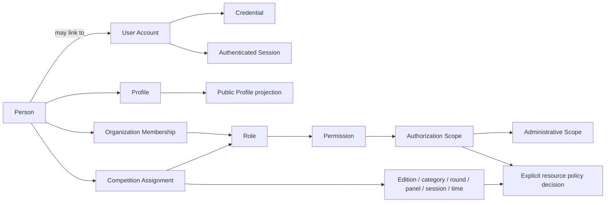
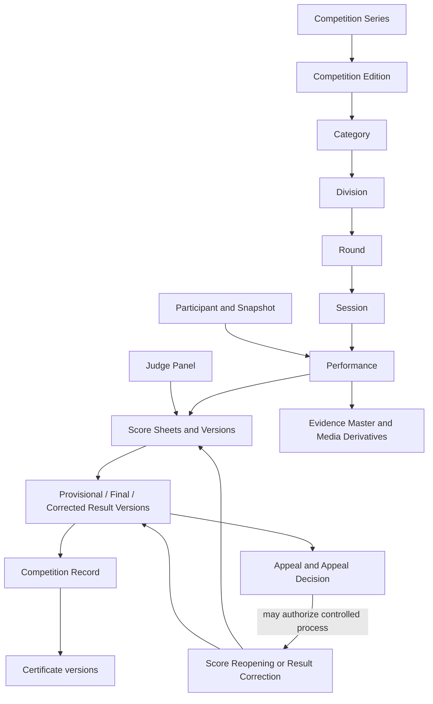

# Domain Glossary

| Document control | Value |
| --- | --- |
| Project | Qur’an Memorizer DB |
| Project code | QMDB |
| Baseline ID | QMDB-BL-001 |
| Document version | 1.0.0 |
| Status | Authoritative canonical terminology baseline |
| Current phase | P0 — Product Constitution and System Requirements |
| Last updated | 2026-08-24 |
| Document owner role | Product and Domain Governance |
| Approval status | Baseline established; religious and policy specifics remain subject to qualified governance |

## Purpose

This glossary assigns one canonical meaning to each major QMDB concept so later requirements, data models, interfaces, policies, APIs, reports, and tests use consistent language.

## Scope and interpretation

“Public” means a term may appear in an approved public projection; it does not make the underlying record public. “Internal” means the term or its detailed record is for authorized workflows. Verification is always a classified event or claim with subject, authority, method, date, scope, status, and provenance—never an unexplained boolean.

## Identity and access

| Canonical term | Definition | Not equivalent to | Key relationships | Lifecycle relevance | Public or internal | Notes |
| --- | --- | --- | --- | --- | --- | --- |
| Person | Durable identity for one real human across contexts. | User Account, Profile, Role, Participant | May have Accounts, Profiles, Memberships, roles, Guardian relationships | Deduplication through historical record | Internal; minimized public representation | One Person may hold many contextual roles. |
| User Account | Authentication and application-access identity that may be linked to a Person. | Person, Credential, Membership | Owns Credentials, Sessions, Devices; links to one Person when established | Invite, activation, suspension, closure | Internal | An Account is not proof of real-world identity. |
| Credential | Secret, key, authenticator, or federated binding used to prove control of a User Account. | User Account, Permission, Session | Belongs to Account; establishes Session | Enrollment, rotation, recovery, revocation | Internal restricted | Plaintext secrets never belong in normal records or logs. |
| Session | Time-bounded authenticated interaction context for a User Account. | Credential, Device, authorization | Established by authentication; evaluated with Device and scopes | Creation, renewal, step-up, revocation, expiry | Internal restricted | A valid Session still requires resource authorization. |
| Device | Client installation or browser context associated with account activity and security signals. | Person, Session, Credential | May hold Sessions and notification tokens | Registration, recognition, loss, revocation | Internal restricted | Device recognition is a risk signal, not identity proof. |
| Profile | Mutable descriptive information associated with a Person for a defined context. | Person, Public Profile, Participant Snapshot | Belongs to Person; may feed reviewed projections | Create, update, restrict, archive | Internal by default | Current changes cannot rewrite historical snapshots. |
| Public Profile | Approved, minimized projection of Profile and achievement information for public discovery. | Profile, Person record, authorization source | Derived from Profile, Consent, privacy policy, Records | Draft, publish, restrict, withdraw | Public projection | Public identifiers and visibility do not grant authority. |
| Competitor Profile | Reusable competition-related attributes for a Person outside a single edition. | Participant Snapshot, Registration, Person | Supports Registrations and eligibility evidence | Create, review, update | Internal; selected public projection | Edition history remains in snapshots and records. |
| Judge Profile | Reusable qualification and judging context for a Person. | User Account, Judge Panel, Competition Assignment | Supports judge assignments and conflict review | Qualification, review, restriction | Internal | It does not itself authorize judging. |
| Workspace | Tenant ownership and security boundary for tenant-owned records. | Organization, Organization Unit, geography | Owns records; contains scoped Memberships and organizations | Provision, operate, suspend, archive | Internal; name may be public | Every tenant-owned record belongs to exactly one Workspace. |
| Organization | Institution or recognized group that participates in governed relationships. | Workspace, Organization Unit, Organizer Type | Has Memberships/Units; may organize, sponsor, host, nominate, supply judges | Onboarding, scoped recognition, suspension | Public or internal by policy | Relationships are distinct and time/scoped. |
| Organization Unit | Structured subdivision of an Organization. | Workspace, independent Organization, Administrative Area | Parent Organization; may have scoped Memberships | Create, reorganize, close | Internal; may be public | Does not inherit unrestricted authority. |
| Membership | Time- and scope-bounded relationship between a Person/User Account and an Organization or Workspace. | Role, employment proof, global authority | Carries Roles and scopes | Invite, accept, activate, suspend, end | Internal | Membership alone grants no capability. |
| Role | Named bundle of expected responsibilities used in RBAC. | Permission, Person type, job title | Assigned through Membership/Assignment; contains Permissions | Define, assign, revoke, review | Internal; role label may display | Always constrained by ABAC and resource policy. |
| Permission | Atomic capability recognized by authorization policy. | Role, UI visibility, ownership | Included in Roles; evaluated within Authorization Scope | Define, grant via role, revoke | Internal | Denied unless policy and context permit. |
| Authorization Scope | Complete boundary within which a Permission may operate. | Role, Administrative Scope alone | May combine workspace, organization, geography, competition, resource, time | Evaluated on every protected action | Internal | Client-supplied scope is not authoritative. |
| Administrative Scope | Authorized Administrative Area boundary for an administrative capability. | Workspace, Competition Scope, global access | Part of Authorization Scope; references Administrative Area | Assignment, review, expiry | Internal | A geographic title does not imply cross-workspace access. |
| Competition Assignment | Explicit relationship authorizing a Person/Account to perform a role in a Competition Edition context. | Membership, Judge Profile, global Role | References edition and possibly category, round, panel, session, time | Assign, accept, recuse, replace, expire | Internal | Required even when organization membership exists. |
| Guardian | Person with a recorded, scoped relationship and approved authority regarding a Minor. | Parent label alone, User Account, Coach | Linked through Guardianship and Consent | Assert, assess, approve, revoke/end | Internal; minimized display | Sensitive consent awaits approved verification policy. |
| Minor | Person to whom the approved age/status policy applies. | Dependent, competitor category, incapacity | May have Guardian relationships and protective policies | Status assessment and transition | Internal restricted | When uncertain, conservative protections apply pending qualified review. |
| Consent | Versioned record of an informed choice for a defined subject, purpose, data/media, scope, policy text, actor, and time. | Guardian relationship, blanket permission | May be given/withdrawn by authorized subject/Guardian | Request, grant, refuse, withdraw, expire | Internal restricted | Absence or ambiguity is not consent. |
| Step-Up Authentication | Fresh stronger authentication required for a high-risk action within an existing Session. | Login, authorization approval | Evaluated with action risk and Session | Challenge, success/failure, short validity | Internal security | Does not replace permission or independent approval. |
| Break-Glass Access | Exceptional, time-limited privileged access for a declared incident under enhanced control. | Super administrator, support access | Uses Step-Up, approval, alerting, Audit Events | Request, approve, activate, expire, review | Internal highly restricted | Temporary, justified, minimal, and never routine. |

## People and competition roles

These are contextual roles or states; none permanently classifies the whole Person.

| Canonical term | Definition | Not equivalent to | Key relationships | Lifecycle relevance | Public or internal | Notes |
| --- | --- | --- | --- | --- | --- | --- |
| Memorizer | Person whose Qur’an memorization learning or achievement is represented. | Competitor, Reciter, User Account | May have achievement Profile and Competition Records | Learning and achievement history | Public only by policy | May never compete or hold an Account. |
| Reciter | Person performing or publishing a Qur’anic recitation in a defined context. | Memorizer, Competitor | Creates Performance or approved Recitation Clip | Performance/publication lifecycle | Public by approved visibility | Term describes an act/context, not global authority. |
| Competitor | Person accepted or seeking acceptance to compete in a Competition Edition. | Participant, Registration, Memorizer | Has Registration, eligibility, Participant Snapshot | Registration through result | Public/minimized or internal | Authority and visibility remain edition scoped. |
| Participant | Snapshot-linked competition participation record for a person in an edition context. | Person, Competitor Profile | Links Registration, Session, Performance, Results | Accepted participation through archive | Public projection or internal | Preserves historical context. |
| Coach | Contextual role supporting one or more competitors. | Guardian, Teacher, Judge | May link to Participant/organization | Nomination through event | Internal; public by policy | No score or consent authority by default. |
| Teacher | Contextual instructional relationship to a Person. | Coach, Guardian, Judge | May support history and conflicts | Learning/competition context | Internal; public by policy | Relationship does not grant administrative access. |
| Judge | Qualified, assigned Person who submits scoped Score Sheets. | Judge Profile, Chief Judge, Ruleset | Assigned to Judge Panel and Performance | Assignment, scoring, recusal | Public role; submissions controlled | Cannot alter another judge’s submission or final result. |
| Chief Judge | Assigned oversight role for a defined Judge Panel or competition scope. | Platform administrator, Result owner | Reviews panel process, exceptions, reopen requests | Assignment through finalization | Public role; controls internal | Does not receive unrestricted score-edit authority. |
| Registrar | Assigned role managing Registration, evidence receipt, and check-in within scope. | Competition Director, identity authority | Uses Registration and Eligibility modules | Pre-event through check-in | Internal; name may be public | Cannot self-approve unrelated sensitive exceptions. |
| Competition Director | Assigned role coordinating a Competition Edition’s approved operations. | Organization owner, Chief Judge | Oversees schedule, assignments, operational state | Planning through closeout | Public role; controls internal | Cannot bypass judging, privacy, or approval policy. |
| Certificate Officer | Assigned role issuing, reissuing, revoking, or superseding certificates under policy. | Result author, signing-key custodian | Uses Final Results and Certificate records | Post-finalization lifecycle | Internal; issuer may display | Cannot change the underlying Final Result. |
| Appeal Reviewer | Independent scoped role evaluating an Appeal and recording an Appeal Decision. | Original Judge, automatic result editor | References evidence and original versions | Appeal intake through decision | Internal; decision may publish | Conflict review and separation are required. |
| Moderator | Scoped role triaging reports and applying approved content policy. | Security Operator, Competition administrator | Handles Moderation Cases/Actions | Publication through appeal | Internal; public policy role | Cannot alter official competition records. |
| Auditor | Read-oriented independent role assessing policy, evidence, access, versions, and controls. | Administrator, Support Officer | Reads Audit Events/checkpoints and records | Continuous/periodic review | Internal restricted | Findings do not directly mutate source records. |
| Privacy Officer | Governance role overseeing purpose, minimization, Consent, rights, retention, and privacy review. | Support Officer, unrestricted data reader | Works across Privacy and data-owning modules | Design through operations | Internal | Access remains purpose-limited and audited. |
| Security Operator | Operational role monitoring threats, access, incidents, keys, and containment. | Moderator, Break-Glass Administrator | Uses security telemetry and scoped controls | Continuous and incident response | Internal restricted | Cannot alter official outcomes without domain workflow. |

## Geography

| Canonical term | Definition | Not equivalent to | Key relationships | Lifecycle relevance | Public or internal | Notes |
| --- | --- | --- | --- | --- | --- | --- |
| Administrative Area | Version-aware hierarchical geographic unit with type, parent, aliases, and validity. | Venue, Organization, fixed State/LGA pair | Parent/child areas; scopes and coverage | Reference lifecycle and historical validity | Public reference | No official codes or full seed data are established here. |
| Country | Top-level Administrative Area for sovereign territorial context. | National Competition Scope | Parent of relevant subdivisions | Geography reference | Public | Initial national focus does not prevent future countries. |
| State | Nigerian first-level Administrative Area of State type. | Federal Capital Territory, organization | Contains LGAs and lower areas | Geography reference | Public | Type and historical validity are explicit. |
| Federal Capital Territory | Nigerian first-level territory represented distinctly from a State. | State, Area Council | Contains Area Councils and lower areas | Geography reference | Public | FCT-specific hierarchy must remain representable. |
| Local Government Area | Administrative Area below a State in applicable hierarchy. | Area Council, Organization Unit | Parent State; may contain Wards/Communities | Geography reference | Public | Not hard-coded as the only lower-area model. |
| Area Council | Administrative Area below the FCT in applicable hierarchy. | Local Government Area | Parent FCT; may contain Wards/Communities | Geography reference | Public | Treated as a distinct area type. |
| Ward | Lower Administrative Area within an applicable LGA or Area Council hierarchy. | Community, venue | Parent administrative area | Geography reference | Public by policy | Boundaries and validity may change over time. |
| Community | Named locality represented for discovery or context where approved. | Ward, precise address, organization | May belong to an Administrative Area | Profile/event context | Public or restricted | Minor precise-location exposure remains prohibited. |
| Venue | Physical or virtual place assigned to an event activity. | Host Location, Administrative Area | Has approved address/geography; hosts Sessions | Planning through event archive | Public/minimized or internal | Exact access/security details may remain restricted. |
| Host Location | Geographic/venue relationship describing where an edition or activity occurs. | Eligibility Geography, Represented Geography | References Venue/Administrative Area | Competition planning and records | Public | Does not determine organizer or eligibility. |
| Eligibility Geography | Geographic rule input used by an approved eligibility policy. | Host Location, Representation | References Administrative Areas and Ruleset | Registration/Eligibility Check | Internal; criteria may publish | Must have policy/version, not inferred from address alone. |
| Represented Geography | Administrative Area a Participant is officially recorded as representing. | Current residence, Host Location | Captured in Participant Snapshot/nomination | Registration through historical record | Public by policy | Evidence and nominating authority may be required. |
| Organization Coverage Area | Declared or recognized geographic reach of an Organization. | Administrative Scope, Competition Scope | Links Organization to Administrative Areas | Onboarding and authorization review | Public or internal | Coverage does not itself grant authority. |

## Competition structure

| Canonical term | Definition | Not equivalent to | Key relationships | Lifecycle relevance | Public or internal | Notes |
| --- | --- | --- | --- | --- | --- | --- |
| Competition Series | Durable identity for a recurring or continuing competition program. | Competition Edition, Organizer | Owns one or more Editions | Create through long-term archive | Public | Does not contain edition-specific results. |
| Competition Edition | One scheduled occurrence of a Competition Series with its own scope, rules, participants, and records. | Series, Session | Belongs to exactly one Series | Plan, open, run, finalize, archive | Public | Primary boundary for competition operations. |
| Competition Scope | Declared participation reach or level of an Edition, such as organization or national. | Organizer Type, Host Location, Eligibility Geography | Attribute/policy of Edition | Planning and public description | Public | Canonical term for “participation scope”; it grants no authority. |
| Organizer Type | Classification of the organizing party. | Competition Scope, Organizer Organization | Describes an organizing relationship | Planning and reporting | Public | Example values require governance; type is not identity. |
| Organizer Organization | Organization assigned the organizer relationship for an Edition. | Sponsor, host, Competition Scope | Links Organization and Edition | Planning through archive | Public | May differ from host, sponsor, and nominator. |
| Category | Competition grouping based on an approved subject or memorization domain. | Division, Age Band, Round | Contains Divisions or participants per structure | Setup through results | Public | Exact categories require rules governance. |
| Division | Subgroup within a Category for approved eligibility or competition organization. | Category, Round, Age Band | Contains Rounds/Participants | Setup through results | Public | Criteria must be explicit and versioned. |
| Age Band | Policy-defined age range used where approved. | Minor status, Division | May constrain eligibility/division | Registration and results context | Public | Does not determine legal Minor status by itself. |
| Round | Ordered competitive unit within a Division. | Stage, Session | Contains Sessions and Performances | Scheduling through result | Public | Round advancement uses approved rules. |
| Stage | Named progression grouping that may contain one or more Rounds. | Round, Session | Organizes competition progression | Setup through result | Public | Use only where rules define it. |
| Session | Scheduled operational block for performances at a time/venue/panel. | Edition, Round, authenticated Session | Contains Performances; uses Venue/Judge Panel | Schedule, run, close | Public/minimized and internal | Identity term context must be clear. |
| Judge Panel | Scoped group of assigned Judges and possibly a Chief Judge. | Organization, Role | Assigned to Sessions/Performances | Form, review conflicts, operate, close | Public roster or internal | Panel membership is time and scope bound. |
| Registration | Application/entry record seeking participation in an Edition context. | Participant, Nomination, Eligibility Check | Links Person/Profile, category/division, evidence | Draft, submit, review, accept/reject/withdraw | Internal; status may expose | Acceptance does not rewrite source identity. |
| Nomination | Attestation by an authorized organization/actor proposing a Competitor or representation. | Registration, eligibility approval | Supports Registration and Represented Geography | Submit, review, withdraw | Internal | Authority, scope, time, method, and evidence are recorded. |
| Eligibility Check | Versioned evaluation of Registration evidence against approved criteria. | Nomination, Result, generic verification | Uses policy/rules and records outcome/reasons | Review and re-evaluation | Internal; outcome may expose | Records what, who/system, method, date, scope, status, evidence. |
| Participant Snapshot | Immutable historical copy of approved participant facts for a defined competition milestone. | Current Profile, Competitor Profile | Derived from Registration/Person; linked to Performance/Record | Registration/check-in/performance/result history | Internal; selected projection public | Later current-data changes do not silently rewrite it. |
| Check-In | Audited confirmation that an accepted Participant is present/ready under event policy. | Registration acceptance, identity proof | Links Participant, Session, actor, time | Event-day operation | Internal; status may display | Method and exceptions remain scoped. |
| Draw Order | Approved ordering assignment controlling performance sequence. | Ranking, Passage Assignment | Links Participants and Session/Round | Draw, publish, amend under control | Public or internal | Changes require reason and audit. |
| Passage Assignment | Versioned assignment of a Passage Range to a Performance under approved rules. | Draw Order, Ruleset | References Qur’an Text Release and range | Before/during performance | Restricted until policy permits; then record | Must not expose unfair advance information. |
| Performance | Recorded occurrence of a Participant’s competition recitation in a Session. | Media Asset, Score Sheet, Recitation Clip | Links snapshot, assignment, panel, media, scores | Start, complete, score, finalize | Public projection/internal record | Stable anchor for scoring and evidence. |

## Scoring and results

| Canonical term | Definition | Not equivalent to | Key relationships | Lifecycle relevance | Public or internal | Notes |
| --- | --- | --- | --- | --- | --- | --- |
| Ruleset | Governed family of declarative competition rules. | Ruleset Version, executable code | Owns Versions; applies to Editions | Draft through retirement | Internal; summary may publish | Cannot contain arbitrary executable scripts. |
| Ruleset Version | Immutable identified version of a Ruleset used by defined competition records. | Mutable settings, Category | Contains criteria, arithmetic, aggregation, tie-break references | Draft, approve, lock, use, supersede | Internal; public explanation may show | Used version remains identifiable forever. |
| Scoring Criterion | Approved dimension on which a Performance is judged. | Mistake Type, Score Item | Defined by Ruleset Version | Rule design through Score Sheet | Public or internal | Exact religious criteria require qualified approval. |
| Score Item | Exact-decimal judge entry for one criterion/context. | Judge Total, Aggregated Score | Part of Score Sheet; may include Deductions | Draft/submission/version review | Internal; projection may show | Server validates permitted precision/range. |
| Deduction | Exact-decimal reduction applied under an identified rule and reason. | Mistake Type, Disqualification | References Score Item/rule/evidence | Judging and review | Internal; summary may show | No invented values in this baseline. |
| Mistake Type | Classified competition judging observation from an approved taxonomy. | Tajwīd Rule, Deduction amount | May justify Score Item/Deduction | Judging, reporting, appeal | Internal; public explanation by policy | Taxonomy and scoring effect are versioned separately. |
| Score Sheet | One Judge’s scoped submission for a Performance under a Ruleset Version. | Result, Judge Total, panel aggregate | Contains Score Items and Versions | Draft, submit, reopen, supersede | Internal restricted | Another actor cannot silently overwrite it. |
| Score Sheet Version | Immutable revision of a Score Sheet with reason, actor, time, evidence, and state. | Editable draft, Result Version | Belongs to Score Sheet | Submission through correction history | Internal restricted | Former submitted versions remain accessible to authorized review. |
| Judge Total | Server-calculated exact-decimal total for one Judge’s Score Sheet. | Score Item, Aggregated Score, Final Result | Derived from Score Items/Ruleset Version | Submission and recalculation | Internal; may project | Client preview is non-authoritative. |
| Aggregated Score | Server-calculated combination of approved Judge Totals for a Performance/ranking context. | Judge Total, Final Result | Uses Aggregation Method/Ruleset Version | Result computation | Internal; public projection may show | Exact decimal and reproducible. |
| Aggregation Method | Declarative versioned method combining Judge Totals. | Ruleset executable code, Tie-Break Rule | Part of Ruleset Version | Approval and calculation | Internal; description may publish | Human-approved and server executed. |
| Tie-Break Rule | Declarative ordered method resolving equal ranking values. | Aggregation Method, manual silent choice | Part of Ruleset Version | Ranking calculation/review | Public summary/internal detail | Exceptions require controlled evidence. |
| Provisional Result | Clearly labeled result not yet final and subject to approved review/appeal/finalization. | Final Result, live raw Score Sheet | Derived from identified score/result version | Publish provisionally, review, supersede | Public or internal | Status must not rely on color alone. |
| Final Result | Official finalized outcome tied to evidence, approved calculation, and a version. | Provisional Result, Certificate | Supersedes provisional state; supports Records/Certificates | Finalize, correct via new version, archive | Public projection/internal record | Cannot be silently edited or normally hard-deleted. |
| Corrected Result | New official Result version produced by an approved correction process. | Edited Final Result, Appeal Decision | Supersedes prior Result version | Correction through archive | Public projection/internal history | Prior result remains preserved and status clear. |
| Ranking | Ordered result relationship calculated under approved rules. | Placement, Draw Order | Based on Result values and tie-break | Provisional/final result | Public or internal | Must identify version and status. |
| Placement | Assigned ordinal/award position in a defined result scope. | Ranking data, certificate | Derived from finalized Ranking | Result and certificate | Public | Scope/category/division must be explicit. |
| Disqualification | Governed competition status excluding a Participant/Performance from specified result treatment. | Deletion, zero score | References rule, authority, evidence, decision | During review/finalization/appeal | Public status/minimized; details controlled | Must be appealable where policy requires. |
| Score Reopening | Controlled state transition allowing a submitted Score Sheet to receive a new version. | Unlock-and-edit, Result Correction | Requires authority, reason, approvals, evidence | Post-submission before/after result under policy | Internal restricted | Original submission remains preserved. |
| Appeal | Formal challenge to an identified decision or record version. | Score Reopening, complaint, direct edit | Has appellant, grounds, evidence, reviewer | Submit, review, decide, close | Internal; status/outcome may publish | Does not mutate the challenged record. |
| Appeal Decision | Versioned authorized outcome of an Appeal. | Result Correction | References Appeal, evidence, reviewer, remedy | Decision and possible follow-on workflow | Internal; summary may publish | A remedy triggers controlled domain actions. |
| Result Correction | Approved process producing a corrected Result version. | Silent edit, Appeal | Uses request, approvals, evidence, supersession | After result publication/finalization | Internal; public status may show | The former Result remains in history. |
| Superseded Record | Preserved record version replaced for current use by a newer identified version. | Deleted record, invalid data by default | Points to successor and reason | Correction/reissue/version lifecycle | Internal; public status may show | Remains available according to authority and retention. |

## Qur’an references

| Canonical term | Definition | Not equivalent to | Key relationships | Lifecycle relevance | Public or internal | Notes |
| --- | --- | --- | --- | --- | --- | --- |
| Qur’an Text Release | Immutable, governed, checksummed release of canonical text and reference data. | Editable content page, Reading alone | Contains Surah/Ayah references; identifies Reading | Import, qualified review, activate, supersede | Public text/internal governance | Normal administrators cannot edit it. |
| Reading or Riwāyah | Approved recitational reading/transmission context identified for references and competition use. | Translation, audio recording, Ruleset | Associated with Text Release and Passage Range | Reference and competition setup | Public | New contracts use this canonical label; exact supported readings require qualified governance. |
| Surah | Canonically identified chapter reference within a Qur’an Text Release. | Page, Juz | Contains Ayat; used in ranges | Reference lifecycle | Public | Identifiers derive from approved release data. |
| Ayah | Canonically identified verse reference within a Surah and Text Release. | Line, Page Reference | Forms Passage Ranges | Reference lifecycle | Public | Text and numbering remain release-specific where required. |
| Juz | Canonical division reference within an approved release/reading context. | Surah, Hizb | Relates to Ayat/ranges | Reference and category description | Public | Mappings come from governed reference data. |
| Hizb | Canonical subdivision reference of a Juz in approved reference data. | Juz, Rubʿ | Relates to ranges | Reference lifecycle | Public | No mappings are invented here. |
| Rubʿ | Canonical quarter-Hizb marker/reference in approved reference data. | Hizb, Page | Relates to ranges | Reference lifecycle | Public | Orthography is retained in canonical labels. |
| Page Reference | Release/edition-specific page locator for display or navigation. | Ayah identity, Passage Range | Maps to text positions in a Text Release | Navigation and evidence | Public | Never use page alone as canonical verse identity. |
| Passage Range | Start/end reference over canonical Qur’an units for assignment or evidence. | Media duration, Page Reference | Uses Text Release, Reading, Surah/Ayah | Assignment, Performance, judging | Public or restricted by timing | Must be validated against one governed release context. |
| Tajwīd Rule Taxonomy | Qualified, versioned classification of tajwīd concepts. | Competition Mistake Taxonomy, scoring formula | May inform rules and educational labels | Governance and reference | Public/internal | Qualified Qur’an review controls semantics. |
| Competition Mistake Taxonomy | Versioned classification used by an approved competition Ruleset. | Tajwīd truth, Deduction | Maps Mistake Types to competition context | Rules, judging, reporting | Internal; explanation may publish | Does not redefine religious doctrine. |

## Records and certificates

| Canonical term | Definition | Not equivalent to | Key relationships | Lifecycle relevance | Public or internal | Notes |
| --- | --- | --- | --- | --- | --- | --- |
| Competition Record | Durable authoritative bundle/reference describing participation, result, provenance, and evidence for an Edition. | Public Profile, Certificate, Score Sheet | Links snapshots, Performance, Result versions, media | Finalization through archive | Internal with public projection | Current source record is version identified. |
| Competition Record Passport | Structured view of one Participant’s records within a defined competition context. | Memorizer Passport, identity document | Projects Competition Records and provenance | Post-participation discovery | Public/minimized or internal | “Passport” is a product view, not a government document. |
| Memorizer Passport | Longitudinal achievement view for one Person across approved records. | Person identity, Public Profile, government passport | Aggregates Competition Records by provenance | Ongoing achievement history | Public only by policy | Does not merge conflicting claims silently. |
| Record Provenance | Evidence chain describing origin, authority, method, dates, transformations, and custody of a record. | Generic verified flag, Audit log alone | Supports classifications, signatures, versions | Ingest through archive | Internal; summary may publish | Must remain specific and reviewable. |
| Verification Classification | Named status describing the evidence and authority supporting a record claim. | Boolean verification, result status | Applies to record/version with provenance | Import, review, change, dispute | Public label/internal evidence | Scope, authority, method, date, status, evidence required. |
| Native Verified Record | Record produced natively by QMDB through governed authoritative workflows. | External attestation, error-free record | Has platform provenance and Audit Events | Native lifecycle | Public classification/internal evidence | “Verified” names origin/class, not absolute truth. |
| Organizer Verified Record | Imported/entered record attested by an authorized Organizer for a defined scope. | Native record, global verification | References organization authority and evidence | Legacy/current import and review | Public classification/internal evidence | Exact verifier, method, date, scope, and status are retained. |
| Legacy Supported Record | Historical record accepted with identified supporting evidence under an approved authority policy. | Native record, Legacy Unverified Record | Has provenance/evidence and classification decision | Import, review, publish, dispute | Public classification/internal evidence | Policy and authority remain an open decision. |
| Legacy Unverified Record | Historical claim lacking sufficient approved evidence or authority for stronger classification. | False record, Disputed Record | May await evidence/review | Import and later reassessment | Public only with clear label or internal | Default for legacy claims until requirements are met. |
| Disputed Record | Record with a formal unresolved challenge to accuracy, authority, or provenance. | Deleted record, automatically false record | Links dispute/appeal and versions | Dispute through resolution | Public status by policy/internal detail | Publication treatment requires policy. |
| Certificate | Versioned signed representation of an identified Final Result or approved achievement record. | Final Result, authority grant, identity document | Uses template, record version, signature metadata | Issue, verify, revoke, supersede | Public artifact/minimized data | QR/public token contains no sensitive data or authorization. |
| Certificate Template | Governed versioned presentation definition for Certificates. | Certificate record, signing key | Used to render certificates | Draft, approve, activate, retire | Internal; design output public | Branding cannot defeat accessibility or meaning. |
| Certificate Verification | Process/output checking signature, identifier, version, lifecycle state, and safe public facts. | Authorization, identity verification | Reads Certificate and Record version | Public validation and audit | Public output/internal evidence | Must distinguish valid, revoked, superseded, and unknown. |
| Certificate Revocation | Governed state ending acceptance of a Certificate without erasing its history. | Deletion, Result Correction | References certificate version, reason, authority | Post-issuance lifecycle | Public status/internal detail | Underlying record may or may not change separately. |
| Certificate Supersession | Relationship replacing one Certificate version with a newer one for current use. | Revocation, deletion | Links predecessor and successor | Reissue lifecycle | Public status/internal history | Old version remains identifiable. |
| Public Record Projection | Minimized, policy-approved view of an identified authoritative record version. | Authoritative record, access right | Derived from Records/Results/Privacy policy | Publish, refresh, withdraw | Public | Search/cache/index cannot expand its authority. |

## Media and community

| Canonical term | Definition | Not equivalent to | Key relationships | Lifecycle relevance | Public or internal | Notes |
| --- | --- | --- | --- | --- | --- | --- |
| Media Asset | QMDB metadata record governing an audio, video, image, or related object. | Object bytes, Social Post | Owns hashes, lifecycle, access, Consent, derivatives | Upload through disposition | Internal; derivative may publish | Bytes stay in object storage, not MySQL BLOBs. |
| Evidence Master | Preserved highest-authority source object used as competition or moderation evidence. | Public stream, Media Derivative | One Media Asset may identify a master and derivatives | Ingest, integrity check, restricted archive | Internal highly restricted | Never directly served through public CDN. |
| Media Derivative | Processed object generated from a source Media Asset for an approved purpose. | Evidence Master | Links source, transform, hash, worker, policy | Process, approve, publish, expire | Public or restricted | Cannot replace or mutate the master. |
| Thumbnail | Image derivative representing approved media. | Evidence Master, consent | Derived from Media Asset | Generate, moderate, publish | Public or restricted | Faces/minors follow same visibility policy. |
| Caption | Versioned text associated with media/content, including language and moderation state. | Qur’an canonical text, transcript proof | Belongs to Media Asset/Post | Draft, moderate, publish, edit/version | Public or internal | Must not misrepresent Qur’an text/reference. |
| Recitation Clip | Moderated short-form recitation Media Asset prepared for community viewing. | Competition Evidence Master, livestream | May derive from evidence only with purpose/Consent | Submit, process, moderate, publish, withdraw | Public when approved | Social metrics cannot affect official records. |
| Social Post | Community publication wrapper for approved content and metadata. | Media Asset, official Competition Record | May reference Clip, author projection, moderation | Draft through archive | Public when approved | Visibility and child-safety gates apply. |
| Follow | User preference to receive approved public activity from a profile/entity. | Friendship, private access, endorsement | Links Account to public entity | Create, remove | Internal with visible counts by policy | Grants no access to restricted data. |
| Reaction | Policy-approved lightweight response to a Social Post. | Score, judgment, endorsement by QMDB | Links Account and Post | Add/change/remove | Public/minimized | Must be moderatable and rate-controlled. |
| Bookmark | Private Account reference saving approved content. | Public endorsement, record retention | Links Account and content | Add/remove | Internal private | Does not preserve access after content restriction. |
| Comment | Moderated user-authored response attached to community content. | Direct message, judging note | Belongs to Post and moderation lifecycle | Submit, publish/hold, edit/version, remove from view | Public when approved | Minor and abuse controls apply. |
| Content Report | Scoped allegation or safety signal concerning content, behavior, or a profile. | Moderation Action, Appeal | Creates/informs Moderation Case | Submit, triage, close | Internal restricted | Reporter identity is minimized and protected. |
| Moderation Case | Governed case collecting reports, evidence, decisions, and history. | Content Report, security incident | Contains Moderation Actions and possible appeal | Open, investigate, decide, close/reopen | Internal restricted | Access and conflicts are scoped. |
| Moderation Action | Versioned policy enforcement decision applied to content/account visibility or capability. | Record deletion, security containment | Belongs to case; cites policy/evidence | Apply, expire, reverse, supersede | Internal; public effect | Cannot modify official competition records. |
| Content Appeal | Formal challenge to an identified Moderation Action. | Competition Appeal, new report | Links action, appellant, reviewer, evidence | Submit, review, decide | Internal; status may expose | Review independence follows policy. |

## Integrity and operations

| Canonical term | Definition | Not equivalent to | Key relationships | Lifecycle relevance | Public or internal | Notes |
| --- | --- | --- | --- | --- | --- | --- |
| Audit Event | Append-oriented security/business evidence of a significant action, decision, access, or state transition. | Debug log, Record Version | Includes actor/service, action, subject, scope, time, correlation, outcome | Entire lifecycle | Internal restricted | Contains no secrets and minimizes sensitive values. |
| Audit Chain | Tamper-evident ordered relationship among Audit Events or batches. | Guarantee against attack, blockchain | Uses hashes/checkpoints | Append, validate, archive | Internal restricted | Supports detection; not described as absolute immutability. |
| Audit Checkpoint | Independently retained integrity marker for an Audit Chain at a point in time. | Backup, full Audit Event | References chain position/hash/signature | Create, verify, retain | Internal highly restricted | Storage and key policy require governance. |
| Transactional Outbox | Database pattern storing an outbound event atomically with its business transaction. | Redis Stream, business record itself | Contains Outbox Events consumed by publisher | Commit, publish, acknowledge/archive | Internal | Prevents commit/publish gaps. |
| Outbox Event | Versioned event message awaiting or recording publication from the Transactional Outbox. | Domain record, notification | Has event ID, tenant, payload, correlation | Create, publish, retry, complete | Internal restricted | Consumers must handle duplicates. |
| Idempotency Key | Unique scoped identifier used to make repeated processing produce one intended business effect. | Public identifier, authorization token | Used by commands/integrations/consumers | Accept, detect replay, expire by policy | Internal; client may supply scoped value | Key alone grants no access. |
| Correlation ID | Non-secret identifier connecting related requests, jobs, events, and Audit Events. | Person identifier, Idempotency Key | Propagates across workflows | Request through asynchronous completion | Internal; safe support reference | Must not embed sensitive data. |
| Record Version | Identified immutable state in a record’s controlled history. | Backup, mutable row timestamp | Links predecessor/successor and provenance | Submit, finalize, correct, supersede | Internal; version may appear publicly | Version identity is explicit. |
| Content Hash | Cryptographic digest used to detect content changes. | Digital Signature, encryption, identity | Applies to text, media, release, record serialization | Ingest, verify, archive | Internal; value may publish | Algorithm and canonicalization are recorded. |
| Digital Signature | Cryptographic proof that a controlled key signed identified canonical content. | Content Hash, authorization, guarantee of truth | Used by certificates/checkpoints/results | Sign, verify, rotate/revoke keys | Public verification/internal keys | Trust depends on key custody and status. |
| Immutable Archive | Operationally protected archive that prevents normal in-place modification and preserves governed history. | Impossible-to-change storage, backup | Contains versions/evidence/checkpoints | Archive, retain, retrieve, dispose by policy | Internal restricted | Defense in depth; privileged procedures still require audit. |
| Point-in-Time Recovery | Capability to restore data to a recoverable time using backups and logs. | High availability, Audit history | Part of continuity controls | Backup, test restore, incident recovery | Internal operations | Numerical objectives remain open. |
| Read Model | Purpose-specific projection optimized for viewing/search/live delivery from authoritative records. | Source of truth, cache authorization | Built from events/queries; version/sequence aware | Build, refresh, invalidate, rebuild | Public or internal | May be discarded and rebuilt. |
| Live Event Sequence | Monotonic scoped ordering metadata for detecting missing, duplicated, or out-of-order live updates. | Wall-clock time, Final Result | Used by Outbox/Redis/SSE/Read Model | Publish, consume, reconcile | Public metadata/internal control | Does not make a live projection authoritative. |

## Terminology rules

| Discouraged term | Required precision |
| --- | --- |
| “competition” | Use Competition Series, Competition Edition, Category, Division, Round, or Session as intended. |
| “admin” | Name the exact actor and its Workspace, organization, geography, competition, assignment, and time scope. |
| “location” | Use Host Location, Venue, Eligibility Geography, Represented Geography, Organization Coverage Area, or a privacy-classified address. |
| “score” | Use Score Item, Deduction, Judge Total, Aggregated Score, Provisional Result, or Final Result. |
| “user” | Use Person, User Account, Registered Individual, Participant, Judge, Guardian, or Organization Member. |
| “verified” | State the subject, verifier/authority, method, date, scope, current status, and evidence/provenance; use a Verification Classification where applicable. |
| “deleted” | For official records use revoked, superseded, withdrawn, archived, restricted, or governed anonymization as factually applicable. |
| “organizer” | Distinguish Organizer Type, Organizer Organization, Competition Director, and other organization relationships. |
| “profile” | Distinguish Profile, Public Profile, Competitor Profile, Judge Profile, Participant Snapshot, and Memorizer Passport. |
| “session” | Distinguish authenticated Session from competition Session. |
| “passport” | Use Competition Record Passport or Memorizer Passport; neither is a government identity document. |
| “final” | Use only for a Result formally finalized under the identified process and version. |

Canonical terms use singular Title Case when naming the domain concept and ordinary grammatical case in prose. Aliases may aid search or migration, but contracts and new schema use the canonical term.

## Identity and authority context

The Account authenticates; the Person provides durable identity; Membership and Competition Assignment supply context; Role names Permissions; scopes and resource policy decide authorization. No node alone grants unrestricted authority.

## Competition conceptual hierarchy

The hierarchy organizes scope; side relationships preserve actors, evidence, appeals, corrections, and representations without collapsing them into the Result.

## Related documents

- [Documentation index](../README.md)
- [Product constitution](../project/product-constitution.md)
- [System boundaries](../project/system-boundaries.md)
- [Stakeholders and actors](stakeholders-and-actors.md)
- [Platform sides and capabilities](platform-sides-and-capabilities.md)
- [Core modules and business invariants](core-modules-and-business-invariants.md)
- [P0-B01 requirements](../requirements/P0-B01-requirements.md)
