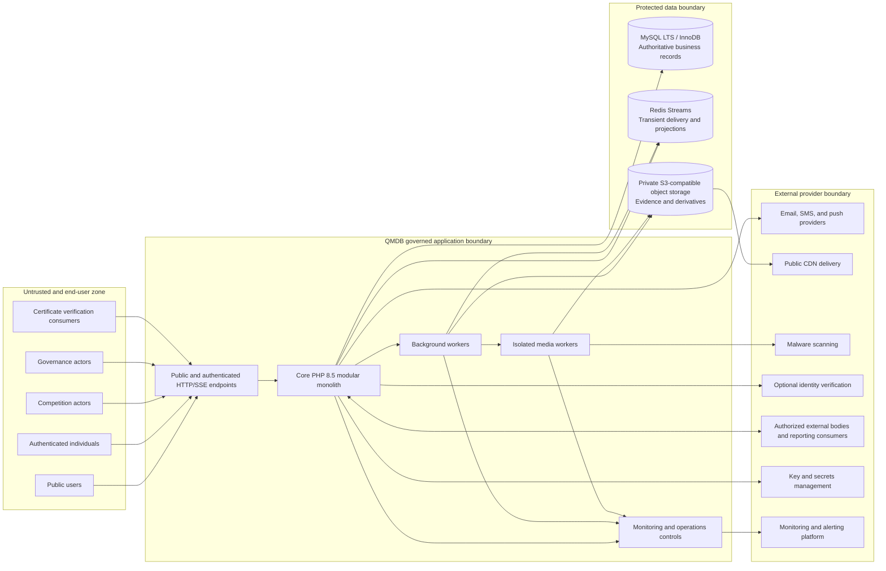

# System Boundaries

| Document control | Value |
| --- | --- |
| Project | Qur’an Memorizer DB |
| Project code | QMDB |
| Baseline ID | QMDB-BL-001 |
| Document version | 1.0.0 |
| Status | Authoritative QMDB-P0-B01 baseline |
| Current phase | P0 — Product Constitution and System Requirements |
| Last updated | 2026-08-24 |
| Document owner role | Enterprise Architecture and Security Governance |
| Approval status | Formal organizational approval pending |

## Purpose

This document defines what QMDB owns, what remains external or deferred, where trust changes, and which system is authoritative for each important record class.

## Scope

The boundary covers human and service actors, the planned secure modular monolith, data and event infrastructure, private media processing and delivery, third-party integrations, multi-tenant authority, and operations access. Vendor selection and implementation topology remain open decisions.

## Locked technology baseline

| Concern | Locked baseline |
| --- | --- |
| Backend language/runtime | Core PHP 8.5 with `declare(strict_types=1)` |
| Architecture | Secure modular monolith |
| Presentation and internal layers | MVC Presentation with Domain, Application, Infrastructure, and Presentation separation |
| Primary database | MySQL LTS using InnoDB for transactional business tables |
| Database access and text | PDO MySQL with native prepared statements; `utf8mb4` |
| Time and official numeric values | UTC with microsecond precision; exact `DECIMAL` official scores, never `FLOAT` or `DOUBLE` |
| Tenancy and integrity | Shared-schema multi-tenancy; `workspace_id` on every tenant-owned record; composite Workspace-aware foreign keys where appropriate |
| Authorization | RBAC plus ABAC plus explicit resource policies, denied by default |
| Reliable live events | Transactional Outbox plus Redis Streams; initial client transport is Server-Sent Events |
| Media | Private S3-compatible object storage and isolated FFmpeg workers |
| Web runtime | Nginx plus PHP-FPM |
| Dependency management | Composer with committed `composer.lock` |
| API contract | OpenAPI 3.1 |
| Verification | Unit, integration, architecture, authorization, security, and end-to-end tests |
| Accessibility and direction | WCAG 2.2 Level AA target with full LTR and RTL support |
| Product character | Secure, respectful, trustworthy, accessible, child-aware, enterprise-grade, and nationally scalable |

This table is a constraint, not evidence that the runtime or dependencies have been installed. Vendor and deployment-topology choices remain open.

## In-scope capabilities

QMDB owns the domain behavior, records, policies, and authorized projections for:

1. Competition Series and Competition Edition creation and administration.
2. Registration, Nomination, Eligibility Check, Participant Snapshot, Check-In, Draw Order, and scheduling.
3. Guardian relationships, versioned Consent, conservative Minor controls, and publication gates.
4. Judge qualification context, assignment, Judge Panels, conflict declarations, recusal workflow foundations, and Chief Judge oversight.
5. Declarative versioned Rulesets, exact-decimal scoring, aggregation, tie-break application, and server-authoritative calculation.
6. Sequenced live competition updates, explicitly labeled provisional outputs, Final Results, and public Read Models.
7. Appeals, Score Reopening, controlled Result Correction, supersession, approval, and evidence history.
8. Private competition audio/video evidence, Media Asset metadata, derivatives, access policy, consent linkage, and lifecycle state.
9. Durable Competition Records, Memorizer achievement history, provenance classifications, and public record projections.
10. Cryptographically verifiable certificate records, issuance, verification, revocation, and supersession history.
11. Administrative hierarchy references and distinct organization, geography, venue, and representation relationships.
12. Moderated Recitation Clips, Social Posts, follows, reactions, bookmarks, comments, reports, cases, actions, and content appeals.
13. Public discovery, search, certificate verification, published results, and approved profile visibility.
14. Organization, competition, geography, privacy, security, moderation, audit, reporting, support, and operations workspaces.
15. Audit provenance, security events, notifications, transactional event publication, monitoring hooks, and operational recovery evidence.

## Out-of-scope capabilities

| Boundary class | Capability | Boundary treatment |
| --- | --- | --- |
| Explicit first-release exclusion | Unrestricted direct messaging | Not exposed; any future messaging requires safety, consent, abuse prevention, and governance approval. |
| Explicit first-release exclusion | Unmoderated user livestreaming | Not exposed; approved event broadcasting would require a separately governed capability. |
| Explicit first-release exclusion | Automated official judging | Automated analysis may be advisory only and cannot decide official outcomes. |
| Explicit first-release exclusion | Executable administrator scoring code | Only approved declarative Ruleset Versions may be configured. |
| Explicit first-release exclusion | Public identity documents or precise Minor locations | Prohibited from public views and public verification payloads. |
| Explicit first-release exclusion | Blockchain or cryptocurrency dependency | Neither is required for integrity or certificate verification. |
| Deferred capability | Payments, sponsorship operations, monetization, and international expansion | Not promised or permanently excluded; each requires an approved product, legal, security, and operating decision. |
| Deferred capability | Advanced recommendations and automated recitation analysis | May be specified later; must remain isolated and advisory where judging is concerned. |
| External-provider capability | Delivery of email, SMS, push, CDN objects, object bytes, malware analysis, and infrastructure telemetry | QMDB creates intent and policy; providers execute contracted technical functions and return delivery or processing evidence. |
| External-provider capability | Optional identity evidence checks | A provider may return scoped evidence; QMDB retains the decision context and does not expose documents publicly. |
| Governance-controlled capability | Canonical Qur’an release approval, competition rules, organization recognition, legacy-record authority, retention, appeals authority, and national rollout | Enabled only after the qualified owner approves policy and authority. |

Formal religious or competition authorities remain authoritative for the policies delegated to them. Qualified Nigerian privacy and compliance professionals must review legal or regulatory interpretations; this baseline is not legal advice.

## External actors and systems

| Category | Permitted relationship | Prohibited authority |
| --- | --- | --- |
| Email delivery provider | Deliver QMDB-generated messages and report status. | Cannot determine business state or official scores. |
| SMS provider | Deliver scoped notification content and status. | Cannot receive unnecessary sensitive content or alter records. |
| Push-notification provider | Route minimal notification payloads. | Cannot act as an authorization source. |
| Object-storage provider | Store encrypted/private media objects under QMDB policy. | Does not own Media Asset metadata, Consent, or publication state. |
| Content delivery network | Deliver only approved public or time-limited authorized derivatives. | Cannot expose Evidence Masters or decide visibility. |
| Malware-scanning service | Analyze quarantined uploads and return findings. | Cannot publish files or modify official records. |
| Media-processing infrastructure | Produce isolated derivatives from approved jobs. | Cannot adjudicate, alter evidence masters, or authorize publication. |
| Key/secrets-management service | Protect keys and secrets and support controlled operations. | Secrets must not be copied into normal records or logs. |
| Monitoring and alerting platform | Receive minimized telemetry and raise operational alerts. | Cannot become the official audit or score store. |
| Optional identity-verification provider | Return evidence for a specifically authorized check. | Cannot grant QMDB roles or global identity truth. |
| Authorized external competition body | Submit or attest scoped source material through an approved workflow. | Cannot directly write authoritative Score Sheets or Final Results. |
| Authorized reporting consumer | Read approved, minimized exports or APIs. | Cannot infer write authority from identifiers or integration access. |
| Notification recipient | Receive a message through a selected channel. | A delivered message does not itself approve a sensitive action. |

No vendor is selected by this baseline. Provider contracts, locations, subprocessors, controls, failure modes, and exit plans must be assessed after the relevant open decision is resolved.

## Trust boundaries

| Boundary | Required controls |
| --- | --- |
| Public unauthenticated clients → public endpoints | Strict input validation, rate controls, minimized projections, no trust in client identifiers, cache-safe privacy, and no private object references. |
| Authenticated end users → application | Secure session handling, CSRF protection where applicable, tenant derivation, resource policy checks, input validation, and contextual authorization. |
| Privileged competition users → sensitive workflows | MFA or equivalent strong authentication, Step-Up Authentication for high-risk actions, explicit Competition Assignment, separation of duties, and audit. |
| Core PHP application → MySQL | PDO MySQL native prepared statements, least-privilege service credentials, transaction boundaries, workspace-aware constraints, exact decimal types, and no SQL in controllers/templates. |
| Core PHP application → Redis | Authenticated encrypted connection where supported, namespaced event/stream data, bounded retention, idempotent consumers, and no use as authoritative score storage. |
| Core PHP application → background workers | Signed or authenticated work requests, correlation and idempotency identifiers, retry policy, dead-letter handling, and state validation on completion. |
| Application/background workers → media workers | Quarantined input, isolated FFmpeg processes, strict codecs/limits, malware workflow, no broad data access, and immutable Evidence Master references. |
| Workers → private object storage | Short-lived scoped credentials, encryption, integrity checks, private-by-default access, and separate source/derivative permissions. |
| Private storage → public CDN | Only approved derivatives through controlled publication or signed access; no unrestricted origin listing or Evidence Master exposure. |
| Application → third-party integrations | Egress allow-listing, minimized payloads, secret isolation, timeouts, replay defense, contract validation, and no direct official-score writes. |
| Operations personnel → production | Named accounts, least privilege, MFA, just-in-time elevation, environment separation, change records, monitoring, and audited access. |
| Break-Glass Administrator → protected resources | Declared incident, justification, independent approval where practicable, Step-Up Authentication, short expiry, continuous audit, alerting, and retrospective review. |

Client-side calculations, hidden fields, route names, public IDs, QR values, cached content, and provider assertions are never sufficient authorization evidence.

## Data ownership and authority

| Record or output | Authoritative owner | Boundary note |
| --- | --- | --- |
| Registrations and Eligibility Checks | Registration and Eligibility modules | External attestations are evidence, not direct authoritative writes. |
| Participant Snapshots | Registration module | Stable historical facts; later Profile changes do not rewrite them. |
| Judge assignments and panels | Judging module | Must include scope, time, conflict state, and approval context. |
| Score Sheets and versions | Scoring module | Judge submissions are preserved; server aggregation creates distinct outputs. |
| Result versions | Results module | Provisional, final, corrected, and superseded states remain distinguishable. |
| Appeals and decisions | Appeals module | Appeals reference rather than mutate original submissions. |
| Certificate records | Certificates module | A certificate is a signed representation of an identified record version. |
| Consent records | Guardianship module | Consent is purpose-, subject-, version-, actor-, and time-specific. |
| Audit Events | Audit module | Operational logs may support but do not replace the authoritative Audit Event. |
| Moderation actions | Moderation module | Platform providers do not decide case outcomes. |
| Media object bytes | Private object storage under Media-module control | QMDB retains authoritative metadata, hash, ownership, consent, lifecycle, and access state. |
| Public live scoreboard | Read Model projection | It is sequenced and labeled, but not the authoritative score store. |

Third parties may transport, store, scan, process, sign with controlled keys, or attest evidence only within their approved role. They are never authoritative for official competition scores.

## Centralized architecture definition

“Centralized” means one governed product, canonical domain model, authorization policy, and authoritative record system that can produce consistent national, geographic, organizational, competition, and public views. It does not mean one physical server, one process, one database machine without redundancy, one failure domain, or one administrator with unrestricted authority. The deployment may use redundant application instances, managed data services, workers, replicas, caches, and geographically appropriate infrastructure while preserving a unified source of truth.

## Multi-tenant boundary

- A Workspace is the tenant security and ownership boundary; every tenant-owned record carries exactly one `workspace_id`.
- Tenant-owned relationships use composite workspace-aware constraints where appropriate so a child cannot reference a parent in another Workspace.
- Organization Membership grants only the contextual capabilities encoded by Role, Permission, scope, policy, time, and resource state.
- Administrative Scope may be limited to an Administrative Area and never implies authority over unrelated Workspaces.
- Competition Assignment is explicit and edition/panel/round/session/category/time scoped; an organization title alone is insufficient.
- Global oversight is a separately governed policy capability, not an implied global administrator account.
- Cross-workspace access is denied by default and must have a documented legal/business purpose, resource policy, minimal data view, and Audit Event.
- Break-Glass Access is not normal oversight: it is temporary, justified, strongly authenticated, monitored, and reviewed.

## System-context diagram

The arrows show controlled interactions, not authority equivalence. MySQL retains authoritative business records; Redis, the CDN, notifications, public clients, and integrations carry events or projections.

## Related documents

- [Documentation index](../README.md)
- [Product constitution](product-constitution.md)
- [Stakeholders and actors](../domain/stakeholders-and-actors.md)
- [Platform sides and capabilities](../domain/platform-sides-and-capabilities.md)
- [Core modules and business invariants](../domain/core-modules-and-business-invariants.md)
- [Decision register](decision-register.md)
- [Open decisions](open-decisions.md)
