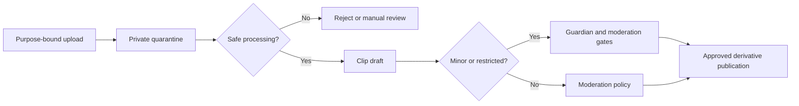
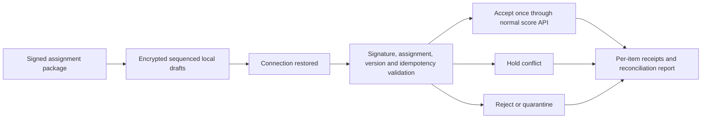

# P0-B02 User Journeys

| Document control | Value |
| --- | --- |
| Project | Qur’an Memorizer DB |
| Baseline | QMDB-BL-001 |
| Batch | QMDB-P0-B02 |
| Document version | 1.0.0 |
| Status | Complete journey baseline |
| Last updated | 2026-08-24 |

## Purpose

These journeys connect multiple use cases into observable end-to-end outcomes. They retain server authority, Workspace and assignment scope, immutable/versioned official evidence, child-aware privacy, accessibility, and recoverable failure behavior at every step.

## QMDB-JRN-001 — Public visitor discovering a live competition

| Field | Journey specification |
| --- | --- |
| Persona | Public Visitor |
| Goal | Find a legitimate live Edition and understand current provisional/final status. |
| Starting condition | An approved Edition or verified static snapshot is public. |
| Steps | Search/filter; open the Edition; inspect schedule/status; follow sequence-aware live updates; open authoritative result details. |
| System responses | Index visibility and freshness are checked; current public projection is labeled and reconnects from its last sequence. |
| Decision points | Edition/category choice; live versus static view; provisional versus final interpretation. |
| Error recovery | On lag/disconnection, show stale timestamp, reconnect/replay, or verified static snapshot; never infer finality. |
| Privacy considerations | Expose only approved public fields and no restricted Minor location/contact. |
| Accessibility considerations | Keyboard filters, announced update status, non-color result state, RTL and low-bandwidth static mode. |
| Completion condition | The visitor reaches a current or explicitly stale public record without gaining authority. |
| Related use cases | QMDB-UC-055, QMDB-UC-062 |
| Related functional requirements | QMDB-FR-SRH-001, QMDB-FR-SRH-003, QMDB-FR-LIV-001, QMDB-FR-LIV-002 |

## QMDB-JRN-002 — New memorizer creating an account and profile

| Field | Journey specification |
| --- | --- |
| Persona | Memorizer |
| Goal | Establish a verified account linked to a distinct Person/Profile. |
| Starting condition | No account is authenticated for the supplied verified contact. |
| Steps | Register; verify contact; authenticate; create/link Person; review profile visibility. |
| System responses | Duplicate-safe account creation, expiring verification, session issuance, and separate account/person linkage occur. |
| Decision points | Duplicate account/person choice; optional profile fields; recovery if verification expires. |
| Error recovery | Use non-enumerating duplicate response, resend bounded challenge, or route potential Person match to controlled review. |
| Privacy considerations | Contact and security data remain restricted; profile defaults are minimal and person/account remain distinct. |
| Accessibility considerations | Accessible forms, password/passkey guidance, focus-to-error, RTL names and preserved values. |
| Completion condition | A verified account and governed Person/Profile link exist without implicit authority. |
| Related use cases | QMDB-UC-001, QMDB-UC-002, QMDB-UC-003, QMDB-UC-012 |
| Related functional requirements | QMDB-FR-IAM-001, QMDB-FR-IAM-002, QMDB-FR-PPL-001, QMDB-FR-PPL-002 |

## QMDB-JRN-003 — Guardian linking to a minor

| Field | Journey specification |
| --- | --- |
| Persona | Guardian |
| Goal | Establish purpose-bound authority for one Minor without broad control. |
| Starting condition | Guardian and Minor Person identities exist or can be safely matched. |
| Steps | Request link; provide allowed evidence; verifier reviews; relationship activates for named purposes; both parties receive safe notice. |
| System responses | Authority evidence is restricted, current relationships are checked, and sensitive actions remain blocked until verified. |
| Decision points | Accept/reject/dispute; define purpose/time scope; handle multiple guardians. |
| Error recovery | Keep relationship pending or frozen on ambiguity/dispute and escalate without revealing protected family data. |
| Privacy considerations | Evidence and child data are Highly Restricted; relationship does not expose unrelated records. |
| Accessibility considerations | Plain-language status, secure alternative evidence path, accessible dispute and safe-exit controls. |
| Completion condition | A verified/pending/rejected relationship is explicit and auditable. |
| Related use cases | QMDB-UC-014 |
| Related functional requirements | QMDB-FR-GUA-001, QMDB-FR-GUA-002, QMDB-FR-GUA-004 |

## QMDB-JRN-004 — Minor applying to a competition with guardian consent

| Field | Journey specification |
| --- | --- |
| Persona | Minor Competitor |
| Goal | Submit an eligible application only with current guardian authority and purpose-specific consent. |
| Starting condition | Registration is open and Minor/Guardian relationship is resolvable. |
| Steps | Choose Edition/category; enter minimum details; attach evidence; request Guardian consent; Guardian decides; submit; receive status. |
| System responses | Server time/category rules, current authority, consent version, duplicate registration, and tenant scope are validated. |
| Decision points | Consent granted/refused; evidence request; deadline/late exception; nomination versus self-application. |
| Error recovery | Preserve draft; reject after deadline using server time; freeze on disputed authority; no partial official registration. |
| Privacy considerations | No public contact/precise location; guardian sees only named dependent scope; evidence private. |
| Accessibility considerations | Accessible multi-step form with saved draft, clear consent dependency and low-bandwidth upload alternative. |
| Completion condition | One Registration is submitted or a recoverable draft/reason remains. |
| Related use cases | QMDB-UC-015, QMDB-UC-024, QMDB-UC-026 |
| Related functional requirements | QMDB-FR-GUA-003, QMDB-FR-REG-001, QMDB-FR-REG-002, QMDB-FR-UXA-002 |

## QMDB-JRN-005 — Organization creating and publishing a competition edition

| Field | Journey specification |
| --- | --- |
| Persona | Competition Director |
| Goal | Create a governed Edition with separate organizer, host, scope, and geography dimensions. |
| Starting condition | Verified Organization, Workspace authority, and Competition Series exist. |
| Steps | Create Edition; select dimensions; configure category/division; attach approved Ruleset; request review; publish; open registration. |
| System responses | Composite workspace integrity, dimension separation, approvals, rules/version and state transitions are enforced. |
| Decision points | Return to draft; reject review; schedule publication; suspend/cancel under governed reason. |
| Error recovery | No publication with ambiguous dimensions/unapproved rules; preserve former approved versions on change. |
| Privacy considerations | Only approved public projections are exposed; internal contacts/evidence remain restricted. |
| Accessibility considerations | Accessible configuration, review summary, non-color states, timezone preview and RTL labels. |
| Completion condition | Edition is PUBLISHED/REGISTRATION_OPEN or remains in a reasoned governed state. |
| Related use cases | QMDB-UC-020, QMDB-UC-021, QMDB-UC-022, QMDB-UC-023 |
| Related functional requirements | QMDB-FR-CMP-001, QMDB-FR-CMP-002, QMDB-FR-CMP-003, QMDB-FR-RUL-003 |

## QMDB-JRN-006 — Registrar screening applications

| Field | Journey specification |
| --- | --- |
| Persona | Competition Registrar |
| Goal | Reach consistent eligibility decisions and immutable Participant Snapshots. |
| Starting condition | Applications exist within the registrar's assigned Edition/category. |
| Steps | Open queue; review evidence/consent; request clarification; decide eligibility; resolve duplicate; create snapshot for accepted participant. |
| System responses | Scope, ruleset criteria, evidence freshness, guardian consent, conflicts and decision reason are server-validated. |
| Decision points | Hold/request evidence; reject; approved late exception; controlled duplicate merge. |
| Error recovery | Do not auto-accept on worker failure or expired evidence; preserve applicant input and prior decisions. |
| Privacy considerations | Evidence and Minor data are restricted; public roster uses approved snapshot projection only. |
| Accessibility considerations | Keyboard queue, announced state, document alternatives, error summary and non-color evidence status. |
| Completion condition | Every application has a reasoned state; accepted entries have stable snapshots. |
| Related use cases | QMDB-UC-026, QMDB-UC-027 |
| Related functional requirements | QMDB-FR-REG-003, QMDB-FR-REG-004, QMDB-FR-REG-005 |

## QMDB-JRN-007 — Competition director scheduling an approved roster

| Field | Journey specification |
| --- | --- |
| Persona | Competition Director |
| Goal | Create a conflict-aware, timezone-explicit schedule and reproducible draw. |
| Starting condition | Roster, venue availability, round/category and judge needs are approved. |
| Steps | Select venue/time; generate draw; review conflicts; publish schedule; notify affected actors; version any change. |
| System responses | Competition-local time and UTC are stored, constraints validated, draw inputs/algorithm recorded, and notice events emitted. |
| Decision points | Manual governed draw; venue change; participant late/absent; reschedule before/after publication. |
| Error recovery | Reject overlapping or out-of-scope assignment; keep prior schedule and show failed notification separately. |
| Privacy considerations | Schedule projection omits restricted contact/location details beyond participant need. |
| Accessibility considerations | Accessible calendar/table alternative, timezone labels, printable low-bandwidth view and change announcements. |
| Completion condition | A versioned schedule/draw is published and attributable. |
| Related use cases | QMDB-UC-028, QMDB-UC-029 |
| Related functional requirements | QMDB-FR-SCH-001, QMDB-FR-SCH-002, QMDB-FR-SCH-004, QMDB-FR-UXA-002 |

## QMDB-JRN-008 — Judge accepting an assignment and declaring conflicts

| Field | Journey specification |
| --- | --- |
| Persona | Judge |
| Goal | Accept only eligible assignments and disclose conflicts before scoring. |
| Starting condition | A named invitation exists for a panel/session/category. |
| Steps | Authenticate with MFA; review assignment/rules; declare conflict or no conflict; reviewer decides; accept/recuse; receive minimum package. |
| System responses | Qualification, workload, membership, conflict status, assignment scope and step-up are checked. |
| Decision points | Request clarification; replace judge; exceptional conflict decision with separate approval. |
| Error recovery | Unresolved conflict removes submission authority; revoked assignment invalidates cached access immediately. |
| Privacy considerations | Judge sees only assigned participant/evidence; declarations are restricted and need-to-know. |
| Accessibility considerations | Accessible declaration, explicit consequences, keyboard acceptance and non-color decision state. |
| Completion condition | Assignment is accepted and conflict-cleared, or safely recused/replaced. |
| Related use cases | QMDB-UC-031, QMDB-UC-032 |
| Related functional requirements | QMDB-FR-JDG-001, QMDB-FR-JDG-002, QMDB-FR-JDG-003 |

## QMDB-JRN-009 — Judge scoring during a live session

| Field | Journey specification |
| --- | --- |
| Persona | Judge |
| Goal | Submit one exact, server-validated Score Sheet Version for an assigned Performance. |
| Starting condition | Judge is assigned, conflict-cleared, strongly authenticated; Performance is open with locked Ruleset Version. |
| Steps | Open assignment; enter criterion values; save draft; review server preview; step-up; submit with idempotency key; receive locked receipt. |
| System responses | Server validates assignment/state/version/bounds/precision, recalculates totals and commits sheet/audit/outbox atomically. |
| Decision points | Continue offline draft; correct validation errors; query receipt after lost acknowledgment. |
| Error recovery | Reject stale/out-of-range/rules mismatch; do not trust client total; retry same key without duplicate. |
| Privacy considerations | Only assigned participant and necessary evidence are exposed; local/offline drafts are encrypted. |
| Accessibility considerations | Keyboard scoring grid, spoken errors/totals, no color-only invalid state, RTL and network status. |
| Completion condition | Exactly one accepted submitted version or a recoverable draft/rejection receipt exists. |
| Related use cases | QMDB-UC-033, QMDB-UC-034, QMDB-UC-035, QMDB-UC-036 |
| Related functional requirements | QMDB-FR-SCR-001, QMDB-FR-SCR-002, QMDB-FR-SCR-003, QMDB-FR-SCR-004 |

## QMDB-JRN-010 — Chief Judge resolving a controlled score reopening

| Field | Journey specification |
| --- | --- |
| Persona | Chief Judge |
| Goal | Reopen a submitted sheet without overwriting its former version. |
| Starting condition | A submitted/locked sheet has a documented eligible issue and result is not beyond allowed correction boundary. |
| Steps | Request reopening; provide reason/evidence; independent authority reviews; step-up; create reopened state/new draft version; original judge resubmits; compare versions. |
| System responses | Separation of duties, current version, timing, result state and scope are checked; all steps append audit. |
| Decision points | Reject request; appoint replacement judge under policy; route post-finalization issue to Result Correction. |
| Error recovery | Keep original locked on failed approval, stale request or unavailable audit; never edit old version. |
| Privacy considerations | Reason/evidence and score versions restricted to assigned review actors. |
| Accessibility considerations | Accessible version comparison and reason form; irreversible boundaries clearly announced. |
| Completion condition | New version supersedes former sheet or request closes with reason; former sheet remains intact. |
| Related use cases | QMDB-UC-037 |
| Related functional requirements | QMDB-FR-SCR-005, QMDB-FR-SCR-006 |

## QMDB-JRN-011 — Public visitor following provisional results

| Field | Journey specification |
| --- | --- |
| Persona | Public Visitor |
| Goal | Understand live ranking without mistaking it for a final record. |
| Starting condition | Provisional publication is authorized and public projection is available. |
| Steps | Open scoreboard; inspect provisional label/sequence/time; filter permitted categories; follow updates; open record provenance. |
| System responses | Projection consumes ordered durable events and always displays source status/freshness. |
| Decision points | Pause updates; reconnect/replay; use static verified snapshot; navigate to final after transition. |
| Error recovery | If gap or source mismatch occurs, mark stale and stop advancement; do not finalize from projection. |
| Privacy considerations | Only public Participant Snapshot fields appear; no private scores/evidence. |
| Accessibility considerations | Screen-reader update summary without focus theft, non-color provisional state, reduced motion and table alternative. |
| Completion condition | Visitor sees an explicitly provisional or stale projection linked to current status. |
| Related use cases | QMDB-UC-039, QMDB-UC-062 |
| Related functional requirements | QMDB-FR-RSL-002, QMDB-FR-LIV-001, QMDB-FR-LIV-002 |

## QMDB-JRN-012 — Competitor reviewing a result and submitting an appeal

| Field | Journey specification |
| --- | --- |
| Persona | Competitor |
| Goal | Review the applicable Result Version and submit one eligible Appeal before the server-authoritative deadline. |
| Starting condition | A provisional/final appealable result is visible to the competitor and window is open. |
| Steps | Authenticate; open own result/evidence summary; inspect deadline/timezone; enter grounds and evidence; step-up if required; submit; receive immutable receipt. |
| System responses | Eligibility, current Result Version, server time, duplicates, scope and evidence limits are checked. |
| Decision points | Save draft; Guardian acts only with valid authority; request accessible alternative evidence format. |
| Error recovery | Reject late/duplicate/out-of-scope appeal without mutating result; preserve submitted form where safe. |
| Privacy considerations | Only own result/authorized evidence is shown; appeal reason restricted to panel. |
| Accessibility considerations | Accessible deadline, form, upload, error summary, receipt and timezone labels. |
| Completion condition | Appeal is submitted exactly once or a reasoned recoverable outcome is shown. |
| Related use cases | QMDB-UC-040 |
| Related functional requirements | QMDB-FR-APL-001, QMDB-FR-UXA-002 |

## QMDB-JRN-013 — Appeal panel reaching a decision

| Field | Journey specification |
| --- | --- |
| Persona | Appeal Reviewer |
| Goal | Reach an independent, evidence-based decision that triggers governed remedies without rewriting sources. |
| Starting condition | Assigned Appeal and preserved challenged records exist; reviewer conflicts are cleared. |
| Steps | Review preserved versions/evidence; record conflict; deliberate under approved rules; decide; record remedy; notify; close. |
| System responses | Assignment, independence, evidence access, decision schema, reason and approval requirements are enforced. |
| Decision points | Request evidence; recuse/replace reviewer; uphold, partially allow, allow, or dismiss under policy. |
| Error recovery | Block decision on conflict/quorum/policy uncertainty; retain original submission and decision. |
| Privacy considerations | Panel access is case-bound; notices redact protected participants/reviewers as policy requires. |
| Accessibility considerations | Accessible evidence index, version comparison, decision form and non-color status. |
| Completion condition | Immutable decision exists and any follow-on correction is a separate governed workflow. |
| Related use cases | QMDB-UC-041 |
| Related functional requirements | QMDB-FR-APL-002, QMDB-FR-APL-003 |

## QMDB-JRN-014 — Certificate officer issuing certificates

| Field | Journey specification |
| --- | --- |
| Persona | Certificate Officer |
| Goal | Issue signed Certificates only for eligible current Final Results. |
| Starting condition | Results are finalized/current; recipient snapshot and approved template/key policy exist. |
| Steps | Open issuance queue; validate eligibility/current version; preview minimized representation; step-up/approve; generate/hash/sign; issue; notify. |
| System responses | Result/certificate uniqueness, template/key status, recipient snapshot, approval and idempotency are validated. |
| Decision points | Batch issuance with per-item result; reissue/supersede after governed correction. |
| Error recovery | Hold on open correction/key incident; no unsigned artifact is marked issued; retry does not duplicate. |
| Privacy considerations | Public verification payload is minimized; document delivery is protected. |
| Accessibility considerations | Accessible preview, batch error summary, keyboard approval and printable tagged document expectation. |
| Completion condition | Issued Certificate and public verification status exist once with signing metadata. |
| Related use cases | QMDB-UC-044 |
| Related functional requirements | QMDB-FR-CER-001, QMDB-FR-CER-002 |

## QMDB-JRN-015 — External visitor verifying a certificate

| Field | Journey specification |
| --- | --- |
| Persona | External Verification Consumer |
| Goal | Determine validity, revocation, supersession, hash, signature and key status without exposing private records. |
| Starting condition | A certificate token/document is available; verification service or continuity snapshot is reachable. |
| Steps | Enter/scan token; optionally upload/hash document locally or safely; rate controls apply; verify record/signature/key/hash/status; display minimized outcome. |
| System responses | Canonical serialization, current lifecycle and historical key status are evaluated against authoritative metadata. |
| Decision points | Show revoked/superseded/historical/temporarily unavailable status; navigate to current certificate if public policy allows. |
| Error recovery | Hash/signature mismatch fails clearly; outage never reports valid by guess; abuse is throttled. |
| Privacy considerations | No contact, private score/evidence or hidden Minor data is returned. |
| Accessibility considerations | Keyboard token entry, text alternative to QR, non-color validity and low-bandwidth continuity response. |
| Completion condition | Visitor gets a trustworthy minimized status or explicit unavailability. |
| Related use cases | QMDB-UC-045 |
| Related functional requirements | QMDB-FR-CER-003, QMDB-FR-CER-004 |

## QMDB-JRN-016 — Organizer importing historical records

| Field | Journey specification |
| --- | --- |
| Persona | Organization Administrator |
| Goal | Import provenance-labeled historical claims without overwriting native records. |
| Starting condition | Approved source, target Workspace, mapping and authority classification are available. |
| Steps | Create batch; upload safe file; parse to staging; map fields; validate/reconcile; review item outcomes; publish allowed projections; export report. |
| System responses | Malware/schema/type checks, tenant scope, duplicates, authority/provenance, native conflict and idempotency are applied. |
| Decision points | Correct staging mapping; classify Legacy Unverified; request attestation; retry failed noncommitted items. |
| Error recovery | Quarantine unsafe input; hold conflicts; never overwrite native official records or infer legitimacy. |
| Privacy considerations | Import evidence is restricted; public projection contains minimum provenance label. |
| Accessibility considerations | Accessible row/error summary, CSV diagnostics, keyboard mapping and resumable batch. |
| Completion condition | Every row is imported once, held or rejected with source/provenance and reconciliation evidence. |
| Related use cases | QMDB-UC-047 |
| Related functional requirements | QMDB-FR-IMP-001, QMDB-FR-REC-001 |

## QMDB-JRN-017 — Reciter uploading a Recitation Clip

| Field | Journey specification |
| --- | --- |
| Persona | Reciter |
| Goal | Create a safe Clip from owned media with valid passage tags and chosen permitted visibility. |
| Starting condition | Eligible profile exists; upload capability/quota and Qur’an release are available. |
| Steps | Request upload; transfer to quarantine; wait for scan/transcode; compose caption/tags/cover; select visibility; submit for approval/publication. |
| System responses | Bytes, ownership, consent, release coordinates, caption/visibility and moderation policy are validated. |
| Decision points | Resume upload; replace rejected media; save draft; choose limited distribution. |
| Error recovery | Malware/malformed input stays quarantined; processing failure preserves retry; private original never public. |
| Privacy considerations | Metadata stripped; content private until approved; Minor policy applies when relevant. |
| Accessibility considerations | Accessible progress, captions, Arabic tag direction, no autoplay and low-bandwidth derivative. |
| Completion condition | Clip is a governed draft/pending/published state with private Evidence Master. |
| Related use cases | QMDB-UC-048, QMDB-UC-050 |
| Related functional requirements | QMDB-FR-MED-001, QMDB-FR-MED-002, QMDB-FR-SOC-001 |

## QMDB-JRN-018 — Guardian approving a minor’s clip

| Field | Journey specification |
| --- | --- |
| Persona | Guardian |
| Goal | Approve or refuse a named Minor Clip only within current relationship and consent scope. |
| Starting condition | A pending Minor Clip and valid/pending Guardian relationship exist. |
| Steps | Open safe preview; review caption/tags/visibility; read purpose notice; grant/refuse; receive publication-history update. |
| System responses | Authority, relationship status, consent purpose/version, media safety and visibility policy are rechecked at decision. |
| Decision points | Request safer visibility/edit; withdraw later; adult-age review path. |
| Error recovery | Disputed/removed authority freezes decision; uncertain safety defaults private; withdrawal removes future optional publication. |
| Privacy considerations | Guardian sees only named dependent content; public contact/location remain absent. |
| Accessibility considerations | Accessible preview without forced autoplay, plain consent, keyboard decision and safe exit. |
| Completion condition | Clip remains private/limited or proceeds to moderation/publication with recorded authority. |
| Related use cases | QMDB-UC-051, QMDB-UC-016 |
| Related functional requirements | QMDB-FR-SOC-002, QMDB-FR-PRI-001, QMDB-FR-MED-004 |

## QMDB-JRN-019 — Community member reporting content

| Field | Journey specification |
| --- | --- |
| Persona | Community member |
| Goal | Report potentially harmful content safely without exposing reporter identity. |
| Starting condition | Reportable visible content exists; reporter can access a protected report entry point. |
| Steps | Open report; choose category; add minimum evidence; submit; receive receipt and safety guidance. |
| System responses | Rate/abuse controls, category/evidence, deduplication and urgent child/security routing execute. |
| Decision points | Anonymous/public report where policy permits; attach to existing case; immediate block/mute. |
| Error recovery | Protect intake under queue overload; throttle flooding; do not reveal reporter to subject. |
| Privacy considerations | Reporter identity and evidence Restricted/Highly Restricted; safety guidance avoids exposing content further. |
| Accessibility considerations | Immediate accessible reporting, confirmation, safe-exit and no mandatory media replay. |
| Completion condition | Report is acknowledged and attached to a prioritized case or safely rejected. |
| Related use cases | QMDB-UC-052 |
| Related functional requirements | QMDB-FR-MOD-001, QMDB-FR-SOC-003 |

## QMDB-JRN-020 — Moderator resolving a safety case

| Field | Journey specification |
| --- | --- |
| Persona | Community-Safety Officer |
| Goal | Apply a proportionate, scoped, appealable safety action and preserve evidence. |
| Starting condition | Prioritized assigned case exists; reviewer conflict is cleared. |
| Steps | Review evidence; assess policy/severity; apply temporary restriction if needed; record decision/reason/duration; notify safely; schedule review/appeal. |
| System responses | Assignment, conflict, action scope/duration, approval for high impact, reporter protection and evidence hold are enforced. |
| Decision points | Escalate child/security case; narrow action; restore after independent appeal. |
| Error recovery | Maintain protective restriction on material uncertainty; do not delete evidence; queue notices on provider failure. |
| Privacy considerations | Case and reporter/Minor data Highly Restricted; subject notice is minimized. |
| Accessibility considerations | Accessible evidence list, decision confirmation, non-color severity and appeal controls. |
| Completion condition | Case closes/escalates with an enforced, reviewable action and complete evidence history. |
| Related use cases | QMDB-UC-053, QMDB-UC-054 |
| Related functional requirements | QMDB-FR-MOD-001, QMDB-FR-MOD-002 |

## QMDB-JRN-021 — Privacy officer resolving a personal-data request

| Field | Journey specification |
| --- | --- |
| Persona | Data-Protection or Privacy Officer |
| Goal | Verify and resolve a privacy request without disclosing third-party or retained official evidence improperly. |
| Starting condition | Verified request case is submitted and assigned. |
| Steps | Verify identity/guardian authority; inventory sources; assess access/correction/export/closure; redact; obtain review; deliver securely; close. |
| System responses | Purpose, identity, scope, holds, retention, third-party rights and Nigerian qualified-review dependencies are recorded. |
| Decision points | Clarify/extend/partially fulfill/refuse with reason; restrict processing pending decision. |
| Error recovery | No disclosure on unverifiable identity; destructive action blocked by hold/official-record rules; preserve case deadline evidence. |
| Privacy considerations | Case Highly Restricted; delivery minimized and protected; no legal conclusion is invented. |
| Accessibility considerations | Accessible case/status and secure alternative delivery; error recovery and language support. |
| Completion condition | Reasoned fulfillment/refusal and disposition manifest are auditable. |
| Related use cases | QMDB-UC-058 |
| Related functional requirements | QMDB-FR-PRI-002, QMDB-FR-PRI-003 |

## QMDB-JRN-022 — Security operator responding to suspicious privileged access

| Field | Journey specification |
| --- | --- |
| Persona | Security Operator |
| Goal | Contain suspicious privilege use while preserving service and investigation evidence. |
| Starting condition | A correlated anomaly or audit failure has created a security incident. |
| Steps | Triage signal; inspect scoped evidence; revoke session/grant/client; contain resource; preserve evidence; recover/rotate; notify; review. |
| System responses | Incident scope, least-impact action, step-up/approval, audit availability and evidence preservation are enforced. |
| Decision points | Use staged containment, maintenance/read-only mode, break-glass only if strictly necessary. |
| Error recovery | If audit integrity is uncertain, freeze high-risk action and use external checkpoint; failed recovery returns to contained state. |
| Privacy considerations | Incident/evidence Highly Restricted; user notice excludes sensitive investigation detail. |
| Accessibility considerations | Accessible incident console and high-impact confirmation; no color-only severity. |
| Completion condition | Threat is contained, privileges revoked/expired, integrity verified and review actions assigned. |
| Related use cases | QMDB-UC-006, QMDB-UC-060 |
| Related functional requirements | QMDB-FR-SEC-001, QMDB-FR-SEC-002, QMDB-FR-AUD-002, QMDB-FR-OPS-002 |

## QMDB-JRN-023 — Venue operator synchronizing offline scoring data

| Field | Journey specification |
| --- | --- |
| Persona | Venue synchronization operator |
| Goal | Reconcile disconnected judge submissions without duplicates or silent overwrites. |
| Starting condition | Registered device holds signed nonexpired-at-action package and sequenced local drafts; connection restores. |
| Steps | Authenticate device/operator; upload signed batch; verify package/assignment/rules/sequence; submit each through normal score API; hold conflicts; receive receipts; produce report. |
| System responses | Signatures, device, expiry-at-action, local sequence, idempotency, current version and bounds are validated server-side. |
| Decision points | Retry unacknowledged items with same keys; route conflict to Chief Judge; enter manual fallback evidence. |
| Error recovery | Tampered/out-of-scope items quarantine; central official data is never overwritten; report all outcomes. |
| Privacy considerations | Offline data encrypted/minimized; device loss triggers revocation and incident path. |
| Accessibility considerations | Per-item screen-reader status, keyboard conflict review, printable report and network announcements. |
| Completion condition | Every item is accepted once, held or rejected with authoritative receipt. |
| Related use cases | QMDB-UC-061 |
| Related functional requirements | QMDB-FR-OFF-001, QMDB-FR-OFF-002 |

## QMDB-JRN-024 — National coordinator viewing aggregated national reports

| Field | Journey specification |
| --- | --- |
| Persona | National Coordinator |
| Goal | View authorized national aggregates without receiving unrestricted edit or person-level access. |
| Starting condition | Named national reporting scope/capability exists and approved read models are available. |
| Steps | Authenticate/step-up; choose report and filters; server resolves scope; apply small-group protection; view freshness-labeled aggregates; request controlled export if separately allowed. |
| System responses | Rows/aggregates, administrative geography, tenant relationships, privacy thresholds, freshness and current authority are enforced. |
| Decision points | Queue large report; narrow timeframe; use static/cached labeled aggregate; request separately approved export. |
| Error recovery | Deny drill-down or pending export after revocation; reporting overload is queued before scoring is affected. |
| Privacy considerations | Aggregates minimize personal data; small groups suppressed; exports classified/expiring. |
| Accessibility considerations | Accessible tables and chart text alternatives, keyboard filters, RTL and low-bandwidth view. |
| Completion condition | Coordinator sees current or explicitly stale authorized aggregates only. |
| Related use cases | QMDB-UC-056, QMDB-UC-057 |
| Related functional requirements | QMDB-FR-RPT-001, QMDB-FR-RPT-002, QMDB-FR-RPT-003 |

## Cross-journey flow views

### Competition truth path

### Media safety path

### Offline reconciliation path

## Related documents

- [Use-case catalog](P0-B02-use-case-catalog.md)
- [Workflows and state machines](P0-B02-workflows-and-state-machines.md)
- [Acceptance scenarios](P0-B02-acceptance-scenarios.md)

