# P0-B02 Workflows and State Machines

| Document control | Value |
| --- | --- |
| Project | Qur’an Memorizer DB |
| Baseline | QMDB-BL-001 |
| Batch | QMDB-P0-B02 |
| Document version | 1.0.0 |
| Status | Complete lifecycle baseline |
| Last updated | 2026-08-24 |

## Interpretation rules

- State changes are commands against the current authoritative version; UI labels, caches, live boards, indexes, and notifications are projections.
- Every transition uses server time, optimistic version checks, tenant/resource scope, idempotency where retryable, and append-only audit evidence.
- “Reversible” means a named compensating or superseding transition is allowed; it never means deleting the former event/version.
- Terminal records remain discoverable to authorized actors under retention policy. Cancellation, suspension, expiry, and timeout preserve evidence and invoke explicit dependent-record handling.
- “Approval required” below means a separate eligible approving-role category where policy calls for it; exact appointments/quorum remain governed by OD-034.

## QMDB-SM-001 — User Account

| Lifecycle property | Definition |
| --- | --- |
| Initial state | `PENDING_VERIFICATION` |
| Terminal states | `CLOSED` |
| Triggering actors | Registered Individual; Security Operator. |
| Reversible transitions | Only transitions with an explicit return, resume, restore, resubmit, reinstate, or successor event; the previous event/version remains preserved. |
| Irreversible transitions | Terminal transition, issuance/finalization, accepted official submission, revocation, archival, rejection, and supersession are not reversed in place; correction uses a new governed record/version. |
| Step-up authentication | Required for privileged approval, activation, lock, reopen, finalization, correction, revocation, suspension, export/elevation, and emergency transitions; ordinary public/read events do not qualify. |
| Multi-person approval | Required for high-risk governance transitions and prohibited from self-approval; exact role/quorum is OD-034. |
| Audit requirements | Actor/service identity, effective role, Workspace/administrative/assignment scope, current and next state, resource/version, event, reason/evidence/approval, server time and correlation. |
| Side effects | Durable domain/outbox event, affected capability recalculation, notification intent, projection invalidation/rebuild, and dependent-record review as applicable. |
| Prohibited transitions | Skipping required intermediate gates, mutating a terminal/former version, stale-version transition, client-authoritative state, cross-workspace transition, self-approval, or transition after authority expiry. |
| Cancellation, suspension, timeout | Preserve the current/former state and evidence; revoke further action; notify affected parties; reconcile dependent assignments, deadlines and projections; require explicit resume/new version. |
| Former official versions | Preserved and linked by version/supersession identifiers wherever the lifecycle can become official or publicly represented. |
| Related functional requirements | QMDB-FR-IAM-001, QMDB-FR-IAM-002, QMDB-FR-IAM-005, QMDB-FR-IAM-006. |

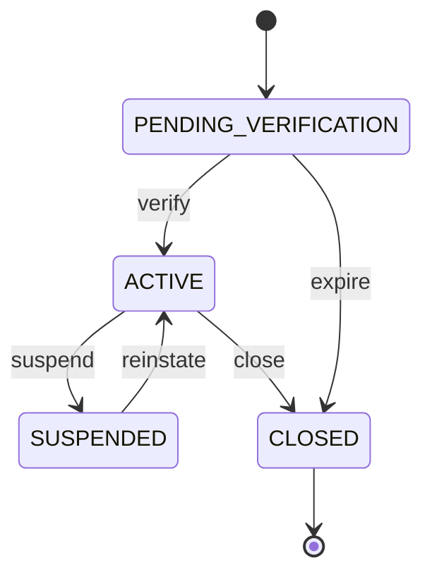
```mermaid
stateDiagram-v2
    [*] --> PENDING_VERIFICATION
    PENDING_VERIFICATION --> ACTIVE: verify
    ACTIVE --> SUSPENDED: suspend
    SUSPENDED --> ACTIVE: reinstate
    ACTIVE --> CLOSED: close
    PENDING_VERIFICATION --> CLOSED: expire
    CLOSED --> [*]
```

| Current State | Event | Required Actor | Preconditions | Authorization Scope | Next State | Records Produced | Audit Required | Notifications | Forbidden When |
| --- | --- | --- | --- | --- | --- | --- | --- | --- | --- |
| `PENDING_VERIFICATION` | verify | Registered Individual; Security Operator | Current version is `PENDING_VERIFICATION`; required evidence/dependencies are valid; no blocking conflict or hold. | Current Workspace plus named administrative, resource, competition, assignment, case, device and time scope as applicable. | `ACTIVE` | Transition event; state/version record; outbox item; approval/reason evidence when sensitive. | Yes; denial is also audited when security-sensitive. | Affected actor/owner/approver and downstream services according to catalog and privacy policy. | Actor is unassigned, conflicted, stale, expired, cross-scope, lacks step-up/approval, or target is in an incompatible/terminal state. |
| `ACTIVE` | suspend | Registered Individual; Security Operator | Current version is `ACTIVE`; required evidence/dependencies are valid; no blocking conflict or hold. | Current Workspace plus named administrative, resource, competition, assignment, case, device and time scope as applicable. | `SUSPENDED` | Transition event; state/version record; outbox item; approval/reason evidence when sensitive. | Yes; denial is also audited when security-sensitive. | Affected actor/owner/approver and downstream services according to catalog and privacy policy. | Actor is unassigned, conflicted, stale, expired, cross-scope, lacks step-up/approval, or target is in an incompatible/terminal state. |
| `SUSPENDED` | reinstate | Registered Individual; Security Operator | Current version is `SUSPENDED`; required evidence/dependencies are valid; no blocking conflict or hold. | Current Workspace plus named administrative, resource, competition, assignment, case, device and time scope as applicable. | `ACTIVE` | Transition event; state/version record; outbox item; approval/reason evidence when sensitive. | Yes; denial is also audited when security-sensitive. | Affected actor/owner/approver and downstream services according to catalog and privacy policy. | Actor is unassigned, conflicted, stale, expired, cross-scope, lacks step-up/approval, or target is in an incompatible/terminal state. |
| `ACTIVE` | close | Registered Individual; Security Operator | Current version is `ACTIVE`; required evidence/dependencies are valid; no blocking conflict or hold. | Current Workspace plus named administrative, resource, competition, assignment, case, device and time scope as applicable. | `CLOSED` | Transition event; state/version record; outbox item; approval/reason evidence when sensitive. | Yes; denial is also audited when security-sensitive. | Affected actor/owner/approver and downstream services according to catalog and privacy policy. | Actor is unassigned, conflicted, stale, expired, cross-scope, lacks step-up/approval, or target is in an incompatible/terminal state. |
| `PENDING_VERIFICATION` | expire | Registered Individual; Security Operator | Current version is `PENDING_VERIFICATION`; required evidence/dependencies are valid; no blocking conflict or hold. | Current Workspace plus named administrative, resource, competition, assignment, case, device and time scope as applicable. | `CLOSED` | Transition event; state/version record; outbox item; approval/reason evidence when sensitive. | Yes; denial is also audited when security-sensitive. | Affected actor/owner/approver and downstream services according to catalog and privacy policy. | Actor is unassigned, conflicted, stale, expired, cross-scope, lacks step-up/approval, or target is in an incompatible/terminal state. |

## QMDB-SM-002 — Workspace

| Lifecycle property | Definition |
| --- | --- |
| Initial state | `DRAFT` |
| Terminal states | `ARCHIVED` |
| Triggering actors | Workspace Owner; Platform Governance. |
| Reversible transitions | Only transitions with an explicit return, resume, restore, resubmit, reinstate, or successor event; the previous event/version remains preserved. |
| Irreversible transitions | Terminal transition, issuance/finalization, accepted official submission, revocation, archival, rejection, and supersession are not reversed in place; correction uses a new governed record/version. |
| Step-up authentication | Required for privileged approval, activation, lock, reopen, finalization, correction, revocation, suspension, export/elevation, and emergency transitions; ordinary public/read events do not qualify. |
| Multi-person approval | Required for high-risk governance transitions and prohibited from self-approval; exact role/quorum is OD-034. |
| Audit requirements | Actor/service identity, effective role, Workspace/administrative/assignment scope, current and next state, resource/version, event, reason/evidence/approval, server time and correlation. |
| Side effects | Durable domain/outbox event, affected capability recalculation, notification intent, projection invalidation/rebuild, and dependent-record review as applicable. |
| Prohibited transitions | Skipping required intermediate gates, mutating a terminal/former version, stale-version transition, client-authoritative state, cross-workspace transition, self-approval, or transition after authority expiry. |
| Cancellation, suspension, timeout | Preserve the current/former state and evidence; revoke further action; notify affected parties; reconcile dependent assignments, deadlines and projections; require explicit resume/new version. |
| Former official versions | Preserved and linked by version/supersession identifiers wherever the lifecycle can become official or publicly represented. |
| Related functional requirements | QMDB-FR-TEN-001, QMDB-FR-TEN-002. |

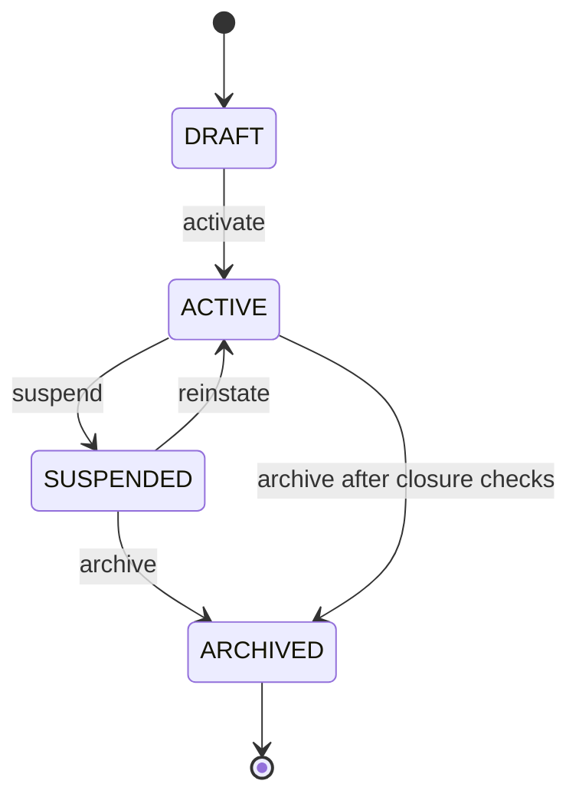
```mermaid
stateDiagram-v2
    [*] --> DRAFT
    DRAFT --> ACTIVE: activate
    ACTIVE --> SUSPENDED: suspend
    SUSPENDED --> ACTIVE: reinstate
    SUSPENDED --> ARCHIVED: archive
    ACTIVE --> ARCHIVED: archive after closure checks
    ARCHIVED --> [*]
```

| Current State | Event | Required Actor | Preconditions | Authorization Scope | Next State | Records Produced | Audit Required | Notifications | Forbidden When |
| --- | --- | --- | --- | --- | --- | --- | --- | --- | --- |
| `DRAFT` | activate | Workspace Owner; Platform Governance | Current version is `DRAFT`; required evidence/dependencies are valid; no blocking conflict or hold. | Current Workspace plus named administrative, resource, competition, assignment, case, device and time scope as applicable. | `ACTIVE` | Transition event; state/version record; outbox item; approval/reason evidence when sensitive. | Yes; denial is also audited when security-sensitive. | Affected actor/owner/approver and downstream services according to catalog and privacy policy. | Actor is unassigned, conflicted, stale, expired, cross-scope, lacks step-up/approval, or target is in an incompatible/terminal state. |
| `ACTIVE` | suspend | Workspace Owner; Platform Governance | Current version is `ACTIVE`; required evidence/dependencies are valid; no blocking conflict or hold. | Current Workspace plus named administrative, resource, competition, assignment, case, device and time scope as applicable. | `SUSPENDED` | Transition event; state/version record; outbox item; approval/reason evidence when sensitive. | Yes; denial is also audited when security-sensitive. | Affected actor/owner/approver and downstream services according to catalog and privacy policy. | Actor is unassigned, conflicted, stale, expired, cross-scope, lacks step-up/approval, or target is in an incompatible/terminal state. |
| `SUSPENDED` | reinstate | Workspace Owner; Platform Governance | Current version is `SUSPENDED`; required evidence/dependencies are valid; no blocking conflict or hold. | Current Workspace plus named administrative, resource, competition, assignment, case, device and time scope as applicable. | `ACTIVE` | Transition event; state/version record; outbox item; approval/reason evidence when sensitive. | Yes; denial is also audited when security-sensitive. | Affected actor/owner/approver and downstream services according to catalog and privacy policy. | Actor is unassigned, conflicted, stale, expired, cross-scope, lacks step-up/approval, or target is in an incompatible/terminal state. |
| `SUSPENDED` | archive | Workspace Owner; Platform Governance | Current version is `SUSPENDED`; required evidence/dependencies are valid; no blocking conflict or hold. | Current Workspace plus named administrative, resource, competition, assignment, case, device and time scope as applicable. | `ARCHIVED` | Transition event; state/version record; outbox item; approval/reason evidence when sensitive. | Yes; denial is also audited when security-sensitive. | Affected actor/owner/approver and downstream services according to catalog and privacy policy. | Actor is unassigned, conflicted, stale, expired, cross-scope, lacks step-up/approval, or target is in an incompatible/terminal state. |
| `ACTIVE` | archive after closure checks | Workspace Owner; Platform Governance | Current version is `ACTIVE`; required evidence/dependencies are valid; no blocking conflict or hold. | Current Workspace plus named administrative, resource, competition, assignment, case, device and time scope as applicable. | `ARCHIVED` | Transition event; state/version record; outbox item; approval/reason evidence when sensitive. | Yes; denial is also audited when security-sensitive. | Affected actor/owner/approver and downstream services according to catalog and privacy policy. | Actor is unassigned, conflicted, stale, expired, cross-scope, lacks step-up/approval, or target is in an incompatible/terminal state. |

## QMDB-SM-003 — Organization Verification

| Lifecycle property | Definition |
| --- | --- |
| Initial state | `NOT_REQUESTED` |
| Terminal states | `REJECTED` |
| Triggering actors | Organization Administrator; Organization-Governance Reviewer. |
| Reversible transitions | Only transitions with an explicit return, resume, restore, resubmit, reinstate, or successor event; the previous event/version remains preserved. |
| Irreversible transitions | Terminal transition, issuance/finalization, accepted official submission, revocation, archival, rejection, and supersession are not reversed in place; correction uses a new governed record/version. |
| Step-up authentication | Required for privileged approval, activation, lock, reopen, finalization, correction, revocation, suspension, export/elevation, and emergency transitions; ordinary public/read events do not qualify. |
| Multi-person approval | Required for high-risk governance transitions and prohibited from self-approval; exact role/quorum is OD-034. |
| Audit requirements | Actor/service identity, effective role, Workspace/administrative/assignment scope, current and next state, resource/version, event, reason/evidence/approval, server time and correlation. |
| Side effects | Durable domain/outbox event, affected capability recalculation, notification intent, projection invalidation/rebuild, and dependent-record review as applicable. |
| Prohibited transitions | Skipping required intermediate gates, mutating a terminal/former version, stale-version transition, client-authoritative state, cross-workspace transition, self-approval, or transition after authority expiry. |
| Cancellation, suspension, timeout | Preserve the current/former state and evidence; revoke further action; notify affected parties; reconcile dependent assignments, deadlines and projections; require explicit resume/new version. |
| Former official versions | Preserved and linked by version/supersession identifiers wherever the lifecycle can become official or publicly represented. |
| Related functional requirements | QMDB-FR-ORG-002, QMDB-FR-ORG-004. |

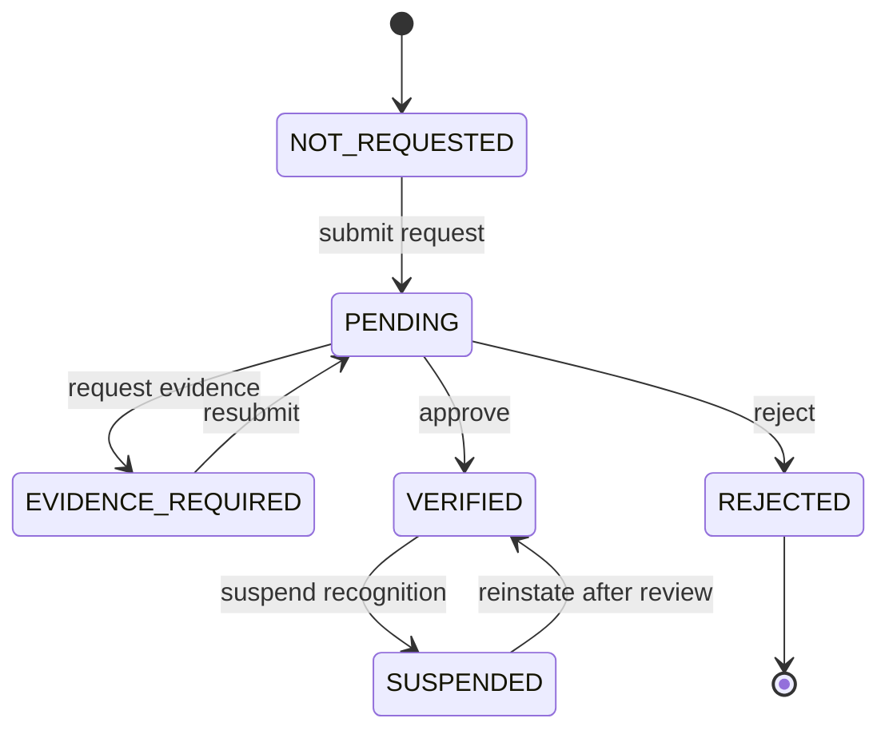
```mermaid
stateDiagram-v2
    [*] --> NOT_REQUESTED
    NOT_REQUESTED --> PENDING: submit request
    PENDING --> EVIDENCE_REQUIRED: request evidence
    EVIDENCE_REQUIRED --> PENDING: resubmit
    PENDING --> VERIFIED: approve
    PENDING --> REJECTED: reject
    VERIFIED --> SUSPENDED: suspend recognition
    SUSPENDED --> VERIFIED: reinstate after review
    REJECTED --> [*]
```

| Current State | Event | Required Actor | Preconditions | Authorization Scope | Next State | Records Produced | Audit Required | Notifications | Forbidden When |
| --- | --- | --- | --- | --- | --- | --- | --- | --- | --- |
| `NOT_REQUESTED` | submit request | Organization Administrator; Organization-Governance Reviewer | Current version is `NOT_REQUESTED`; required evidence/dependencies are valid; no blocking conflict or hold. | Current Workspace plus named administrative, resource, competition, assignment, case, device and time scope as applicable. | `PENDING` | Transition event; state/version record; outbox item; approval/reason evidence when sensitive. | Yes; denial is also audited when security-sensitive. | Affected actor/owner/approver and downstream services according to catalog and privacy policy. | Actor is unassigned, conflicted, stale, expired, cross-scope, lacks step-up/approval, or target is in an incompatible/terminal state. |
| `PENDING` | request evidence | Organization Administrator; Organization-Governance Reviewer | Current version is `PENDING`; required evidence/dependencies are valid; no blocking conflict or hold. | Current Workspace plus named administrative, resource, competition, assignment, case, device and time scope as applicable. | `EVIDENCE_REQUIRED` | Transition event; state/version record; outbox item; approval/reason evidence when sensitive. | Yes; denial is also audited when security-sensitive. | Affected actor/owner/approver and downstream services according to catalog and privacy policy. | Actor is unassigned, conflicted, stale, expired, cross-scope, lacks step-up/approval, or target is in an incompatible/terminal state. |
| `EVIDENCE_REQUIRED` | resubmit | Organization Administrator; Organization-Governance Reviewer | Current version is `EVIDENCE_REQUIRED`; required evidence/dependencies are valid; no blocking conflict or hold. | Current Workspace plus named administrative, resource, competition, assignment, case, device and time scope as applicable. | `PENDING` | Transition event; state/version record; outbox item; approval/reason evidence when sensitive. | Yes; denial is also audited when security-sensitive. | Affected actor/owner/approver and downstream services according to catalog and privacy policy. | Actor is unassigned, conflicted, stale, expired, cross-scope, lacks step-up/approval, or target is in an incompatible/terminal state. |
| `PENDING` | approve | Organization Administrator; Organization-Governance Reviewer | Current version is `PENDING`; required evidence/dependencies are valid; no blocking conflict or hold. | Current Workspace plus named administrative, resource, competition, assignment, case, device and time scope as applicable. | `VERIFIED` | Transition event; state/version record; outbox item; approval/reason evidence when sensitive. | Yes; denial is also audited when security-sensitive. | Affected actor/owner/approver and downstream services according to catalog and privacy policy. | Actor is unassigned, conflicted, stale, expired, cross-scope, lacks step-up/approval, or target is in an incompatible/terminal state. |
| `PENDING` | reject | Organization Administrator; Organization-Governance Reviewer | Current version is `PENDING`; required evidence/dependencies are valid; no blocking conflict or hold. | Current Workspace plus named administrative, resource, competition, assignment, case, device and time scope as applicable. | `REJECTED` | Transition event; state/version record; outbox item; approval/reason evidence when sensitive. | Yes; denial is also audited when security-sensitive. | Affected actor/owner/approver and downstream services according to catalog and privacy policy. | Actor is unassigned, conflicted, stale, expired, cross-scope, lacks step-up/approval, or target is in an incompatible/terminal state. |
| `VERIFIED` | suspend recognition | Organization Administrator; Organization-Governance Reviewer | Current version is `VERIFIED`; required evidence/dependencies are valid; no blocking conflict or hold. | Current Workspace plus named administrative, resource, competition, assignment, case, device and time scope as applicable. | `SUSPENDED` | Transition event; state/version record; outbox item; approval/reason evidence when sensitive. | Yes; denial is also audited when security-sensitive. | Affected actor/owner/approver and downstream services according to catalog and privacy policy. | Actor is unassigned, conflicted, stale, expired, cross-scope, lacks step-up/approval, or target is in an incompatible/terminal state. |
| `SUSPENDED` | reinstate after review | Organization Administrator; Organization-Governance Reviewer | Current version is `SUSPENDED`; required evidence/dependencies are valid; no blocking conflict or hold. | Current Workspace plus named administrative, resource, competition, assignment, case, device and time scope as applicable. | `VERIFIED` | Transition event; state/version record; outbox item; approval/reason evidence when sensitive. | Yes; denial is also audited when security-sensitive. | Affected actor/owner/approver and downstream services according to catalog and privacy policy. | Actor is unassigned, conflicted, stale, expired, cross-scope, lacks step-up/approval, or target is in an incompatible/terminal state. |

## QMDB-SM-004 — Guardian Relationship

| Lifecycle property | Definition |
| --- | --- |
| Initial state | `PENDING` |
| Terminal states | `REVOKED`, `EXPIRED` |
| Triggering actors | Guardian; Guardian Verifier. |
| Reversible transitions | Only transitions with an explicit return, resume, restore, resubmit, reinstate, or successor event; the previous event/version remains preserved. |
| Irreversible transitions | Terminal transition, issuance/finalization, accepted official submission, revocation, archival, rejection, and supersession are not reversed in place; correction uses a new governed record/version. |
| Step-up authentication | Required for privileged approval, activation, lock, reopen, finalization, correction, revocation, suspension, export/elevation, and emergency transitions; ordinary public/read events do not qualify. |
| Multi-person approval | Required for high-risk governance transitions and prohibited from self-approval; exact role/quorum is OD-034. |
| Audit requirements | Actor/service identity, effective role, Workspace/administrative/assignment scope, current and next state, resource/version, event, reason/evidence/approval, server time and correlation. |
| Side effects | Durable domain/outbox event, affected capability recalculation, notification intent, projection invalidation/rebuild, and dependent-record review as applicable. |
| Prohibited transitions | Skipping required intermediate gates, mutating a terminal/former version, stale-version transition, client-authoritative state, cross-workspace transition, self-approval, or transition after authority expiry. |
| Cancellation, suspension, timeout | Preserve the current/former state and evidence; revoke further action; notify affected parties; reconcile dependent assignments, deadlines and projections; require explicit resume/new version. |
| Former official versions | Preserved and linked by version/supersession identifiers wherever the lifecycle can become official or publicly represented. |
| Related functional requirements | QMDB-FR-GUA-001, QMDB-FR-GUA-002, QMDB-FR-GUA-004. |

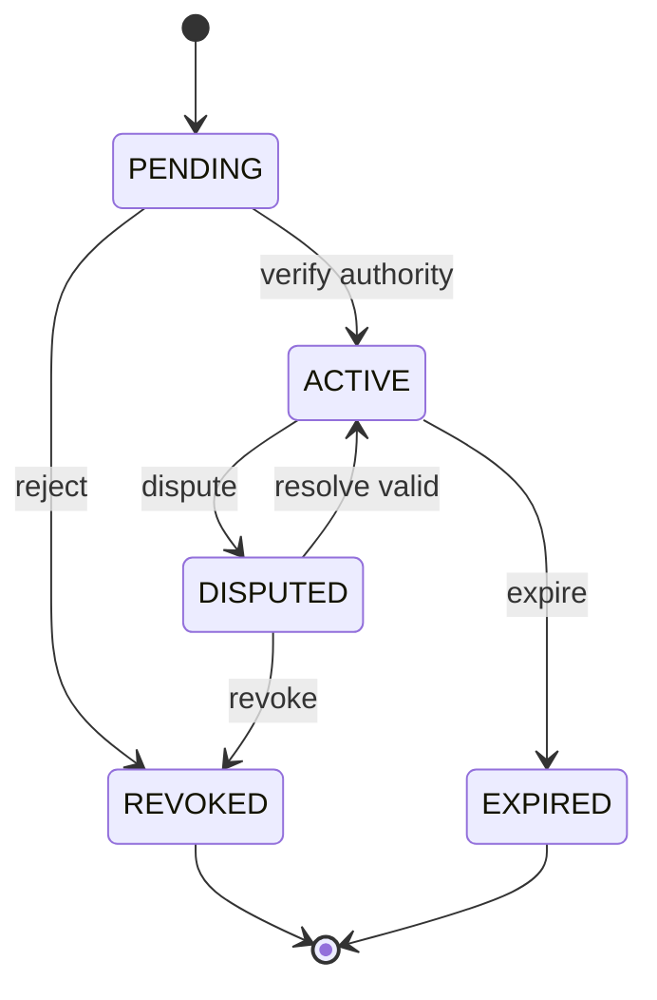
```mermaid
stateDiagram-v2
    [*] --> PENDING
    PENDING --> ACTIVE: verify authority
    PENDING --> REVOKED: reject
    ACTIVE --> DISPUTED: dispute
    DISPUTED --> ACTIVE: resolve valid
    DISPUTED --> REVOKED: revoke
    ACTIVE --> EXPIRED: expire
    REVOKED --> [*]
    EXPIRED --> [*]
```

| Current State | Event | Required Actor | Preconditions | Authorization Scope | Next State | Records Produced | Audit Required | Notifications | Forbidden When |
| --- | --- | --- | --- | --- | --- | --- | --- | --- | --- |
| `PENDING` | verify authority | Guardian; Guardian Verifier | Current version is `PENDING`; required evidence/dependencies are valid; no blocking conflict or hold. | Current Workspace plus named administrative, resource, competition, assignment, case, device and time scope as applicable. | `ACTIVE` | Transition event; state/version record; outbox item; approval/reason evidence when sensitive. | Yes; denial is also audited when security-sensitive. | Affected actor/owner/approver and downstream services according to catalog and privacy policy. | Actor is unassigned, conflicted, stale, expired, cross-scope, lacks step-up/approval, or target is in an incompatible/terminal state. |
| `PENDING` | reject | Guardian; Guardian Verifier | Current version is `PENDING`; required evidence/dependencies are valid; no blocking conflict or hold. | Current Workspace plus named administrative, resource, competition, assignment, case, device and time scope as applicable. | `REVOKED` | Transition event; state/version record; outbox item; approval/reason evidence when sensitive. | Yes; denial is also audited when security-sensitive. | Affected actor/owner/approver and downstream services according to catalog and privacy policy. | Actor is unassigned, conflicted, stale, expired, cross-scope, lacks step-up/approval, or target is in an incompatible/terminal state. |
| `ACTIVE` | dispute | Guardian; Guardian Verifier | Current version is `ACTIVE`; required evidence/dependencies are valid; no blocking conflict or hold. | Current Workspace plus named administrative, resource, competition, assignment, case, device and time scope as applicable. | `DISPUTED` | Transition event; state/version record; outbox item; approval/reason evidence when sensitive. | Yes; denial is also audited when security-sensitive. | Affected actor/owner/approver and downstream services according to catalog and privacy policy. | Actor is unassigned, conflicted, stale, expired, cross-scope, lacks step-up/approval, or target is in an incompatible/terminal state. |
| `DISPUTED` | resolve valid | Guardian; Guardian Verifier | Current version is `DISPUTED`; required evidence/dependencies are valid; no blocking conflict or hold. | Current Workspace plus named administrative, resource, competition, assignment, case, device and time scope as applicable. | `ACTIVE` | Transition event; state/version record; outbox item; approval/reason evidence when sensitive. | Yes; denial is also audited when security-sensitive. | Affected actor/owner/approver and downstream services according to catalog and privacy policy. | Actor is unassigned, conflicted, stale, expired, cross-scope, lacks step-up/approval, or target is in an incompatible/terminal state. |
| `DISPUTED` | revoke | Guardian; Guardian Verifier | Current version is `DISPUTED`; required evidence/dependencies are valid; no blocking conflict or hold. | Current Workspace plus named administrative, resource, competition, assignment, case, device and time scope as applicable. | `REVOKED` | Transition event; state/version record; outbox item; approval/reason evidence when sensitive. | Yes; denial is also audited when security-sensitive. | Affected actor/owner/approver and downstream services according to catalog and privacy policy. | Actor is unassigned, conflicted, stale, expired, cross-scope, lacks step-up/approval, or target is in an incompatible/terminal state. |
| `ACTIVE` | expire | Guardian; Guardian Verifier | Current version is `ACTIVE`; required evidence/dependencies are valid; no blocking conflict or hold. | Current Workspace plus named administrative, resource, competition, assignment, case, device and time scope as applicable. | `EXPIRED` | Transition event; state/version record; outbox item; approval/reason evidence when sensitive. | Yes; denial is also audited when security-sensitive. | Affected actor/owner/approver and downstream services according to catalog and privacy policy. | Actor is unassigned, conflicted, stale, expired, cross-scope, lacks step-up/approval, or target is in an incompatible/terminal state. |

## QMDB-SM-005 — Consent Record

| Lifecycle property | Definition |
| --- | --- |
| Initial state | `NOT_GRANTED` |
| Terminal states | `WITHDRAWN`, `EXPIRED` |
| Triggering actors | Data Subject or Guardian. |
| Reversible transitions | Only transitions with an explicit return, resume, restore, resubmit, reinstate, or successor event; the previous event/version remains preserved. |
| Irreversible transitions | Terminal transition, issuance/finalization, accepted official submission, revocation, archival, rejection, and supersession are not reversed in place; correction uses a new governed record/version. |
| Step-up authentication | Required for privileged approval, activation, lock, reopen, finalization, correction, revocation, suspension, export/elevation, and emergency transitions; ordinary public/read events do not qualify. |
| Multi-person approval | Required for high-risk governance transitions and prohibited from self-approval; exact role/quorum is OD-034. |
| Audit requirements | Actor/service identity, effective role, Workspace/administrative/assignment scope, current and next state, resource/version, event, reason/evidence/approval, server time and correlation. |
| Side effects | Durable domain/outbox event, affected capability recalculation, notification intent, projection invalidation/rebuild, and dependent-record review as applicable. |
| Prohibited transitions | Skipping required intermediate gates, mutating a terminal/former version, stale-version transition, client-authoritative state, cross-workspace transition, self-approval, or transition after authority expiry. |
| Cancellation, suspension, timeout | Preserve the current/former state and evidence; revoke further action; notify affected parties; reconcile dependent assignments, deadlines and projections; require explicit resume/new version. |
| Former official versions | Preserved and linked by version/supersession identifiers wherever the lifecycle can become official or publicly represented. |
| Related functional requirements | QMDB-FR-GUA-003, QMDB-FR-PRI-001. |

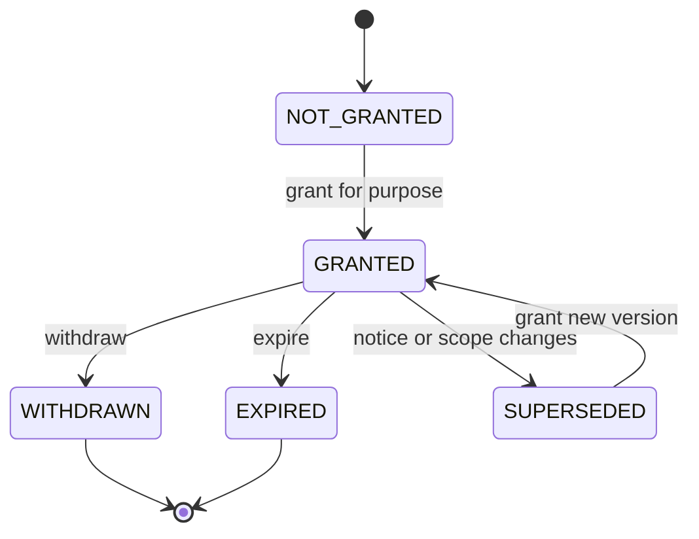
```mermaid
stateDiagram-v2
    [*] --> NOT_GRANTED
    NOT_GRANTED --> GRANTED: grant for purpose
    GRANTED --> WITHDRAWN: withdraw
    GRANTED --> EXPIRED: expire
    GRANTED --> SUPERSEDED: notice or scope changes
    SUPERSEDED --> GRANTED: grant new version
    WITHDRAWN --> [*]
    EXPIRED --> [*]
```

| Current State | Event | Required Actor | Preconditions | Authorization Scope | Next State | Records Produced | Audit Required | Notifications | Forbidden When |
| --- | --- | --- | --- | --- | --- | --- | --- | --- | --- |
| `NOT_GRANTED` | grant for purpose | Data Subject or Guardian | Current version is `NOT_GRANTED`; required evidence/dependencies are valid; no blocking conflict or hold. | Current Workspace plus named administrative, resource, competition, assignment, case, device and time scope as applicable. | `GRANTED` | Transition event; state/version record; outbox item; approval/reason evidence when sensitive. | Yes; denial is also audited when security-sensitive. | Affected actor/owner/approver and downstream services according to catalog and privacy policy. | Actor is unassigned, conflicted, stale, expired, cross-scope, lacks step-up/approval, or target is in an incompatible/terminal state. |
| `GRANTED` | withdraw | Data Subject or Guardian | Current version is `GRANTED`; required evidence/dependencies are valid; no blocking conflict or hold. | Current Workspace plus named administrative, resource, competition, assignment, case, device and time scope as applicable. | `WITHDRAWN` | Transition event; state/version record; outbox item; approval/reason evidence when sensitive. | Yes; denial is also audited when security-sensitive. | Affected actor/owner/approver and downstream services according to catalog and privacy policy. | Actor is unassigned, conflicted, stale, expired, cross-scope, lacks step-up/approval, or target is in an incompatible/terminal state. |
| `GRANTED` | expire | Data Subject or Guardian | Current version is `GRANTED`; required evidence/dependencies are valid; no blocking conflict or hold. | Current Workspace plus named administrative, resource, competition, assignment, case, device and time scope as applicable. | `EXPIRED` | Transition event; state/version record; outbox item; approval/reason evidence when sensitive. | Yes; denial is also audited when security-sensitive. | Affected actor/owner/approver and downstream services according to catalog and privacy policy. | Actor is unassigned, conflicted, stale, expired, cross-scope, lacks step-up/approval, or target is in an incompatible/terminal state. |
| `GRANTED` | notice or scope changes | Data Subject or Guardian | Current version is `GRANTED`; required evidence/dependencies are valid; no blocking conflict or hold. | Current Workspace plus named administrative, resource, competition, assignment, case, device and time scope as applicable. | `SUPERSEDED` | Transition event; state/version record; outbox item; approval/reason evidence when sensitive. | Yes; denial is also audited when security-sensitive. | Affected actor/owner/approver and downstream services according to catalog and privacy policy. | Actor is unassigned, conflicted, stale, expired, cross-scope, lacks step-up/approval, or target is in an incompatible/terminal state. |
| `SUPERSEDED` | grant new version | Data Subject or Guardian | Current version is `SUPERSEDED`; required evidence/dependencies are valid; no blocking conflict or hold. | Current Workspace plus named administrative, resource, competition, assignment, case, device and time scope as applicable. | `GRANTED` | Transition event; state/version record; outbox item; approval/reason evidence when sensitive. | Yes; denial is also audited when security-sensitive. | Affected actor/owner/approver and downstream services according to catalog and privacy policy. | Actor is unassigned, conflicted, stale, expired, cross-scope, lacks step-up/approval, or target is in an incompatible/terminal state. |

## QMDB-SM-006 — Qur’an Text Release

| Lifecycle property | Definition |
| --- | --- |
| Initial state | `DRAFT` |
| Terminal states | `REJECTED` |
| Triggering actors | Qualified Qur’an Reviewer. |
| Reversible transitions | Only transitions with an explicit return, resume, restore, resubmit, reinstate, or successor event; the previous event/version remains preserved. |
| Irreversible transitions | Terminal transition, issuance/finalization, accepted official submission, revocation, archival, rejection, and supersession are not reversed in place; correction uses a new governed record/version. |
| Step-up authentication | Required for privileged approval, activation, lock, reopen, finalization, correction, revocation, suspension, export/elevation, and emergency transitions; ordinary public/read events do not qualify. |
| Multi-person approval | Required for high-risk governance transitions and prohibited from self-approval; exact role/quorum is OD-034. |
| Audit requirements | Actor/service identity, effective role, Workspace/administrative/assignment scope, current and next state, resource/version, event, reason/evidence/approval, server time and correlation. |
| Side effects | Durable domain/outbox event, affected capability recalculation, notification intent, projection invalidation/rebuild, and dependent-record review as applicable. |
| Prohibited transitions | Skipping required intermediate gates, mutating a terminal/former version, stale-version transition, client-authoritative state, cross-workspace transition, self-approval, or transition after authority expiry. |
| Cancellation, suspension, timeout | Preserve the current/former state and evidence; revoke further action; notify affected parties; reconcile dependent assignments, deadlines and projections; require explicit resume/new version. |
| Former official versions | Preserved and linked by version/supersession identifiers wherever the lifecycle can become official or publicly represented. |
| Related functional requirements | QMDB-FR-QRF-001, QMDB-FR-QRF-002, QMDB-FR-QRF-003, QMDB-FR-QRF-004, QMDB-FR-QRF-005. |

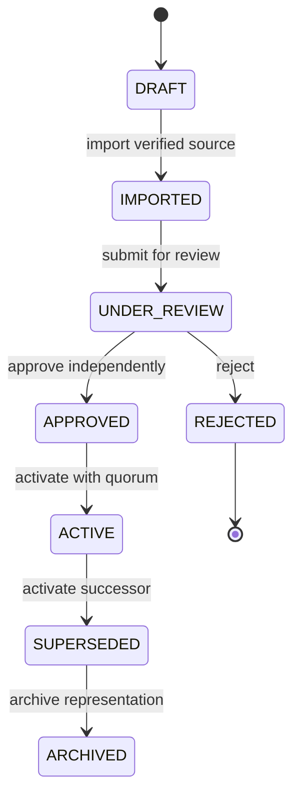
```mermaid
stateDiagram-v2
    [*] --> DRAFT
    DRAFT --> IMPORTED: import verified source
    IMPORTED --> UNDER_REVIEW: submit for review
    UNDER_REVIEW --> APPROVED: approve independently
    UNDER_REVIEW --> REJECTED: reject
    APPROVED --> ACTIVE: activate with quorum
    ACTIVE --> SUPERSEDED: activate successor
    SUPERSEDED --> ARCHIVED: archive representation
    REJECTED --> [*]
```

| Current State | Event | Required Actor | Preconditions | Authorization Scope | Next State | Records Produced | Audit Required | Notifications | Forbidden When |
| --- | --- | --- | --- | --- | --- | --- | --- | --- | --- |
| `DRAFT` | import verified source | Qualified Qur’an Reviewer | Current version is `DRAFT`; required evidence/dependencies are valid; no blocking conflict or hold. | Current Workspace plus named administrative, resource, competition, assignment, case, device and time scope as applicable. | `IMPORTED` | Transition event; state/version record; outbox item; approval/reason evidence when sensitive. | Yes; denial is also audited when security-sensitive. | Affected actor/owner/approver and downstream services according to catalog and privacy policy. | Actor is unassigned, conflicted, stale, expired, cross-scope, lacks step-up/approval, or target is in an incompatible/terminal state. |
| `IMPORTED` | submit for review | Qualified Qur’an Reviewer | Current version is `IMPORTED`; required evidence/dependencies are valid; no blocking conflict or hold. | Current Workspace plus named administrative, resource, competition, assignment, case, device and time scope as applicable. | `UNDER_REVIEW` | Transition event; state/version record; outbox item; approval/reason evidence when sensitive. | Yes; denial is also audited when security-sensitive. | Affected actor/owner/approver and downstream services according to catalog and privacy policy. | Actor is unassigned, conflicted, stale, expired, cross-scope, lacks step-up/approval, or target is in an incompatible/terminal state. |
| `UNDER_REVIEW` | approve independently | Qualified Qur’an Reviewer | Current version is `UNDER_REVIEW`; required evidence/dependencies are valid; no blocking conflict or hold. | Current Workspace plus named administrative, resource, competition, assignment, case, device and time scope as applicable. | `APPROVED` | Transition event; state/version record; outbox item; approval/reason evidence when sensitive. | Yes; denial is also audited when security-sensitive. | Affected actor/owner/approver and downstream services according to catalog and privacy policy. | Actor is unassigned, conflicted, stale, expired, cross-scope, lacks step-up/approval, or target is in an incompatible/terminal state. |
| `UNDER_REVIEW` | reject | Qualified Qur’an Reviewer | Current version is `UNDER_REVIEW`; required evidence/dependencies are valid; no blocking conflict or hold. | Current Workspace plus named administrative, resource, competition, assignment, case, device and time scope as applicable. | `REJECTED` | Transition event; state/version record; outbox item; approval/reason evidence when sensitive. | Yes; denial is also audited when security-sensitive. | Affected actor/owner/approver and downstream services according to catalog and privacy policy. | Actor is unassigned, conflicted, stale, expired, cross-scope, lacks step-up/approval, or target is in an incompatible/terminal state. |
| `APPROVED` | activate with quorum | Qualified Qur’an Reviewer | Current version is `APPROVED`; required evidence/dependencies are valid; no blocking conflict or hold. | Current Workspace plus named administrative, resource, competition, assignment, case, device and time scope as applicable. | `ACTIVE` | Transition event; state/version record; outbox item; approval/reason evidence when sensitive. | Yes; denial is also audited when security-sensitive. | Affected actor/owner/approver and downstream services according to catalog and privacy policy. | Actor is unassigned, conflicted, stale, expired, cross-scope, lacks step-up/approval, or target is in an incompatible/terminal state. |
| `ACTIVE` | activate successor | Qualified Qur’an Reviewer | Current version is `ACTIVE`; required evidence/dependencies are valid; no blocking conflict or hold. | Current Workspace plus named administrative, resource, competition, assignment, case, device and time scope as applicable. | `SUPERSEDED` | Transition event; state/version record; outbox item; approval/reason evidence when sensitive. | Yes; denial is also audited when security-sensitive. | Affected actor/owner/approver and downstream services according to catalog and privacy policy. | Actor is unassigned, conflicted, stale, expired, cross-scope, lacks step-up/approval, or target is in an incompatible/terminal state. |
| `SUPERSEDED` | archive representation | Qualified Qur’an Reviewer | Current version is `SUPERSEDED`; required evidence/dependencies are valid; no blocking conflict or hold. | Current Workspace plus named administrative, resource, competition, assignment, case, device and time scope as applicable. | `ARCHIVED` | Transition event; state/version record; outbox item; approval/reason evidence when sensitive. | Yes; denial is also audited when security-sensitive. | Affected actor/owner/approver and downstream services according to catalog and privacy policy. | Actor is unassigned, conflicted, stale, expired, cross-scope, lacks step-up/approval, or target is in an incompatible/terminal state. |

## QMDB-SM-007 — Competition Edition

| Lifecycle property | Definition |
| --- | --- |
| Initial state | `DRAFT` |
| Terminal states | `ARCHIVED`, `CANCELLED` |
| Triggering actors | Competition Director; Approving Role Category. |
| Reversible transitions | Only transitions with an explicit return, resume, restore, resubmit, reinstate, or successor event; the previous event/version remains preserved. |
| Irreversible transitions | Terminal transition, issuance/finalization, accepted official submission, revocation, archival, rejection, and supersession are not reversed in place; correction uses a new governed record/version. |
| Step-up authentication | Required for privileged approval, activation, lock, reopen, finalization, correction, revocation, suspension, export/elevation, and emergency transitions; ordinary public/read events do not qualify. |
| Multi-person approval | Required for high-risk governance transitions and prohibited from self-approval; exact role/quorum is OD-034. |
| Audit requirements | Actor/service identity, effective role, Workspace/administrative/assignment scope, current and next state, resource/version, event, reason/evidence/approval, server time and correlation. |
| Side effects | Durable domain/outbox event, affected capability recalculation, notification intent, projection invalidation/rebuild, and dependent-record review as applicable. |
| Prohibited transitions | Skipping required intermediate gates, mutating a terminal/former version, stale-version transition, client-authoritative state, cross-workspace transition, self-approval, or transition after authority expiry. |
| Cancellation, suspension, timeout | Preserve the current/former state and evidence; revoke further action; notify affected parties; reconcile dependent assignments, deadlines and projections; require explicit resume/new version. |
| Former official versions | Preserved and linked by version/supersession identifiers wherever the lifecycle can become official or publicly represented. |
| Related functional requirements | QMDB-FR-CMP-001, QMDB-FR-CMP-002, QMDB-FR-CMP-003, QMDB-FR-CMP-004. |

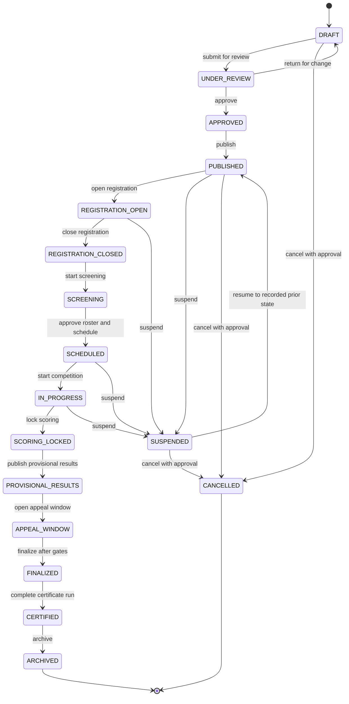
```mermaid
stateDiagram-v2
    [*] --> DRAFT
    DRAFT --> UNDER_REVIEW: submit for review
    UNDER_REVIEW --> APPROVED: approve
    APPROVED --> PUBLISHED: publish
    PUBLISHED --> REGISTRATION_OPEN: open registration
    REGISTRATION_OPEN --> REGISTRATION_CLOSED: close registration
    REGISTRATION_CLOSED --> SCREENING: start screening
    SCREENING --> SCHEDULED: approve roster and schedule
    SCHEDULED --> IN_PROGRESS: start competition
    IN_PROGRESS --> SCORING_LOCKED: lock scoring
    SCORING_LOCKED --> PROVISIONAL_RESULTS: publish provisional results
    PROVISIONAL_RESULTS --> APPEAL_WINDOW: open appeal window
    APPEAL_WINDOW --> FINALIZED: finalize after gates
    FINALIZED --> CERTIFIED: complete certificate run
    CERTIFIED --> ARCHIVED: archive
    UNDER_REVIEW --> DRAFT: return for change
    PUBLISHED --> SUSPENDED: suspend
    REGISTRATION_OPEN --> SUSPENDED: suspend
    SCHEDULED --> SUSPENDED: suspend
    IN_PROGRESS --> SUSPENDED: suspend
    SUSPENDED --> PUBLISHED: resume to recorded prior state
    DRAFT --> CANCELLED: cancel with approval
    PUBLISHED --> CANCELLED: cancel with approval
    SUSPENDED --> CANCELLED: cancel with approval
    ARCHIVED --> [*]
    CANCELLED --> [*]
```

| Current State | Event | Required Actor | Preconditions | Authorization Scope | Next State | Records Produced | Audit Required | Notifications | Forbidden When |
| --- | --- | --- | --- | --- | --- | --- | --- | --- | --- |
| `DRAFT` | submit for review | Competition Director; Approving Role Category | Current version is `DRAFT`; required evidence/dependencies are valid; no blocking conflict or hold. | Current Workspace plus named administrative, resource, competition, assignment, case, device and time scope as applicable. | `UNDER_REVIEW` | Transition event; state/version record; outbox item; approval/reason evidence when sensitive. | Yes; denial is also audited when security-sensitive. | Affected actor/owner/approver and downstream services according to catalog and privacy policy. | Actor is unassigned, conflicted, stale, expired, cross-scope, lacks step-up/approval, or target is in an incompatible/terminal state. |
| `UNDER_REVIEW` | approve | Competition Director; Approving Role Category | Current version is `UNDER_REVIEW`; required evidence/dependencies are valid; no blocking conflict or hold. | Current Workspace plus named administrative, resource, competition, assignment, case, device and time scope as applicable. | `APPROVED` | Transition event; state/version record; outbox item; approval/reason evidence when sensitive. | Yes; denial is also audited when security-sensitive. | Affected actor/owner/approver and downstream services according to catalog and privacy policy. | Actor is unassigned, conflicted, stale, expired, cross-scope, lacks step-up/approval, or target is in an incompatible/terminal state. |
| `APPROVED` | publish | Competition Director; Approving Role Category | Current version is `APPROVED`; required evidence/dependencies are valid; no blocking conflict or hold. | Current Workspace plus named administrative, resource, competition, assignment, case, device and time scope as applicable. | `PUBLISHED` | Transition event; state/version record; outbox item; approval/reason evidence when sensitive. | Yes; denial is also audited when security-sensitive. | Affected actor/owner/approver and downstream services according to catalog and privacy policy. | Actor is unassigned, conflicted, stale, expired, cross-scope, lacks step-up/approval, or target is in an incompatible/terminal state. |
| `PUBLISHED` | open registration | Competition Director; Approving Role Category | Current version is `PUBLISHED`; required evidence/dependencies are valid; no blocking conflict or hold. | Current Workspace plus named administrative, resource, competition, assignment, case, device and time scope as applicable. | `REGISTRATION_OPEN` | Transition event; state/version record; outbox item; approval/reason evidence when sensitive. | Yes; denial is also audited when security-sensitive. | Affected actor/owner/approver and downstream services according to catalog and privacy policy. | Actor is unassigned, conflicted, stale, expired, cross-scope, lacks step-up/approval, or target is in an incompatible/terminal state. |
| `REGISTRATION_OPEN` | close registration | Competition Director; Approving Role Category | Current version is `REGISTRATION_OPEN`; required evidence/dependencies are valid; no blocking conflict or hold. | Current Workspace plus named administrative, resource, competition, assignment, case, device and time scope as applicable. | `REGISTRATION_CLOSED` | Transition event; state/version record; outbox item; approval/reason evidence when sensitive. | Yes; denial is also audited when security-sensitive. | Affected actor/owner/approver and downstream services according to catalog and privacy policy. | Actor is unassigned, conflicted, stale, expired, cross-scope, lacks step-up/approval, or target is in an incompatible/terminal state. |
| `REGISTRATION_CLOSED` | start screening | Competition Director; Approving Role Category | Current version is `REGISTRATION_CLOSED`; required evidence/dependencies are valid; no blocking conflict or hold. | Current Workspace plus named administrative, resource, competition, assignment, case, device and time scope as applicable. | `SCREENING` | Transition event; state/version record; outbox item; approval/reason evidence when sensitive. | Yes; denial is also audited when security-sensitive. | Affected actor/owner/approver and downstream services according to catalog and privacy policy. | Actor is unassigned, conflicted, stale, expired, cross-scope, lacks step-up/approval, or target is in an incompatible/terminal state. |
| `SCREENING` | approve roster and schedule | Competition Director; Approving Role Category | Current version is `SCREENING`; required evidence/dependencies are valid; no blocking conflict or hold. | Current Workspace plus named administrative, resource, competition, assignment, case, device and time scope as applicable. | `SCHEDULED` | Transition event; state/version record; outbox item; approval/reason evidence when sensitive. | Yes; denial is also audited when security-sensitive. | Affected actor/owner/approver and downstream services according to catalog and privacy policy. | Actor is unassigned, conflicted, stale, expired, cross-scope, lacks step-up/approval, or target is in an incompatible/terminal state. |
| `SCHEDULED` | start competition | Competition Director; Approving Role Category | Current version is `SCHEDULED`; required evidence/dependencies are valid; no blocking conflict or hold. | Current Workspace plus named administrative, resource, competition, assignment, case, device and time scope as applicable. | `IN_PROGRESS` | Transition event; state/version record; outbox item; approval/reason evidence when sensitive. | Yes; denial is also audited when security-sensitive. | Affected actor/owner/approver and downstream services according to catalog and privacy policy. | Actor is unassigned, conflicted, stale, expired, cross-scope, lacks step-up/approval, or target is in an incompatible/terminal state. |
| `IN_PROGRESS` | lock scoring | Competition Director; Approving Role Category | Current version is `IN_PROGRESS`; required evidence/dependencies are valid; no blocking conflict or hold. | Current Workspace plus named administrative, resource, competition, assignment, case, device and time scope as applicable. | `SCORING_LOCKED` | Transition event; state/version record; outbox item; approval/reason evidence when sensitive. | Yes; denial is also audited when security-sensitive. | Affected actor/owner/approver and downstream services according to catalog and privacy policy. | Actor is unassigned, conflicted, stale, expired, cross-scope, lacks step-up/approval, or target is in an incompatible/terminal state. |
| `SCORING_LOCKED` | publish provisional results | Competition Director; Approving Role Category | Current version is `SCORING_LOCKED`; required evidence/dependencies are valid; no blocking conflict or hold. | Current Workspace plus named administrative, resource, competition, assignment, case, device and time scope as applicable. | `PROVISIONAL_RESULTS` | Transition event; state/version record; outbox item; approval/reason evidence when sensitive. | Yes; denial is also audited when security-sensitive. | Affected actor/owner/approver and downstream services according to catalog and privacy policy. | Actor is unassigned, conflicted, stale, expired, cross-scope, lacks step-up/approval, or target is in an incompatible/terminal state. |
| `PROVISIONAL_RESULTS` | open appeal window | Competition Director; Approving Role Category | Current version is `PROVISIONAL_RESULTS`; required evidence/dependencies are valid; no blocking conflict or hold. | Current Workspace plus named administrative, resource, competition, assignment, case, device and time scope as applicable. | `APPEAL_WINDOW` | Transition event; state/version record; outbox item; approval/reason evidence when sensitive. | Yes; denial is also audited when security-sensitive. | Affected actor/owner/approver and downstream services according to catalog and privacy policy. | Actor is unassigned, conflicted, stale, expired, cross-scope, lacks step-up/approval, or target is in an incompatible/terminal state. |
| `APPEAL_WINDOW` | finalize after gates | Competition Director; Approving Role Category | Current version is `APPEAL_WINDOW`; required evidence/dependencies are valid; no blocking conflict or hold. | Current Workspace plus named administrative, resource, competition, assignment, case, device and time scope as applicable. | `FINALIZED` | Transition event; state/version record; outbox item; approval/reason evidence when sensitive. | Yes; denial is also audited when security-sensitive. | Affected actor/owner/approver and downstream services according to catalog and privacy policy. | Actor is unassigned, conflicted, stale, expired, cross-scope, lacks step-up/approval, or target is in an incompatible/terminal state. |
| `FINALIZED` | complete certificate run | Competition Director; Approving Role Category | Current version is `FINALIZED`; required evidence/dependencies are valid; no blocking conflict or hold. | Current Workspace plus named administrative, resource, competition, assignment, case, device and time scope as applicable. | `CERTIFIED` | Transition event; state/version record; outbox item; approval/reason evidence when sensitive. | Yes; denial is also audited when security-sensitive. | Affected actor/owner/approver and downstream services according to catalog and privacy policy. | Actor is unassigned, conflicted, stale, expired, cross-scope, lacks step-up/approval, or target is in an incompatible/terminal state. |
| `CERTIFIED` | archive | Competition Director; Approving Role Category | Current version is `CERTIFIED`; required evidence/dependencies are valid; no blocking conflict or hold. | Current Workspace plus named administrative, resource, competition, assignment, case, device and time scope as applicable. | `ARCHIVED` | Transition event; state/version record; outbox item; approval/reason evidence when sensitive. | Yes; denial is also audited when security-sensitive. | Affected actor/owner/approver and downstream services according to catalog and privacy policy. | Actor is unassigned, conflicted, stale, expired, cross-scope, lacks step-up/approval, or target is in an incompatible/terminal state. |
| `UNDER_REVIEW` | return for change | Competition Director; Approving Role Category | Current version is `UNDER_REVIEW`; required evidence/dependencies are valid; no blocking conflict or hold. | Current Workspace plus named administrative, resource, competition, assignment, case, device and time scope as applicable. | `DRAFT` | Transition event; state/version record; outbox item; approval/reason evidence when sensitive. | Yes; denial is also audited when security-sensitive. | Affected actor/owner/approver and downstream services according to catalog and privacy policy. | Actor is unassigned, conflicted, stale, expired, cross-scope, lacks step-up/approval, or target is in an incompatible/terminal state. |
| `PUBLISHED` | suspend | Competition Director; Approving Role Category | Current version is `PUBLISHED`; required evidence/dependencies are valid; no blocking conflict or hold. | Current Workspace plus named administrative, resource, competition, assignment, case, device and time scope as applicable. | `SUSPENDED` | Transition event; state/version record; outbox item; approval/reason evidence when sensitive. | Yes; denial is also audited when security-sensitive. | Affected actor/owner/approver and downstream services according to catalog and privacy policy. | Actor is unassigned, conflicted, stale, expired, cross-scope, lacks step-up/approval, or target is in an incompatible/terminal state. |
| `REGISTRATION_OPEN` | suspend | Competition Director; Approving Role Category | Current version is `REGISTRATION_OPEN`; required evidence/dependencies are valid; no blocking conflict or hold. | Current Workspace plus named administrative, resource, competition, assignment, case, device and time scope as applicable. | `SUSPENDED` | Transition event; state/version record; outbox item; approval/reason evidence when sensitive. | Yes; denial is also audited when security-sensitive. | Affected actor/owner/approver and downstream services according to catalog and privacy policy. | Actor is unassigned, conflicted, stale, expired, cross-scope, lacks step-up/approval, or target is in an incompatible/terminal state. |
| `SCHEDULED` | suspend | Competition Director; Approving Role Category | Current version is `SCHEDULED`; required evidence/dependencies are valid; no blocking conflict or hold. | Current Workspace plus named administrative, resource, competition, assignment, case, device and time scope as applicable. | `SUSPENDED` | Transition event; state/version record; outbox item; approval/reason evidence when sensitive. | Yes; denial is also audited when security-sensitive. | Affected actor/owner/approver and downstream services according to catalog and privacy policy. | Actor is unassigned, conflicted, stale, expired, cross-scope, lacks step-up/approval, or target is in an incompatible/terminal state. |
| `IN_PROGRESS` | suspend | Competition Director; Approving Role Category | Current version is `IN_PROGRESS`; required evidence/dependencies are valid; no blocking conflict or hold. | Current Workspace plus named administrative, resource, competition, assignment, case, device and time scope as applicable. | `SUSPENDED` | Transition event; state/version record; outbox item; approval/reason evidence when sensitive. | Yes; denial is also audited when security-sensitive. | Affected actor/owner/approver and downstream services according to catalog and privacy policy. | Actor is unassigned, conflicted, stale, expired, cross-scope, lacks step-up/approval, or target is in an incompatible/terminal state. |
| `SUSPENDED` | resume to recorded prior state | Competition Director; Approving Role Category | Current version is `SUSPENDED`; required evidence/dependencies are valid; no blocking conflict or hold. | Current Workspace plus named administrative, resource, competition, assignment, case, device and time scope as applicable. | `PUBLISHED` | Transition event; state/version record; outbox item; approval/reason evidence when sensitive. | Yes; denial is also audited when security-sensitive. | Affected actor/owner/approver and downstream services according to catalog and privacy policy. | Actor is unassigned, conflicted, stale, expired, cross-scope, lacks step-up/approval, or target is in an incompatible/terminal state. |
| `DRAFT` | cancel with approval | Competition Director; Approving Role Category | Current version is `DRAFT`; required evidence/dependencies are valid; no blocking conflict or hold. | Current Workspace plus named administrative, resource, competition, assignment, case, device and time scope as applicable. | `CANCELLED` | Transition event; state/version record; outbox item; approval/reason evidence when sensitive. | Yes; denial is also audited when security-sensitive. | Affected actor/owner/approver and downstream services according to catalog and privacy policy. | Actor is unassigned, conflicted, stale, expired, cross-scope, lacks step-up/approval, or target is in an incompatible/terminal state. |
| `PUBLISHED` | cancel with approval | Competition Director; Approving Role Category | Current version is `PUBLISHED`; required evidence/dependencies are valid; no blocking conflict or hold. | Current Workspace plus named administrative, resource, competition, assignment, case, device and time scope as applicable. | `CANCELLED` | Transition event; state/version record; outbox item; approval/reason evidence when sensitive. | Yes; denial is also audited when security-sensitive. | Affected actor/owner/approver and downstream services according to catalog and privacy policy. | Actor is unassigned, conflicted, stale, expired, cross-scope, lacks step-up/approval, or target is in an incompatible/terminal state. |
| `SUSPENDED` | cancel with approval | Competition Director; Approving Role Category | Current version is `SUSPENDED`; required evidence/dependencies are valid; no blocking conflict or hold. | Current Workspace plus named administrative, resource, competition, assignment, case, device and time scope as applicable. | `CANCELLED` | Transition event; state/version record; outbox item; approval/reason evidence when sensitive. | Yes; denial is also audited when security-sensitive. | Affected actor/owner/approver and downstream services according to catalog and privacy policy. | Actor is unassigned, conflicted, stale, expired, cross-scope, lacks step-up/approval, or target is in an incompatible/terminal state. |

## QMDB-SM-008 — Ruleset Version

| Lifecycle property | Definition |
| --- | --- |
| Initial state | `DRAFT` |
| Terminal states | `REJECTED` |
| Triggering actors | Competition-Rules Governance Body. |
| Reversible transitions | Only transitions with an explicit return, resume, restore, resubmit, reinstate, or successor event; the previous event/version remains preserved. |
| Irreversible transitions | Terminal transition, issuance/finalization, accepted official submission, revocation, archival, rejection, and supersession are not reversed in place; correction uses a new governed record/version. |
| Step-up authentication | Required for privileged approval, activation, lock, reopen, finalization, correction, revocation, suspension, export/elevation, and emergency transitions; ordinary public/read events do not qualify. |
| Multi-person approval | Required for high-risk governance transitions and prohibited from self-approval; exact role/quorum is OD-034. |
| Audit requirements | Actor/service identity, effective role, Workspace/administrative/assignment scope, current and next state, resource/version, event, reason/evidence/approval, server time and correlation. |
| Side effects | Durable domain/outbox event, affected capability recalculation, notification intent, projection invalidation/rebuild, and dependent-record review as applicable. |
| Prohibited transitions | Skipping required intermediate gates, mutating a terminal/former version, stale-version transition, client-authoritative state, cross-workspace transition, self-approval, or transition after authority expiry. |
| Cancellation, suspension, timeout | Preserve the current/former state and evidence; revoke further action; notify affected parties; reconcile dependent assignments, deadlines and projections; require explicit resume/new version. |
| Former official versions | Preserved and linked by version/supersession identifiers wherever the lifecycle can become official or publicly represented. |
| Related functional requirements | QMDB-FR-RUL-001, QMDB-FR-RUL-002, QMDB-FR-RUL-003. |

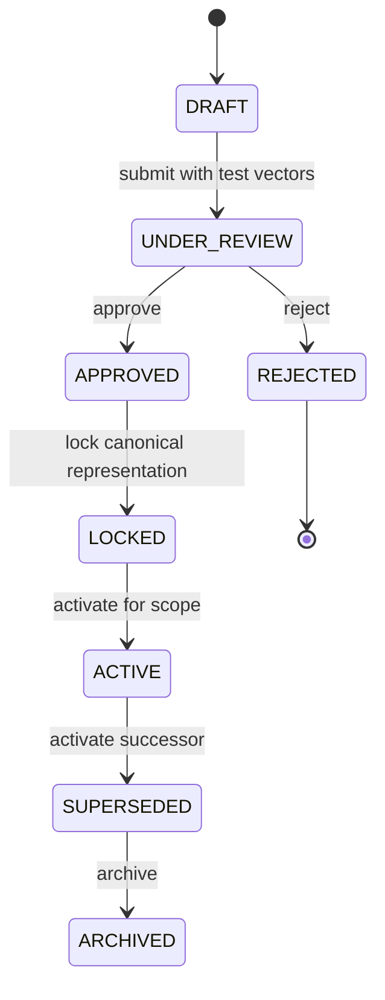
```mermaid
stateDiagram-v2
    [*] --> DRAFT
    DRAFT --> UNDER_REVIEW: submit with test vectors
    UNDER_REVIEW --> APPROVED: approve
    UNDER_REVIEW --> REJECTED: reject
    APPROVED --> LOCKED: lock canonical representation
    LOCKED --> ACTIVE: activate for scope
    ACTIVE --> SUPERSEDED: activate successor
    SUPERSEDED --> ARCHIVED: archive
    REJECTED --> [*]
```

| Current State | Event | Required Actor | Preconditions | Authorization Scope | Next State | Records Produced | Audit Required | Notifications | Forbidden When |
| --- | --- | --- | --- | --- | --- | --- | --- | --- | --- |
| `DRAFT` | submit with test vectors | Competition-Rules Governance Body | Current version is `DRAFT`; required evidence/dependencies are valid; no blocking conflict or hold. | Current Workspace plus named administrative, resource, competition, assignment, case, device and time scope as applicable. | `UNDER_REVIEW` | Transition event; state/version record; outbox item; approval/reason evidence when sensitive. | Yes; denial is also audited when security-sensitive. | Affected actor/owner/approver and downstream services according to catalog and privacy policy. | Actor is unassigned, conflicted, stale, expired, cross-scope, lacks step-up/approval, or target is in an incompatible/terminal state. |
| `UNDER_REVIEW` | approve | Competition-Rules Governance Body | Current version is `UNDER_REVIEW`; required evidence/dependencies are valid; no blocking conflict or hold. | Current Workspace plus named administrative, resource, competition, assignment, case, device and time scope as applicable. | `APPROVED` | Transition event; state/version record; outbox item; approval/reason evidence when sensitive. | Yes; denial is also audited when security-sensitive. | Affected actor/owner/approver and downstream services according to catalog and privacy policy. | Actor is unassigned, conflicted, stale, expired, cross-scope, lacks step-up/approval, or target is in an incompatible/terminal state. |
| `UNDER_REVIEW` | reject | Competition-Rules Governance Body | Current version is `UNDER_REVIEW`; required evidence/dependencies are valid; no blocking conflict or hold. | Current Workspace plus named administrative, resource, competition, assignment, case, device and time scope as applicable. | `REJECTED` | Transition event; state/version record; outbox item; approval/reason evidence when sensitive. | Yes; denial is also audited when security-sensitive. | Affected actor/owner/approver and downstream services according to catalog and privacy policy. | Actor is unassigned, conflicted, stale, expired, cross-scope, lacks step-up/approval, or target is in an incompatible/terminal state. |
| `APPROVED` | lock canonical representation | Competition-Rules Governance Body | Current version is `APPROVED`; required evidence/dependencies are valid; no blocking conflict or hold. | Current Workspace plus named administrative, resource, competition, assignment, case, device and time scope as applicable. | `LOCKED` | Transition event; state/version record; outbox item; approval/reason evidence when sensitive. | Yes; denial is also audited when security-sensitive. | Affected actor/owner/approver and downstream services according to catalog and privacy policy. | Actor is unassigned, conflicted, stale, expired, cross-scope, lacks step-up/approval, or target is in an incompatible/terminal state. |
| `LOCKED` | activate for scope | Competition-Rules Governance Body | Current version is `LOCKED`; required evidence/dependencies are valid; no blocking conflict or hold. | Current Workspace plus named administrative, resource, competition, assignment, case, device and time scope as applicable. | `ACTIVE` | Transition event; state/version record; outbox item; approval/reason evidence when sensitive. | Yes; denial is also audited when security-sensitive. | Affected actor/owner/approver and downstream services according to catalog and privacy policy. | Actor is unassigned, conflicted, stale, expired, cross-scope, lacks step-up/approval, or target is in an incompatible/terminal state. |
| `ACTIVE` | activate successor | Competition-Rules Governance Body | Current version is `ACTIVE`; required evidence/dependencies are valid; no blocking conflict or hold. | Current Workspace plus named administrative, resource, competition, assignment, case, device and time scope as applicable. | `SUPERSEDED` | Transition event; state/version record; outbox item; approval/reason evidence when sensitive. | Yes; denial is also audited when security-sensitive. | Affected actor/owner/approver and downstream services according to catalog and privacy policy. | Actor is unassigned, conflicted, stale, expired, cross-scope, lacks step-up/approval, or target is in an incompatible/terminal state. |
| `SUPERSEDED` | archive | Competition-Rules Governance Body | Current version is `SUPERSEDED`; required evidence/dependencies are valid; no blocking conflict or hold. | Current Workspace plus named administrative, resource, competition, assignment, case, device and time scope as applicable. | `ARCHIVED` | Transition event; state/version record; outbox item; approval/reason evidence when sensitive. | Yes; denial is also audited when security-sensitive. | Affected actor/owner/approver and downstream services according to catalog and privacy policy. | Actor is unassigned, conflicted, stale, expired, cross-scope, lacks step-up/approval, or target is in an incompatible/terminal state. |

## QMDB-SM-009 — Registration

| Lifecycle property | Definition |
| --- | --- |
| Initial state | `DRAFT` |
| Terminal states | `WITHDRAWN`, `INELIGIBLE` |
| Triggering actors | Competitor or Nominee; Competition Registrar. |
| Reversible transitions | Only transitions with an explicit return, resume, restore, resubmit, reinstate, or successor event; the previous event/version remains preserved. |
| Irreversible transitions | Terminal transition, issuance/finalization, accepted official submission, revocation, archival, rejection, and supersession are not reversed in place; correction uses a new governed record/version. |
| Step-up authentication | Required for privileged approval, activation, lock, reopen, finalization, correction, revocation, suspension, export/elevation, and emergency transitions; ordinary public/read events do not qualify. |
| Multi-person approval | Required for high-risk governance transitions and prohibited from self-approval; exact role/quorum is OD-034. |
| Audit requirements | Actor/service identity, effective role, Workspace/administrative/assignment scope, current and next state, resource/version, event, reason/evidence/approval, server time and correlation. |
| Side effects | Durable domain/outbox event, affected capability recalculation, notification intent, projection invalidation/rebuild, and dependent-record review as applicable. |
| Prohibited transitions | Skipping required intermediate gates, mutating a terminal/former version, stale-version transition, client-authoritative state, cross-workspace transition, self-approval, or transition after authority expiry. |
| Cancellation, suspension, timeout | Preserve the current/former state and evidence; revoke further action; notify affected parties; reconcile dependent assignments, deadlines and projections; require explicit resume/new version. |
| Former official versions | Preserved and linked by version/supersession identifiers wherever the lifecycle can become official or publicly represented. |
| Related functional requirements | QMDB-FR-REG-001, QMDB-FR-REG-002. |

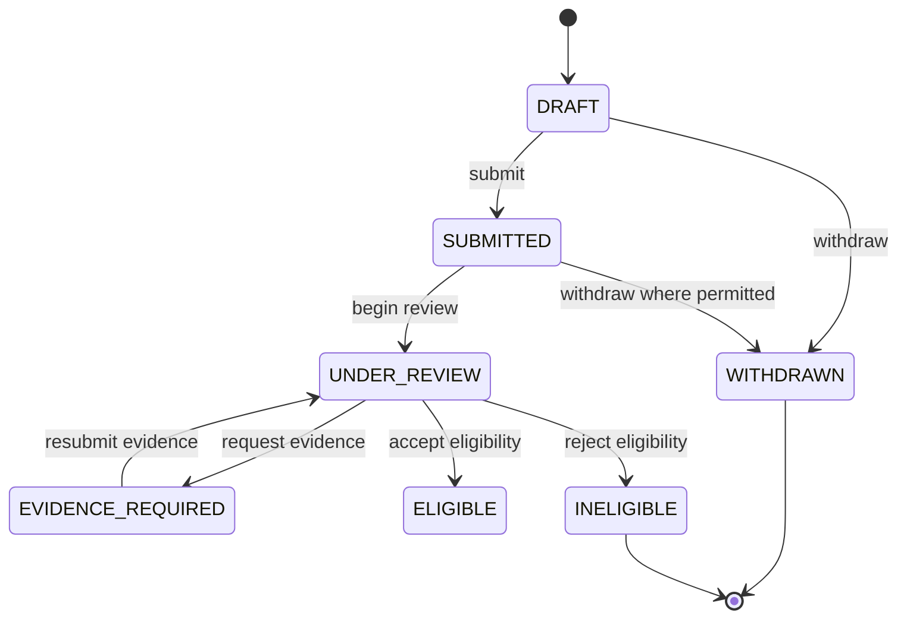
```mermaid
stateDiagram-v2
    [*] --> DRAFT
    DRAFT --> SUBMITTED: submit
    SUBMITTED --> UNDER_REVIEW: begin review
    UNDER_REVIEW --> EVIDENCE_REQUIRED: request evidence
    EVIDENCE_REQUIRED --> UNDER_REVIEW: resubmit evidence
    UNDER_REVIEW --> ELIGIBLE: accept eligibility
    UNDER_REVIEW --> INELIGIBLE: reject eligibility
    DRAFT --> WITHDRAWN: withdraw
    SUBMITTED --> WITHDRAWN: withdraw where permitted
    WITHDRAWN --> [*]
    INELIGIBLE --> [*]
```

| Current State | Event | Required Actor | Preconditions | Authorization Scope | Next State | Records Produced | Audit Required | Notifications | Forbidden When |
| --- | --- | --- | --- | --- | --- | --- | --- | --- | --- |
| `DRAFT` | submit | Competitor or Nominee; Competition Registrar | Current version is `DRAFT`; required evidence/dependencies are valid; no blocking conflict or hold. | Current Workspace plus named administrative, resource, competition, assignment, case, device and time scope as applicable. | `SUBMITTED` | Transition event; state/version record; outbox item; approval/reason evidence when sensitive. | Yes; denial is also audited when security-sensitive. | Affected actor/owner/approver and downstream services according to catalog and privacy policy. | Actor is unassigned, conflicted, stale, expired, cross-scope, lacks step-up/approval, or target is in an incompatible/terminal state. |
| `SUBMITTED` | begin review | Competitor or Nominee; Competition Registrar | Current version is `SUBMITTED`; required evidence/dependencies are valid; no blocking conflict or hold. | Current Workspace plus named administrative, resource, competition, assignment, case, device and time scope as applicable. | `UNDER_REVIEW` | Transition event; state/version record; outbox item; approval/reason evidence when sensitive. | Yes; denial is also audited when security-sensitive. | Affected actor/owner/approver and downstream services according to catalog and privacy policy. | Actor is unassigned, conflicted, stale, expired, cross-scope, lacks step-up/approval, or target is in an incompatible/terminal state. |
| `UNDER_REVIEW` | request evidence | Competitor or Nominee; Competition Registrar | Current version is `UNDER_REVIEW`; required evidence/dependencies are valid; no blocking conflict or hold. | Current Workspace plus named administrative, resource, competition, assignment, case, device and time scope as applicable. | `EVIDENCE_REQUIRED` | Transition event; state/version record; outbox item; approval/reason evidence when sensitive. | Yes; denial is also audited when security-sensitive. | Affected actor/owner/approver and downstream services according to catalog and privacy policy. | Actor is unassigned, conflicted, stale, expired, cross-scope, lacks step-up/approval, or target is in an incompatible/terminal state. |
| `EVIDENCE_REQUIRED` | resubmit evidence | Competitor or Nominee; Competition Registrar | Current version is `EVIDENCE_REQUIRED`; required evidence/dependencies are valid; no blocking conflict or hold. | Current Workspace plus named administrative, resource, competition, assignment, case, device and time scope as applicable. | `UNDER_REVIEW` | Transition event; state/version record; outbox item; approval/reason evidence when sensitive. | Yes; denial is also audited when security-sensitive. | Affected actor/owner/approver and downstream services according to catalog and privacy policy. | Actor is unassigned, conflicted, stale, expired, cross-scope, lacks step-up/approval, or target is in an incompatible/terminal state. |
| `UNDER_REVIEW` | accept eligibility | Competitor or Nominee; Competition Registrar | Current version is `UNDER_REVIEW`; required evidence/dependencies are valid; no blocking conflict or hold. | Current Workspace plus named administrative, resource, competition, assignment, case, device and time scope as applicable. | `ELIGIBLE` | Transition event; state/version record; outbox item; approval/reason evidence when sensitive. | Yes; denial is also audited when security-sensitive. | Affected actor/owner/approver and downstream services according to catalog and privacy policy. | Actor is unassigned, conflicted, stale, expired, cross-scope, lacks step-up/approval, or target is in an incompatible/terminal state. |
| `UNDER_REVIEW` | reject eligibility | Competitor or Nominee; Competition Registrar | Current version is `UNDER_REVIEW`; required evidence/dependencies are valid; no blocking conflict or hold. | Current Workspace plus named administrative, resource, competition, assignment, case, device and time scope as applicable. | `INELIGIBLE` | Transition event; state/version record; outbox item; approval/reason evidence when sensitive. | Yes; denial is also audited when security-sensitive. | Affected actor/owner/approver and downstream services according to catalog and privacy policy. | Actor is unassigned, conflicted, stale, expired, cross-scope, lacks step-up/approval, or target is in an incompatible/terminal state. |
| `DRAFT` | withdraw | Competitor or Nominee; Competition Registrar | Current version is `DRAFT`; required evidence/dependencies are valid; no blocking conflict or hold. | Current Workspace plus named administrative, resource, competition, assignment, case, device and time scope as applicable. | `WITHDRAWN` | Transition event; state/version record; outbox item; approval/reason evidence when sensitive. | Yes; denial is also audited when security-sensitive. | Affected actor/owner/approver and downstream services according to catalog and privacy policy. | Actor is unassigned, conflicted, stale, expired, cross-scope, lacks step-up/approval, or target is in an incompatible/terminal state. |
| `SUBMITTED` | withdraw where permitted | Competitor or Nominee; Competition Registrar | Current version is `SUBMITTED`; required evidence/dependencies are valid; no blocking conflict or hold. | Current Workspace plus named administrative, resource, competition, assignment, case, device and time scope as applicable. | `WITHDRAWN` | Transition event; state/version record; outbox item; approval/reason evidence when sensitive. | Yes; denial is also audited when security-sensitive. | Affected actor/owner/approver and downstream services according to catalog and privacy policy. | Actor is unassigned, conflicted, stale, expired, cross-scope, lacks step-up/approval, or target is in an incompatible/terminal state. |

## QMDB-SM-010 — Eligibility Review

| Lifecycle property | Definition |
| --- | --- |
| Initial state | `PENDING` |
| Terminal states | `APPROVED`, `REJECTED`, `EXPIRED` |
| Triggering actors | Competition Registrar. |
| Reversible transitions | Only transitions with an explicit return, resume, restore, resubmit, reinstate, or successor event; the previous event/version remains preserved. |
| Irreversible transitions | Terminal transition, issuance/finalization, accepted official submission, revocation, archival, rejection, and supersession are not reversed in place; correction uses a new governed record/version. |
| Step-up authentication | Required for privileged approval, activation, lock, reopen, finalization, correction, revocation, suspension, export/elevation, and emergency transitions; ordinary public/read events do not qualify. |
| Multi-person approval | Required for high-risk governance transitions and prohibited from self-approval; exact role/quorum is OD-034. |
| Audit requirements | Actor/service identity, effective role, Workspace/administrative/assignment scope, current and next state, resource/version, event, reason/evidence/approval, server time and correlation. |
| Side effects | Durable domain/outbox event, affected capability recalculation, notification intent, projection invalidation/rebuild, and dependent-record review as applicable. |
| Prohibited transitions | Skipping required intermediate gates, mutating a terminal/former version, stale-version transition, client-authoritative state, cross-workspace transition, self-approval, or transition after authority expiry. |
| Cancellation, suspension, timeout | Preserve the current/former state and evidence; revoke further action; notify affected parties; reconcile dependent assignments, deadlines and projections; require explicit resume/new version. |
| Former official versions | Preserved and linked by version/supersession identifiers wherever the lifecycle can become official or publicly represented. |
| Related functional requirements | QMDB-FR-REG-003, QMDB-FR-REG-004. |

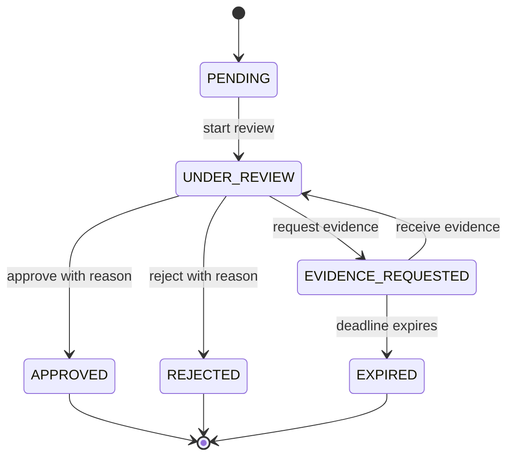
```mermaid
stateDiagram-v2
    [*] --> PENDING
    PENDING --> UNDER_REVIEW: start review
    UNDER_REVIEW --> EVIDENCE_REQUESTED: request evidence
    EVIDENCE_REQUESTED --> UNDER_REVIEW: receive evidence
    UNDER_REVIEW --> APPROVED: approve with reason
    UNDER_REVIEW --> REJECTED: reject with reason
    EVIDENCE_REQUESTED --> EXPIRED: deadline expires
    APPROVED --> [*]
    REJECTED --> [*]
    EXPIRED --> [*]
```

| Current State | Event | Required Actor | Preconditions | Authorization Scope | Next State | Records Produced | Audit Required | Notifications | Forbidden When |
| --- | --- | --- | --- | --- | --- | --- | --- | --- | --- |
| `PENDING` | start review | Competition Registrar | Current version is `PENDING`; required evidence/dependencies are valid; no blocking conflict or hold. | Current Workspace plus named administrative, resource, competition, assignment, case, device and time scope as applicable. | `UNDER_REVIEW` | Transition event; state/version record; outbox item; approval/reason evidence when sensitive. | Yes; denial is also audited when security-sensitive. | Affected actor/owner/approver and downstream services according to catalog and privacy policy. | Actor is unassigned, conflicted, stale, expired, cross-scope, lacks step-up/approval, or target is in an incompatible/terminal state. |
| `UNDER_REVIEW` | request evidence | Competition Registrar | Current version is `UNDER_REVIEW`; required evidence/dependencies are valid; no blocking conflict or hold. | Current Workspace plus named administrative, resource, competition, assignment, case, device and time scope as applicable. | `EVIDENCE_REQUESTED` | Transition event; state/version record; outbox item; approval/reason evidence when sensitive. | Yes; denial is also audited when security-sensitive. | Affected actor/owner/approver and downstream services according to catalog and privacy policy. | Actor is unassigned, conflicted, stale, expired, cross-scope, lacks step-up/approval, or target is in an incompatible/terminal state. |
| `EVIDENCE_REQUESTED` | receive evidence | Competition Registrar | Current version is `EVIDENCE_REQUESTED`; required evidence/dependencies are valid; no blocking conflict or hold. | Current Workspace plus named administrative, resource, competition, assignment, case, device and time scope as applicable. | `UNDER_REVIEW` | Transition event; state/version record; outbox item; approval/reason evidence when sensitive. | Yes; denial is also audited when security-sensitive. | Affected actor/owner/approver and downstream services according to catalog and privacy policy. | Actor is unassigned, conflicted, stale, expired, cross-scope, lacks step-up/approval, or target is in an incompatible/terminal state. |
| `UNDER_REVIEW` | approve with reason | Competition Registrar | Current version is `UNDER_REVIEW`; required evidence/dependencies are valid; no blocking conflict or hold. | Current Workspace plus named administrative, resource, competition, assignment, case, device and time scope as applicable. | `APPROVED` | Transition event; state/version record; outbox item; approval/reason evidence when sensitive. | Yes; denial is also audited when security-sensitive. | Affected actor/owner/approver and downstream services according to catalog and privacy policy. | Actor is unassigned, conflicted, stale, expired, cross-scope, lacks step-up/approval, or target is in an incompatible/terminal state. |
| `UNDER_REVIEW` | reject with reason | Competition Registrar | Current version is `UNDER_REVIEW`; required evidence/dependencies are valid; no blocking conflict or hold. | Current Workspace plus named administrative, resource, competition, assignment, case, device and time scope as applicable. | `REJECTED` | Transition event; state/version record; outbox item; approval/reason evidence when sensitive. | Yes; denial is also audited when security-sensitive. | Affected actor/owner/approver and downstream services according to catalog and privacy policy. | Actor is unassigned, conflicted, stale, expired, cross-scope, lacks step-up/approval, or target is in an incompatible/terminal state. |
| `EVIDENCE_REQUESTED` | deadline expires | Competition Registrar | Current version is `EVIDENCE_REQUESTED`; required evidence/dependencies are valid; no blocking conflict or hold. | Current Workspace plus named administrative, resource, competition, assignment, case, device and time scope as applicable. | `EXPIRED` | Transition event; state/version record; outbox item; approval/reason evidence when sensitive. | Yes; denial is also audited when security-sensitive. | Affected actor/owner/approver and downstream services according to catalog and privacy policy. | Actor is unassigned, conflicted, stale, expired, cross-scope, lacks step-up/approval, or target is in an incompatible/terminal state. |

## QMDB-SM-011 — Participant Check-In

| Lifecycle property | Definition |
| --- | --- |
| Initial state | `EXPECTED` |
| Terminal states | `CHECKED_IN`, `ABSENT`, `WITHDRAWN` |
| Triggering actors | Competition Registrar; Venue Operator. |
| Reversible transitions | Only transitions with an explicit return, resume, restore, resubmit, reinstate, or successor event; the previous event/version remains preserved. |
| Irreversible transitions | Terminal transition, issuance/finalization, accepted official submission, revocation, archival, rejection, and supersession are not reversed in place; correction uses a new governed record/version. |
| Step-up authentication | Required for privileged approval, activation, lock, reopen, finalization, correction, revocation, suspension, export/elevation, and emergency transitions; ordinary public/read events do not qualify. |
| Multi-person approval | Required for high-risk governance transitions and prohibited from self-approval; exact role/quorum is OD-034. |
| Audit requirements | Actor/service identity, effective role, Workspace/administrative/assignment scope, current and next state, resource/version, event, reason/evidence/approval, server time and correlation. |
| Side effects | Durable domain/outbox event, affected capability recalculation, notification intent, projection invalidation/rebuild, and dependent-record review as applicable. |
| Prohibited transitions | Skipping required intermediate gates, mutating a terminal/former version, stale-version transition, client-authoritative state, cross-workspace transition, self-approval, or transition after authority expiry. |
| Cancellation, suspension, timeout | Preserve the current/former state and evidence; revoke further action; notify affected parties; reconcile dependent assignments, deadlines and projections; require explicit resume/new version. |
| Former official versions | Preserved and linked by version/supersession identifiers wherever the lifecycle can become official or publicly represented. |
| Related functional requirements | QMDB-FR-SCH-003. |

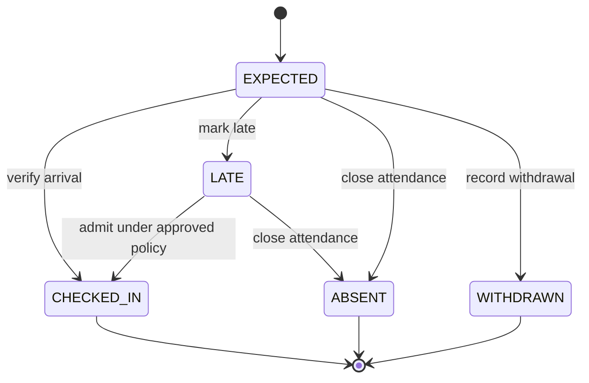
```mermaid
stateDiagram-v2
    [*] --> EXPECTED
    EXPECTED --> CHECKED_IN: verify arrival
    EXPECTED --> LATE: mark late
    LATE --> CHECKED_IN: admit under approved policy
    EXPECTED --> ABSENT: close attendance
    LATE --> ABSENT: close attendance
    EXPECTED --> WITHDRAWN: record withdrawal
    CHECKED_IN --> [*]
    ABSENT --> [*]
    WITHDRAWN --> [*]
```

| Current State | Event | Required Actor | Preconditions | Authorization Scope | Next State | Records Produced | Audit Required | Notifications | Forbidden When |
| --- | --- | --- | --- | --- | --- | --- | --- | --- | --- |
| `EXPECTED` | verify arrival | Competition Registrar; Venue Operator | Current version is `EXPECTED`; required evidence/dependencies are valid; no blocking conflict or hold. | Current Workspace plus named administrative, resource, competition, assignment, case, device and time scope as applicable. | `CHECKED_IN` | Transition event; state/version record; outbox item; approval/reason evidence when sensitive. | Yes; denial is also audited when security-sensitive. | Affected actor/owner/approver and downstream services according to catalog and privacy policy. | Actor is unassigned, conflicted, stale, expired, cross-scope, lacks step-up/approval, or target is in an incompatible/terminal state. |
| `EXPECTED` | mark late | Competition Registrar; Venue Operator | Current version is `EXPECTED`; required evidence/dependencies are valid; no blocking conflict or hold. | Current Workspace plus named administrative, resource, competition, assignment, case, device and time scope as applicable. | `LATE` | Transition event; state/version record; outbox item; approval/reason evidence when sensitive. | Yes; denial is also audited when security-sensitive. | Affected actor/owner/approver and downstream services according to catalog and privacy policy. | Actor is unassigned, conflicted, stale, expired, cross-scope, lacks step-up/approval, or target is in an incompatible/terminal state. |
| `LATE` | admit under approved policy | Competition Registrar; Venue Operator | Current version is `LATE`; required evidence/dependencies are valid; no blocking conflict or hold. | Current Workspace plus named administrative, resource, competition, assignment, case, device and time scope as applicable. | `CHECKED_IN` | Transition event; state/version record; outbox item; approval/reason evidence when sensitive. | Yes; denial is also audited when security-sensitive. | Affected actor/owner/approver and downstream services according to catalog and privacy policy. | Actor is unassigned, conflicted, stale, expired, cross-scope, lacks step-up/approval, or target is in an incompatible/terminal state. |
| `EXPECTED` | close attendance | Competition Registrar; Venue Operator | Current version is `EXPECTED`; required evidence/dependencies are valid; no blocking conflict or hold. | Current Workspace plus named administrative, resource, competition, assignment, case, device and time scope as applicable. | `ABSENT` | Transition event; state/version record; outbox item; approval/reason evidence when sensitive. | Yes; denial is also audited when security-sensitive. | Affected actor/owner/approver and downstream services according to catalog and privacy policy. | Actor is unassigned, conflicted, stale, expired, cross-scope, lacks step-up/approval, or target is in an incompatible/terminal state. |
| `LATE` | close attendance | Competition Registrar; Venue Operator | Current version is `LATE`; required evidence/dependencies are valid; no blocking conflict or hold. | Current Workspace plus named administrative, resource, competition, assignment, case, device and time scope as applicable. | `ABSENT` | Transition event; state/version record; outbox item; approval/reason evidence when sensitive. | Yes; denial is also audited when security-sensitive. | Affected actor/owner/approver and downstream services according to catalog and privacy policy. | Actor is unassigned, conflicted, stale, expired, cross-scope, lacks step-up/approval, or target is in an incompatible/terminal state. |
| `EXPECTED` | record withdrawal | Competition Registrar; Venue Operator | Current version is `EXPECTED`; required evidence/dependencies are valid; no blocking conflict or hold. | Current Workspace plus named administrative, resource, competition, assignment, case, device and time scope as applicable. | `WITHDRAWN` | Transition event; state/version record; outbox item; approval/reason evidence when sensitive. | Yes; denial is also audited when security-sensitive. | Affected actor/owner/approver and downstream services according to catalog and privacy policy. | Actor is unassigned, conflicted, stale, expired, cross-scope, lacks step-up/approval, or target is in an incompatible/terminal state. |

## QMDB-SM-012 — Judge Assignment

| Lifecycle property | Definition |
| --- | --- |
| Initial state | `INVITED` |
| Terminal states | `RECUSED`, `REVOKED`, `COMPLETED` |
| Triggering actors | Judge; Competition Director; Chief Judge. |
| Reversible transitions | Only transitions with an explicit return, resume, restore, resubmit, reinstate, or successor event; the previous event/version remains preserved. |
| Irreversible transitions | Terminal transition, issuance/finalization, accepted official submission, revocation, archival, rejection, and supersession are not reversed in place; correction uses a new governed record/version. |
| Step-up authentication | Required for privileged approval, activation, lock, reopen, finalization, correction, revocation, suspension, export/elevation, and emergency transitions; ordinary public/read events do not qualify. |
| Multi-person approval | Required for high-risk governance transitions and prohibited from self-approval; exact role/quorum is OD-034. |
| Audit requirements | Actor/service identity, effective role, Workspace/administrative/assignment scope, current and next state, resource/version, event, reason/evidence/approval, server time and correlation. |
| Side effects | Durable domain/outbox event, affected capability recalculation, notification intent, projection invalidation/rebuild, and dependent-record review as applicable. |
| Prohibited transitions | Skipping required intermediate gates, mutating a terminal/former version, stale-version transition, client-authoritative state, cross-workspace transition, self-approval, or transition after authority expiry. |
| Cancellation, suspension, timeout | Preserve the current/former state and evidence; revoke further action; notify affected parties; reconcile dependent assignments, deadlines and projections; require explicit resume/new version. |
| Former official versions | Preserved and linked by version/supersession identifiers wherever the lifecycle can become official or publicly represented. |
| Related functional requirements | QMDB-FR-JDG-001, QMDB-FR-JDG-003. |

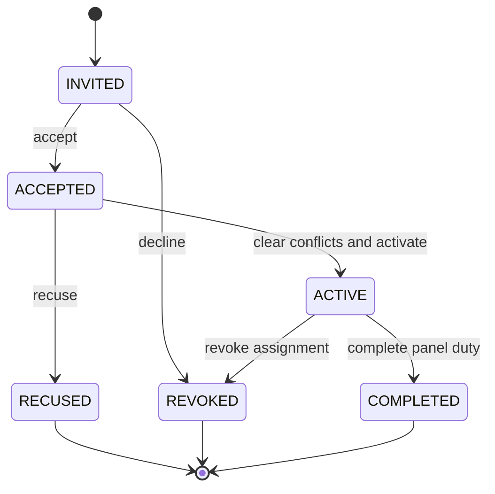
```mermaid
stateDiagram-v2
    [*] --> INVITED
    INVITED --> ACCEPTED: accept
    INVITED --> REVOKED: decline
    ACCEPTED --> ACTIVE: clear conflicts and activate
    ACCEPTED --> RECUSED: recuse
    ACTIVE --> REVOKED: revoke assignment
    ACTIVE --> COMPLETED: complete panel duty
    RECUSED --> [*]
    REVOKED --> [*]
    COMPLETED --> [*]
```

| Current State | Event | Required Actor | Preconditions | Authorization Scope | Next State | Records Produced | Audit Required | Notifications | Forbidden When |
| --- | --- | --- | --- | --- | --- | --- | --- | --- | --- |
| `INVITED` | accept | Judge; Competition Director; Chief Judge | Current version is `INVITED`; required evidence/dependencies are valid; no blocking conflict or hold. | Current Workspace plus named administrative, resource, competition, assignment, case, device and time scope as applicable. | `ACCEPTED` | Transition event; state/version record; outbox item; approval/reason evidence when sensitive. | Yes; denial is also audited when security-sensitive. | Affected actor/owner/approver and downstream services according to catalog and privacy policy. | Actor is unassigned, conflicted, stale, expired, cross-scope, lacks step-up/approval, or target is in an incompatible/terminal state. |
| `INVITED` | decline | Judge; Competition Director; Chief Judge | Current version is `INVITED`; required evidence/dependencies are valid; no blocking conflict or hold. | Current Workspace plus named administrative, resource, competition, assignment, case, device and time scope as applicable. | `REVOKED` | Transition event; state/version record; outbox item; approval/reason evidence when sensitive. | Yes; denial is also audited when security-sensitive. | Affected actor/owner/approver and downstream services according to catalog and privacy policy. | Actor is unassigned, conflicted, stale, expired, cross-scope, lacks step-up/approval, or target is in an incompatible/terminal state. |
| `ACCEPTED` | clear conflicts and activate | Judge; Competition Director; Chief Judge | Current version is `ACCEPTED`; required evidence/dependencies are valid; no blocking conflict or hold. | Current Workspace plus named administrative, resource, competition, assignment, case, device and time scope as applicable. | `ACTIVE` | Transition event; state/version record; outbox item; approval/reason evidence when sensitive. | Yes; denial is also audited when security-sensitive. | Affected actor/owner/approver and downstream services according to catalog and privacy policy. | Actor is unassigned, conflicted, stale, expired, cross-scope, lacks step-up/approval, or target is in an incompatible/terminal state. |
| `ACCEPTED` | recuse | Judge; Competition Director; Chief Judge | Current version is `ACCEPTED`; required evidence/dependencies are valid; no blocking conflict or hold. | Current Workspace plus named administrative, resource, competition, assignment, case, device and time scope as applicable. | `RECUSED` | Transition event; state/version record; outbox item; approval/reason evidence when sensitive. | Yes; denial is also audited when security-sensitive. | Affected actor/owner/approver and downstream services according to catalog and privacy policy. | Actor is unassigned, conflicted, stale, expired, cross-scope, lacks step-up/approval, or target is in an incompatible/terminal state. |
| `ACTIVE` | revoke assignment | Judge; Competition Director; Chief Judge | Current version is `ACTIVE`; required evidence/dependencies are valid; no blocking conflict or hold. | Current Workspace plus named administrative, resource, competition, assignment, case, device and time scope as applicable. | `REVOKED` | Transition event; state/version record; outbox item; approval/reason evidence when sensitive. | Yes; denial is also audited when security-sensitive. | Affected actor/owner/approver and downstream services according to catalog and privacy policy. | Actor is unassigned, conflicted, stale, expired, cross-scope, lacks step-up/approval, or target is in an incompatible/terminal state. |
| `ACTIVE` | complete panel duty | Judge; Competition Director; Chief Judge | Current version is `ACTIVE`; required evidence/dependencies are valid; no blocking conflict or hold. | Current Workspace plus named administrative, resource, competition, assignment, case, device and time scope as applicable. | `COMPLETED` | Transition event; state/version record; outbox item; approval/reason evidence when sensitive. | Yes; denial is also audited when security-sensitive. | Affected actor/owner/approver and downstream services according to catalog and privacy policy. | Actor is unassigned, conflicted, stale, expired, cross-scope, lacks step-up/approval, or target is in an incompatible/terminal state. |

## QMDB-SM-013 — Conflict Declaration

| Lifecycle property | Definition |
| --- | --- |
| Initial state | `UNDECLARED` |
| Terminal states | `CLEARED`, `RECUSED`, `EXCEPTION_APPROVED` |
| Triggering actors | Judge; Independent Conflict Reviewer. |
| Reversible transitions | Only transitions with an explicit return, resume, restore, resubmit, reinstate, or successor event; the previous event/version remains preserved. |
| Irreversible transitions | Terminal transition, issuance/finalization, accepted official submission, revocation, archival, rejection, and supersession are not reversed in place; correction uses a new governed record/version. |
| Step-up authentication | Required for privileged approval, activation, lock, reopen, finalization, correction, revocation, suspension, export/elevation, and emergency transitions; ordinary public/read events do not qualify. |
| Multi-person approval | Required for high-risk governance transitions and prohibited from self-approval; exact role/quorum is OD-034. |
| Audit requirements | Actor/service identity, effective role, Workspace/administrative/assignment scope, current and next state, resource/version, event, reason/evidence/approval, server time and correlation. |
| Side effects | Durable domain/outbox event, affected capability recalculation, notification intent, projection invalidation/rebuild, and dependent-record review as applicable. |
| Prohibited transitions | Skipping required intermediate gates, mutating a terminal/former version, stale-version transition, client-authoritative state, cross-workspace transition, self-approval, or transition after authority expiry. |
| Cancellation, suspension, timeout | Preserve the current/former state and evidence; revoke further action; notify affected parties; reconcile dependent assignments, deadlines and projections; require explicit resume/new version. |
| Former official versions | Preserved and linked by version/supersession identifiers wherever the lifecycle can become official or publicly represented. |
| Related functional requirements | QMDB-FR-JDG-002. |

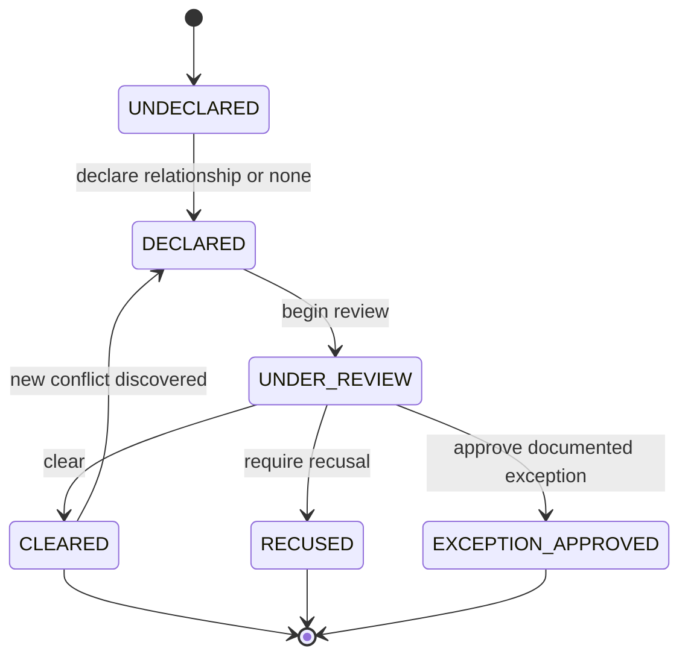
```mermaid
stateDiagram-v2
    [*] --> UNDECLARED
    UNDECLARED --> DECLARED: declare relationship or none
    DECLARED --> UNDER_REVIEW: begin review
    UNDER_REVIEW --> CLEARED: clear
    UNDER_REVIEW --> RECUSED: require recusal
    UNDER_REVIEW --> EXCEPTION_APPROVED: approve documented exception
    CLEARED --> DECLARED: new conflict discovered
    CLEARED --> [*]
    RECUSED --> [*]
    EXCEPTION_APPROVED --> [*]
```

| Current State | Event | Required Actor | Preconditions | Authorization Scope | Next State | Records Produced | Audit Required | Notifications | Forbidden When |
| --- | --- | --- | --- | --- | --- | --- | --- | --- | --- |
| `UNDECLARED` | declare relationship or none | Judge; Independent Conflict Reviewer | Current version is `UNDECLARED`; required evidence/dependencies are valid; no blocking conflict or hold. | Current Workspace plus named administrative, resource, competition, assignment, case, device and time scope as applicable. | `DECLARED` | Transition event; state/version record; outbox item; approval/reason evidence when sensitive. | Yes; denial is also audited when security-sensitive. | Affected actor/owner/approver and downstream services according to catalog and privacy policy. | Actor is unassigned, conflicted, stale, expired, cross-scope, lacks step-up/approval, or target is in an incompatible/terminal state. |
| `DECLARED` | begin review | Judge; Independent Conflict Reviewer | Current version is `DECLARED`; required evidence/dependencies are valid; no blocking conflict or hold. | Current Workspace plus named administrative, resource, competition, assignment, case, device and time scope as applicable. | `UNDER_REVIEW` | Transition event; state/version record; outbox item; approval/reason evidence when sensitive. | Yes; denial is also audited when security-sensitive. | Affected actor/owner/approver and downstream services according to catalog and privacy policy. | Actor is unassigned, conflicted, stale, expired, cross-scope, lacks step-up/approval, or target is in an incompatible/terminal state. |
| `UNDER_REVIEW` | clear | Judge; Independent Conflict Reviewer | Current version is `UNDER_REVIEW`; required evidence/dependencies are valid; no blocking conflict or hold. | Current Workspace plus named administrative, resource, competition, assignment, case, device and time scope as applicable. | `CLEARED` | Transition event; state/version record; outbox item; approval/reason evidence when sensitive. | Yes; denial is also audited when security-sensitive. | Affected actor/owner/approver and downstream services according to catalog and privacy policy. | Actor is unassigned, conflicted, stale, expired, cross-scope, lacks step-up/approval, or target is in an incompatible/terminal state. |
| `UNDER_REVIEW` | require recusal | Judge; Independent Conflict Reviewer | Current version is `UNDER_REVIEW`; required evidence/dependencies are valid; no blocking conflict or hold. | Current Workspace plus named administrative, resource, competition, assignment, case, device and time scope as applicable. | `RECUSED` | Transition event; state/version record; outbox item; approval/reason evidence when sensitive. | Yes; denial is also audited when security-sensitive. | Affected actor/owner/approver and downstream services according to catalog and privacy policy. | Actor is unassigned, conflicted, stale, expired, cross-scope, lacks step-up/approval, or target is in an incompatible/terminal state. |
| `UNDER_REVIEW` | approve documented exception | Judge; Independent Conflict Reviewer | Current version is `UNDER_REVIEW`; required evidence/dependencies are valid; no blocking conflict or hold. | Current Workspace plus named administrative, resource, competition, assignment, case, device and time scope as applicable. | `EXCEPTION_APPROVED` | Transition event; state/version record; outbox item; approval/reason evidence when sensitive. | Yes; denial is also audited when security-sensitive. | Affected actor/owner/approver and downstream services according to catalog and privacy policy. | Actor is unassigned, conflicted, stale, expired, cross-scope, lacks step-up/approval, or target is in an incompatible/terminal state. |
| `CLEARED` | new conflict discovered | Judge; Independent Conflict Reviewer | Current version is `CLEARED`; required evidence/dependencies are valid; no blocking conflict or hold. | Current Workspace plus named administrative, resource, competition, assignment, case, device and time scope as applicable. | `DECLARED` | Transition event; state/version record; outbox item; approval/reason evidence when sensitive. | Yes; denial is also audited when security-sensitive. | Affected actor/owner/approver and downstream services according to catalog and privacy policy. | Actor is unassigned, conflicted, stale, expired, cross-scope, lacks step-up/approval, or target is in an incompatible/terminal state. |

## QMDB-SM-014 — Performance

| Lifecycle property | Definition |
| --- | --- |
| Initial state | `SCHEDULED` |
| Terminal states | `CLOSED`, `CANCELLED` |
| Triggering actors | Chief Judge; Competition Director. |
| Reversible transitions | Only transitions with an explicit return, resume, restore, resubmit, reinstate, or successor event; the previous event/version remains preserved. |
| Irreversible transitions | Terminal transition, issuance/finalization, accepted official submission, revocation, archival, rejection, and supersession are not reversed in place; correction uses a new governed record/version. |
| Step-up authentication | Required for privileged approval, activation, lock, reopen, finalization, correction, revocation, suspension, export/elevation, and emergency transitions; ordinary public/read events do not qualify. |
| Multi-person approval | Required for high-risk governance transitions and prohibited from self-approval; exact role/quorum is OD-034. |
| Audit requirements | Actor/service identity, effective role, Workspace/administrative/assignment scope, current and next state, resource/version, event, reason/evidence/approval, server time and correlation. |
| Side effects | Durable domain/outbox event, affected capability recalculation, notification intent, projection invalidation/rebuild, and dependent-record review as applicable. |
| Prohibited transitions | Skipping required intermediate gates, mutating a terminal/former version, stale-version transition, client-authoritative state, cross-workspace transition, self-approval, or transition after authority expiry. |
| Cancellation, suspension, timeout | Preserve the current/former state and evidence; revoke further action; notify affected parties; reconcile dependent assignments, deadlines and projections; require explicit resume/new version. |
| Former official versions | Preserved and linked by version/supersession identifiers wherever the lifecycle can become official or publicly represented. |
| Related functional requirements | QMDB-FR-JDG-004, QMDB-FR-SCR-001. |

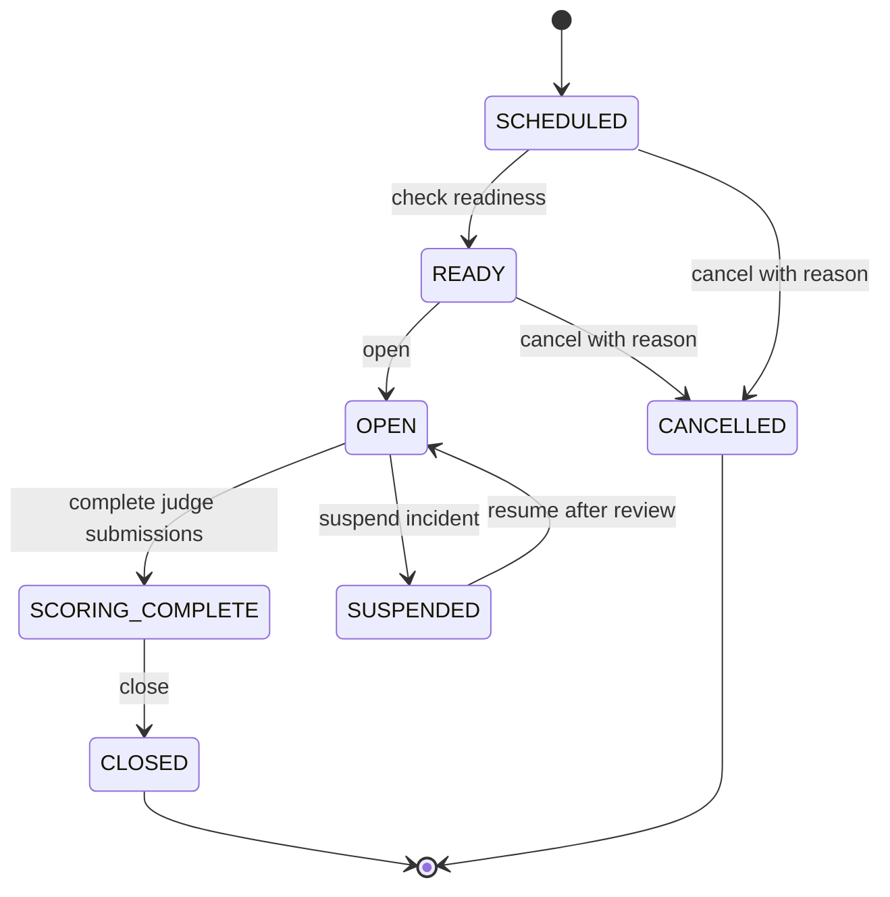
```mermaid
stateDiagram-v2
    [*] --> SCHEDULED
    SCHEDULED --> READY: check readiness
    READY --> OPEN: open
    OPEN --> SCORING_COMPLETE: complete judge submissions
    SCORING_COMPLETE --> CLOSED: close
    OPEN --> SUSPENDED: suspend incident
    SUSPENDED --> OPEN: resume after review
    SCHEDULED --> CANCELLED: cancel with reason
    READY --> CANCELLED: cancel with reason
    CLOSED --> [*]
    CANCELLED --> [*]
```

| Current State | Event | Required Actor | Preconditions | Authorization Scope | Next State | Records Produced | Audit Required | Notifications | Forbidden When |
| --- | --- | --- | --- | --- | --- | --- | --- | --- | --- |
| `SCHEDULED` | check readiness | Chief Judge; Competition Director | Current version is `SCHEDULED`; required evidence/dependencies are valid; no blocking conflict or hold. | Current Workspace plus named administrative, resource, competition, assignment, case, device and time scope as applicable. | `READY` | Transition event; state/version record; outbox item; approval/reason evidence when sensitive. | Yes; denial is also audited when security-sensitive. | Affected actor/owner/approver and downstream services according to catalog and privacy policy. | Actor is unassigned, conflicted, stale, expired, cross-scope, lacks step-up/approval, or target is in an incompatible/terminal state. |
| `READY` | open | Chief Judge; Competition Director | Current version is `READY`; required evidence/dependencies are valid; no blocking conflict or hold. | Current Workspace plus named administrative, resource, competition, assignment, case, device and time scope as applicable. | `OPEN` | Transition event; state/version record; outbox item; approval/reason evidence when sensitive. | Yes; denial is also audited when security-sensitive. | Affected actor/owner/approver and downstream services according to catalog and privacy policy. | Actor is unassigned, conflicted, stale, expired, cross-scope, lacks step-up/approval, or target is in an incompatible/terminal state. |
| `OPEN` | complete judge submissions | Chief Judge; Competition Director | Current version is `OPEN`; required evidence/dependencies are valid; no blocking conflict or hold. | Current Workspace plus named administrative, resource, competition, assignment, case, device and time scope as applicable. | `SCORING_COMPLETE` | Transition event; state/version record; outbox item; approval/reason evidence when sensitive. | Yes; denial is also audited when security-sensitive. | Affected actor/owner/approver and downstream services according to catalog and privacy policy. | Actor is unassigned, conflicted, stale, expired, cross-scope, lacks step-up/approval, or target is in an incompatible/terminal state. |
| `SCORING_COMPLETE` | close | Chief Judge; Competition Director | Current version is `SCORING_COMPLETE`; required evidence/dependencies are valid; no blocking conflict or hold. | Current Workspace plus named administrative, resource, competition, assignment, case, device and time scope as applicable. | `CLOSED` | Transition event; state/version record; outbox item; approval/reason evidence when sensitive. | Yes; denial is also audited when security-sensitive. | Affected actor/owner/approver and downstream services according to catalog and privacy policy. | Actor is unassigned, conflicted, stale, expired, cross-scope, lacks step-up/approval, or target is in an incompatible/terminal state. |
| `OPEN` | suspend incident | Chief Judge; Competition Director | Current version is `OPEN`; required evidence/dependencies are valid; no blocking conflict or hold. | Current Workspace plus named administrative, resource, competition, assignment, case, device and time scope as applicable. | `SUSPENDED` | Transition event; state/version record; outbox item; approval/reason evidence when sensitive. | Yes; denial is also audited when security-sensitive. | Affected actor/owner/approver and downstream services according to catalog and privacy policy. | Actor is unassigned, conflicted, stale, expired, cross-scope, lacks step-up/approval, or target is in an incompatible/terminal state. |
| `SUSPENDED` | resume after review | Chief Judge; Competition Director | Current version is `SUSPENDED`; required evidence/dependencies are valid; no blocking conflict or hold. | Current Workspace plus named administrative, resource, competition, assignment, case, device and time scope as applicable. | `OPEN` | Transition event; state/version record; outbox item; approval/reason evidence when sensitive. | Yes; denial is also audited when security-sensitive. | Affected actor/owner/approver and downstream services according to catalog and privacy policy. | Actor is unassigned, conflicted, stale, expired, cross-scope, lacks step-up/approval, or target is in an incompatible/terminal state. |
| `SCHEDULED` | cancel with reason | Chief Judge; Competition Director | Current version is `SCHEDULED`; required evidence/dependencies are valid; no blocking conflict or hold. | Current Workspace plus named administrative, resource, competition, assignment, case, device and time scope as applicable. | `CANCELLED` | Transition event; state/version record; outbox item; approval/reason evidence when sensitive. | Yes; denial is also audited when security-sensitive. | Affected actor/owner/approver and downstream services according to catalog and privacy policy. | Actor is unassigned, conflicted, stale, expired, cross-scope, lacks step-up/approval, or target is in an incompatible/terminal state. |
| `READY` | cancel with reason | Chief Judge; Competition Director | Current version is `READY`; required evidence/dependencies are valid; no blocking conflict or hold. | Current Workspace plus named administrative, resource, competition, assignment, case, device and time scope as applicable. | `CANCELLED` | Transition event; state/version record; outbox item; approval/reason evidence when sensitive. | Yes; denial is also audited when security-sensitive. | Affected actor/owner/approver and downstream services according to catalog and privacy policy. | Actor is unassigned, conflicted, stale, expired, cross-scope, lacks step-up/approval, or target is in an incompatible/terminal state. |

## QMDB-SM-015 — Score Sheet

| Lifecycle property | Definition |
| --- | --- |
| Initial state | `DRAFT` |
| Terminal states | `LOCKED`, `SUPERSEDED` |
| Triggering actors | Judge; Chief Judge; Approving Role Category. |
| Reversible transitions | Only transitions with an explicit return, resume, restore, resubmit, reinstate, or successor event; the previous event/version remains preserved. |
| Irreversible transitions | Terminal transition, issuance/finalization, accepted official submission, revocation, archival, rejection, and supersession are not reversed in place; correction uses a new governed record/version. |
| Step-up authentication | Required for privileged approval, activation, lock, reopen, finalization, correction, revocation, suspension, export/elevation, and emergency transitions; ordinary public/read events do not qualify. |
| Multi-person approval | Required for high-risk governance transitions and prohibited from self-approval; exact role/quorum is OD-034. |
| Audit requirements | Actor/service identity, effective role, Workspace/administrative/assignment scope, current and next state, resource/version, event, reason/evidence/approval, server time and correlation. |
| Side effects | Durable domain/outbox event, affected capability recalculation, notification intent, projection invalidation/rebuild, and dependent-record review as applicable. |
| Prohibited transitions | Skipping required intermediate gates, mutating a terminal/former version, stale-version transition, client-authoritative state, cross-workspace transition, self-approval, or transition after authority expiry. |
| Cancellation, suspension, timeout | Preserve the current/former state and evidence; revoke further action; notify affected parties; reconcile dependent assignments, deadlines and projections; require explicit resume/new version. |
| Former official versions | Preserved and linked by version/supersession identifiers wherever the lifecycle can become official or publicly represented. |
| Related functional requirements | QMDB-FR-SCR-001, QMDB-FR-SCR-002, QMDB-FR-SCR-003, QMDB-FR-SCR-004, QMDB-FR-SCR-005. |

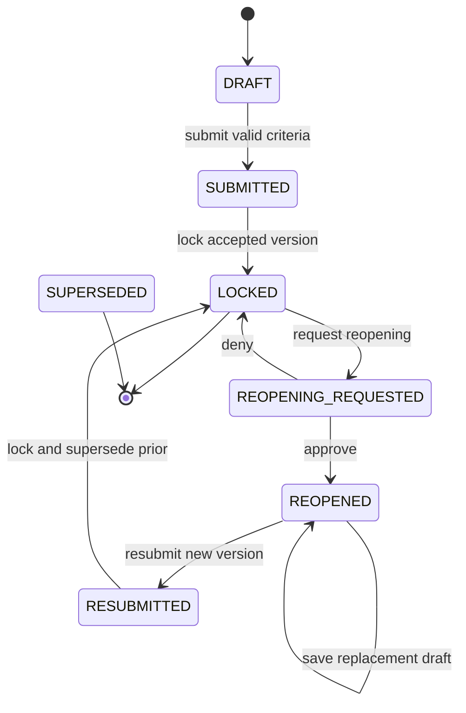
```mermaid
stateDiagram-v2
    [*] --> DRAFT
    DRAFT --> SUBMITTED: submit valid criteria
    SUBMITTED --> LOCKED: lock accepted version
    LOCKED --> REOPENING_REQUESTED: request reopening
    REOPENING_REQUESTED --> LOCKED: deny
    REOPENING_REQUESTED --> REOPENED: approve
    REOPENED --> REOPENED: save replacement draft
    REOPENED --> RESUBMITTED: resubmit new version
    RESUBMITTED --> LOCKED: lock and supersede prior
    LOCKED --> [*]
    SUPERSEDED --> [*]
```

| Current State | Event | Required Actor | Preconditions | Authorization Scope | Next State | Records Produced | Audit Required | Notifications | Forbidden When |
| --- | --- | --- | --- | --- | --- | --- | --- | --- | --- |
| `DRAFT` | submit valid criteria | Judge; Chief Judge; Approving Role Category | Current version is `DRAFT`; required evidence/dependencies are valid; no blocking conflict or hold. | Current Workspace plus named administrative, resource, competition, assignment, case, device and time scope as applicable. | `SUBMITTED` | Transition event; state/version record; outbox item; approval/reason evidence when sensitive. | Yes; denial is also audited when security-sensitive. | Affected actor/owner/approver and downstream services according to catalog and privacy policy. | Actor is unassigned, conflicted, stale, expired, cross-scope, lacks step-up/approval, or target is in an incompatible/terminal state. |
| `SUBMITTED` | lock accepted version | Judge; Chief Judge; Approving Role Category | Current version is `SUBMITTED`; required evidence/dependencies are valid; no blocking conflict or hold. | Current Workspace plus named administrative, resource, competition, assignment, case, device and time scope as applicable. | `LOCKED` | Transition event; state/version record; outbox item; approval/reason evidence when sensitive. | Yes; denial is also audited when security-sensitive. | Affected actor/owner/approver and downstream services according to catalog and privacy policy. | Actor is unassigned, conflicted, stale, expired, cross-scope, lacks step-up/approval, or target is in an incompatible/terminal state. |
| `LOCKED` | request reopening | Judge; Chief Judge; Approving Role Category | Current version is `LOCKED`; required evidence/dependencies are valid; no blocking conflict or hold. | Current Workspace plus named administrative, resource, competition, assignment, case, device and time scope as applicable. | `REOPENING_REQUESTED` | Transition event; state/version record; outbox item; approval/reason evidence when sensitive. | Yes; denial is also audited when security-sensitive. | Affected actor/owner/approver and downstream services according to catalog and privacy policy. | Actor is unassigned, conflicted, stale, expired, cross-scope, lacks step-up/approval, or target is in an incompatible/terminal state. |
| `REOPENING_REQUESTED` | deny | Judge; Chief Judge; Approving Role Category | Current version is `REOPENING_REQUESTED`; required evidence/dependencies are valid; no blocking conflict or hold. | Current Workspace plus named administrative, resource, competition, assignment, case, device and time scope as applicable. | `LOCKED` | Transition event; state/version record; outbox item; approval/reason evidence when sensitive. | Yes; denial is also audited when security-sensitive. | Affected actor/owner/approver and downstream services according to catalog and privacy policy. | Actor is unassigned, conflicted, stale, expired, cross-scope, lacks step-up/approval, or target is in an incompatible/terminal state. |
| `REOPENING_REQUESTED` | approve | Judge; Chief Judge; Approving Role Category | Current version is `REOPENING_REQUESTED`; required evidence/dependencies are valid; no blocking conflict or hold. | Current Workspace plus named administrative, resource, competition, assignment, case, device and time scope as applicable. | `REOPENED` | Transition event; state/version record; outbox item; approval/reason evidence when sensitive. | Yes; denial is also audited when security-sensitive. | Affected actor/owner/approver and downstream services according to catalog and privacy policy. | Actor is unassigned, conflicted, stale, expired, cross-scope, lacks step-up/approval, or target is in an incompatible/terminal state. |
| `REOPENED` | save replacement draft | Judge; Chief Judge; Approving Role Category | Current version is `REOPENED`; required evidence/dependencies are valid; no blocking conflict or hold. | Current Workspace plus named administrative, resource, competition, assignment, case, device and time scope as applicable. | `REOPENED` | Transition event; state/version record; outbox item; approval/reason evidence when sensitive. | Yes; denial is also audited when security-sensitive. | Affected actor/owner/approver and downstream services according to catalog and privacy policy. | Actor is unassigned, conflicted, stale, expired, cross-scope, lacks step-up/approval, or target is in an incompatible/terminal state. |
| `REOPENED` | resubmit new version | Judge; Chief Judge; Approving Role Category | Current version is `REOPENED`; required evidence/dependencies are valid; no blocking conflict or hold. | Current Workspace plus named administrative, resource, competition, assignment, case, device and time scope as applicable. | `RESUBMITTED` | Transition event; state/version record; outbox item; approval/reason evidence when sensitive. | Yes; denial is also audited when security-sensitive. | Affected actor/owner/approver and downstream services according to catalog and privacy policy. | Actor is unassigned, conflicted, stale, expired, cross-scope, lacks step-up/approval, or target is in an incompatible/terminal state. |
| `RESUBMITTED` | lock and supersede prior | Judge; Chief Judge; Approving Role Category | Current version is `RESUBMITTED`; required evidence/dependencies are valid; no blocking conflict or hold. | Current Workspace plus named administrative, resource, competition, assignment, case, device and time scope as applicable. | `LOCKED` | Transition event; state/version record; outbox item; approval/reason evidence when sensitive. | Yes; denial is also audited when security-sensitive. | Affected actor/owner/approver and downstream services according to catalog and privacy policy. | Actor is unassigned, conflicted, stale, expired, cross-scope, lacks step-up/approval, or target is in an incompatible/terminal state. |

## QMDB-SM-016 — Result

| Lifecycle property | Definition |
| --- | --- |
| Initial state | `DRAFT` |
| Terminal states | `ARCHIVED` |
| Triggering actors | Result Service; Competition Director; Records Custodian. |
| Reversible transitions | Only transitions with an explicit return, resume, restore, resubmit, reinstate, or successor event; the previous event/version remains preserved. |
| Irreversible transitions | Terminal transition, issuance/finalization, accepted official submission, revocation, archival, rejection, and supersession are not reversed in place; correction uses a new governed record/version. |
| Step-up authentication | Required for privileged approval, activation, lock, reopen, finalization, correction, revocation, suspension, export/elevation, and emergency transitions; ordinary public/read events do not qualify. |
| Multi-person approval | Required for high-risk governance transitions and prohibited from self-approval; exact role/quorum is OD-034. |
| Audit requirements | Actor/service identity, effective role, Workspace/administrative/assignment scope, current and next state, resource/version, event, reason/evidence/approval, server time and correlation. |
| Side effects | Durable domain/outbox event, affected capability recalculation, notification intent, projection invalidation/rebuild, and dependent-record review as applicable. |
| Prohibited transitions | Skipping required intermediate gates, mutating a terminal/former version, stale-version transition, client-authoritative state, cross-workspace transition, self-approval, or transition after authority expiry. |
| Cancellation, suspension, timeout | Preserve the current/former state and evidence; revoke further action; notify affected parties; reconcile dependent assignments, deadlines and projections; require explicit resume/new version. |
| Former official versions | Preserved and linked by version/supersession identifiers wherever the lifecycle can become official or publicly represented. |
| Related functional requirements | QMDB-FR-RSL-001, QMDB-FR-RSL-002, QMDB-FR-RSL-003, QMDB-FR-RSL-004. |

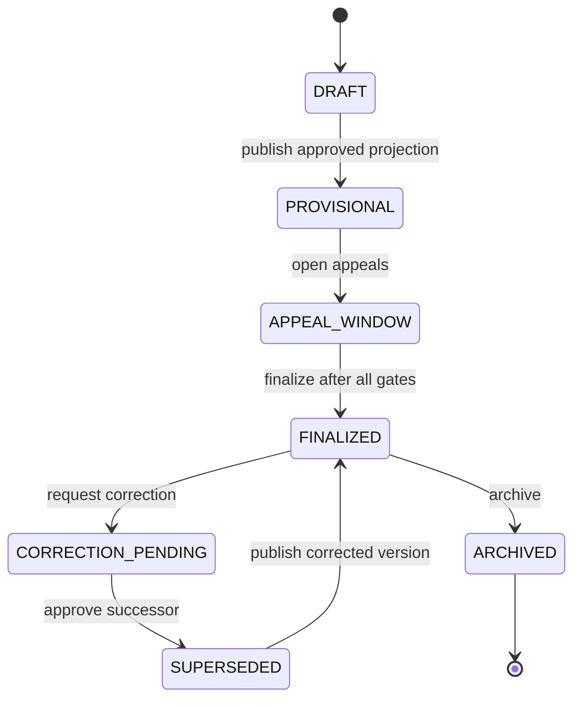
```mermaid
stateDiagram-v2
    [*] --> DRAFT
    DRAFT --> PROVISIONAL: publish approved projection
    PROVISIONAL --> APPEAL_WINDOW: open appeals
    APPEAL_WINDOW --> FINALIZED: finalize after all gates
    FINALIZED --> CORRECTION_PENDING: request correction
    CORRECTION_PENDING --> SUPERSEDED: approve successor
    SUPERSEDED --> FINALIZED: publish corrected version
    FINALIZED --> ARCHIVED: archive
    ARCHIVED --> [*]
```

| Current State | Event | Required Actor | Preconditions | Authorization Scope | Next State | Records Produced | Audit Required | Notifications | Forbidden When |
| --- | --- | --- | --- | --- | --- | --- | --- | --- | --- |
| `DRAFT` | publish approved projection | Result Service; Competition Director; Records Custodian | Current version is `DRAFT`; required evidence/dependencies are valid; no blocking conflict or hold. | Current Workspace plus named administrative, resource, competition, assignment, case, device and time scope as applicable. | `PROVISIONAL` | Transition event; state/version record; outbox item; approval/reason evidence when sensitive. | Yes; denial is also audited when security-sensitive. | Affected actor/owner/approver and downstream services according to catalog and privacy policy. | Actor is unassigned, conflicted, stale, expired, cross-scope, lacks step-up/approval, or target is in an incompatible/terminal state. |
| `PROVISIONAL` | open appeals | Result Service; Competition Director; Records Custodian | Current version is `PROVISIONAL`; required evidence/dependencies are valid; no blocking conflict or hold. | Current Workspace plus named administrative, resource, competition, assignment, case, device and time scope as applicable. | `APPEAL_WINDOW` | Transition event; state/version record; outbox item; approval/reason evidence when sensitive. | Yes; denial is also audited when security-sensitive. | Affected actor/owner/approver and downstream services according to catalog and privacy policy. | Actor is unassigned, conflicted, stale, expired, cross-scope, lacks step-up/approval, or target is in an incompatible/terminal state. |
| `APPEAL_WINDOW` | finalize after all gates | Result Service; Competition Director; Records Custodian | Current version is `APPEAL_WINDOW`; required evidence/dependencies are valid; no blocking conflict or hold. | Current Workspace plus named administrative, resource, competition, assignment, case, device and time scope as applicable. | `FINALIZED` | Transition event; state/version record; outbox item; approval/reason evidence when sensitive. | Yes; denial is also audited when security-sensitive. | Affected actor/owner/approver and downstream services according to catalog and privacy policy. | Actor is unassigned, conflicted, stale, expired, cross-scope, lacks step-up/approval, or target is in an incompatible/terminal state. |
| `FINALIZED` | request correction | Result Service; Competition Director; Records Custodian | Current version is `FINALIZED`; required evidence/dependencies are valid; no blocking conflict or hold. | Current Workspace plus named administrative, resource, competition, assignment, case, device and time scope as applicable. | `CORRECTION_PENDING` | Transition event; state/version record; outbox item; approval/reason evidence when sensitive. | Yes; denial is also audited when security-sensitive. | Affected actor/owner/approver and downstream services according to catalog and privacy policy. | Actor is unassigned, conflicted, stale, expired, cross-scope, lacks step-up/approval, or target is in an incompatible/terminal state. |
| `CORRECTION_PENDING` | approve successor | Result Service; Competition Director; Records Custodian | Current version is `CORRECTION_PENDING`; required evidence/dependencies are valid; no blocking conflict or hold. | Current Workspace plus named administrative, resource, competition, assignment, case, device and time scope as applicable. | `SUPERSEDED` | Transition event; state/version record; outbox item; approval/reason evidence when sensitive. | Yes; denial is also audited when security-sensitive. | Affected actor/owner/approver and downstream services according to catalog and privacy policy. | Actor is unassigned, conflicted, stale, expired, cross-scope, lacks step-up/approval, or target is in an incompatible/terminal state. |
| `SUPERSEDED` | publish corrected version | Result Service; Competition Director; Records Custodian | Current version is `SUPERSEDED`; required evidence/dependencies are valid; no blocking conflict or hold. | Current Workspace plus named administrative, resource, competition, assignment, case, device and time scope as applicable. | `FINALIZED` | Transition event; state/version record; outbox item; approval/reason evidence when sensitive. | Yes; denial is also audited when security-sensitive. | Affected actor/owner/approver and downstream services according to catalog and privacy policy. | Actor is unassigned, conflicted, stale, expired, cross-scope, lacks step-up/approval, or target is in an incompatible/terminal state. |
| `FINALIZED` | archive | Result Service; Competition Director; Records Custodian | Current version is `FINALIZED`; required evidence/dependencies are valid; no blocking conflict or hold. | Current Workspace plus named administrative, resource, competition, assignment, case, device and time scope as applicable. | `ARCHIVED` | Transition event; state/version record; outbox item; approval/reason evidence when sensitive. | Yes; denial is also audited when security-sensitive. | Affected actor/owner/approver and downstream services according to catalog and privacy policy. | Actor is unassigned, conflicted, stale, expired, cross-scope, lacks step-up/approval, or target is in an incompatible/terminal state. |

## QMDB-SM-017 — Appeal

| Lifecycle property | Definition |
| --- | --- |
| Initial state | `DRAFT` |
| Terminal states | `DECIDED`, `CLOSED`, `WITHDRAWN` |
| Triggering actors | Competitor; Appeal Reviewer. |
| Reversible transitions | Only transitions with an explicit return, resume, restore, resubmit, reinstate, or successor event; the previous event/version remains preserved. |
| Irreversible transitions | Terminal transition, issuance/finalization, accepted official submission, revocation, archival, rejection, and supersession are not reversed in place; correction uses a new governed record/version. |
| Step-up authentication | Required for privileged approval, activation, lock, reopen, finalization, correction, revocation, suspension, export/elevation, and emergency transitions; ordinary public/read events do not qualify. |
| Multi-person approval | Required for high-risk governance transitions and prohibited from self-approval; exact role/quorum is OD-034. |
| Audit requirements | Actor/service identity, effective role, Workspace/administrative/assignment scope, current and next state, resource/version, event, reason/evidence/approval, server time and correlation. |
| Side effects | Durable domain/outbox event, affected capability recalculation, notification intent, projection invalidation/rebuild, and dependent-record review as applicable. |
| Prohibited transitions | Skipping required intermediate gates, mutating a terminal/former version, stale-version transition, client-authoritative state, cross-workspace transition, self-approval, or transition after authority expiry. |
| Cancellation, suspension, timeout | Preserve the current/former state and evidence; revoke further action; notify affected parties; reconcile dependent assignments, deadlines and projections; require explicit resume/new version. |
| Former official versions | Preserved and linked by version/supersession identifiers wherever the lifecycle can become official or publicly represented. |
| Related functional requirements | QMDB-FR-APL-001, QMDB-FR-APL-002, QMDB-FR-APL-003. |

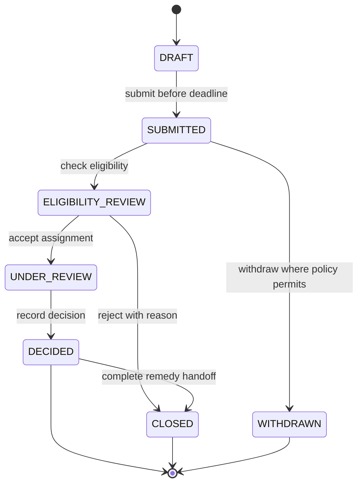
```mermaid
stateDiagram-v2
    [*] --> DRAFT
    DRAFT --> SUBMITTED: submit before deadline
    SUBMITTED --> ELIGIBILITY_REVIEW: check eligibility
    ELIGIBILITY_REVIEW --> UNDER_REVIEW: accept assignment
    ELIGIBILITY_REVIEW --> CLOSED: reject with reason
    UNDER_REVIEW --> DECIDED: record decision
    DECIDED --> CLOSED: complete remedy handoff
    SUBMITTED --> WITHDRAWN: withdraw where policy permits
    DECIDED --> [*]
    CLOSED --> [*]
    WITHDRAWN --> [*]
```

| Current State | Event | Required Actor | Preconditions | Authorization Scope | Next State | Records Produced | Audit Required | Notifications | Forbidden When |
| --- | --- | --- | --- | --- | --- | --- | --- | --- | --- |
| `DRAFT` | submit before deadline | Competitor; Appeal Reviewer | Current version is `DRAFT`; required evidence/dependencies are valid; no blocking conflict or hold. | Current Workspace plus named administrative, resource, competition, assignment, case, device and time scope as applicable. | `SUBMITTED` | Transition event; state/version record; outbox item; approval/reason evidence when sensitive. | Yes; denial is also audited when security-sensitive. | Affected actor/owner/approver and downstream services according to catalog and privacy policy. | Actor is unassigned, conflicted, stale, expired, cross-scope, lacks step-up/approval, or target is in an incompatible/terminal state. |
| `SUBMITTED` | check eligibility | Competitor; Appeal Reviewer | Current version is `SUBMITTED`; required evidence/dependencies are valid; no blocking conflict or hold. | Current Workspace plus named administrative, resource, competition, assignment, case, device and time scope as applicable. | `ELIGIBILITY_REVIEW` | Transition event; state/version record; outbox item; approval/reason evidence when sensitive. | Yes; denial is also audited when security-sensitive. | Affected actor/owner/approver and downstream services according to catalog and privacy policy. | Actor is unassigned, conflicted, stale, expired, cross-scope, lacks step-up/approval, or target is in an incompatible/terminal state. |
| `ELIGIBILITY_REVIEW` | accept assignment | Competitor; Appeal Reviewer | Current version is `ELIGIBILITY_REVIEW`; required evidence/dependencies are valid; no blocking conflict or hold. | Current Workspace plus named administrative, resource, competition, assignment, case, device and time scope as applicable. | `UNDER_REVIEW` | Transition event; state/version record; outbox item; approval/reason evidence when sensitive. | Yes; denial is also audited when security-sensitive. | Affected actor/owner/approver and downstream services according to catalog and privacy policy. | Actor is unassigned, conflicted, stale, expired, cross-scope, lacks step-up/approval, or target is in an incompatible/terminal state. |
| `ELIGIBILITY_REVIEW` | reject with reason | Competitor; Appeal Reviewer | Current version is `ELIGIBILITY_REVIEW`; required evidence/dependencies are valid; no blocking conflict or hold. | Current Workspace plus named administrative, resource, competition, assignment, case, device and time scope as applicable. | `CLOSED` | Transition event; state/version record; outbox item; approval/reason evidence when sensitive. | Yes; denial is also audited when security-sensitive. | Affected actor/owner/approver and downstream services according to catalog and privacy policy. | Actor is unassigned, conflicted, stale, expired, cross-scope, lacks step-up/approval, or target is in an incompatible/terminal state. |
| `UNDER_REVIEW` | record decision | Competitor; Appeal Reviewer | Current version is `UNDER_REVIEW`; required evidence/dependencies are valid; no blocking conflict or hold. | Current Workspace plus named administrative, resource, competition, assignment, case, device and time scope as applicable. | `DECIDED` | Transition event; state/version record; outbox item; approval/reason evidence when sensitive. | Yes; denial is also audited when security-sensitive. | Affected actor/owner/approver and downstream services according to catalog and privacy policy. | Actor is unassigned, conflicted, stale, expired, cross-scope, lacks step-up/approval, or target is in an incompatible/terminal state. |
| `DECIDED` | complete remedy handoff | Competitor; Appeal Reviewer | Current version is `DECIDED`; required evidence/dependencies are valid; no blocking conflict or hold. | Current Workspace plus named administrative, resource, competition, assignment, case, device and time scope as applicable. | `CLOSED` | Transition event; state/version record; outbox item; approval/reason evidence when sensitive. | Yes; denial is also audited when security-sensitive. | Affected actor/owner/approver and downstream services according to catalog and privacy policy. | Actor is unassigned, conflicted, stale, expired, cross-scope, lacks step-up/approval, or target is in an incompatible/terminal state. |
| `SUBMITTED` | withdraw where policy permits | Competitor; Appeal Reviewer | Current version is `SUBMITTED`; required evidence/dependencies are valid; no blocking conflict or hold. | Current Workspace plus named administrative, resource, competition, assignment, case, device and time scope as applicable. | `WITHDRAWN` | Transition event; state/version record; outbox item; approval/reason evidence when sensitive. | Yes; denial is also audited when security-sensitive. | Affected actor/owner/approver and downstream services according to catalog and privacy policy. | Actor is unassigned, conflicted, stale, expired, cross-scope, lacks step-up/approval, or target is in an incompatible/terminal state. |

## QMDB-SM-018 — Certificate

| Lifecycle property | Definition |
| --- | --- |
| Initial state | `PENDING` |
| Terminal states | `REVOKED`, `ARCHIVED` |
| Triggering actors | Certificate Officer; Verification Service. |
| Reversible transitions | Only transitions with an explicit return, resume, restore, resubmit, reinstate, or successor event; the previous event/version remains preserved. |
| Irreversible transitions | Terminal transition, issuance/finalization, accepted official submission, revocation, archival, rejection, and supersession are not reversed in place; correction uses a new governed record/version. |
| Step-up authentication | Required for privileged approval, activation, lock, reopen, finalization, correction, revocation, suspension, export/elevation, and emergency transitions; ordinary public/read events do not qualify. |
| Multi-person approval | Required for high-risk governance transitions and prohibited from self-approval; exact role/quorum is OD-034. |
| Audit requirements | Actor/service identity, effective role, Workspace/administrative/assignment scope, current and next state, resource/version, event, reason/evidence/approval, server time and correlation. |
| Side effects | Durable domain/outbox event, affected capability recalculation, notification intent, projection invalidation/rebuild, and dependent-record review as applicable. |
| Prohibited transitions | Skipping required intermediate gates, mutating a terminal/former version, stale-version transition, client-authoritative state, cross-workspace transition, self-approval, or transition after authority expiry. |
| Cancellation, suspension, timeout | Preserve the current/former state and evidence; revoke further action; notify affected parties; reconcile dependent assignments, deadlines and projections; require explicit resume/new version. |
| Former official versions | Preserved and linked by version/supersession identifiers wherever the lifecycle can become official or publicly represented. |
| Related functional requirements | QMDB-FR-CER-001, QMDB-FR-CER-002, QMDB-FR-CER-003, QMDB-FR-CER-004. |

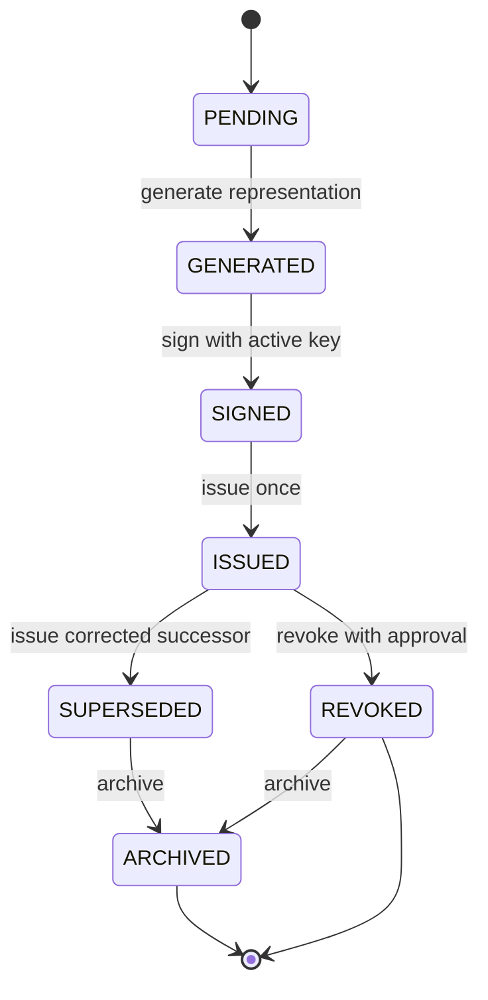
```mermaid
stateDiagram-v2
    [*] --> PENDING
    PENDING --> GENERATED: generate representation
    GENERATED --> SIGNED: sign with active key
    SIGNED --> ISSUED: issue once
    ISSUED --> SUPERSEDED: issue corrected successor
    ISSUED --> REVOKED: revoke with approval
    SUPERSEDED --> ARCHIVED: archive
    REVOKED --> ARCHIVED: archive
    REVOKED --> [*]
    ARCHIVED --> [*]
```

| Current State | Event | Required Actor | Preconditions | Authorization Scope | Next State | Records Produced | Audit Required | Notifications | Forbidden When |
| --- | --- | --- | --- | --- | --- | --- | --- | --- | --- |
| `PENDING` | generate representation | Certificate Officer; Verification Service | Current version is `PENDING`; required evidence/dependencies are valid; no blocking conflict or hold. | Current Workspace plus named administrative, resource, competition, assignment, case, device and time scope as applicable. | `GENERATED` | Transition event; state/version record; outbox item; approval/reason evidence when sensitive. | Yes; denial is also audited when security-sensitive. | Affected actor/owner/approver and downstream services according to catalog and privacy policy. | Actor is unassigned, conflicted, stale, expired, cross-scope, lacks step-up/approval, or target is in an incompatible/terminal state. |
| `GENERATED` | sign with active key | Certificate Officer; Verification Service | Current version is `GENERATED`; required evidence/dependencies are valid; no blocking conflict or hold. | Current Workspace plus named administrative, resource, competition, assignment, case, device and time scope as applicable. | `SIGNED` | Transition event; state/version record; outbox item; approval/reason evidence when sensitive. | Yes; denial is also audited when security-sensitive. | Affected actor/owner/approver and downstream services according to catalog and privacy policy. | Actor is unassigned, conflicted, stale, expired, cross-scope, lacks step-up/approval, or target is in an incompatible/terminal state. |
| `SIGNED` | issue once | Certificate Officer; Verification Service | Current version is `SIGNED`; required evidence/dependencies are valid; no blocking conflict or hold. | Current Workspace plus named administrative, resource, competition, assignment, case, device and time scope as applicable. | `ISSUED` | Transition event; state/version record; outbox item; approval/reason evidence when sensitive. | Yes; denial is also audited when security-sensitive. | Affected actor/owner/approver and downstream services according to catalog and privacy policy. | Actor is unassigned, conflicted, stale, expired, cross-scope, lacks step-up/approval, or target is in an incompatible/terminal state. |
| `ISSUED` | issue corrected successor | Certificate Officer; Verification Service | Current version is `ISSUED`; required evidence/dependencies are valid; no blocking conflict or hold. | Current Workspace plus named administrative, resource, competition, assignment, case, device and time scope as applicable. | `SUPERSEDED` | Transition event; state/version record; outbox item; approval/reason evidence when sensitive. | Yes; denial is also audited when security-sensitive. | Affected actor/owner/approver and downstream services according to catalog and privacy policy. | Actor is unassigned, conflicted, stale, expired, cross-scope, lacks step-up/approval, or target is in an incompatible/terminal state. |
| `ISSUED` | revoke with approval | Certificate Officer; Verification Service | Current version is `ISSUED`; required evidence/dependencies are valid; no blocking conflict or hold. | Current Workspace plus named administrative, resource, competition, assignment, case, device and time scope as applicable. | `REVOKED` | Transition event; state/version record; outbox item; approval/reason evidence when sensitive. | Yes; denial is also audited when security-sensitive. | Affected actor/owner/approver and downstream services according to catalog and privacy policy. | Actor is unassigned, conflicted, stale, expired, cross-scope, lacks step-up/approval, or target is in an incompatible/terminal state. |
| `SUPERSEDED` | archive | Certificate Officer; Verification Service | Current version is `SUPERSEDED`; required evidence/dependencies are valid; no blocking conflict or hold. | Current Workspace plus named administrative, resource, competition, assignment, case, device and time scope as applicable. | `ARCHIVED` | Transition event; state/version record; outbox item; approval/reason evidence when sensitive. | Yes; denial is also audited when security-sensitive. | Affected actor/owner/approver and downstream services according to catalog and privacy policy. | Actor is unassigned, conflicted, stale, expired, cross-scope, lacks step-up/approval, or target is in an incompatible/terminal state. |
| `REVOKED` | archive | Certificate Officer; Verification Service | Current version is `REVOKED`; required evidence/dependencies are valid; no blocking conflict or hold. | Current Workspace plus named administrative, resource, competition, assignment, case, device and time scope as applicable. | `ARCHIVED` | Transition event; state/version record; outbox item; approval/reason evidence when sensitive. | Yes; denial is also audited when security-sensitive. | Affected actor/owner/approver and downstream services according to catalog and privacy policy. | Actor is unassigned, conflicted, stale, expired, cross-scope, lacks step-up/approval, or target is in an incompatible/terminal state. |

## QMDB-SM-019 — Legacy Import Batch

| Lifecycle property | Definition |
| --- | --- |
| Initial state | `CREATED` |
| Terminal states | `COMPLETED`, `REJECTED`, `CANCELLED` |
| Triggering actors | Records Custodian; Import Reviewer. |
| Reversible transitions | Only transitions with an explicit return, resume, restore, resubmit, reinstate, or successor event; the previous event/version remains preserved. |
| Irreversible transitions | Terminal transition, issuance/finalization, accepted official submission, revocation, archival, rejection, and supersession are not reversed in place; correction uses a new governed record/version. |
| Step-up authentication | Required for privileged approval, activation, lock, reopen, finalization, correction, revocation, suspension, export/elevation, and emergency transitions; ordinary public/read events do not qualify. |
| Multi-person approval | Required for high-risk governance transitions and prohibited from self-approval; exact role/quorum is OD-034. |
| Audit requirements | Actor/service identity, effective role, Workspace/administrative/assignment scope, current and next state, resource/version, event, reason/evidence/approval, server time and correlation. |
| Side effects | Durable domain/outbox event, affected capability recalculation, notification intent, projection invalidation/rebuild, and dependent-record review as applicable. |
| Prohibited transitions | Skipping required intermediate gates, mutating a terminal/former version, stale-version transition, client-authoritative state, cross-workspace transition, self-approval, or transition after authority expiry. |
| Cancellation, suspension, timeout | Preserve the current/former state and evidence; revoke further action; notify affected parties; reconcile dependent assignments, deadlines and projections; require explicit resume/new version. |
| Former official versions | Preserved and linked by version/supersession identifiers wherever the lifecycle can become official or publicly represented. |
| Related functional requirements | QMDB-FR-IMP-001. |

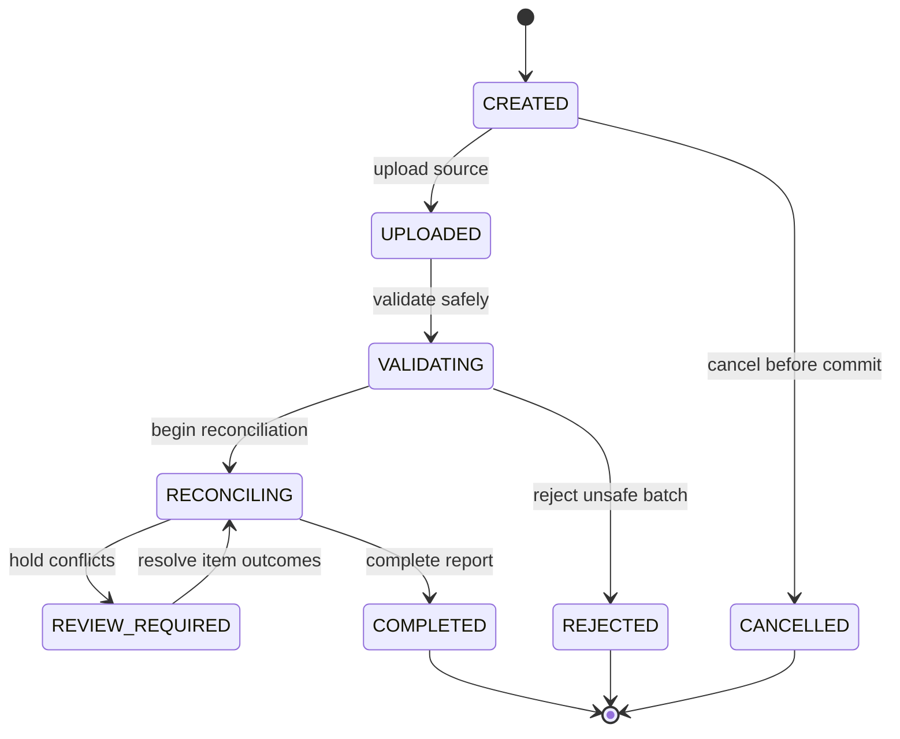
```mermaid
stateDiagram-v2
    [*] --> CREATED
    CREATED --> UPLOADED: upload source
    UPLOADED --> VALIDATING: validate safely
    VALIDATING --> RECONCILING: begin reconciliation
    RECONCILING --> REVIEW_REQUIRED: hold conflicts
    REVIEW_REQUIRED --> RECONCILING: resolve item outcomes
    RECONCILING --> COMPLETED: complete report
    VALIDATING --> REJECTED: reject unsafe batch
    CREATED --> CANCELLED: cancel before commit
    COMPLETED --> [*]
    REJECTED --> [*]
    CANCELLED --> [*]
```

| Current State | Event | Required Actor | Preconditions | Authorization Scope | Next State | Records Produced | Audit Required | Notifications | Forbidden When |
| --- | --- | --- | --- | --- | --- | --- | --- | --- | --- |
| `CREATED` | upload source | Records Custodian; Import Reviewer | Current version is `CREATED`; required evidence/dependencies are valid; no blocking conflict or hold. | Current Workspace plus named administrative, resource, competition, assignment, case, device and time scope as applicable. | `UPLOADED` | Transition event; state/version record; outbox item; approval/reason evidence when sensitive. | Yes; denial is also audited when security-sensitive. | Affected actor/owner/approver and downstream services according to catalog and privacy policy. | Actor is unassigned, conflicted, stale, expired, cross-scope, lacks step-up/approval, or target is in an incompatible/terminal state. |
| `UPLOADED` | validate safely | Records Custodian; Import Reviewer | Current version is `UPLOADED`; required evidence/dependencies are valid; no blocking conflict or hold. | Current Workspace plus named administrative, resource, competition, assignment, case, device and time scope as applicable. | `VALIDATING` | Transition event; state/version record; outbox item; approval/reason evidence when sensitive. | Yes; denial is also audited when security-sensitive. | Affected actor/owner/approver and downstream services according to catalog and privacy policy. | Actor is unassigned, conflicted, stale, expired, cross-scope, lacks step-up/approval, or target is in an incompatible/terminal state. |
| `VALIDATING` | begin reconciliation | Records Custodian; Import Reviewer | Current version is `VALIDATING`; required evidence/dependencies are valid; no blocking conflict or hold. | Current Workspace plus named administrative, resource, competition, assignment, case, device and time scope as applicable. | `RECONCILING` | Transition event; state/version record; outbox item; approval/reason evidence when sensitive. | Yes; denial is also audited when security-sensitive. | Affected actor/owner/approver and downstream services according to catalog and privacy policy. | Actor is unassigned, conflicted, stale, expired, cross-scope, lacks step-up/approval, or target is in an incompatible/terminal state. |
| `RECONCILING` | hold conflicts | Records Custodian; Import Reviewer | Current version is `RECONCILING`; required evidence/dependencies are valid; no blocking conflict or hold. | Current Workspace plus named administrative, resource, competition, assignment, case, device and time scope as applicable. | `REVIEW_REQUIRED` | Transition event; state/version record; outbox item; approval/reason evidence when sensitive. | Yes; denial is also audited when security-sensitive. | Affected actor/owner/approver and downstream services according to catalog and privacy policy. | Actor is unassigned, conflicted, stale, expired, cross-scope, lacks step-up/approval, or target is in an incompatible/terminal state. |
| `REVIEW_REQUIRED` | resolve item outcomes | Records Custodian; Import Reviewer | Current version is `REVIEW_REQUIRED`; required evidence/dependencies are valid; no blocking conflict or hold. | Current Workspace plus named administrative, resource, competition, assignment, case, device and time scope as applicable. | `RECONCILING` | Transition event; state/version record; outbox item; approval/reason evidence when sensitive. | Yes; denial is also audited when security-sensitive. | Affected actor/owner/approver and downstream services according to catalog and privacy policy. | Actor is unassigned, conflicted, stale, expired, cross-scope, lacks step-up/approval, or target is in an incompatible/terminal state. |
| `RECONCILING` | complete report | Records Custodian; Import Reviewer | Current version is `RECONCILING`; required evidence/dependencies are valid; no blocking conflict or hold. | Current Workspace plus named administrative, resource, competition, assignment, case, device and time scope as applicable. | `COMPLETED` | Transition event; state/version record; outbox item; approval/reason evidence when sensitive. | Yes; denial is also audited when security-sensitive. | Affected actor/owner/approver and downstream services according to catalog and privacy policy. | Actor is unassigned, conflicted, stale, expired, cross-scope, lacks step-up/approval, or target is in an incompatible/terminal state. |
| `VALIDATING` | reject unsafe batch | Records Custodian; Import Reviewer | Current version is `VALIDATING`; required evidence/dependencies are valid; no blocking conflict or hold. | Current Workspace plus named administrative, resource, competition, assignment, case, device and time scope as applicable. | `REJECTED` | Transition event; state/version record; outbox item; approval/reason evidence when sensitive. | Yes; denial is also audited when security-sensitive. | Affected actor/owner/approver and downstream services according to catalog and privacy policy. | Actor is unassigned, conflicted, stale, expired, cross-scope, lacks step-up/approval, or target is in an incompatible/terminal state. |
| `CREATED` | cancel before commit | Records Custodian; Import Reviewer | Current version is `CREATED`; required evidence/dependencies are valid; no blocking conflict or hold. | Current Workspace plus named administrative, resource, competition, assignment, case, device and time scope as applicable. | `CANCELLED` | Transition event; state/version record; outbox item; approval/reason evidence when sensitive. | Yes; denial is also audited when security-sensitive. | Affected actor/owner/approver and downstream services according to catalog and privacy policy. | Actor is unassigned, conflicted, stale, expired, cross-scope, lacks step-up/approval, or target is in an incompatible/terminal state. |

## QMDB-SM-020 — Media Asset

| Lifecycle property | Definition |
| --- | --- |
| Initial state | `CREATED` |
| Terminal states | `REJECTED`, `ARCHIVED` |
| Triggering actors | Authorized Uploader; Media Processing Worker; Media Publisher. |
| Reversible transitions | Only transitions with an explicit return, resume, restore, resubmit, reinstate, or successor event; the previous event/version remains preserved. |
| Irreversible transitions | Terminal transition, issuance/finalization, accepted official submission, revocation, archival, rejection, and supersession are not reversed in place; correction uses a new governed record/version. |
| Step-up authentication | Required for privileged approval, activation, lock, reopen, finalization, correction, revocation, suspension, export/elevation, and emergency transitions; ordinary public/read events do not qualify. |
| Multi-person approval | Required for high-risk governance transitions and prohibited from self-approval; exact role/quorum is OD-034. |
| Audit requirements | Actor/service identity, effective role, Workspace/administrative/assignment scope, current and next state, resource/version, event, reason/evidence/approval, server time and correlation. |
| Side effects | Durable domain/outbox event, affected capability recalculation, notification intent, projection invalidation/rebuild, and dependent-record review as applicable. |
| Prohibited transitions | Skipping required intermediate gates, mutating a terminal/former version, stale-version transition, client-authoritative state, cross-workspace transition, self-approval, or transition after authority expiry. |
| Cancellation, suspension, timeout | Preserve the current/former state and evidence; revoke further action; notify affected parties; reconcile dependent assignments, deadlines and projections; require explicit resume/new version. |
| Former official versions | Preserved and linked by version/supersession identifiers wherever the lifecycle can become official or publicly represented. |
| Related functional requirements | QMDB-FR-MED-001, QMDB-FR-MED-002, QMDB-FR-MED-003, QMDB-FR-MED-004. |

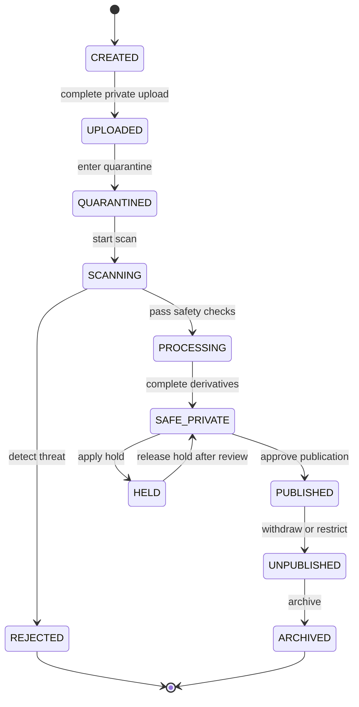
```mermaid
stateDiagram-v2
    [*] --> CREATED
    CREATED --> UPLOADED: complete private upload
    UPLOADED --> QUARANTINED: enter quarantine
    QUARANTINED --> SCANNING: start scan
    SCANNING --> PROCESSING: pass safety checks
    SCANNING --> REJECTED: detect threat
    PROCESSING --> SAFE_PRIVATE: complete derivatives
    SAFE_PRIVATE --> PUBLISHED: approve publication
    PUBLISHED --> UNPUBLISHED: withdraw or restrict
    SAFE_PRIVATE --> HELD: apply hold
    HELD --> SAFE_PRIVATE: release hold after review
    UNPUBLISHED --> ARCHIVED: archive
    REJECTED --> [*]
    ARCHIVED --> [*]
```

| Current State | Event | Required Actor | Preconditions | Authorization Scope | Next State | Records Produced | Audit Required | Notifications | Forbidden When |
| --- | --- | --- | --- | --- | --- | --- | --- | --- | --- |
| `CREATED` | complete private upload | Authorized Uploader; Media Processing Worker; Media Publisher | Current version is `CREATED`; required evidence/dependencies are valid; no blocking conflict or hold. | Current Workspace plus named administrative, resource, competition, assignment, case, device and time scope as applicable. | `UPLOADED` | Transition event; state/version record; outbox item; approval/reason evidence when sensitive. | Yes; denial is also audited when security-sensitive. | Affected actor/owner/approver and downstream services according to catalog and privacy policy. | Actor is unassigned, conflicted, stale, expired, cross-scope, lacks step-up/approval, or target is in an incompatible/terminal state. |
| `UPLOADED` | enter quarantine | Authorized Uploader; Media Processing Worker; Media Publisher | Current version is `UPLOADED`; required evidence/dependencies are valid; no blocking conflict or hold. | Current Workspace plus named administrative, resource, competition, assignment, case, device and time scope as applicable. | `QUARANTINED` | Transition event; state/version record; outbox item; approval/reason evidence when sensitive. | Yes; denial is also audited when security-sensitive. | Affected actor/owner/approver and downstream services according to catalog and privacy policy. | Actor is unassigned, conflicted, stale, expired, cross-scope, lacks step-up/approval, or target is in an incompatible/terminal state. |
| `QUARANTINED` | start scan | Authorized Uploader; Media Processing Worker; Media Publisher | Current version is `QUARANTINED`; required evidence/dependencies are valid; no blocking conflict or hold. | Current Workspace plus named administrative, resource, competition, assignment, case, device and time scope as applicable. | `SCANNING` | Transition event; state/version record; outbox item; approval/reason evidence when sensitive. | Yes; denial is also audited when security-sensitive. | Affected actor/owner/approver and downstream services according to catalog and privacy policy. | Actor is unassigned, conflicted, stale, expired, cross-scope, lacks step-up/approval, or target is in an incompatible/terminal state. |
| `SCANNING` | pass safety checks | Authorized Uploader; Media Processing Worker; Media Publisher | Current version is `SCANNING`; required evidence/dependencies are valid; no blocking conflict or hold. | Current Workspace plus named administrative, resource, competition, assignment, case, device and time scope as applicable. | `PROCESSING` | Transition event; state/version record; outbox item; approval/reason evidence when sensitive. | Yes; denial is also audited when security-sensitive. | Affected actor/owner/approver and downstream services according to catalog and privacy policy. | Actor is unassigned, conflicted, stale, expired, cross-scope, lacks step-up/approval, or target is in an incompatible/terminal state. |
| `SCANNING` | detect threat | Authorized Uploader; Media Processing Worker; Media Publisher | Current version is `SCANNING`; required evidence/dependencies are valid; no blocking conflict or hold. | Current Workspace plus named administrative, resource, competition, assignment, case, device and time scope as applicable. | `REJECTED` | Transition event; state/version record; outbox item; approval/reason evidence when sensitive. | Yes; denial is also audited when security-sensitive. | Affected actor/owner/approver and downstream services according to catalog and privacy policy. | Actor is unassigned, conflicted, stale, expired, cross-scope, lacks step-up/approval, or target is in an incompatible/terminal state. |
| `PROCESSING` | complete derivatives | Authorized Uploader; Media Processing Worker; Media Publisher | Current version is `PROCESSING`; required evidence/dependencies are valid; no blocking conflict or hold. | Current Workspace plus named administrative, resource, competition, assignment, case, device and time scope as applicable. | `SAFE_PRIVATE` | Transition event; state/version record; outbox item; approval/reason evidence when sensitive. | Yes; denial is also audited when security-sensitive. | Affected actor/owner/approver and downstream services according to catalog and privacy policy. | Actor is unassigned, conflicted, stale, expired, cross-scope, lacks step-up/approval, or target is in an incompatible/terminal state. |
| `SAFE_PRIVATE` | approve publication | Authorized Uploader; Media Processing Worker; Media Publisher | Current version is `SAFE_PRIVATE`; required evidence/dependencies are valid; no blocking conflict or hold. | Current Workspace plus named administrative, resource, competition, assignment, case, device and time scope as applicable. | `PUBLISHED` | Transition event; state/version record; outbox item; approval/reason evidence when sensitive. | Yes; denial is also audited when security-sensitive. | Affected actor/owner/approver and downstream services according to catalog and privacy policy. | Actor is unassigned, conflicted, stale, expired, cross-scope, lacks step-up/approval, or target is in an incompatible/terminal state. |
| `PUBLISHED` | withdraw or restrict | Authorized Uploader; Media Processing Worker; Media Publisher | Current version is `PUBLISHED`; required evidence/dependencies are valid; no blocking conflict or hold. | Current Workspace plus named administrative, resource, competition, assignment, case, device and time scope as applicable. | `UNPUBLISHED` | Transition event; state/version record; outbox item; approval/reason evidence when sensitive. | Yes; denial is also audited when security-sensitive. | Affected actor/owner/approver and downstream services according to catalog and privacy policy. | Actor is unassigned, conflicted, stale, expired, cross-scope, lacks step-up/approval, or target is in an incompatible/terminal state. |
| `SAFE_PRIVATE` | apply hold | Authorized Uploader; Media Processing Worker; Media Publisher | Current version is `SAFE_PRIVATE`; required evidence/dependencies are valid; no blocking conflict or hold. | Current Workspace plus named administrative, resource, competition, assignment, case, device and time scope as applicable. | `HELD` | Transition event; state/version record; outbox item; approval/reason evidence when sensitive. | Yes; denial is also audited when security-sensitive. | Affected actor/owner/approver and downstream services according to catalog and privacy policy. | Actor is unassigned, conflicted, stale, expired, cross-scope, lacks step-up/approval, or target is in an incompatible/terminal state. |
| `HELD` | release hold after review | Authorized Uploader; Media Processing Worker; Media Publisher | Current version is `HELD`; required evidence/dependencies are valid; no blocking conflict or hold. | Current Workspace plus named administrative, resource, competition, assignment, case, device and time scope as applicable. | `SAFE_PRIVATE` | Transition event; state/version record; outbox item; approval/reason evidence when sensitive. | Yes; denial is also audited when security-sensitive. | Affected actor/owner/approver and downstream services according to catalog and privacy policy. | Actor is unassigned, conflicted, stale, expired, cross-scope, lacks step-up/approval, or target is in an incompatible/terminal state. |
| `UNPUBLISHED` | archive | Authorized Uploader; Media Processing Worker; Media Publisher | Current version is `UNPUBLISHED`; required evidence/dependencies are valid; no blocking conflict or hold. | Current Workspace plus named administrative, resource, competition, assignment, case, device and time scope as applicable. | `ARCHIVED` | Transition event; state/version record; outbox item; approval/reason evidence when sensitive. | Yes; denial is also audited when security-sensitive. | Affected actor/owner/approver and downstream services according to catalog and privacy policy. | Actor is unassigned, conflicted, stale, expired, cross-scope, lacks step-up/approval, or target is in an incompatible/terminal state. |

## QMDB-SM-021 — Recitation Clip

| Lifecycle property | Definition |
| --- | --- |
| Initial state | `DRAFT` |
| Terminal states | `REJECTED`, `ARCHIVED` |
| Triggering actors | Reciter; Guardian; Media Moderator. |
| Reversible transitions | Only transitions with an explicit return, resume, restore, resubmit, reinstate, or successor event; the previous event/version remains preserved. |
| Irreversible transitions | Terminal transition, issuance/finalization, accepted official submission, revocation, archival, rejection, and supersession are not reversed in place; correction uses a new governed record/version. |
| Step-up authentication | Required for privileged approval, activation, lock, reopen, finalization, correction, revocation, suspension, export/elevation, and emergency transitions; ordinary public/read events do not qualify. |
| Multi-person approval | Required for high-risk governance transitions and prohibited from self-approval; exact role/quorum is OD-034. |
| Audit requirements | Actor/service identity, effective role, Workspace/administrative/assignment scope, current and next state, resource/version, event, reason/evidence/approval, server time and correlation. |
| Side effects | Durable domain/outbox event, affected capability recalculation, notification intent, projection invalidation/rebuild, and dependent-record review as applicable. |
| Prohibited transitions | Skipping required intermediate gates, mutating a terminal/former version, stale-version transition, client-authoritative state, cross-workspace transition, self-approval, or transition after authority expiry. |
| Cancellation, suspension, timeout | Preserve the current/former state and evidence; revoke further action; notify affected parties; reconcile dependent assignments, deadlines and projections; require explicit resume/new version. |
| Former official versions | Preserved and linked by version/supersession identifiers wherever the lifecycle can become official or publicly represented. |
| Related functional requirements | QMDB-FR-SOC-001, QMDB-FR-SOC-002. |

```mermaid
stateDiagram-v2
    [*] --> DRAFT
    DRAFT --> PROCESSING: submit media processing
    PROCESSING --> PENDING_APPROVAL: require guardian approval
    PROCESSING --> PENDING_MODERATION: submit moderation
    PENDING_APPROVAL --> PENDING_MODERATION: guardian approves
    PENDING_APPROVAL --> REJECTED: guardian refuses
    PENDING_MODERATION --> PUBLISHED: approve publication
    PENDING_MODERATION --> REJECTED: reject
    PUBLISHED --> LIMITED: limit visibility
    PUBLISHED --> REMOVED: remove
    REMOVED --> RESTORED: restore after appeal
    RESTORED --> PUBLISHED: republish
    LIMITED --> ARCHIVED: archive
    REJECTED --> [*]
    ARCHIVED --> [*]
```

| Current State | Event | Required Actor | Preconditions | Authorization Scope | Next State | Records Produced | Audit Required | Notifications | Forbidden When |
| --- | --- | --- | --- | --- | --- | --- | --- | --- | --- |
| `DRAFT` | submit media processing | Reciter; Guardian; Media Moderator | Current version is `DRAFT`; required evidence/dependencies are valid; no blocking conflict or hold. | Current Workspace plus named administrative, resource, competition, assignment, case, device and time scope as applicable. | `PROCESSING` | Transition event; state/version record; outbox item; approval/reason evidence when sensitive. | Yes; denial is also audited when security-sensitive. | Affected actor/owner/approver and downstream services according to catalog and privacy policy. | Actor is unassigned, conflicted, stale, expired, cross-scope, lacks step-up/approval, or target is in an incompatible/terminal state. |
| `PROCESSING` | require guardian approval | Reciter; Guardian; Media Moderator | Current version is `PROCESSING`; required evidence/dependencies are valid; no blocking conflict or hold. | Current Workspace plus named administrative, resource, competition, assignment, case, device and time scope as applicable. | `PENDING_APPROVAL` | Transition event; state/version record; outbox item; approval/reason evidence when sensitive. | Yes; denial is also audited when security-sensitive. | Affected actor/owner/approver and downstream services according to catalog and privacy policy. | Actor is unassigned, conflicted, stale, expired, cross-scope, lacks step-up/approval, or target is in an incompatible/terminal state. |
| `PROCESSING` | submit moderation | Reciter; Guardian; Media Moderator | Current version is `PROCESSING`; required evidence/dependencies are valid; no blocking conflict or hold. | Current Workspace plus named administrative, resource, competition, assignment, case, device and time scope as applicable. | `PENDING_MODERATION` | Transition event; state/version record; outbox item; approval/reason evidence when sensitive. | Yes; denial is also audited when security-sensitive. | Affected actor/owner/approver and downstream services according to catalog and privacy policy. | Actor is unassigned, conflicted, stale, expired, cross-scope, lacks step-up/approval, or target is in an incompatible/terminal state. |
| `PENDING_APPROVAL` | guardian approves | Reciter; Guardian; Media Moderator | Current version is `PENDING_APPROVAL`; required evidence/dependencies are valid; no blocking conflict or hold. | Current Workspace plus named administrative, resource, competition, assignment, case, device and time scope as applicable. | `PENDING_MODERATION` | Transition event; state/version record; outbox item; approval/reason evidence when sensitive. | Yes; denial is also audited when security-sensitive. | Affected actor/owner/approver and downstream services according to catalog and privacy policy. | Actor is unassigned, conflicted, stale, expired, cross-scope, lacks step-up/approval, or target is in an incompatible/terminal state. |
| `PENDING_APPROVAL` | guardian refuses | Reciter; Guardian; Media Moderator | Current version is `PENDING_APPROVAL`; required evidence/dependencies are valid; no blocking conflict or hold. | Current Workspace plus named administrative, resource, competition, assignment, case, device and time scope as applicable. | `REJECTED` | Transition event; state/version record; outbox item; approval/reason evidence when sensitive. | Yes; denial is also audited when security-sensitive. | Affected actor/owner/approver and downstream services according to catalog and privacy policy. | Actor is unassigned, conflicted, stale, expired, cross-scope, lacks step-up/approval, or target is in an incompatible/terminal state. |
| `PENDING_MODERATION` | approve publication | Reciter; Guardian; Media Moderator | Current version is `PENDING_MODERATION`; required evidence/dependencies are valid; no blocking conflict or hold. | Current Workspace plus named administrative, resource, competition, assignment, case, device and time scope as applicable. | `PUBLISHED` | Transition event; state/version record; outbox item; approval/reason evidence when sensitive. | Yes; denial is also audited when security-sensitive. | Affected actor/owner/approver and downstream services according to catalog and privacy policy. | Actor is unassigned, conflicted, stale, expired, cross-scope, lacks step-up/approval, or target is in an incompatible/terminal state. |
| `PENDING_MODERATION` | reject | Reciter; Guardian; Media Moderator | Current version is `PENDING_MODERATION`; required evidence/dependencies are valid; no blocking conflict or hold. | Current Workspace plus named administrative, resource, competition, assignment, case, device and time scope as applicable. | `REJECTED` | Transition event; state/version record; outbox item; approval/reason evidence when sensitive. | Yes; denial is also audited when security-sensitive. | Affected actor/owner/approver and downstream services according to catalog and privacy policy. | Actor is unassigned, conflicted, stale, expired, cross-scope, lacks step-up/approval, or target is in an incompatible/terminal state. |
| `PUBLISHED` | limit visibility | Reciter; Guardian; Media Moderator | Current version is `PUBLISHED`; required evidence/dependencies are valid; no blocking conflict or hold. | Current Workspace plus named administrative, resource, competition, assignment, case, device and time scope as applicable. | `LIMITED` | Transition event; state/version record; outbox item; approval/reason evidence when sensitive. | Yes; denial is also audited when security-sensitive. | Affected actor/owner/approver and downstream services according to catalog and privacy policy. | Actor is unassigned, conflicted, stale, expired, cross-scope, lacks step-up/approval, or target is in an incompatible/terminal state. |
| `PUBLISHED` | remove | Reciter; Guardian; Media Moderator | Current version is `PUBLISHED`; required evidence/dependencies are valid; no blocking conflict or hold. | Current Workspace plus named administrative, resource, competition, assignment, case, device and time scope as applicable. | `REMOVED` | Transition event; state/version record; outbox item; approval/reason evidence when sensitive. | Yes; denial is also audited when security-sensitive. | Affected actor/owner/approver and downstream services according to catalog and privacy policy. | Actor is unassigned, conflicted, stale, expired, cross-scope, lacks step-up/approval, or target is in an incompatible/terminal state. |
| `REMOVED` | restore after appeal | Reciter; Guardian; Media Moderator | Current version is `REMOVED`; required evidence/dependencies are valid; no blocking conflict or hold. | Current Workspace plus named administrative, resource, competition, assignment, case, device and time scope as applicable. | `RESTORED` | Transition event; state/version record; outbox item; approval/reason evidence when sensitive. | Yes; denial is also audited when security-sensitive. | Affected actor/owner/approver and downstream services according to catalog and privacy policy. | Actor is unassigned, conflicted, stale, expired, cross-scope, lacks step-up/approval, or target is in an incompatible/terminal state. |
| `RESTORED` | republish | Reciter; Guardian; Media Moderator | Current version is `RESTORED`; required evidence/dependencies are valid; no blocking conflict or hold. | Current Workspace plus named administrative, resource, competition, assignment, case, device and time scope as applicable. | `PUBLISHED` | Transition event; state/version record; outbox item; approval/reason evidence when sensitive. | Yes; denial is also audited when security-sensitive. | Affected actor/owner/approver and downstream services according to catalog and privacy policy. | Actor is unassigned, conflicted, stale, expired, cross-scope, lacks step-up/approval, or target is in an incompatible/terminal state. |
| `LIMITED` | archive | Reciter; Guardian; Media Moderator | Current version is `LIMITED`; required evidence/dependencies are valid; no blocking conflict or hold. | Current Workspace plus named administrative, resource, competition, assignment, case, device and time scope as applicable. | `ARCHIVED` | Transition event; state/version record; outbox item; approval/reason evidence when sensitive. | Yes; denial is also audited when security-sensitive. | Affected actor/owner/approver and downstream services according to catalog and privacy policy. | Actor is unassigned, conflicted, stale, expired, cross-scope, lacks step-up/approval, or target is in an incompatible/terminal state. |

## QMDB-SM-022 — Moderation Case

| Lifecycle property | Definition |
| --- | --- |
| Initial state | `OPEN` |
| Terminal states | `CLOSED` |
| Triggering actors | Media Moderator; Community-Safety Officer. |
| Reversible transitions | Only transitions with an explicit return, resume, restore, resubmit, reinstate, or successor event; the previous event/version remains preserved. |
| Irreversible transitions | Terminal transition, issuance/finalization, accepted official submission, revocation, archival, rejection, and supersession are not reversed in place; correction uses a new governed record/version. |
| Step-up authentication | Required for privileged approval, activation, lock, reopen, finalization, correction, revocation, suspension, export/elevation, and emergency transitions; ordinary public/read events do not qualify. |
| Multi-person approval | Required for high-risk governance transitions and prohibited from self-approval; exact role/quorum is OD-034. |
| Audit requirements | Actor/service identity, effective role, Workspace/administrative/assignment scope, current and next state, resource/version, event, reason/evidence/approval, server time and correlation. |
| Side effects | Durable domain/outbox event, affected capability recalculation, notification intent, projection invalidation/rebuild, and dependent-record review as applicable. |
| Prohibited transitions | Skipping required intermediate gates, mutating a terminal/former version, stale-version transition, client-authoritative state, cross-workspace transition, self-approval, or transition after authority expiry. |
| Cancellation, suspension, timeout | Preserve the current/former state and evidence; revoke further action; notify affected parties; reconcile dependent assignments, deadlines and projections; require explicit resume/new version. |
| Former official versions | Preserved and linked by version/supersession identifiers wherever the lifecycle can become official or publicly represented. |
| Related functional requirements | QMDB-FR-MOD-001, QMDB-FR-MOD-002. |

```mermaid
stateDiagram-v2
    [*] --> OPEN
    OPEN --> TRIAGED: triage and prioritize
    TRIAGED --> ASSIGNED: assign conflict-free reviewer
    ASSIGNED --> UNDER_REVIEW: begin review
    UNDER_REVIEW --> ACTIONED: apply action
    UNDER_REVIEW --> ESCALATED: escalate safety or security
    ACTIONED --> APPEALED: receive eligible appeal
    ACTIONED --> CLOSED: close after notice/review window
    ESCALATED --> CLOSED: resolve handoff
    CLOSED --> [*]
```

| Current State | Event | Required Actor | Preconditions | Authorization Scope | Next State | Records Produced | Audit Required | Notifications | Forbidden When |
| --- | --- | --- | --- | --- | --- | --- | --- | --- | --- |
| `OPEN` | triage and prioritize | Media Moderator; Community-Safety Officer | Current version is `OPEN`; required evidence/dependencies are valid; no blocking conflict or hold. | Current Workspace plus named administrative, resource, competition, assignment, case, device and time scope as applicable. | `TRIAGED` | Transition event; state/version record; outbox item; approval/reason evidence when sensitive. | Yes; denial is also audited when security-sensitive. | Affected actor/owner/approver and downstream services according to catalog and privacy policy. | Actor is unassigned, conflicted, stale, expired, cross-scope, lacks step-up/approval, or target is in an incompatible/terminal state. |
| `TRIAGED` | assign conflict-free reviewer | Media Moderator; Community-Safety Officer | Current version is `TRIAGED`; required evidence/dependencies are valid; no blocking conflict or hold. | Current Workspace plus named administrative, resource, competition, assignment, case, device and time scope as applicable. | `ASSIGNED` | Transition event; state/version record; outbox item; approval/reason evidence when sensitive. | Yes; denial is also audited when security-sensitive. | Affected actor/owner/approver and downstream services according to catalog and privacy policy. | Actor is unassigned, conflicted, stale, expired, cross-scope, lacks step-up/approval, or target is in an incompatible/terminal state. |
| `ASSIGNED` | begin review | Media Moderator; Community-Safety Officer | Current version is `ASSIGNED`; required evidence/dependencies are valid; no blocking conflict or hold. | Current Workspace plus named administrative, resource, competition, assignment, case, device and time scope as applicable. | `UNDER_REVIEW` | Transition event; state/version record; outbox item; approval/reason evidence when sensitive. | Yes; denial is also audited when security-sensitive. | Affected actor/owner/approver and downstream services according to catalog and privacy policy. | Actor is unassigned, conflicted, stale, expired, cross-scope, lacks step-up/approval, or target is in an incompatible/terminal state. |
| `UNDER_REVIEW` | apply action | Media Moderator; Community-Safety Officer | Current version is `UNDER_REVIEW`; required evidence/dependencies are valid; no blocking conflict or hold. | Current Workspace plus named administrative, resource, competition, assignment, case, device and time scope as applicable. | `ACTIONED` | Transition event; state/version record; outbox item; approval/reason evidence when sensitive. | Yes; denial is also audited when security-sensitive. | Affected actor/owner/approver and downstream services according to catalog and privacy policy. | Actor is unassigned, conflicted, stale, expired, cross-scope, lacks step-up/approval, or target is in an incompatible/terminal state. |
| `UNDER_REVIEW` | escalate safety or security | Media Moderator; Community-Safety Officer | Current version is `UNDER_REVIEW`; required evidence/dependencies are valid; no blocking conflict or hold. | Current Workspace plus named administrative, resource, competition, assignment, case, device and time scope as applicable. | `ESCALATED` | Transition event; state/version record; outbox item; approval/reason evidence when sensitive. | Yes; denial is also audited when security-sensitive. | Affected actor/owner/approver and downstream services according to catalog and privacy policy. | Actor is unassigned, conflicted, stale, expired, cross-scope, lacks step-up/approval, or target is in an incompatible/terminal state. |
| `ACTIONED` | receive eligible appeal | Media Moderator; Community-Safety Officer | Current version is `ACTIONED`; required evidence/dependencies are valid; no blocking conflict or hold. | Current Workspace plus named administrative, resource, competition, assignment, case, device and time scope as applicable. | `APPEALED` | Transition event; state/version record; outbox item; approval/reason evidence when sensitive. | Yes; denial is also audited when security-sensitive. | Affected actor/owner/approver and downstream services according to catalog and privacy policy. | Actor is unassigned, conflicted, stale, expired, cross-scope, lacks step-up/approval, or target is in an incompatible/terminal state. |
| `ACTIONED` | close after notice/review window | Media Moderator; Community-Safety Officer | Current version is `ACTIONED`; required evidence/dependencies are valid; no blocking conflict or hold. | Current Workspace plus named administrative, resource, competition, assignment, case, device and time scope as applicable. | `CLOSED` | Transition event; state/version record; outbox item; approval/reason evidence when sensitive. | Yes; denial is also audited when security-sensitive. | Affected actor/owner/approver and downstream services according to catalog and privacy policy. | Actor is unassigned, conflicted, stale, expired, cross-scope, lacks step-up/approval, or target is in an incompatible/terminal state. |
| `ESCALATED` | resolve handoff | Media Moderator; Community-Safety Officer | Current version is `ESCALATED`; required evidence/dependencies are valid; no blocking conflict or hold. | Current Workspace plus named administrative, resource, competition, assignment, case, device and time scope as applicable. | `CLOSED` | Transition event; state/version record; outbox item; approval/reason evidence when sensitive. | Yes; denial is also audited when security-sensitive. | Affected actor/owner/approver and downstream services according to catalog and privacy policy. | Actor is unassigned, conflicted, stale, expired, cross-scope, lacks step-up/approval, or target is in an incompatible/terminal state. |

## QMDB-SM-023 — Content Appeal

| Lifecycle property | Definition |
| --- | --- |
| Initial state | `SUBMITTED` |
| Terminal states | `UPHELD`, `VARIED`, `OVERTURNED`, `CLOSED` |
| Triggering actors | Content Owner; Independent Appeal Reviewer. |
| Reversible transitions | Only transitions with an explicit return, resume, restore, resubmit, reinstate, or successor event; the previous event/version remains preserved. |
| Irreversible transitions | Terminal transition, issuance/finalization, accepted official submission, revocation, archival, rejection, and supersession are not reversed in place; correction uses a new governed record/version. |
| Step-up authentication | Required for privileged approval, activation, lock, reopen, finalization, correction, revocation, suspension, export/elevation, and emergency transitions; ordinary public/read events do not qualify. |
| Multi-person approval | Required for high-risk governance transitions and prohibited from self-approval; exact role/quorum is OD-034. |
| Audit requirements | Actor/service identity, effective role, Workspace/administrative/assignment scope, current and next state, resource/version, event, reason/evidence/approval, server time and correlation. |
| Side effects | Durable domain/outbox event, affected capability recalculation, notification intent, projection invalidation/rebuild, and dependent-record review as applicable. |
| Prohibited transitions | Skipping required intermediate gates, mutating a terminal/former version, stale-version transition, client-authoritative state, cross-workspace transition, self-approval, or transition after authority expiry. |
| Cancellation, suspension, timeout | Preserve the current/former state and evidence; revoke further action; notify affected parties; reconcile dependent assignments, deadlines and projections; require explicit resume/new version. |
| Former official versions | Preserved and linked by version/supersession identifiers wherever the lifecycle can become official or publicly represented. |
| Related functional requirements | QMDB-FR-MOD-002. |

```mermaid
stateDiagram-v2
    [*] --> SUBMITTED
    SUBMITTED --> ELIGIBILITY_REVIEW: check eligibility
    ELIGIBILITY_REVIEW --> UNDER_REVIEW: accept
    ELIGIBILITY_REVIEW --> CLOSED: reject with reason
    UNDER_REVIEW --> UPHELD: uphold action
    UNDER_REVIEW --> VARIED: vary action
    UNDER_REVIEW --> OVERTURNED: overturn and restore
    UPHELD --> [*]
    VARIED --> [*]
    OVERTURNED --> [*]
    CLOSED --> [*]
```

| Current State | Event | Required Actor | Preconditions | Authorization Scope | Next State | Records Produced | Audit Required | Notifications | Forbidden When |
| --- | --- | --- | --- | --- | --- | --- | --- | --- | --- |
| `SUBMITTED` | check eligibility | Content Owner; Independent Appeal Reviewer | Current version is `SUBMITTED`; required evidence/dependencies are valid; no blocking conflict or hold. | Current Workspace plus named administrative, resource, competition, assignment, case, device and time scope as applicable. | `ELIGIBILITY_REVIEW` | Transition event; state/version record; outbox item; approval/reason evidence when sensitive. | Yes; denial is also audited when security-sensitive. | Affected actor/owner/approver and downstream services according to catalog and privacy policy. | Actor is unassigned, conflicted, stale, expired, cross-scope, lacks step-up/approval, or target is in an incompatible/terminal state. |
| `ELIGIBILITY_REVIEW` | accept | Content Owner; Independent Appeal Reviewer | Current version is `ELIGIBILITY_REVIEW`; required evidence/dependencies are valid; no blocking conflict or hold. | Current Workspace plus named administrative, resource, competition, assignment, case, device and time scope as applicable. | `UNDER_REVIEW` | Transition event; state/version record; outbox item; approval/reason evidence when sensitive. | Yes; denial is also audited when security-sensitive. | Affected actor/owner/approver and downstream services according to catalog and privacy policy. | Actor is unassigned, conflicted, stale, expired, cross-scope, lacks step-up/approval, or target is in an incompatible/terminal state. |
| `ELIGIBILITY_REVIEW` | reject with reason | Content Owner; Independent Appeal Reviewer | Current version is `ELIGIBILITY_REVIEW`; required evidence/dependencies are valid; no blocking conflict or hold. | Current Workspace plus named administrative, resource, competition, assignment, case, device and time scope as applicable. | `CLOSED` | Transition event; state/version record; outbox item; approval/reason evidence when sensitive. | Yes; denial is also audited when security-sensitive. | Affected actor/owner/approver and downstream services according to catalog and privacy policy. | Actor is unassigned, conflicted, stale, expired, cross-scope, lacks step-up/approval, or target is in an incompatible/terminal state. |
| `UNDER_REVIEW` | uphold action | Content Owner; Independent Appeal Reviewer | Current version is `UNDER_REVIEW`; required evidence/dependencies are valid; no blocking conflict or hold. | Current Workspace plus named administrative, resource, competition, assignment, case, device and time scope as applicable. | `UPHELD` | Transition event; state/version record; outbox item; approval/reason evidence when sensitive. | Yes; denial is also audited when security-sensitive. | Affected actor/owner/approver and downstream services according to catalog and privacy policy. | Actor is unassigned, conflicted, stale, expired, cross-scope, lacks step-up/approval, or target is in an incompatible/terminal state. |
| `UNDER_REVIEW` | vary action | Content Owner; Independent Appeal Reviewer | Current version is `UNDER_REVIEW`; required evidence/dependencies are valid; no blocking conflict or hold. | Current Workspace plus named administrative, resource, competition, assignment, case, device and time scope as applicable. | `VARIED` | Transition event; state/version record; outbox item; approval/reason evidence when sensitive. | Yes; denial is also audited when security-sensitive. | Affected actor/owner/approver and downstream services according to catalog and privacy policy. | Actor is unassigned, conflicted, stale, expired, cross-scope, lacks step-up/approval, or target is in an incompatible/terminal state. |
| `UNDER_REVIEW` | overturn and restore | Content Owner; Independent Appeal Reviewer | Current version is `UNDER_REVIEW`; required evidence/dependencies are valid; no blocking conflict or hold. | Current Workspace plus named administrative, resource, competition, assignment, case, device and time scope as applicable. | `OVERTURNED` | Transition event; state/version record; outbox item; approval/reason evidence when sensitive. | Yes; denial is also audited when security-sensitive. | Affected actor/owner/approver and downstream services according to catalog and privacy policy. | Actor is unassigned, conflicted, stale, expired, cross-scope, lacks step-up/approval, or target is in an incompatible/terminal state. |

## QMDB-SM-024 — Privacy Request

| Lifecycle property | Definition |
| --- | --- |
| Initial state | `SUBMITTED` |
| Terminal states | `FULFILLED`, `PARTIALLY_FULFILLED`, `REJECTED`, `CLOSED`, `CANCELLED` |
| Triggering actors | Data Subject; Data-Protection or Privacy Officer. |
| Reversible transitions | Only transitions with an explicit return, resume, restore, resubmit, reinstate, or successor event; the previous event/version remains preserved. |
| Irreversible transitions | Terminal transition, issuance/finalization, accepted official submission, revocation, archival, rejection, and supersession are not reversed in place; correction uses a new governed record/version. |
| Step-up authentication | Required for privileged approval, activation, lock, reopen, finalization, correction, revocation, suspension, export/elevation, and emergency transitions; ordinary public/read events do not qualify. |
| Multi-person approval | Required for high-risk governance transitions and prohibited from self-approval; exact role/quorum is OD-034. |
| Audit requirements | Actor/service identity, effective role, Workspace/administrative/assignment scope, current and next state, resource/version, event, reason/evidence/approval, server time and correlation. |
| Side effects | Durable domain/outbox event, affected capability recalculation, notification intent, projection invalidation/rebuild, and dependent-record review as applicable. |
| Prohibited transitions | Skipping required intermediate gates, mutating a terminal/former version, stale-version transition, client-authoritative state, cross-workspace transition, self-approval, or transition after authority expiry. |
| Cancellation, suspension, timeout | Preserve the current/former state and evidence; revoke further action; notify affected parties; reconcile dependent assignments, deadlines and projections; require explicit resume/new version. |
| Former official versions | Preserved and linked by version/supersession identifiers wherever the lifecycle can become official or publicly represented. |
| Related functional requirements | QMDB-FR-PRI-002, QMDB-FR-PRI-003. |

```mermaid
stateDiagram-v2
    [*] --> SUBMITTED
    SUBMITTED --> IDENTITY_PENDING: request identity proof
    IDENTITY_PENDING --> VERIFIED: verify identity/authority
    VERIFIED --> ASSIGNED: assign case
    ASSIGNED --> DISCOVERY: discover affected records
    DISCOVERY --> DECISION_PENDING: prepare reviewed decision
    DECISION_PENDING --> FULFILLED: fulfill
    DECISION_PENDING --> PARTIALLY_FULFILLED: partially fulfill
    DECISION_PENDING --> REJECTED: reject with reason
    FULFILLED --> CLOSED: confirm delivery and close
    SUBMITTED --> CANCELLED: withdraw request
    FULFILLED --> [*]
    PARTIALLY_FULFILLED --> [*]
    REJECTED --> [*]
    CLOSED --> [*]
    CANCELLED --> [*]
```

| Current State | Event | Required Actor | Preconditions | Authorization Scope | Next State | Records Produced | Audit Required | Notifications | Forbidden When |
| --- | --- | --- | --- | --- | --- | --- | --- | --- | --- |
| `SUBMITTED` | request identity proof | Data Subject; Data-Protection or Privacy Officer | Current version is `SUBMITTED`; required evidence/dependencies are valid; no blocking conflict or hold. | Current Workspace plus named administrative, resource, competition, assignment, case, device and time scope as applicable. | `IDENTITY_PENDING` | Transition event; state/version record; outbox item; approval/reason evidence when sensitive. | Yes; denial is also audited when security-sensitive. | Affected actor/owner/approver and downstream services according to catalog and privacy policy. | Actor is unassigned, conflicted, stale, expired, cross-scope, lacks step-up/approval, or target is in an incompatible/terminal state. |
| `IDENTITY_PENDING` | verify identity/authority | Data Subject; Data-Protection or Privacy Officer | Current version is `IDENTITY_PENDING`; required evidence/dependencies are valid; no blocking conflict or hold. | Current Workspace plus named administrative, resource, competition, assignment, case, device and time scope as applicable. | `VERIFIED` | Transition event; state/version record; outbox item; approval/reason evidence when sensitive. | Yes; denial is also audited when security-sensitive. | Affected actor/owner/approver and downstream services according to catalog and privacy policy. | Actor is unassigned, conflicted, stale, expired, cross-scope, lacks step-up/approval, or target is in an incompatible/terminal state. |
| `VERIFIED` | assign case | Data Subject; Data-Protection or Privacy Officer | Current version is `VERIFIED`; required evidence/dependencies are valid; no blocking conflict or hold. | Current Workspace plus named administrative, resource, competition, assignment, case, device and time scope as applicable. | `ASSIGNED` | Transition event; state/version record; outbox item; approval/reason evidence when sensitive. | Yes; denial is also audited when security-sensitive. | Affected actor/owner/approver and downstream services according to catalog and privacy policy. | Actor is unassigned, conflicted, stale, expired, cross-scope, lacks step-up/approval, or target is in an incompatible/terminal state. |
| `ASSIGNED` | discover affected records | Data Subject; Data-Protection or Privacy Officer | Current version is `ASSIGNED`; required evidence/dependencies are valid; no blocking conflict or hold. | Current Workspace plus named administrative, resource, competition, assignment, case, device and time scope as applicable. | `DISCOVERY` | Transition event; state/version record; outbox item; approval/reason evidence when sensitive. | Yes; denial is also audited when security-sensitive. | Affected actor/owner/approver and downstream services according to catalog and privacy policy. | Actor is unassigned, conflicted, stale, expired, cross-scope, lacks step-up/approval, or target is in an incompatible/terminal state. |
| `DISCOVERY` | prepare reviewed decision | Data Subject; Data-Protection or Privacy Officer | Current version is `DISCOVERY`; required evidence/dependencies are valid; no blocking conflict or hold. | Current Workspace plus named administrative, resource, competition, assignment, case, device and time scope as applicable. | `DECISION_PENDING` | Transition event; state/version record; outbox item; approval/reason evidence when sensitive. | Yes; denial is also audited when security-sensitive. | Affected actor/owner/approver and downstream services according to catalog and privacy policy. | Actor is unassigned, conflicted, stale, expired, cross-scope, lacks step-up/approval, or target is in an incompatible/terminal state. |
| `DECISION_PENDING` | fulfill | Data Subject; Data-Protection or Privacy Officer | Current version is `DECISION_PENDING`; required evidence/dependencies are valid; no blocking conflict or hold. | Current Workspace plus named administrative, resource, competition, assignment, case, device and time scope as applicable. | `FULFILLED` | Transition event; state/version record; outbox item; approval/reason evidence when sensitive. | Yes; denial is also audited when security-sensitive. | Affected actor/owner/approver and downstream services according to catalog and privacy policy. | Actor is unassigned, conflicted, stale, expired, cross-scope, lacks step-up/approval, or target is in an incompatible/terminal state. |
| `DECISION_PENDING` | partially fulfill | Data Subject; Data-Protection or Privacy Officer | Current version is `DECISION_PENDING`; required evidence/dependencies are valid; no blocking conflict or hold. | Current Workspace plus named administrative, resource, competition, assignment, case, device and time scope as applicable. | `PARTIALLY_FULFILLED` | Transition event; state/version record; outbox item; approval/reason evidence when sensitive. | Yes; denial is also audited when security-sensitive. | Affected actor/owner/approver and downstream services according to catalog and privacy policy. | Actor is unassigned, conflicted, stale, expired, cross-scope, lacks step-up/approval, or target is in an incompatible/terminal state. |
| `DECISION_PENDING` | reject with reason | Data Subject; Data-Protection or Privacy Officer | Current version is `DECISION_PENDING`; required evidence/dependencies are valid; no blocking conflict or hold. | Current Workspace plus named administrative, resource, competition, assignment, case, device and time scope as applicable. | `REJECTED` | Transition event; state/version record; outbox item; approval/reason evidence when sensitive. | Yes; denial is also audited when security-sensitive. | Affected actor/owner/approver and downstream services according to catalog and privacy policy. | Actor is unassigned, conflicted, stale, expired, cross-scope, lacks step-up/approval, or target is in an incompatible/terminal state. |
| `FULFILLED` | confirm delivery and close | Data Subject; Data-Protection or Privacy Officer | Current version is `FULFILLED`; required evidence/dependencies are valid; no blocking conflict or hold. | Current Workspace plus named administrative, resource, competition, assignment, case, device and time scope as applicable. | `CLOSED` | Transition event; state/version record; outbox item; approval/reason evidence when sensitive. | Yes; denial is also audited when security-sensitive. | Affected actor/owner/approver and downstream services according to catalog and privacy policy. | Actor is unassigned, conflicted, stale, expired, cross-scope, lacks step-up/approval, or target is in an incompatible/terminal state. |
| `SUBMITTED` | withdraw request | Data Subject; Data-Protection or Privacy Officer | Current version is `SUBMITTED`; required evidence/dependencies are valid; no blocking conflict or hold. | Current Workspace plus named administrative, resource, competition, assignment, case, device and time scope as applicable. | `CANCELLED` | Transition event; state/version record; outbox item; approval/reason evidence when sensitive. | Yes; denial is also audited when security-sensitive. | Affected actor/owner/approver and downstream services according to catalog and privacy policy. | Actor is unassigned, conflicted, stale, expired, cross-scope, lacks step-up/approval, or target is in an incompatible/terminal state. |

## QMDB-SM-025 — Support Access Grant

| Lifecycle property | Definition |
| --- | --- |
| Initial state | `REQUESTED` |
| Terminal states | `EXPIRED`, `REVOKED`, `CLOSED` |
| Triggering actors | Support Officer; Approving Role Category. |
| Reversible transitions | Only transitions with an explicit return, resume, restore, resubmit, reinstate, or successor event; the previous event/version remains preserved. |
| Irreversible transitions | Terminal transition, issuance/finalization, accepted official submission, revocation, archival, rejection, and supersession are not reversed in place; correction uses a new governed record/version. |
| Step-up authentication | Required for privileged approval, activation, lock, reopen, finalization, correction, revocation, suspension, export/elevation, and emergency transitions; ordinary public/read events do not qualify. |
| Multi-person approval | Required for high-risk governance transitions and prohibited from self-approval; exact role/quorum is OD-034. |
| Audit requirements | Actor/service identity, effective role, Workspace/administrative/assignment scope, current and next state, resource/version, event, reason/evidence/approval, server time and correlation. |
| Side effects | Durable domain/outbox event, affected capability recalculation, notification intent, projection invalidation/rebuild, and dependent-record review as applicable. |
| Prohibited transitions | Skipping required intermediate gates, mutating a terminal/former version, stale-version transition, client-authoritative state, cross-workspace transition, self-approval, or transition after authority expiry. |
| Cancellation, suspension, timeout | Preserve the current/former state and evidence; revoke further action; notify affected parties; reconcile dependent assignments, deadlines and projections; require explicit resume/new version. |
| Former official versions | Preserved and linked by version/supersession identifiers wherever the lifecycle can become official or publicly represented. |
| Related functional requirements | QMDB-FR-OPS-001. |

```mermaid
stateDiagram-v2
    [*] --> REQUESTED
    REQUESTED --> APPROVED: approve minimum scope
    APPROVED --> ACTIVE: activate support mode
    ACTIVE --> EXPIRED: reach expiry
    ACTIVE --> REVOKED: revoke on case or risk change
    EXPIRED --> CLOSED: complete review
    REVOKED --> CLOSED: complete review
    EXPIRED --> [*]
    REVOKED --> [*]
    CLOSED --> [*]
```

| Current State | Event | Required Actor | Preconditions | Authorization Scope | Next State | Records Produced | Audit Required | Notifications | Forbidden When |
| --- | --- | --- | --- | --- | --- | --- | --- | --- | --- |
| `REQUESTED` | approve minimum scope | Support Officer; Approving Role Category | Current version is `REQUESTED`; required evidence/dependencies are valid; no blocking conflict or hold. | Current Workspace plus named administrative, resource, competition, assignment, case, device and time scope as applicable. | `APPROVED` | Transition event; state/version record; outbox item; approval/reason evidence when sensitive. | Yes; denial is also audited when security-sensitive. | Affected actor/owner/approver and downstream services according to catalog and privacy policy. | Actor is unassigned, conflicted, stale, expired, cross-scope, lacks step-up/approval, or target is in an incompatible/terminal state. |
| `APPROVED` | activate support mode | Support Officer; Approving Role Category | Current version is `APPROVED`; required evidence/dependencies are valid; no blocking conflict or hold. | Current Workspace plus named administrative, resource, competition, assignment, case, device and time scope as applicable. | `ACTIVE` | Transition event; state/version record; outbox item; approval/reason evidence when sensitive. | Yes; denial is also audited when security-sensitive. | Affected actor/owner/approver and downstream services according to catalog and privacy policy. | Actor is unassigned, conflicted, stale, expired, cross-scope, lacks step-up/approval, or target is in an incompatible/terminal state. |
| `ACTIVE` | reach expiry | Support Officer; Approving Role Category | Current version is `ACTIVE`; required evidence/dependencies are valid; no blocking conflict or hold. | Current Workspace plus named administrative, resource, competition, assignment, case, device and time scope as applicable. | `EXPIRED` | Transition event; state/version record; outbox item; approval/reason evidence when sensitive. | Yes; denial is also audited when security-sensitive. | Affected actor/owner/approver and downstream services according to catalog and privacy policy. | Actor is unassigned, conflicted, stale, expired, cross-scope, lacks step-up/approval, or target is in an incompatible/terminal state. |
| `ACTIVE` | revoke on case or risk change | Support Officer; Approving Role Category | Current version is `ACTIVE`; required evidence/dependencies are valid; no blocking conflict or hold. | Current Workspace plus named administrative, resource, competition, assignment, case, device and time scope as applicable. | `REVOKED` | Transition event; state/version record; outbox item; approval/reason evidence when sensitive. | Yes; denial is also audited when security-sensitive. | Affected actor/owner/approver and downstream services according to catalog and privacy policy. | Actor is unassigned, conflicted, stale, expired, cross-scope, lacks step-up/approval, or target is in an incompatible/terminal state. |
| `EXPIRED` | complete review | Support Officer; Approving Role Category | Current version is `EXPIRED`; required evidence/dependencies are valid; no blocking conflict or hold. | Current Workspace plus named administrative, resource, competition, assignment, case, device and time scope as applicable. | `CLOSED` | Transition event; state/version record; outbox item; approval/reason evidence when sensitive. | Yes; denial is also audited when security-sensitive. | Affected actor/owner/approver and downstream services according to catalog and privacy policy. | Actor is unassigned, conflicted, stale, expired, cross-scope, lacks step-up/approval, or target is in an incompatible/terminal state. |
| `REVOKED` | complete review | Support Officer; Approving Role Category | Current version is `REVOKED`; required evidence/dependencies are valid; no blocking conflict or hold. | Current Workspace plus named administrative, resource, competition, assignment, case, device and time scope as applicable. | `CLOSED` | Transition event; state/version record; outbox item; approval/reason evidence when sensitive. | Yes; denial is also audited when security-sensitive. | Affected actor/owner/approver and downstream services according to catalog and privacy policy. | Actor is unassigned, conflicted, stale, expired, cross-scope, lacks step-up/approval, or target is in an incompatible/terminal state. |

## QMDB-SM-026 — Break-Glass Grant

| Lifecycle property | Definition |
| --- | --- |
| Initial state | `REQUESTED` |
| Terminal states | `REVOKED`, `CLOSED` |
| Triggering actors | Break-Glass Administrator; Security Reviewer. |
| Reversible transitions | Only transitions with an explicit return, resume, restore, resubmit, reinstate, or successor event; the previous event/version remains preserved. |
| Irreversible transitions | Terminal transition, issuance/finalization, accepted official submission, revocation, archival, rejection, and supersession are not reversed in place; correction uses a new governed record/version. |
| Step-up authentication | Required for privileged approval, activation, lock, reopen, finalization, correction, revocation, suspension, export/elevation, and emergency transitions; ordinary public/read events do not qualify. |
| Multi-person approval | Required for high-risk governance transitions and prohibited from self-approval; exact role/quorum is OD-034. |
| Audit requirements | Actor/service identity, effective role, Workspace/administrative/assignment scope, current and next state, resource/version, event, reason/evidence/approval, server time and correlation. |
| Side effects | Durable domain/outbox event, affected capability recalculation, notification intent, projection invalidation/rebuild, and dependent-record review as applicable. |
| Prohibited transitions | Skipping required intermediate gates, mutating a terminal/former version, stale-version transition, client-authoritative state, cross-workspace transition, self-approval, or transition after authority expiry. |
| Cancellation, suspension, timeout | Preserve the current/former state and evidence; revoke further action; notify affected parties; reconcile dependent assignments, deadlines and projections; require explicit resume/new version. |
| Former official versions | Preserved and linked by version/supersession identifiers wherever the lifecycle can become official or publicly represented. |
| Related functional requirements | QMDB-FR-OPS-002. |

```mermaid
stateDiagram-v2
    [*] --> REQUESTED
    REQUESTED --> APPROVED: approve where feasible
    REQUESTED --> EMERGENCY_RECORDED: record unavoidable emergency activation
    APPROVED --> ACTIVE: activate after step-up
    EMERGENCY_RECORDED --> ACTIVE: activate after step-up
    ACTIVE --> EXPIRED: automatic timeout
    ACTIVE --> REVOKED: revoke immediately
    EXPIRED --> REVIEW_PENDING: open independent review
    REVOKED --> REVIEW_PENDING: open independent review
    REVIEW_PENDING --> CLOSED: close with findings/actions
    REVOKED --> [*]
    CLOSED --> [*]
```

| Current State | Event | Required Actor | Preconditions | Authorization Scope | Next State | Records Produced | Audit Required | Notifications | Forbidden When |
| --- | --- | --- | --- | --- | --- | --- | --- | --- | --- |
| `REQUESTED` | approve where feasible | Break-Glass Administrator; Security Reviewer | Current version is `REQUESTED`; required evidence/dependencies are valid; no blocking conflict or hold. | Current Workspace plus named administrative, resource, competition, assignment, case, device and time scope as applicable. | `APPROVED` | Transition event; state/version record; outbox item; approval/reason evidence when sensitive. | Yes; denial is also audited when security-sensitive. | Affected actor/owner/approver and downstream services according to catalog and privacy policy. | Actor is unassigned, conflicted, stale, expired, cross-scope, lacks step-up/approval, or target is in an incompatible/terminal state. |
| `REQUESTED` | record unavoidable emergency activation | Break-Glass Administrator; Security Reviewer | Current version is `REQUESTED`; required evidence/dependencies are valid; no blocking conflict or hold. | Current Workspace plus named administrative, resource, competition, assignment, case, device and time scope as applicable. | `EMERGENCY_RECORDED` | Transition event; state/version record; outbox item; approval/reason evidence when sensitive. | Yes; denial is also audited when security-sensitive. | Affected actor/owner/approver and downstream services according to catalog and privacy policy. | Actor is unassigned, conflicted, stale, expired, cross-scope, lacks step-up/approval, or target is in an incompatible/terminal state. |
| `APPROVED` | activate after step-up | Break-Glass Administrator; Security Reviewer | Current version is `APPROVED`; required evidence/dependencies are valid; no blocking conflict or hold. | Current Workspace plus named administrative, resource, competition, assignment, case, device and time scope as applicable. | `ACTIVE` | Transition event; state/version record; outbox item; approval/reason evidence when sensitive. | Yes; denial is also audited when security-sensitive. | Affected actor/owner/approver and downstream services according to catalog and privacy policy. | Actor is unassigned, conflicted, stale, expired, cross-scope, lacks step-up/approval, or target is in an incompatible/terminal state. |
| `EMERGENCY_RECORDED` | activate after step-up | Break-Glass Administrator; Security Reviewer | Current version is `EMERGENCY_RECORDED`; required evidence/dependencies are valid; no blocking conflict or hold. | Current Workspace plus named administrative, resource, competition, assignment, case, device and time scope as applicable. | `ACTIVE` | Transition event; state/version record; outbox item; approval/reason evidence when sensitive. | Yes; denial is also audited when security-sensitive. | Affected actor/owner/approver and downstream services according to catalog and privacy policy. | Actor is unassigned, conflicted, stale, expired, cross-scope, lacks step-up/approval, or target is in an incompatible/terminal state. |
| `ACTIVE` | automatic timeout | Break-Glass Administrator; Security Reviewer | Current version is `ACTIVE`; required evidence/dependencies are valid; no blocking conflict or hold. | Current Workspace plus named administrative, resource, competition, assignment, case, device and time scope as applicable. | `EXPIRED` | Transition event; state/version record; outbox item; approval/reason evidence when sensitive. | Yes; denial is also audited when security-sensitive. | Affected actor/owner/approver and downstream services according to catalog and privacy policy. | Actor is unassigned, conflicted, stale, expired, cross-scope, lacks step-up/approval, or target is in an incompatible/terminal state. |
| `ACTIVE` | revoke immediately | Break-Glass Administrator; Security Reviewer | Current version is `ACTIVE`; required evidence/dependencies are valid; no blocking conflict or hold. | Current Workspace plus named administrative, resource, competition, assignment, case, device and time scope as applicable. | `REVOKED` | Transition event; state/version record; outbox item; approval/reason evidence when sensitive. | Yes; denial is also audited when security-sensitive. | Affected actor/owner/approver and downstream services according to catalog and privacy policy. | Actor is unassigned, conflicted, stale, expired, cross-scope, lacks step-up/approval, or target is in an incompatible/terminal state. |
| `EXPIRED` | open independent review | Break-Glass Administrator; Security Reviewer | Current version is `EXPIRED`; required evidence/dependencies are valid; no blocking conflict or hold. | Current Workspace plus named administrative, resource, competition, assignment, case, device and time scope as applicable. | `REVIEW_PENDING` | Transition event; state/version record; outbox item; approval/reason evidence when sensitive. | Yes; denial is also audited when security-sensitive. | Affected actor/owner/approver and downstream services according to catalog and privacy policy. | Actor is unassigned, conflicted, stale, expired, cross-scope, lacks step-up/approval, or target is in an incompatible/terminal state. |
| `REVOKED` | open independent review | Break-Glass Administrator; Security Reviewer | Current version is `REVOKED`; required evidence/dependencies are valid; no blocking conflict or hold. | Current Workspace plus named administrative, resource, competition, assignment, case, device and time scope as applicable. | `REVIEW_PENDING` | Transition event; state/version record; outbox item; approval/reason evidence when sensitive. | Yes; denial is also audited when security-sensitive. | Affected actor/owner/approver and downstream services according to catalog and privacy policy. | Actor is unassigned, conflicted, stale, expired, cross-scope, lacks step-up/approval, or target is in an incompatible/terminal state. |
| `REVIEW_PENDING` | close with findings/actions | Break-Glass Administrator; Security Reviewer | Current version is `REVIEW_PENDING`; required evidence/dependencies are valid; no blocking conflict or hold. | Current Workspace plus named administrative, resource, competition, assignment, case, device and time scope as applicable. | `CLOSED` | Transition event; state/version record; outbox item; approval/reason evidence when sensitive. | Yes; denial is also audited when security-sensitive. | Affected actor/owner/approver and downstream services according to catalog and privacy policy. | Actor is unassigned, conflicted, stale, expired, cross-scope, lacks step-up/approval, or target is in an incompatible/terminal state. |

## QMDB-SM-027 — Outbox Event

| Lifecycle property | Definition |
| --- | --- |
| Initial state | `PENDING` |
| Terminal states | `DELIVERED` |
| Triggering actors | Background Worker; Platform Operator. |
| Reversible transitions | Only transitions with an explicit return, resume, restore, resubmit, reinstate, or successor event; the previous event/version remains preserved. |
| Irreversible transitions | Terminal transition, issuance/finalization, accepted official submission, revocation, archival, rejection, and supersession are not reversed in place; correction uses a new governed record/version. |
| Step-up authentication | Required for privileged approval, activation, lock, reopen, finalization, correction, revocation, suspension, export/elevation, and emergency transitions; ordinary public/read events do not qualify. |
| Multi-person approval | Required for high-risk governance transitions and prohibited from self-approval; exact role/quorum is OD-034. |
| Audit requirements | Actor/service identity, effective role, Workspace/administrative/assignment scope, current and next state, resource/version, event, reason/evidence/approval, server time and correlation. |
| Side effects | Durable domain/outbox event, affected capability recalculation, notification intent, projection invalidation/rebuild, and dependent-record review as applicable. |
| Prohibited transitions | Skipping required intermediate gates, mutating a terminal/former version, stale-version transition, client-authoritative state, cross-workspace transition, self-approval, or transition after authority expiry. |
| Cancellation, suspension, timeout | Preserve the current/former state and evidence; revoke further action; notify affected parties; reconcile dependent assignments, deadlines and projections; require explicit resume/new version. |
| Former official versions | Preserved and linked by version/supersession identifiers wherever the lifecycle can become official or publicly represented. |
| Related functional requirements | QMDB-FR-AUD-001, QMDB-FR-INT-002. |

```mermaid
stateDiagram-v2
    [*] --> PENDING
    PENDING --> CLAIMED: claim with lease
    CLAIMED --> DELIVERED: consumer acknowledges idempotently
    CLAIMED --> RETRY_WAIT: transient failure
    RETRY_WAIT --> CLAIMED: retry after backoff
    RETRY_WAIT --> DEAD_LETTER: retry limit reached
    DEAD_LETTER --> REPLAYED: authorize replay
    REPLAYED --> CLAIMED: claim original event ID
    DELIVERED --> [*]
```

| Current State | Event | Required Actor | Preconditions | Authorization Scope | Next State | Records Produced | Audit Required | Notifications | Forbidden When |
| --- | --- | --- | --- | --- | --- | --- | --- | --- | --- |
| `PENDING` | claim with lease | Background Worker; Platform Operator | Current version is `PENDING`; required evidence/dependencies are valid; no blocking conflict or hold. | Current Workspace plus named administrative, resource, competition, assignment, case, device and time scope as applicable. | `CLAIMED` | Transition event; state/version record; outbox item; approval/reason evidence when sensitive. | Yes; denial is also audited when security-sensitive. | Affected actor/owner/approver and downstream services according to catalog and privacy policy. | Actor is unassigned, conflicted, stale, expired, cross-scope, lacks step-up/approval, or target is in an incompatible/terminal state. |
| `CLAIMED` | consumer acknowledges idempotently | Background Worker; Platform Operator | Current version is `CLAIMED`; required evidence/dependencies are valid; no blocking conflict or hold. | Current Workspace plus named administrative, resource, competition, assignment, case, device and time scope as applicable. | `DELIVERED` | Transition event; state/version record; outbox item; approval/reason evidence when sensitive. | Yes; denial is also audited when security-sensitive. | Affected actor/owner/approver and downstream services according to catalog and privacy policy. | Actor is unassigned, conflicted, stale, expired, cross-scope, lacks step-up/approval, or target is in an incompatible/terminal state. |
| `CLAIMED` | transient failure | Background Worker; Platform Operator | Current version is `CLAIMED`; required evidence/dependencies are valid; no blocking conflict or hold. | Current Workspace plus named administrative, resource, competition, assignment, case, device and time scope as applicable. | `RETRY_WAIT` | Transition event; state/version record; outbox item; approval/reason evidence when sensitive. | Yes; denial is also audited when security-sensitive. | Affected actor/owner/approver and downstream services according to catalog and privacy policy. | Actor is unassigned, conflicted, stale, expired, cross-scope, lacks step-up/approval, or target is in an incompatible/terminal state. |
| `RETRY_WAIT` | retry after backoff | Background Worker; Platform Operator | Current version is `RETRY_WAIT`; required evidence/dependencies are valid; no blocking conflict or hold. | Current Workspace plus named administrative, resource, competition, assignment, case, device and time scope as applicable. | `CLAIMED` | Transition event; state/version record; outbox item; approval/reason evidence when sensitive. | Yes; denial is also audited when security-sensitive. | Affected actor/owner/approver and downstream services according to catalog and privacy policy. | Actor is unassigned, conflicted, stale, expired, cross-scope, lacks step-up/approval, or target is in an incompatible/terminal state. |
| `RETRY_WAIT` | retry limit reached | Background Worker; Platform Operator | Current version is `RETRY_WAIT`; required evidence/dependencies are valid; no blocking conflict or hold. | Current Workspace plus named administrative, resource, competition, assignment, case, device and time scope as applicable. | `DEAD_LETTER` | Transition event; state/version record; outbox item; approval/reason evidence when sensitive. | Yes; denial is also audited when security-sensitive. | Affected actor/owner/approver and downstream services according to catalog and privacy policy. | Actor is unassigned, conflicted, stale, expired, cross-scope, lacks step-up/approval, or target is in an incompatible/terminal state. |
| `DEAD_LETTER` | authorize replay | Background Worker; Platform Operator | Current version is `DEAD_LETTER`; required evidence/dependencies are valid; no blocking conflict or hold. | Current Workspace plus named administrative, resource, competition, assignment, case, device and time scope as applicable. | `REPLAYED` | Transition event; state/version record; outbox item; approval/reason evidence when sensitive. | Yes; denial is also audited when security-sensitive. | Affected actor/owner/approver and downstream services according to catalog and privacy policy. | Actor is unassigned, conflicted, stale, expired, cross-scope, lacks step-up/approval, or target is in an incompatible/terminal state. |
| `REPLAYED` | claim original event ID | Background Worker; Platform Operator | Current version is `REPLAYED`; required evidence/dependencies are valid; no blocking conflict or hold. | Current Workspace plus named administrative, resource, competition, assignment, case, device and time scope as applicable. | `CLAIMED` | Transition event; state/version record; outbox item; approval/reason evidence when sensitive. | Yes; denial is also audited when security-sensitive. | Affected actor/owner/approver and downstream services according to catalog and privacy policy. | Actor is unassigned, conflicted, stale, expired, cross-scope, lacks step-up/approval, or target is in an incompatible/terminal state. |

## QMDB-SM-028 — Notification Delivery

| Lifecycle property | Definition |
| --- | --- |
| Initial state | `PENDING` |
| Terminal states | `DELIVERED`, `SUPPRESSED`, `EXPIRED` |
| Triggering actors | Notification Worker; Recipient. |
| Reversible transitions | Only transitions with an explicit return, resume, restore, resubmit, reinstate, or successor event; the previous event/version remains preserved. |
| Irreversible transitions | Terminal transition, issuance/finalization, accepted official submission, revocation, archival, rejection, and supersession are not reversed in place; correction uses a new governed record/version. |
| Step-up authentication | Required for privileged approval, activation, lock, reopen, finalization, correction, revocation, suspension, export/elevation, and emergency transitions; ordinary public/read events do not qualify. |
| Multi-person approval | Required for high-risk governance transitions and prohibited from self-approval; exact role/quorum is OD-034. |
| Audit requirements | Actor/service identity, effective role, Workspace/administrative/assignment scope, current and next state, resource/version, event, reason/evidence/approval, server time and correlation. |
| Side effects | Durable domain/outbox event, affected capability recalculation, notification intent, projection invalidation/rebuild, and dependent-record review as applicable. |
| Prohibited transitions | Skipping required intermediate gates, mutating a terminal/former version, stale-version transition, client-authoritative state, cross-workspace transition, self-approval, or transition after authority expiry. |
| Cancellation, suspension, timeout | Preserve the current/former state and evidence; revoke further action; notify affected parties; reconcile dependent assignments, deadlines and projections; require explicit resume/new version. |
| Former official versions | Preserved and linked by version/supersession identifiers wherever the lifecycle can become official or publicly represented. |
| Related functional requirements | QMDB-FR-NTF-001, QMDB-FR-NTF-002. |

```mermaid
stateDiagram-v2
    [*] --> PENDING
    PENDING --> READY: resolve recipient/policy
    READY --> SUPPRESSED: suppress optional preference
    READY --> SENT: send allowed channel
    SENT --> DELIVERED: provider confirms
    SENT --> FAILED_RETRY: transient failure
    FAILED_RETRY --> READY: retry boundedly
    FAILED_RETRY --> DEAD_LETTER: terminal failure
    PENDING --> EXPIRED: intent expires
    DELIVERED --> [*]
    SUPPRESSED --> [*]
    EXPIRED --> [*]
```

| Current State | Event | Required Actor | Preconditions | Authorization Scope | Next State | Records Produced | Audit Required | Notifications | Forbidden When |
| --- | --- | --- | --- | --- | --- | --- | --- | --- | --- |
| `PENDING` | resolve recipient/policy | Notification Worker; Recipient | Current version is `PENDING`; required evidence/dependencies are valid; no blocking conflict or hold. | Current Workspace plus named administrative, resource, competition, assignment, case, device and time scope as applicable. | `READY` | Transition event; state/version record; outbox item; approval/reason evidence when sensitive. | Yes; denial is also audited when security-sensitive. | Affected actor/owner/approver and downstream services according to catalog and privacy policy. | Actor is unassigned, conflicted, stale, expired, cross-scope, lacks step-up/approval, or target is in an incompatible/terminal state. |
| `READY` | suppress optional preference | Notification Worker; Recipient | Current version is `READY`; required evidence/dependencies are valid; no blocking conflict or hold. | Current Workspace plus named administrative, resource, competition, assignment, case, device and time scope as applicable. | `SUPPRESSED` | Transition event; state/version record; outbox item; approval/reason evidence when sensitive. | Yes; denial is also audited when security-sensitive. | Affected actor/owner/approver and downstream services according to catalog and privacy policy. | Actor is unassigned, conflicted, stale, expired, cross-scope, lacks step-up/approval, or target is in an incompatible/terminal state. |
| `READY` | send allowed channel | Notification Worker; Recipient | Current version is `READY`; required evidence/dependencies are valid; no blocking conflict or hold. | Current Workspace plus named administrative, resource, competition, assignment, case, device and time scope as applicable. | `SENT` | Transition event; state/version record; outbox item; approval/reason evidence when sensitive. | Yes; denial is also audited when security-sensitive. | Affected actor/owner/approver and downstream services according to catalog and privacy policy. | Actor is unassigned, conflicted, stale, expired, cross-scope, lacks step-up/approval, or target is in an incompatible/terminal state. |
| `SENT` | provider confirms | Notification Worker; Recipient | Current version is `SENT`; required evidence/dependencies are valid; no blocking conflict or hold. | Current Workspace plus named administrative, resource, competition, assignment, case, device and time scope as applicable. | `DELIVERED` | Transition event; state/version record; outbox item; approval/reason evidence when sensitive. | Yes; denial is also audited when security-sensitive. | Affected actor/owner/approver and downstream services according to catalog and privacy policy. | Actor is unassigned, conflicted, stale, expired, cross-scope, lacks step-up/approval, or target is in an incompatible/terminal state. |
| `SENT` | transient failure | Notification Worker; Recipient | Current version is `SENT`; required evidence/dependencies are valid; no blocking conflict or hold. | Current Workspace plus named administrative, resource, competition, assignment, case, device and time scope as applicable. | `FAILED_RETRY` | Transition event; state/version record; outbox item; approval/reason evidence when sensitive. | Yes; denial is also audited when security-sensitive. | Affected actor/owner/approver and downstream services according to catalog and privacy policy. | Actor is unassigned, conflicted, stale, expired, cross-scope, lacks step-up/approval, or target is in an incompatible/terminal state. |
| `FAILED_RETRY` | retry boundedly | Notification Worker; Recipient | Current version is `FAILED_RETRY`; required evidence/dependencies are valid; no blocking conflict or hold. | Current Workspace plus named administrative, resource, competition, assignment, case, device and time scope as applicable. | `READY` | Transition event; state/version record; outbox item; approval/reason evidence when sensitive. | Yes; denial is also audited when security-sensitive. | Affected actor/owner/approver and downstream services according to catalog and privacy policy. | Actor is unassigned, conflicted, stale, expired, cross-scope, lacks step-up/approval, or target is in an incompatible/terminal state. |
| `FAILED_RETRY` | terminal failure | Notification Worker; Recipient | Current version is `FAILED_RETRY`; required evidence/dependencies are valid; no blocking conflict or hold. | Current Workspace plus named administrative, resource, competition, assignment, case, device and time scope as applicable. | `DEAD_LETTER` | Transition event; state/version record; outbox item; approval/reason evidence when sensitive. | Yes; denial is also audited when security-sensitive. | Affected actor/owner/approver and downstream services according to catalog and privacy policy. | Actor is unassigned, conflicted, stale, expired, cross-scope, lacks step-up/approval, or target is in an incompatible/terminal state. |
| `PENDING` | intent expires | Notification Worker; Recipient | Current version is `PENDING`; required evidence/dependencies are valid; no blocking conflict or hold. | Current Workspace plus named administrative, resource, competition, assignment, case, device and time scope as applicable. | `EXPIRED` | Transition event; state/version record; outbox item; approval/reason evidence when sensitive. | Yes; denial is also audited when security-sensitive. | Affected actor/owner/approver and downstream services according to catalog and privacy policy. | Actor is unassigned, conflicted, stale, expired, cross-scope, lacks step-up/approval, or target is in an incompatible/terminal state. |

## QMDB-SM-029 — Offline Submission Package

| Lifecycle property | Definition |
| --- | --- |
| Initial state | `CREATED` |
| Terminal states | `CLOSED`, `REJECTED` |
| Triggering actors | Venue Synchronization Operator; Judge; Chief Judge. |
| Reversible transitions | Only transitions with an explicit return, resume, restore, resubmit, reinstate, or successor event; the previous event/version remains preserved. |
| Irreversible transitions | Terminal transition, issuance/finalization, accepted official submission, revocation, archival, rejection, and supersession are not reversed in place; correction uses a new governed record/version. |
| Step-up authentication | Required for privileged approval, activation, lock, reopen, finalization, correction, revocation, suspension, export/elevation, and emergency transitions; ordinary public/read events do not qualify. |
| Multi-person approval | Required for high-risk governance transitions and prohibited from self-approval; exact role/quorum is OD-034. |
| Audit requirements | Actor/service identity, effective role, Workspace/administrative/assignment scope, current and next state, resource/version, event, reason/evidence/approval, server time and correlation. |
| Side effects | Durable domain/outbox event, affected capability recalculation, notification intent, projection invalidation/rebuild, and dependent-record review as applicable. |
| Prohibited transitions | Skipping required intermediate gates, mutating a terminal/former version, stale-version transition, client-authoritative state, cross-workspace transition, self-approval, or transition after authority expiry. |
| Cancellation, suspension, timeout | Preserve the current/former state and evidence; revoke further action; notify affected parties; reconcile dependent assignments, deadlines and projections; require explicit resume/new version. |
| Former official versions | Preserved and linked by version/supersession identifiers wherever the lifecycle can become official or publicly represented. |
| Related functional requirements | QMDB-FR-OFF-001, QMDB-FR-OFF-002. |

```mermaid
stateDiagram-v2
    [*] --> CREATED
    CREATED --> ISSUED: sign and issue to device
    ISSUED --> IN_USE: record sequenced drafts
    IN_USE --> SEALED: seal local batch
    SEALED --> UPLOADING: restore connection and upload
    UPLOADING --> RECONCILING: verify and reconcile
    RECONCILING --> ACCEPTED: accept all once
    RECONCILING --> PARTIAL: accept some and hold rest
    RECONCILING --> CONFLICTED: hold central conflicts
    RECONCILING --> REJECTED: reject tampered package
    ACCEPTED --> CLOSED: issue final report
    PARTIAL --> CLOSED: resolve held items and report
    CONFLICTED --> CLOSED: resolve under governed workflow
    CLOSED --> [*]
    REJECTED --> [*]
```

| Current State | Event | Required Actor | Preconditions | Authorization Scope | Next State | Records Produced | Audit Required | Notifications | Forbidden When |
| --- | --- | --- | --- | --- | --- | --- | --- | --- | --- |
| `CREATED` | sign and issue to device | Venue Synchronization Operator; Judge; Chief Judge | Current version is `CREATED`; required evidence/dependencies are valid; no blocking conflict or hold. | Current Workspace plus named administrative, resource, competition, assignment, case, device and time scope as applicable. | `ISSUED` | Transition event; state/version record; outbox item; approval/reason evidence when sensitive. | Yes; denial is also audited when security-sensitive. | Affected actor/owner/approver and downstream services according to catalog and privacy policy. | Actor is unassigned, conflicted, stale, expired, cross-scope, lacks step-up/approval, or target is in an incompatible/terminal state. |
| `ISSUED` | record sequenced drafts | Venue Synchronization Operator; Judge; Chief Judge | Current version is `ISSUED`; required evidence/dependencies are valid; no blocking conflict or hold. | Current Workspace plus named administrative, resource, competition, assignment, case, device and time scope as applicable. | `IN_USE` | Transition event; state/version record; outbox item; approval/reason evidence when sensitive. | Yes; denial is also audited when security-sensitive. | Affected actor/owner/approver and downstream services according to catalog and privacy policy. | Actor is unassigned, conflicted, stale, expired, cross-scope, lacks step-up/approval, or target is in an incompatible/terminal state. |
| `IN_USE` | seal local batch | Venue Synchronization Operator; Judge; Chief Judge | Current version is `IN_USE`; required evidence/dependencies are valid; no blocking conflict or hold. | Current Workspace plus named administrative, resource, competition, assignment, case, device and time scope as applicable. | `SEALED` | Transition event; state/version record; outbox item; approval/reason evidence when sensitive. | Yes; denial is also audited when security-sensitive. | Affected actor/owner/approver and downstream services according to catalog and privacy policy. | Actor is unassigned, conflicted, stale, expired, cross-scope, lacks step-up/approval, or target is in an incompatible/terminal state. |
| `SEALED` | restore connection and upload | Venue Synchronization Operator; Judge; Chief Judge | Current version is `SEALED`; required evidence/dependencies are valid; no blocking conflict or hold. | Current Workspace plus named administrative, resource, competition, assignment, case, device and time scope as applicable. | `UPLOADING` | Transition event; state/version record; outbox item; approval/reason evidence when sensitive. | Yes; denial is also audited when security-sensitive. | Affected actor/owner/approver and downstream services according to catalog and privacy policy. | Actor is unassigned, conflicted, stale, expired, cross-scope, lacks step-up/approval, or target is in an incompatible/terminal state. |
| `UPLOADING` | verify and reconcile | Venue Synchronization Operator; Judge; Chief Judge | Current version is `UPLOADING`; required evidence/dependencies are valid; no blocking conflict or hold. | Current Workspace plus named administrative, resource, competition, assignment, case, device and time scope as applicable. | `RECONCILING` | Transition event; state/version record; outbox item; approval/reason evidence when sensitive. | Yes; denial is also audited when security-sensitive. | Affected actor/owner/approver and downstream services according to catalog and privacy policy. | Actor is unassigned, conflicted, stale, expired, cross-scope, lacks step-up/approval, or target is in an incompatible/terminal state. |
| `RECONCILING` | accept all once | Venue Synchronization Operator; Judge; Chief Judge | Current version is `RECONCILING`; required evidence/dependencies are valid; no blocking conflict or hold. | Current Workspace plus named administrative, resource, competition, assignment, case, device and time scope as applicable. | `ACCEPTED` | Transition event; state/version record; outbox item; approval/reason evidence when sensitive. | Yes; denial is also audited when security-sensitive. | Affected actor/owner/approver and downstream services according to catalog and privacy policy. | Actor is unassigned, conflicted, stale, expired, cross-scope, lacks step-up/approval, or target is in an incompatible/terminal state. |
| `RECONCILING` | accept some and hold rest | Venue Synchronization Operator; Judge; Chief Judge | Current version is `RECONCILING`; required evidence/dependencies are valid; no blocking conflict or hold. | Current Workspace plus named administrative, resource, competition, assignment, case, device and time scope as applicable. | `PARTIAL` | Transition event; state/version record; outbox item; approval/reason evidence when sensitive. | Yes; denial is also audited when security-sensitive. | Affected actor/owner/approver and downstream services according to catalog and privacy policy. | Actor is unassigned, conflicted, stale, expired, cross-scope, lacks step-up/approval, or target is in an incompatible/terminal state. |
| `RECONCILING` | hold central conflicts | Venue Synchronization Operator; Judge; Chief Judge | Current version is `RECONCILING`; required evidence/dependencies are valid; no blocking conflict or hold. | Current Workspace plus named administrative, resource, competition, assignment, case, device and time scope as applicable. | `CONFLICTED` | Transition event; state/version record; outbox item; approval/reason evidence when sensitive. | Yes; denial is also audited when security-sensitive. | Affected actor/owner/approver and downstream services according to catalog and privacy policy. | Actor is unassigned, conflicted, stale, expired, cross-scope, lacks step-up/approval, or target is in an incompatible/terminal state. |
| `RECONCILING` | reject tampered package | Venue Synchronization Operator; Judge; Chief Judge | Current version is `RECONCILING`; required evidence/dependencies are valid; no blocking conflict or hold. | Current Workspace plus named administrative, resource, competition, assignment, case, device and time scope as applicable. | `REJECTED` | Transition event; state/version record; outbox item; approval/reason evidence when sensitive. | Yes; denial is also audited when security-sensitive. | Affected actor/owner/approver and downstream services according to catalog and privacy policy. | Actor is unassigned, conflicted, stale, expired, cross-scope, lacks step-up/approval, or target is in an incompatible/terminal state. |
| `ACCEPTED` | issue final report | Venue Synchronization Operator; Judge; Chief Judge | Current version is `ACCEPTED`; required evidence/dependencies are valid; no blocking conflict or hold. | Current Workspace plus named administrative, resource, competition, assignment, case, device and time scope as applicable. | `CLOSED` | Transition event; state/version record; outbox item; approval/reason evidence when sensitive. | Yes; denial is also audited when security-sensitive. | Affected actor/owner/approver and downstream services according to catalog and privacy policy. | Actor is unassigned, conflicted, stale, expired, cross-scope, lacks step-up/approval, or target is in an incompatible/terminal state. |
| `PARTIAL` | resolve held items and report | Venue Synchronization Operator; Judge; Chief Judge | Current version is `PARTIAL`; required evidence/dependencies are valid; no blocking conflict or hold. | Current Workspace plus named administrative, resource, competition, assignment, case, device and time scope as applicable. | `CLOSED` | Transition event; state/version record; outbox item; approval/reason evidence when sensitive. | Yes; denial is also audited when security-sensitive. | Affected actor/owner/approver and downstream services according to catalog and privacy policy. | Actor is unassigned, conflicted, stale, expired, cross-scope, lacks step-up/approval, or target is in an incompatible/terminal state. |
| `CONFLICTED` | resolve under governed workflow | Venue Synchronization Operator; Judge; Chief Judge | Current version is `CONFLICTED`; required evidence/dependencies are valid; no blocking conflict or hold. | Current Workspace plus named administrative, resource, competition, assignment, case, device and time scope as applicable. | `CLOSED` | Transition event; state/version record; outbox item; approval/reason evidence when sensitive. | Yes; denial is also audited when security-sensitive. | Affected actor/owner/approver and downstream services according to catalog and privacy policy. | Actor is unassigned, conflicted, stale, expired, cross-scope, lacks step-up/approval, or target is in an incompatible/terminal state. |

## Cross-workflow integrity

A transition in one lifecycle never rewrites another aggregate. Appeals emit remedy instructions; result corrections produce successor Result Versions; certificate changes produce successor/revocation records; consent withdrawal changes future optional processing; offline synchronization invokes normal score commands; and projections may be rebuilt from authoritative events.

## Related documents

- [Use-case catalog](P0-B02-use-case-catalog.md)
- [Permission and capability matrix](P0-B02-permission-capability-matrix.md)
- [Event and notification catalog](P0-B02-event-and-notification-catalog.md)
- [Edge cases and failure behavior](P0-B02-edge-cases-and-failure-behavior.md)

