# Trust-Boundary and Data-Flow Analysis

| Document control | Value |
| --- | --- |
| Project | Qur’an Memorizer DB |
| Project Code | QMDB |
| Baseline ID | QMDB-BL-001 |
| Batch ID | QMDB-P0-B03 |
| Document Title | Trust-Boundary and Data-Flow Analysis |
| Document Version | 1.0.0 |
| Document Status | Controlled draft |
| Document Owner Role | Security Architecture and Data Governance |
| Last Updated | 2026-08-24 |
| Approval Status | Proposed for governance approval; locked baseline constraints remain binding |
| Related Documents | [System boundaries](../project/system-boundaries.md); [Threat model](threat-model.md); [Data classification](../privacy/data-classification-and-handling.md) |

## Purpose

Make authentication, authorization, encryption, audit, replay/idempotency and data authority explicit across critical flows.

## Authority legend

MySQL is the authoritative transactional store; private object storage is authoritative for approved media binaries with MySQL metadata; KMS custody is authoritative for private keys. Redis, CDN, browser/device local storage, analytics and search/read models are never authoritative official-record stores.

## 1. Authentication

| Analysis field | Value |
| --- | --- |
| Actor | Account holder |
| Component | Browser → Nginx/PHP → Identity → Session store/MySQL |
| Data | Credentials, factors, Session |
| Classification | QMDB-DCL-004/QMDB-DCL-005 |
| Protocol | HTTPS; TLS to stores |
| Trust boundary | Internet/browser/application/store |
| Authentication | Credential/factor |
| Authorization | Risk/MFA/step-up policy |
| Encryption | TLS and secure cookie |
| Audit | Authentication/security audit |
| Failure behavior | Non-enumerating deny; no Session |
| Replay protection | Single-use challenge and rotation |
| Idempotency | Idempotent recovery command |
| Authoritative store | MySQL identity/Session server state |
| Projection or cache | Notification/security metrics |

## 2. Tenant-scoped request

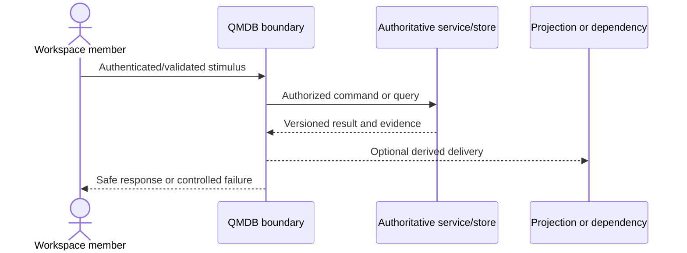

| Analysis field | Value |
| --- | --- |
| Actor | Workspace member |
| Component | Browser/API → policy → repository → MySQL |
| Data | Identity, Workspace, resource command |
| Classification | QMDB-DCL-002–QMDB-DCL-004 |
| Protocol | HTTPS; TLS MySQL |
| Trust boundary | User/application/tenant repository |
| Authentication | Session/API client |
| Authorization | RBAC+ABAC+resource+Workspace |
| Encryption | TLS |
| Audit | Allowed/denied action |
| Failure behavior | Deny missing/mismatch |
| Replay protection | Request/idempotency key where retryable |
| Idempotency | Idempotent sensitive command |
| Authoritative store | MySQL |
| Projection or cache | Tenant-aware cache/read model |

## 3. Judge score submission

| Analysis field | Value |
| --- | --- |
| Actor | Assigned Judge |
| Component | Browser → scoring command → policy/rules → MySQL/outbox |
| Data | Score criteria, version, assignment |
| Classification | QMDB-DCL-004 |
| Protocol | HTTPS; TLS MySQL |
| Trust boundary | Judge/application/scoring/store |
| Authentication | Step-up Session |
| Authorization | Assignment, conflict, state, Workspace |
| Encryption | TLS |
| Audit | Score/audit/outbox |
| Failure behavior | Keep draft; reject stale/unauthorized |
| Replay protection | Command key and version |
| Idempotency | Exactly-once business effect |
| Authoritative store | MySQL Score Sheet |
| Projection or cache | Redis/live projection |

## 4. Transactional outbox publication

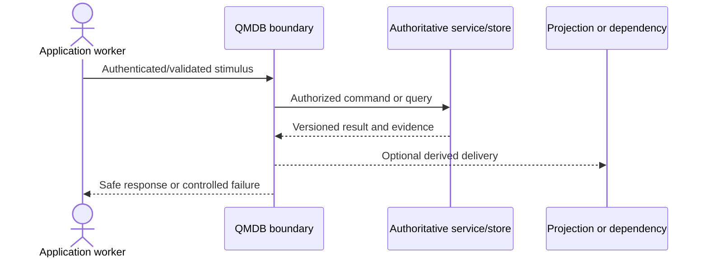

| Analysis field | Value |
| --- | --- |
| Actor | Application worker |
| Component | MySQL transaction → outbox relay → Redis Streams → consumer |
| Data | Domain event and correlation |
| Classification | QMDB-DCL-002/QMDB-DCL-004 |
| Protocol | TLS |
| Trust boundary | MySQL/worker/Redis/consumer |
| Authentication | Service identity |
| Authorization | ACL and event contract |
| Encryption | TLS where supported |
| Audit | Outbox/consumer ledger |
| Failure behavior | Retain backlog; no lost authoritative commit |
| Replay protection | Event ID/consumer position |
| Idempotency | Consumer idempotency |
| Authoritative store | MySQL transaction/outbox |
| Projection or cache | Redis Stream/read models |

## 5. Public live-score delivery

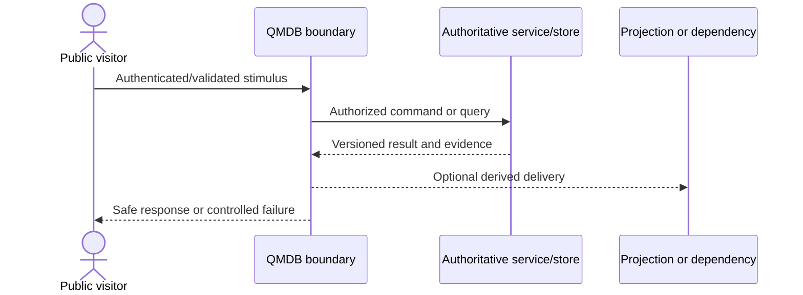

| Analysis field | Value |
| --- | --- |
| Actor | Public visitor |
| Component | MySQL/outbox → projection → Redis/SSE/CDN → browser |
| Data | Approved sequenced public score projection |
| Classification | QMDB-DCL-001 |
| Protocol | HTTPS/SSE |
| Trust boundary | Authoritative/projection/public edge |
| Authentication | Public endpoint controls |
| Authorization | Public allowlist/status |
| Encryption | TLS |
| Audit | Delivery metrics |
| Failure behavior | Stale label/static snapshot/unavailable |
| Replay protection | Event sequence/reconnect cursor |
| Idempotency | Client dedupe |
| Authoritative store | MySQL official result |
| Projection or cache | Public read model/CDN/browser |

## 6. Certificate issuance and verification

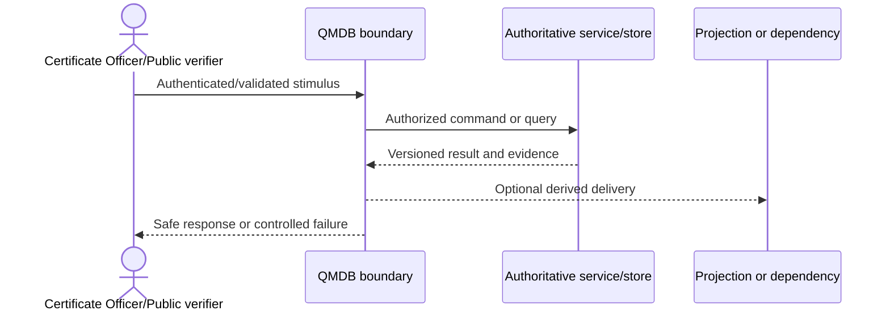

| Analysis field | Value |
| --- | --- |
| Actor | Certificate Officer/Public verifier |
| Component | MySQL → signing/KMS → artifact/status → public verifier |
| Data | Recipient snapshot, result hash, signature/status |
| Classification | QMDB-DCL-003/QMDB-DCL-005 |
| Protocol | TLS; signature |
| Trust boundary | Application/KMS/public |
| Authentication | Step-up service/user auth |
| Authorization | Issue approval; public minimal read |
| Encryption | TLS and digital signature |
| Audit | Issue/verify/revoke audit |
| Failure behavior | Stop issuance; invalid/unavailable status |
| Replay protection | Unique certificate/version |
| Idempotency | Idempotent issuance |
| Authoritative store | MySQL certificate/key metadata; KMS key |
| Projection or cache | Minimal public verification/CDN |

## 7. Media upload and processing

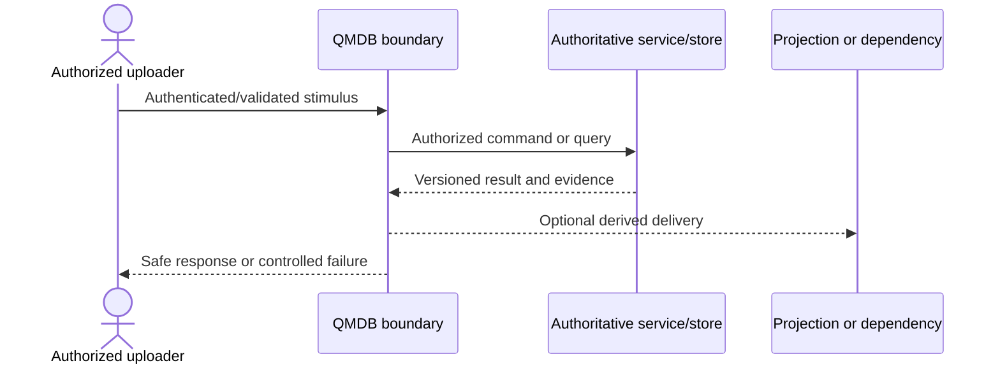

| Analysis field | Value |
| --- | --- |
| Actor | Authorized uploader |
| Component | Browser → upload authorization → private quarantine → isolated worker → approved storage |
| Data | Media, metadata, scan/hash |
| Classification | QMDB-DCL-004 |
| Protocol | HTTPS; signed upload; TLS |
| Trust boundary | Internet/application/object/worker |
| Authentication | Session and short-lived permission |
| Authorization | Purpose/Workspace/consent/quota |
| Encryption | TLS and at-rest encryption |
| Audit | Media pipeline audit |
| Failure behavior | Quarantine/stop publication |
| Replay protection | Opaque key and upload ID |
| Idempotency | Idempotent processing |
| Authoritative store | MySQL metadata/private object master |
| Projection or cache | Approved derivative/CDN |

## 8. Recitation Clip publication

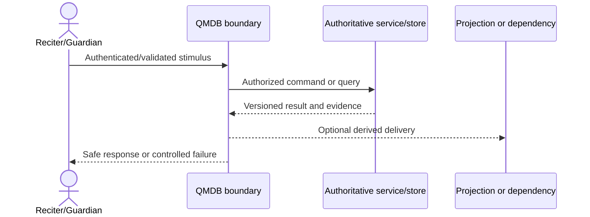

| Analysis field | Value |
| --- | --- |
| Actor | Reciter/Guardian |
| Component | Clip draft → consent/safety policy → moderation → public projection |
| Data | Clip, Minor/consent status, derivative |
| Classification | QMDB-DCL-003/QMDB-DCL-004 |
| Protocol | HTTPS |
| Trust boundary | Private community/public projection |
| Authentication | Session/Guardian authority |
| Authorization | Ownership, consent, visibility, safety |
| Encryption | TLS |
| Audit | Consent/publication/moderation audit |
| Failure behavior | Keep private/unpublish |
| Replay protection | Version and publication ID |
| Idempotency | Idempotent publish/unpublish |
| Authoritative store | MySQL/private media |
| Projection or cache | Public Clip read model/CDN |

## 9. Guardian-consent evaluation

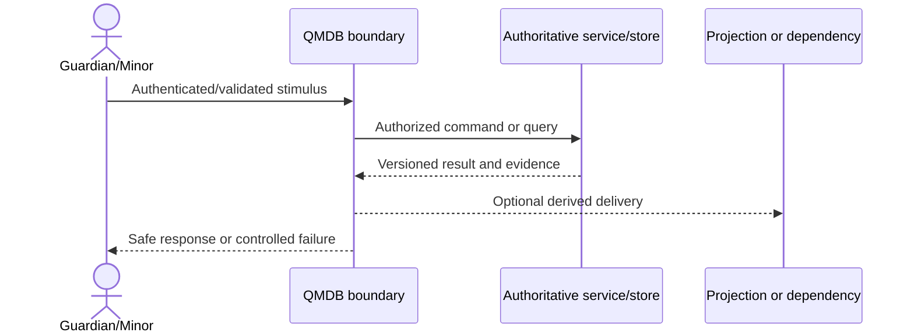

| Analysis field | Value |
| --- | --- |
| Actor | Guardian/Minor |
| Component | Browser → Guardianship policy → consent store → consuming module |
| Data | Relationship, purpose/version/status |
| Classification | QMDB-DCL-004 |
| Protocol | HTTPS; TLS MySQL |
| Trust boundary | Guardian/application/domain |
| Authentication | Step-up where sensitive |
| Authorization | Relationship scope and action consent |
| Encryption | TLS |
| Audit | Consent lifecycle audit |
| Failure behavior | Protective deny/private |
| Replay protection | Consent version and action context |
| Idempotency | Idempotent grant/withdraw |
| Authoritative store | MySQL |
| Projection or cache | Consent projection/cache invalidated |

## 10. Privacy request

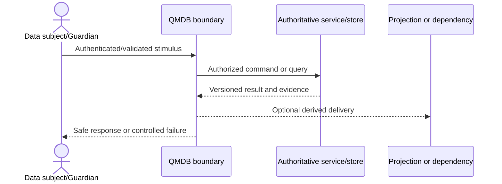

| Analysis field | Value |
| --- | --- |
| Actor | Data subject/Guardian |
| Component | Browser → privacy case → identity verification → scoped collectors → secure export |
| Data | Request, verification, personal data |
| Classification | QMDB-DCL-004 |
| Protocol | HTTPS; encrypted delivery |
| Trust boundary | Subject/privacy operations/modules/export |
| Authentication | Verified Session and request proof |
| Authorization | Subject/Guardian and staff assignment |
| Encryption | TLS and export encryption |
| Audit | Case/access/delivery audit |
| Failure behavior | Hold/reject; no disclosure |
| Replay protection | Case/export token |
| Idempotency | Idempotent case commands |
| Authoritative store | MySQL/privacy case and source stores |
| Projection or cache | Temporary encrypted export/cache purge |

## 11. Support access

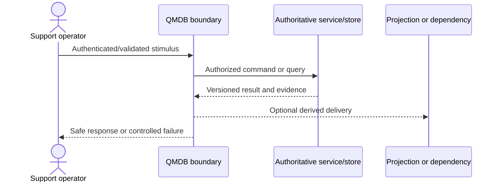

| Analysis field | Value |
| --- | --- |
| Actor | Support operator |
| Component | Ticket → approval → JIT grant → field-minimized view → expiry |
| Data | Ticket, user fields, actions |
| Classification | QMDB-DCL-004 |
| Protocol | HTTPS |
| Trust boundary | Support/IAM/protected modules |
| Authentication | Individual MFA |
| Authorization | Ticket/purpose/field/time scope |
| Encryption | TLS |
| Audit | Continuous support audit |
| Failure behavior | Deny/expire/revoke; no impersonation |
| Replay protection | Grant ID |
| Idempotency | Idempotent grant/revoke |
| Authoritative store | MySQL grant/audit |
| Projection or cache | No authoritative projection |

## 12. Break-glass access

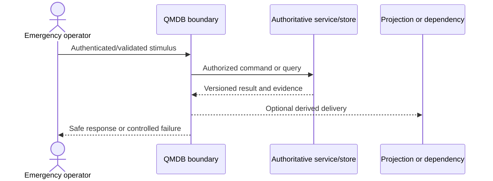

| Analysis field | Value |
| --- | --- |
| Actor | Emergency operator |
| Component | Incident → independent approval → expiring grant → protected action → review |
| Data | Incident, grant, actions |
| Classification | QMDB-DCL-004 |
| Protocol | HTTPS; privileged channel |
| Trust boundary | Incident/IAM/protected systems |
| Authentication | Strong MFA/step-up |
| Authorization | Emergency scope/exclusions/expiry |
| Encryption | TLS |
| Audit | Continuous and external alert |
| Failure behavior | Deny if prerequisites; terminate on expiry |
| Replay protection | Grant/action IDs |
| Idempotency | Idempotent activation/revoke |
| Authoritative store | MySQL grant/audit |
| Projection or cache | Monitoring/alerts only |

## 13. Offline venue synchronization

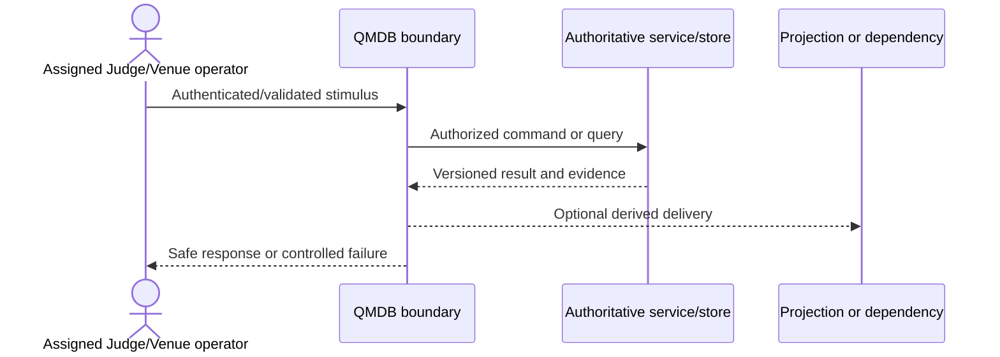

| Analysis field | Value |
| --- | --- |
| Actor | Assigned Judge/Venue operator |
| Component | Central package → registered device → local event log → sync API → scoring domain |
| Data | Assignment, draft, sequence/hash, score |
| Classification | QMDB-DCL-004 |
| Protocol | Signed/encrypted package; HTTPS sync |
| Trust boundary | Central/venue/device/central |
| Authentication | Device and operator identity |
| Authorization | Package/assignment/version/rules/time |
| Encryption | Encryption and signatures |
| Audit | Local+central event/reconciliation audit |
| Failure behavior | Quarantine conflict/replay |
| Replay protection | Package/event sequence/nonce |
| Idempotency | Central idempotency key |
| Authoritative store | Central MySQL after acceptance |
| Projection or cache | Encrypted local draft; no authoritative cache |

## 14. Backup and restore

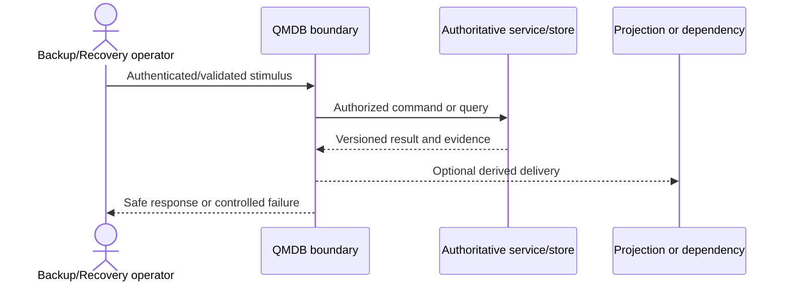

| Analysis field | Value |
| --- | --- |
| Actor | Backup/Recovery operator |
| Component | Authoritative stores → encrypted separate backup → recovery environment → reconciliation |
| Data | Database, objects, config, keys/checkpoints |
| Classification | QMDB-DCL-004/QMDB-DCL-005 |
| Protocol | Encrypted channels/storage |
| Trust boundary | Production/backup/recovery custody |
| Authentication | Separate service/JIT identities |
| Authorization | Backup/recovery approval and roles |
| Encryption | Encryption, integrity hashes |
| Audit | Backup/restore/recovery audit |
| Failure behavior | Alert; no recoverability claim |
| Replay protection | Backup manifest/restore point |
| Idempotency | Repeatable restore and replay dedupe |
| Authoritative store | Recovered authoritative MySQL/private objects |
| Projection or cache | Rebuilt Redis/search/read models |

## Review rule

Any protocol, trust-boundary, authority, provider, data-classification, offline or replay/idempotency change requires updated threat, control, privacy and acceptance evidence before implementation approval.

